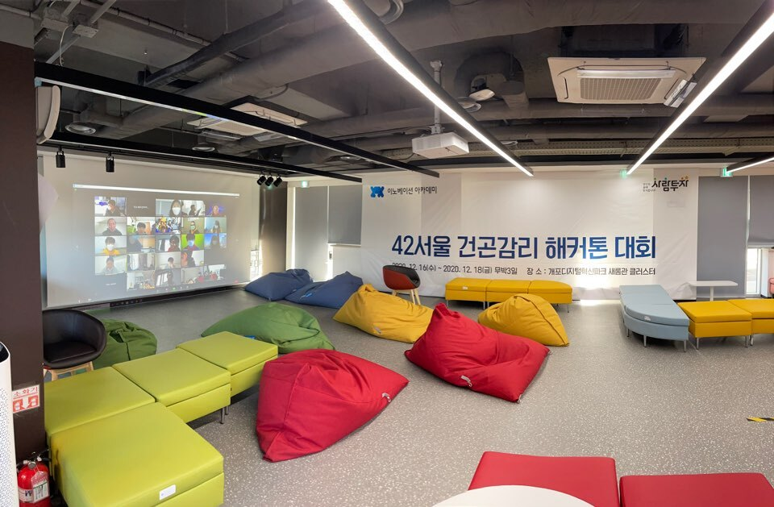
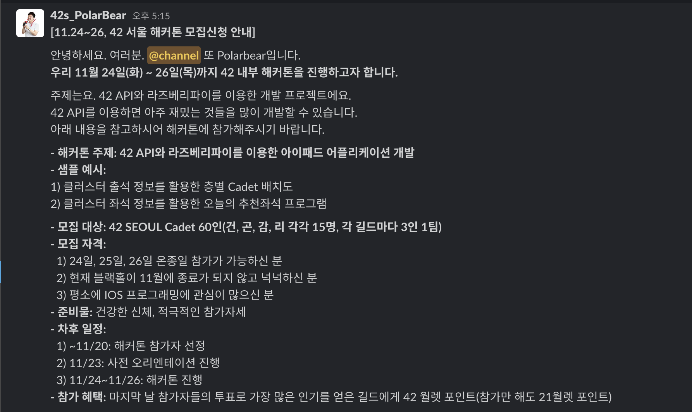
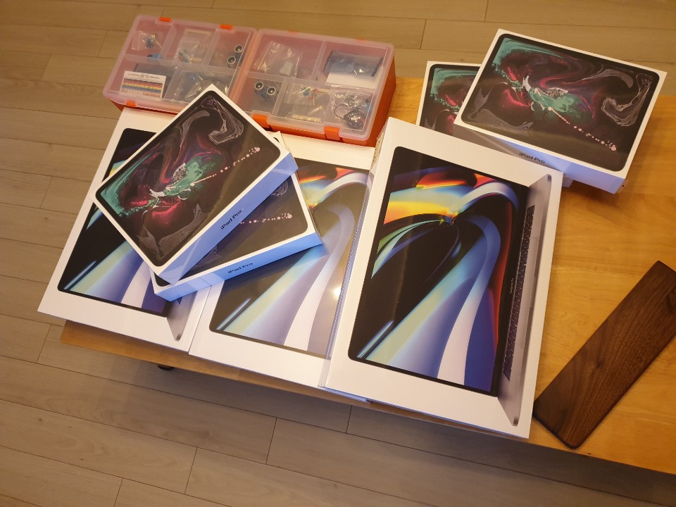
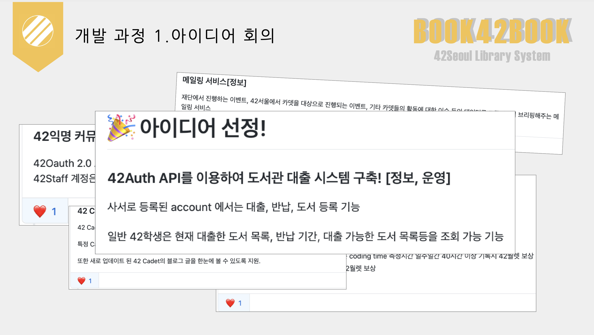
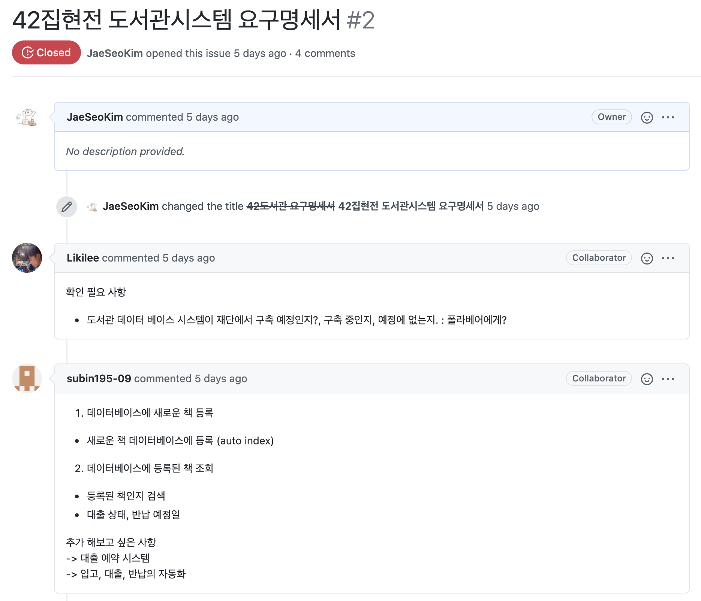
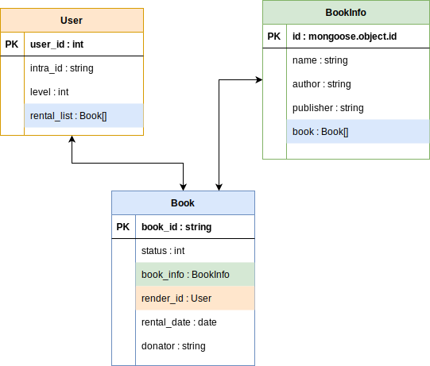
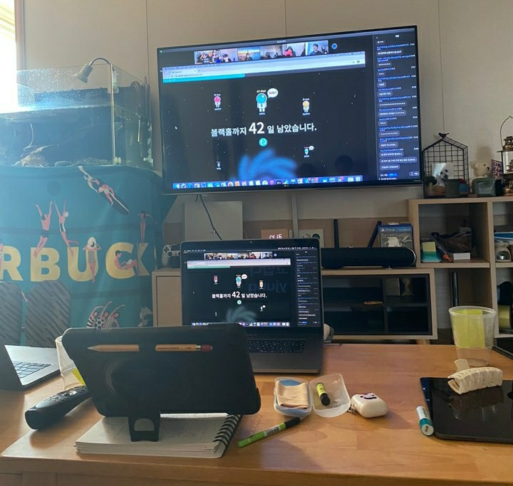
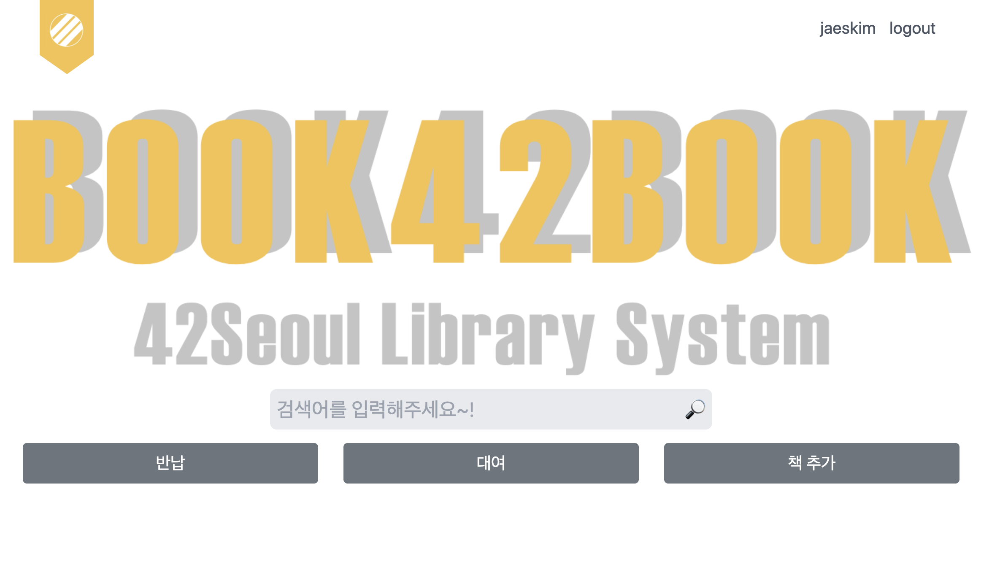

> 온라인으로 진행된 42서울 건곤감리 해커톤 대회!

# 42Seoul 건곤감리 해커톤!

이번에 42서울에서 아래와 같은 내부 해커톤을 진행한다는 공지가 올라와서 참여를 신청하게 되었다!

위에서 보다 싶이 원래는 **11.24 ~ 26** 동안 진행되는 해커톤 이였지만 **~~나쁜~~코로나** 때문에 온라인으로 전환되고 기간도 **12.16 ~ 18**로 연기가 되었다 ㅠㅠ

같은 코알리션끼리 팀빌딩이 되어야 하기 때문에 `kilee` 형!, `skim` 누나와 함께 팀을 만들어서 참여하게 되었다..!!!

## 📦 준비물 수령! - 12.15

이번 해커톤 기간동안 오프라인으로 진행되는 만큼 여러 기기를 대여 해주셨는데 무려 `맥북프로 16인치` , `아이패드 프로`, `라즈베리 파이4`, `웹캠` 을 대여 해주셔서 편하게 참가 할 수 있었다! (~~심지어 맥북 프로와 아이패드가 새 제품이여서 언박싱을 할 수 있는 기회가..!!!~~)

`spark` 형 집에 두팀이 모여서 진행을 해서 아이패드 프로랑 맥북이 엄청나게 모인 모습을 볼 수 있었다 ㅋㅋㅋ

### 🧐 해커톤 시작전 아이디어 회의!

일단 준비물을 수령하고 이제 다같이 모였으니 아이디어 회의에 돌입을 하였다!

GIthub의 이슈를 이용하여 아이디어를 기록 하였고 최종적으로 토론을 한 결과 도서관 대출 시스템을 구축 하는 것으로 결정 나게 되었다!

그 다음 이제 집현전에서 사용을 한다고 생각을 하였을 때 실질적으로 필요한 기능이 어떤 것이 있을 까 하고 추가적인 세부 기능에 대해서 고민을 하였는데 현재 집현전 동아리에서 봉사를 통해 도서 관리를 하고 있는 형태라서 키오스크를 이용한 무인 반납, 대출 시스템이 있으면 좋겠다고 생각을 하였고, 추가적으로 필요하다고 생각 한 기능들을 모아서 간단한 명세서를 작성을 하였다.

그리고 프로젝트 명을 `Book42Book` 으로 명명 하고 15일의 일정을 끝나게 되었다.

## 🏃🏻‍♂️ 해커톤 시작! - 12.16

드디어 대망의 해커톤 당일날이 되어서 1시 부터 Zoom를 통한 해커톤을 시작하게 되었다!

일단 5시에 주제 발표를 해야 하기 때문에 어제 기획을 했던 내용을 바탕으로 간단한 db diagram를 작성을 하게 되었다!

그리고 이제 필요한 기술 스택에 대해서 정의를 하였는데 결과적으로 아래와 같이 결정이 되었다.

---

1. BackEnd - Node.js

   - express.js <-> Next.js
   - Passport : passport-42 (42 Oauth 2.0 API)

2. DataBase - mongoDB

   - mongoose : ODM

3. FrontEnd - React

   - reactstrap: components

   - tailwindcss : CSS
     - Tailwind.macro
     - emotion

---

그리고 이제 사전 기술 스택에서 조사한 passport-42 라이브러리를 이용하여 42 Oauth 2.0 로그인을 구현 하였고 mongoDB와도 연결를 하여 프로젝트 베이스를 완성 하였다!

그리고 팀원과 함께 [기획 문서](https://github.com/JaeSeoKim/book42book/wiki/기획)를 작성하여 접근이 필요한 `URL PATH` 를 정의 하고 각 필요한 기능에 대하여 백엔드 API와 함께 프론트의 컴포넌트를 개발 하였다.

그 결과 간단한 검색 API 등 일부 필요한 기능을 완성하고 하루를 종료하게 되었다.

## 🧑‍💻 해커톤 2일차 - 12.17

2일차에는 일단 어제 개발 했던 API를 프론트로 이식 하는 기능과 함께 API 명세서를 작성 하면서 개발하기로 하였다.

첫날에 개발하였던 API의 명세를 작성을 하고 추가적으로 필요한 API의 기능을 함께 구상을 하면서 명세를 먼저 작성을 하고 API를 개발 하는 형태로 진행을 하였다.

[API 명세서](https://github.com/JaeSeoKim/book42book/wiki/API-%EB%AA%85%EC%84%B8%EC%84%9C)

그 다음 reactstrap과 tailwindcss를 이용하여 만든 컴포넌트 디자인을 API와 연결 하는 형태로 개발을 하였고 그 다음 일부 개선이 필요한 부분에 개선에 들어가면서 내일 있어야 하는 발표 준비를 하였다!

## 😴 해커톤 마지막날! - 12.18

이제 마지막날이 되고 발표 준비를 하면서 `yjung` 형이 배우로 참여를 하여 시연 영상도 재미있게 촬영도 하고 중간에 42seoul에서 촬영도 오고 여러가지 이벤트가 있었다.

원래 heroku를 이용하여 실 서버에 deploy를 하고 싶었는데 아무리 시도를 해봐도 `@babel/runtime` 에서 생기는 오류를 잡지 못하여 ㅠㅠ 실서버에는 못 올리게 되었다 ㅠㅠ

`spark` 형 팀에서 `QQUADET` 이라는 재미난 프로젝트를 발표하고 시연 영상에서 출연했던 `yjung` 형이 이어서 `book42book` 발표 시연에서 나와서 명품연기를 선 보이면서 재미있게 발표를 할 수 있었다!!

> TV로 Zoom을 통한 발표를 보는 모습!

> 완성된 Book42Book 메인 페이지

## 🤔 해커톤을 끝내면서..

일단 이번 해커톤을 진행하면서 아쉬웠던 점은 내가 프로젝트의 PM이 되어서 프로젝트의 관리를 했어야 하는데 이러한 협업을 통한 프로젝트 진행한 경험이 적어서 제대로 못했다는 점이 매우 아쉬웠다.

처음에는 어느정도 자신감을 가지고 깃허브를 만들고 계획를 하고 진행을 하였는데 어느순간부터 멘붕이 오더니 제대로 진행을 못하고 마구잡이로 진행을 하게 되어서 팀원들이 엄청 힘들게 진행을 한 것 같아서 이러한 협업능력을 42서울에서 공부하는 기간 동안 더욱 발전해 나아가고 싶어졌다.

### 📚 Book42Book 개선 방향

만약 42서울의 집현전과 같이 개발을 할 수 있는 기회를 가지게 된다면 구조부터 다시 만들어서 제대로 완성도 있게 다시 만들어 보고 싶다.

아이디어 회의중 나온 인트라 로그인 부분을 스피드게이트에서 사용하는 출입카드로 인증하여 손쉽게 대출 할 수 있는 시스템, 그리고 미래에 출판사와 협력하여서 DRM을 이용한 42-EBOOK 서비스 까지 완성도가 높은 서비스로 발전해 나아가고 싶다!
