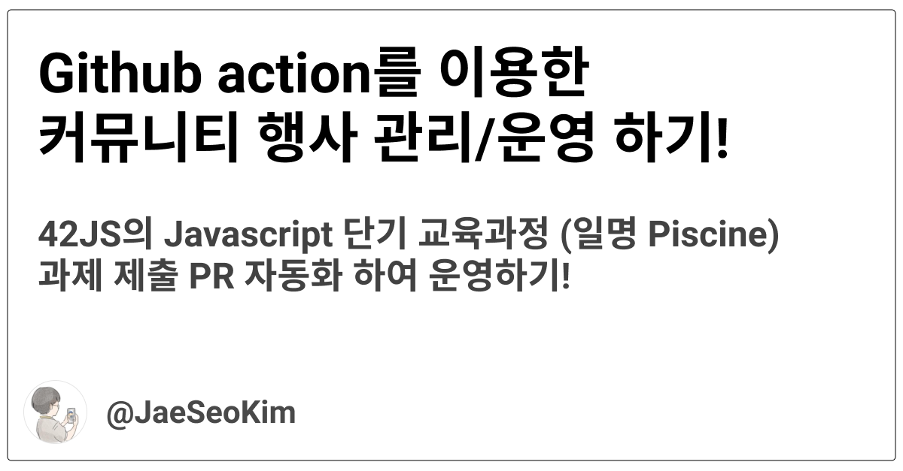
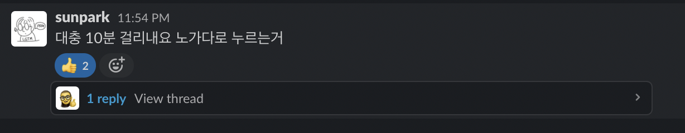
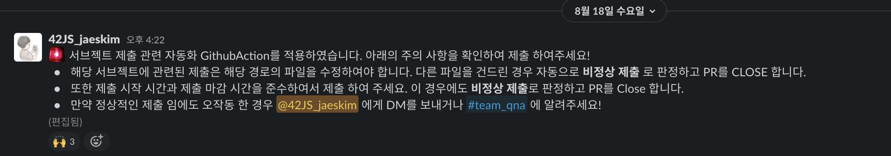
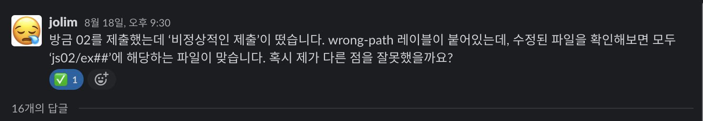
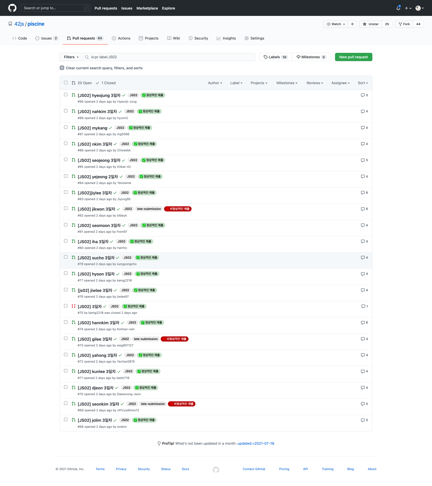
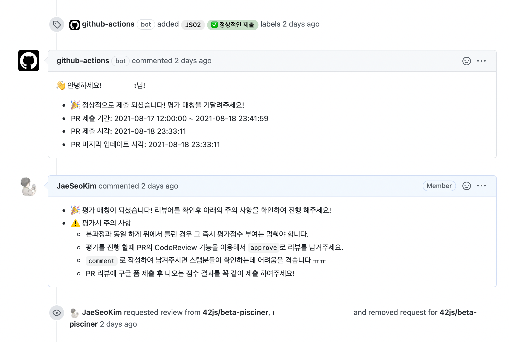
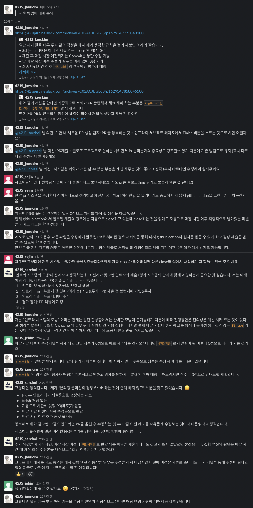
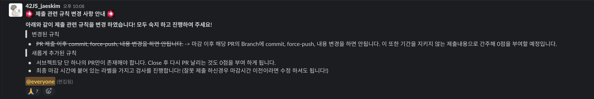

**42Seoul**의 공식 커뮤니티인 **42JS**에 기획하고 제작을 한 `Javascript 단기 교육과정` 일명 `피씬(Piscine)` 를 실제 **42Seoul** 학생들을 대상으로 베타로 진행을 하게 되었습니다!

> ℹ️ JS Piscine에 더 알고 싶은 분들은 아래의 repo로 들어가 주세요!
>
> https://github.com/42js/piscine

원래 최초의 계획은 학생들이 만든 교육 과정의 문제 `subject` 들을 기존 `42Intra` 시스템에 추가를 하여서 진행을 하는 것 이였지만 시스템에 추가하기 위해서는 subject 에 대한 검증 및 부가 적으로 엮이는 시스템에 관련된 이슈들이 있기 때문에 이번 베타 테스트에서는 자체적으로 진행하기로 결정을 하게 되었습니다.

원할한 진행을 위해 `google sheet` 와 `form` 를 이용하여 점수 및 통계를 나타내도록 제작을 하였고 이제 subject에 대한 평가를 제출 하고 이에 대한 리뷰어(평가자)를 매칭 시키는 것에 대해서 고민을 많이 하게 되었는데, 최초에 적용한 방법은 아래와 같습니다.

1. 피평가자가 문제를 풀고 해당 Subject의 정답의 코드를 `PR` 형태로 제출
2. 42JS 스태프가 `PR` 제출 시간, 추가 규칙 등을 확인 후 `Github Team Code review assignment` 를 활용하여 리뷰어를 배정
3. 리뷰어가 배정이 되면 평가 기간내에 `google form` 를 이용하여 평가 진행 후 해당 정보와 함께 `PR review` 를 통해 기록

원래 회의를 진행 하면서 리뷰어를 매칭 하는 것에 대해 `code owner` 기능 `github action` 등 많은 이야기가 오갔지만 첫번째인 `code owner` 는 team 권한을 `write`까지 줘야 하기 때문에 **보안 이슈**와 **중도 포기자**에 대한 처리와 함께 부가적으로 오는 이슈들을 해결 하기 어렵기 때문에 무산이 되었고 두번째인 `github action` 은 시작일이 얼마 남지 않아서 현재 상황에서는 적용이 어려우니 중간에 적용이 가능하다면 적용하기로 하고 일단 수동으로 진행하게 되었습니다.

현재 **8월 16일** 첫 날에 해당 담당하기로한 `sunpark` 님께서 직접 진행을 하였는데 실제 수 작업으로 진행해보니 **약 10분간** 의 시간이 소요된다고 하였고 다음날부터는 평가 확인과 같은 다양한 작업을 진행 해야 하기 때문에 더 많은 시간 소요가 많이 되기 때문에 `github action` 를 이용하여 자동화를 설정 하기로 결심을 하였습니다.



## Github Action 활용 범위 선정 하기!

일단 자동화를 구축 하기 위해 일단 자동화를 어떤 형태로 진행 할 것인지에 대해서 정의를 하였습니다.

`Github Action` 에서 제공 하는 트리거 이벤트 `pull_request opened` 를 활용하여 자동으로 PR의 제출 시간에 대해서 검증 하고 라벨을 붙여 주는 작업, 이후 `Github Action Input` 를 이용하여 전 단계에서 정상적인 라벨일 때 리뷰어를 배정 하는 것을 최소 `MVP` 로 정의를 하고 구현하기 위해 어떤 작업이 필요 한지 생각을 해보았습니다.

Ï일단 **PR 검증 기능** 구현하기 위해서는 일단 제출 경로에 따른 마감 시간이 서로 다르기 때문에 **제출 한 파일에 대해 어떤 경로에 속해 있는지**에 대해 체크를 하는 부분과 **제출 경로와 마감 시간등**을 **설정 파일**의 정보를 가져 올 수 있는 기능을 구현을 해야 하는 것이 필요하다고 생각을 하였습니다.

이제 해당 자동화를 구축 하기에 앞서 기존에 만들어진 App을 이용하려고 하였지만 제출 경로에 따른 제출 시간등이 조건으로 걸려있는 부분을 세밀 하게 정의 하는 것이 기존 APP에서는 불가능 하기 때문에 **직접 Script** 를 작성하여 구현 하는 것으로 정하였습니다.

일단 GitHub action에서 App를 개발 하는 방법에는 **Docker Image**, **Javascript** 등 다양한 방법이 있지만 **javascript 커뮤니티** 이기도 하고 또한 저의 주력언어가 typescript 이기 때문에 **typescript로 개발**을 하기로 정하였습니다!

이제 구현을 하기 위해 **Github**에서 **[TypeScript-Action](https://github.com/actions/typescript-action)** 템플릿을 제공을 하여서 해당 템플릿을 참조 하여 개발을 진행 하엿습니다.

템플릿을 살펴 보면 **[action-toolkit](https://github.com/actions/toolkit/blob/master/README.md#packages) **를 사용하여 action내부의 여러가지 정보를 가져오거나 정보를 외부로 보내는 기능 github 제어등 다양한 기능을 제공 하기 때문에 해당 문서를 참조하면서 개발을 진행하였습니다.

또한 최종적으로 workflow가 동작을 할 때 `node.js` 개발이 된 것은 동작을 할때 `node_modules` 라는 무거운 의존 파일을 가지고 있어야 하기 때문에 workflow 내부에 `npm install` 과 같은 작업이 포함되어야 하지만 `@vercel/ncc` 라는 CLI 도구를 이용하여 의존성을 모두 가지고 있는 `단일 JS` 파일로 나올 수 있도록 작업을 진행 하였습니다.

이제 개발을 진행 하면서 어떤 형태로 `Debug` 및 `Test` 를 진행 하는 것이 관권 이였는데 매번 실제 `Action` 를 동작 시키는 것은 힘들고 local에서 동작 하게 해주는 [act](https://github.com/nektos/act) 라는 도구를 사용하기 에도 PR 이벤트 라는 제약 때문에 사용하기가 애매하다고 판단하고 `Jest` 를 이용한 `TDD` 방법론으로 개발을 진행 하게 되었습니다!

## Jest를 이용하여 GitHub action 개발하기!

Jest를 이용하여 action에 대한 테스트 코드는 매우 단순하게 작성을 하였는 데 특정 함수를 `mock` 함수로 설정을 하고 동작을 할 때 총 몇번 호출을 되었는지에 대해서 확인을 하도록 하는 형태로 개발을 진행 하였습니다.

예를 들어서 `action` 이 동작되는 함수에서는 `core.error()` 를 0번 호출 해야 한다. 이런 형태로 정상적일 때의 동작을 정의후 동작 시 지정한 횟수에 만족 하지 않는 다면 해당 테스트를 만족 할 수 있는 코드로 다시 작성 하는 형태로 개발을 하였습니다.

또한 실제 동작시에만 객체 들에 대해서도 `Mock` 화를 시켜 테스트를 진행 하여 점진적으로 개발을 진행 하여 최종적으로 작성된 `run()` 함수에 대한 테스트 코드는 아래와 같이 매우 간단한 형태로 작성이 완료 되었습니다.

```typescript
it("run()시 정상적이라면 정해진 함수들의 횟수가 동일하게 동작", async () => {
  const errorMock = jest.spyOn(core, "error")
  const setFailedMock = jest.spyOn(core, "setFailed")

  const getOctokitMock = jest.spyOn(github, "getOctokit")

  const paginateMock = jest.spyOn(gh, "paginate")
  paginateMock.mockResolvedValue([
    {
      id: 42,
      filename: "js00/test.js",
    },
  ])

  const getPullsMock = jest.spyOn(gh.rest.pulls, "get")
  const addLabelsMock = jest.spyOn(gh.rest.issues, "addLabels")
  const removeLabelMock = jest.spyOn(gh.rest.issues, "removeLabel")
  const addCommentMock = jest.spyOn(gh.rest.issues, "createComment")

  await run()

  expect(getOctokitMock).toBeCalledTimes(1)

  expect(getPullsMock).toBeCalledTimes(1)
  expect(addLabelsMock).toBeCalledTimes(1)
  expect(removeLabelMock).toBeCalledTimes(0)
  expect(addCommentMock).toBeCalledTimes(1)

  expect(errorMock).toBeCalledTimes(0)
  expect(setFailedMock).toBeCalledTimes(0)
})
```

또한 내부에 사용 되는 여러가지 함수 들도 아래와 같이 테스트를 작성을 하여서 개발을 진행 하였습니다.

```typescript
it("test getChnageFiles()", async () => {
  const paginateMock = jest.spyOn(gh, "paginate")
  const reuslt = [{ filename: "filelist1" }, { filename: "filelist2" }]
  paginateMock.mockResolvedValue(reuslt)

  expect(await getChnageFiles(gh, 42)).toStrictEqual(
    reuslt.map((f) => f.filename)
  )
})
```

또한 실제 개발을 진행하는 중간 실 동작을 확인 해야 하는 경우에는 test repo에 올려서 실제로 동작을 테스트 해보면서 일단 초기 아이디어 단계를 전부 구현을 하여서 완성을 하였습니다.

## 리뷰어 매칭 workflow 만들기!

이제 PR 검증에 대한 **Action**은 완성을 하였으니 이제 라벨을 가지고 Reviwer를 배정하는 workflow를 정의를 하였는데 이 경우에는 별도의 App 으로 분리하지 않고 `actions/github-script@v4` 를 이용하여 `inline-script` 형태로 간단하게 작성을 하였습니다.

초기에 나온 버전은 아래와 같이 완성을 하여 **8월 16일**에 첫 도입을 하였습니다!

```yaml
name: 리뷰어 매칭

on:
  workflow_dispatch:
    inputs:
      subject:
        description: 자동으로 매칭 시킬 타겟 Subject
        required: true
      currect-label:
        description: 정상적인 제출 확인용 라벨
        required: true
        default: "✅ 정상적인 제출"
      reviewer:
        description: 리뷰어로 지정될 팀명
        required: true
        default: "beta-pisciner"

jobs:
  matching-reviwers:
    name: "해당 서브젝트 Reviewer 매칭"
    runs-on: ubuntu-latest
    steps:
      - uses: actions/github-script@v4
        with:
          github-token: ${{ secrets.SECRET_PAT }}
          script: |
            const prlistConfig = github.pulls.list.endpoint.merge({
              owner: context.repo.owner,
              repo: context.repo.repo,
            });
            const prList = await github.paginate(prlistConfig);
            for (const pr of prList) {
              if (
                pr.state === "open" &&
                !!pr.labels.find(
                  (label) => label.name === "${{ github.event.inputs.subject }}"
                ) &&
                !!pr.labels.find(
                  (label) => label.name === "${{ github.event.inputs.currect-label }}"
                )
              ) {
                await github.pulls.requestReviewers({
                  owner: context.repo.owner,
                  repo: context.repo.repo,
                  pull_number: pr.number,
                  team_reviewers: ["${{ github.event.inputs.reviewer }}"],
                });
                await github.issues.createComment({
                  owner: context.repo.owner,
                  repo: context.repo.repo,
                  issue_number: pr.number,
                body : [
                        `- 🎉 평가 매칭이 되셨습니다! 리뷰어를 확인후 아래의 주의 사항을 확인하여 진행 해주세요!`,
                        `- ⚠️ 평가시 주의 사항`,
                        `  - 본과정과 동일 하게 위에서 틀린 경우 그 즉시 평가점수 부여는 멈춰야 합니다.`,
                        `  - 평가를 진행 할때 PR의 CodeReview 기능을 이용해서 \`approve\`로 리뷰를 남겨주세요.`,
                        `  - \`comment\` 로 작성하여 남겨주시면 스탭분들이 확인하는데 어려움을 격습니다 ㅠㅠ`,
                        `  - PR 리뷰에 구글 폼 제출 후 나오는 점수 결과를 꼭 같이 제출 하여주세요!`,
                      ].join("\n"),
                });
              }
            }
```

중간에 **reviewer를 team으로 배정** 하는 부분에 대해서 일반적으로 제공되는 **repo의 token**으로는 권한이 부족하여 작동하지 않는 이슈가 있어서 `PAT` 를 발급 받아 적용하는 것으로 해결을 하였습니다.

## 첫 도입 이후 발생한 이슈 해결 하기!



> Piscine 적용 공지!

일단 적용이후 만든 **Action의 tag**을 정의 하여 사용하였는데 배포를 할 때 **pre-release** 로 정의를 하지 않았더니 버전관련해서 찾지 못하는 부분이 있어서 `42js/pr-checker@master` 로 정의 하여 해결을 하였습니다.

또한 실 적용 이후 PR이 올라오면서 아래와 같이 정상적이지 않는 PR로 판정되는 이슈가 있었는데 알고 보니 설정을 할 때 `glob` 형태를 잘못 작성 하여 생긴 문제여서 설정을 업데이트 하는 것으로 해결을 하였습니다.



그 결과 아래와 같이 **PR**에 대해 잘 검사 후 라벨링을 적용 하는 것을 볼 수 있었습니다!



그리고 **리뷰어 매칭** 하는 부분에 대해서도 아래와 같이 정상적으로 잘 동작 한 것을 볼 수 있습니다!



## 개선 하기!

`github-action` 를 첫 적용이후 여러가지 불편한 부분과 함께 개선 해야 하는 항목 들이 보였는데 그 부분은 아래와 같습니다.

`8월 18일` 기준 PR 제출 이후 `Commit` 은 **0점 처리 항목으로 정의**가 되어 있어서 PR에 다른 서브젝트에 대한 파일이 섞여 있는 경우 action에서 비정상 제출을 받아도 수정이 불가능 하다는 부분이 첫번째 문제 였습니다.

일단 해당 사항에 대해서 내부적으로 논의 후 일단 해당 날짜에

기존 규칙에 다른 서브젝트에 대한 파일이 포함되어 있으면 안된다는 규칙이 없었기 때문에 발생한 문제이지만 `GithubAction` 에서의 원할한 작동을 위해서는 파일 제출에 대한 제약을 걸어야 하기 때문에 **제출 방법에 대해** 아래와 같이 **팀회의를** 진행 하였습니다.



최종적으로 위와 같이 제출 방법에 대해 새롭게 재 정의 후 해당 동작대로 작업 할 수 있도록 기존 비정상 제출에 대한 `Close` 행위를 제거 함과 `Action Trigger` 에 `PR synchronize` 를 추가 함으로 동기화 이벤트 발생시 재 검사를 도와줄 수 있도록 하였습니다.

그리고 `리뷰어 매칭 Action` 를 동작 시 해당 시점을 기준으로 `비 정상 제출` 에 대한 라벨이 적용된 경우 안내 메세지와 함께 Close 할 수 있도록 수정 하엿습니다.

최종적으로 변경 사항을 적용 후 공지를 하여 개선을 하였습니다.



## 끝 마치면서

현재 **8월 20일** 기준 **Github Action**을 통해 자동화를 적용해보니 관리 운영을 하는데 소모되는 비용이 줄어들고 수동으로 진행하면서 발생하는 실수 들이 없어지기 때문에 다른 커뮤니티 활동이나 개발을 진행 할 때 **Github Action** 을 적극적으로 적용을 하여 진행을 할 것 입니다.

또한 현재 아직 **8월 31일** 까지 **JS piscine 베타**가 진행 되기 때문에 **추가적으로 자동화할 수 있는 부분에 대해 적용 및 개선**하여 진행할 것 입니다!

---

> ### @42js/pr-checker
>
> - **Github: https://github.com/42js/pr-checker**
