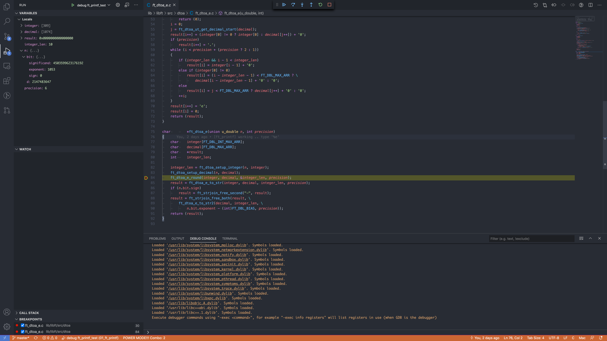

# intro

이전부터 42seoul의 프로젝트를 진행하면서 `vscode debugger` 를 사용하는 일이 많아지면서 한번 간단하게 예시를 이용하여 정리를 해보았다!

# vscode debugger!

vscode에서는 다양한 언어에 대하여 디버깅 기능을 지원을 하는데 여기서는 `c/c++` 언어에 대하여 사용하는 법에 대하여 작성을 해본다.

일단 디버깅을 위해서는 선행으로 설치가 되어야 하는 `extension` 과 프로그램이 있다.

일단 vscode에서 extension 항목에서 설치 가능한 [ms-vscode.cpptools](https://marketplace.visualstudio.com/items?itemName=ms-vscode.cpptools) 의 설치가 선행으로 필요가 하고 당연히 필요한 컴파일러(gcc, clang), debugger(gdb, lldb)등의 프로그램이 설치가 되어 있어야 한다.

vscode의 debugger의 간단하게 아래의 작업을 수행을 해준다.

1. task.json에 정의가 되어 있는 컴파일 과정을 수행
2. launch.json에 정의가 되어 있는 debugger로 1번에서 컴파일한 프로그램을 실행
3. 2번에서 정의한 debugger와 vscode와 연결이 되어 gui환경에서 간편하게 디버깅 기능을 제공

위에서 설명한 작업을 하기 위해서는 기본적으로 `workspace` 별로 `task.json`, `launch.json` 파일을 만들어 사용을 하여야 한다.

이제 2가지 예제를 들어서 설정하는 방법에 대하여 설명을 해본다.

## Ex. 파일 하나에서 main이 포함이 되어 있고 모든 작업에 대한 함수가 그 파일에 포함이 되어 있는 경우.

일단 `workspace` 안에서 `.vscode/task.json` 파일을 만들어 컴파일 과정을 설정을 해본다.

```json
{
  "tasks": [
    {
      // 실행하는 task type
      "type": "cppbuild",
      // task의 label (launch.json에서 연결할 때 사용이 됨)
      "label": "C/C++: gcc build active file",
      // 실행을 하게 되는 명령어
      "command": "/usr/bin/gcc",
      // 명령어에 대한 인자
      "args": [
        // *중요* gcc 컴파일을 할 때 디버깅을 가능하게 만들어 주는 옵션
        "-g",
        // vscode에서 제공하는 변수 디버깅을 시작하는 시점에서 focus하는 파일의 이름이 들어옴
        "${file}",
        "-o",
        // ${fileDirname} : 디버깅을 시작하는 시점에서 focus하는 파일의 경로가 들어옴
        // ${fileBasenameNoExtension} : 디버깅을 시작하는 시점에서 focus하는 파일의 확장자를 제외한 이름이 들어옴
        "${fileDirname}/${fileBasenameNoExtension}"
      ],
      "options": {
        // 작업을 진행하는 경로
        "cwd": "/usr/bin"
      },
      // task 진행시 오류 발생하는 정보 연결 지정자
      "problemMatcher": [
        // $tsc, $go 등 다양한 언어를 지원함
        "$gcc"
      ],
      // 작업에 대한 group 정보
      "group": {
        "kind": "build",
        "isDefault": true
      },
      // 작업에 대한 설명
      "detail": "Generated task by Debugger"
    }
  ],
  "version": "2.0.0"
}
```

기본적으로 위와 같이 기본적인 세팅이 들어 오게 되는데 예시의 제목과 같이 단 하나의 파일에서만 모든 작업이 수행이 가능하다면 바로 task가 진행이 오류 없이 사용이 가능하다.

만약 외부의 라이브러리를 사용해야 한다면 그때 필요한 인자 옵션들을 `args`에 추가하여 지정을 해주어야 한다.

이제 디버깅을 시작하게 하는 `launch.json` 에 대해 설정을 해본다.

```json
{
  // Use IntelliSense to learn about possible attributes.
  // Hover to view descriptions of existing attributes.
  // For more information, visit: https://go.microsoft.com/fwlink/?linkid=830387
  "version": "0.2.0",
  "configurations": [
    {
      // debug작업 이름
      "name": "gcc - 활성 파일 빌드 및 디버그",
      // debug type
      "type": "cppdbg",
      // debug request
      "request": "launch",
      // launch 하는 대상 프로그램
      "program": "${fileDirname}/${fileBasenameNoExtension}",
      // 실행하는 프로그램에 대해 인자가 필요한 경우 아래에 추가
      "args": [],
      // debug가 시작후 main 시작 부분에서 멈추게 하는지에 대한 여부
      "stopAtEntry": false,
      // 작업 경로
      "cwd": "${workspaceFolder}",
      // 환경 변수 설정
      "environment": [],
      // vscode의 terminal이 아닌 외부의 terminal에서 실행을 할지에 대한 설정
      "externalConsole": false,
      // debugger 종류
      "MIMode": "lldb",
      // launch하기전 build나 선 수행 되야 하는 task 설정
      // task.json에서 정의된 label 이름을 설정
      "preLaunchTask": "C/C++: gcc build active file"
    }
  ]
}
```

기본적인 설정은 위와 같이 완성이 되는데 이제 어떤 라이브러리에 대해서 개발을 한다고 가정을 하고 예시를 작성해 본다.

## Ex. printf의 기능을 동일하게 작동하는 ft_printf 함수 라이브러리 test debug 하기

라이브러리를 개발을 할 때에는 기본적으로 makefile를 통해 개발을 하게 되는데 이것을 모두 task.json에 정의가 하기 힘들기 때문에 make를 task.json에서 작동하도록 설정을 하도록 한다.

일단 makefile은 아래와 같이 `make debug_test` 를 하게 되면 실행 파일이 만들어 지도록 되어 있다.

```makefile
# **************************************************************************** #
#                                                                              #
#                                                         :::      ::::::::    #
#    Makefile                                           :+:      :+:    :+:    #
#                                                     +:+ +:+         +:+      #
#    By: jaeskim <jaeskim@student.42seoul.kr>       +#+  +:+       +#+         #
#                                                 +#+#+#+#+#+   +#+            #
#    Created: 2020/09/24 20:10:49 by jaeskim           #+#    #+#              #
#    Updated: 2020/11/14 01:58:10 by jaeskim          ###   ########.fr        #
#                                                                              #
# **************************************************************************** #

NAME = libftprintf.a

AR = ar
ARFLAGS = crs

CC = gcc
CFLAGS = -Wall -Wextra -Werror

ifeq ($(DEBUG),true)
	CDEBUG = -g
endif

RM = rm
RMFLAGS = -f

LIBFT = libft.a
LIBFT_DIR = ./lib/libft
LIBFT_FILE = $(LIBFT_DIR)/$(LIBFT)
LIBFT_INC_DIR = $(LIBFT_DIR)/include

INC_DIR = ./include

SRC_DIR = ./src
SRC_UTIL_DIR = $(SRC_DIR)/util
SRC_UTIL_UTF8_DIR = $(SRC_UTIL_DIR)/utf8
SRC_PARSE_DIR = $(SRC_DIR)/parse
SRC_PRINT_DIR = $(SRC_DIR)/print

OBJ_DIR = ./obj

vpath %.c \
	$(subst ./, , $(SRC_DIR))	\
	$(subst ./, , $(SRC_UTIL_DIR))	\
	$(subst ./, , $(SRC_UTIL_UTF8_DIR))	\
	$(subst ./, , $(SRC_PARSE_DIR))	\
	$(subst ./, , $(SRC_PRINT_DIR))

SRCS = \
	$(wildcard $(SRC_DIR)/*.c)	\
	$(wildcard $(SRC_UTIL_DIR)/*.c)	\
	$(wildcard $(SRC_UTIL_UTF8_DIR)/*.c)	\
	$(wildcard $(SRC_PARSE_DIR)/*.c)	\
	$(wildcard $(SRC_PRINT_DIR)/*.c)

OBJS = $(addprefix $(OBJ_DIR)/, $(notdir $(SRCS:.c=.o)))

# Color
CL_BOLD   = \e[1m
CL_DIM    = \e[2m
CL_UDLINE = \e[4m

NO_COLOR = \e[0m

BG_TEXT = \e[48;2;45;55;72m
BG_BLACK = \e[48;2;30;31;33m

FG_WHITE = $(NO_COLOR)\e[0;37m
FG_TEXT = $(NO_COLOR)\e[38;2;189;147;249m
FG_TEXT_PRIMARY = $(NO_COLOR)$(CL_BOLD)\e[38;2;255;121;198m

LF = \e[1K\r$(NO_COLOR)
CRLF= \n$(LF)

all : $(NAME)

bonus : $(NAME)

clean : $(LIBFT)_clean
	@$(RM) $(RMFLAGS) $(OBJS)
	@printf "$(LF)🧹 $(FG_TEXT)Cleaning $(FG_TEXT_PRIMARY)$(NAME)'s Object files...\n"

fclean : $(LIBFT)_fclean clean
	@$(RM) $(RMFLAGS) $(NAME)
	@printf "$(LF)🧹 $(FG_TEXT)Cleaning $(FG_TEXT_PRIMARY)$(NAME)\n"

re : fclean all

$(OBJ_DIR)/%.o : %.c
	@mkdir -p $(OBJ_DIR)
	@$(CC) $(CFLAGS) $(CDEBUG) -I $(INC_DIR) -I $(LIBFT_INC_DIR) -c $< -o $@
	@printf "$(LF)🚧 $(FG_TEXT)Create $(FG_TEXT_PRIMARY)$@ $(FG_TEXT)from $(FG_TEXT_PRIMARY)$<"

$(NAME) : $(LIBFT_FILE) $(OBJS)
	@printf "$(LF)🚀 $(FG_TEXT)Successfully Created $(FG_TEXT_PRIMARY)$(NAME)'s Object files $(FG_TEXT)!"
	@printf "$(CRLF)📚 $(FG_TEXT)Archiving! $(FG_TEXT_PRIMARY)$@"
	@$(AR) $(ARFLAGS) $@ $(OBJS)
	@printf "$(LF)🎉 $(FG_TEXT)Successfully Archived $(FG_TEXT_PRIMARY)$@ $(FG_TEXT)!\n"

# Libft

$(LIBFT) : $(LIBFT_FILE)

$(LIBFT_FILE) :
	@make --no-print-directory -C $(LIBFT_DIR)
	@cp $(LIBFT_FILE) $(NAME)

$(LIBFT)_clean :
	@make --no-print-directory -C $(LIBFT_DIR) clean

$(LIBFT)_fclean :
	@make --no-print-directory -C $(LIBFT_DIR) fclean

# Test Code

TEST_FILE = test.c

debug_make : $(NAME) $(TEST_FILE)
	$(CC) -g -I $(INC_DIR) -I $(LIBFT_INC_DIR) $(TEST_FILE) -o $(TEST_FILE:.c=.out) -L. -lftprintf

test : $(NAME) $(TEST_FILE)
	@$(CC) -g -I $(INC_DIR) -I $(LIBFT_INC_DIR) $(TEST_FILE) -o $(TEST_FILE:.c=.out) -L. -lftprintf
	@printf "$(FG_TEXT_PRIMARY)$(BG_BLACK)🚧 [TEST RESULT]! 🚧$(CRLF)$(FG_TEXT)"
	@./$(TEST_FILE:.c=.out)
	@rm $(TEST_FILE:.c=.out)

.PHONY : \
	all clean fclean re \
	$(LIBFT) $(LIBFT)_clean $(LIBFT)_fclean \
	test debug_make

```

일단 makefile를 보게 되면 `task.json` 에서 환경 변수를 설정 할 수 있는 점을 이용하여 아래의 코드를 이용하여 vscode task build시 `-g` 옵션으로 라이브러리가 컴파일 되도록 되어 있다.

```makefile
ifeq ($(DEBUG),true)
	CDEBUG = -g
endif
```

이제 중요한 `task.json` 으로 가본다.

```json
{
  "tasks": [
    {
      // type를 shell로 설정
      "type": "shell",
      // custom label를 설정
      "label": "Build ft_printf_test",
      // make 명령어를 실행!
      "command": "/usr/bin/make",
      // 현재 workspace를 기준으로 re, debug_make 작업을 수행함
      "args": ["-C", "${workspaceFolder}", "re", "debug_make"],
      "options": {
        "cwd": "/usr/bin",
        // 환경 변수로 DEBUG: ture로 설정함
        "env": {
          "DEBUG": "true"
        }
      },
      "problemMatcher": ["$gcc"],
      "group": {
        "kind": "build",
        "isDefault": true
      }
    }
  ],
  "version": "2.0.0"
}
```

그 다음 `luanch.json` 은 이전 것과 크게 다른 점은 없이 아래와 같이 설정을 하였다.

```json
{
  // Use IntelliSense to learn about possible attributes.
  // Hover to view descriptions of existing attributes.
  // For more information, visit: https://go.microsoft.com/fwlink/?linkid=830387
  "version": "0.2.0",
  "configurations": [
    {
      "name": "debug ft_printf_test",
      "type": "cppdbg",
      "request": "launch",
      // 현재 workspace를 기준으로 test.out 프로그램을 실행
      "program": "${workspaceFolder}/test.out",
      "args": [],
      "stopAtEntry": true,
      "cwd": "${workspaceFolder}",
      "environment": [],
      "externalConsole": false,
      "osx": {
        "MIMode": "lldb"
      },
      "linux": {
        "MIMode": "gdb"
      },
      "preLaunchTask": "Build ft_printf_test"
    }
  ]
}
```

다른 점은 일단 `preLaunchTask` 가 따로 설정한 task라는 점이고 그 다음으로는 운영 체제 별로 각기 다른 debugger를 실행하도록 설정을 해두었다.



이제 `f5` 를 눌러보게 되면 자동으로 이전에 설정한 task.json의 작업이 수행이 되고 내부에서 동작 할 때의 변수 값 등등에 대해서 세밀하게 debugging이 가능해진다.
