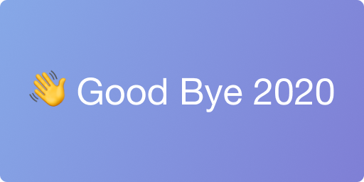

# 🦠 Covid-19와 함께한 2020년..!

나의 20살이 오늘으로 마무리 되는 날이다.

코로나 때문에 아쉽기도 하지만 그래도 좋은 사람들을 많이 만나서 즐겁고 보람차게 보낼 수 있었던 한해 였던 것 같다!

올 한 해 있었던 여러가지 주요 사건들을 위주로 정리해보았다.

## ✈️ 1월 유럽 여행

[서울특별시에서 계최한 창의아이디어 경진대회에서 은상을 수상](https://m.blog.naver.com/PostView.nhn?blogId=2019sca&logNo=222086576390&navType=tl)하고 부상으로 유렵여행을 다녀오게 되었다.

다행히 코로나가 아직 중국내에서 해외로 퍼지지 않았던 시점이라서 다행히 안전하게 다녀 올 수 있었던 것 같다.

스페인, 프랑스, 독일 3개국을 돌아다니면서 여러가지 문화를 느낄 수 있었던 좋은 기회였다.

## 🗺 3월 React 공부 후 공적마스크맵 개발

처음으로 웹 프론트에 대해서 관심을 가지게 된 계기가 되는 프로젝트이다.

코로나가 지속되면서 집에서만 있게되고 입학하게 되는 대학도 MT 취소, 입학식 취소, 비대면 수업으로 진행됨에 따라서 허무함을 느끼고 있다가 `TeamMODU` 에서 진행하기로 했던 프로젝트를 위해서 React를 공부하게 되었다.

처음 간단하게 클론코딩을 통해서 React, React Hook 까지 공부를 하고 그 다음 코로나 관련해서 무언가 만들고 싶어져서 재난 문자 API를 이용한 프로젝트를 해본뒤 마스크맵 API를 이용하여서 공적 마스크맵까지 개발 하게 되었다.

[[React JS] - 공적 마스크맵 개발 후기(feat. Kakaomap)](https://jaeseokim.github.io/React/React-JS-%EA%B3%B5%EC%A0%81-%EB%A7%88%EC%8A%A4%ED%81%AC%EB%A7%B5-%EA%B0%9C%EB%B0%9C-%ED%9B%84%EA%B8%B0feat-Kakaomap/)

## 🎉 6월 첫 Github Contribution!

`React`, `Next.js` 등을 공부하면서 게시판 구현을 하게 되었는데 이 때 사용한 `react-simplemde-editor` 라이브러리에 버그를 발견하게 되어서 내부에 이벤트에 대해서 하나가 처리가 안되어 있는 것을 알게 되고 해당하는 코드를 하나 추가 해서 처음으로 오픈소스에 기여를 하게 되었다.

[첫 GitHub Contribution!! (feat. react-simplemde-editor)](https://jaeseokim.github.io/React/%EC%B2%AB-GitHub-Contribution-feat-react-simplemde-editor/)

## 🏊‍♂️ 7월 42Seoul - La Piscine 참여!

작년에 신청했었던 42Seoul의 1개월 집중 교육 및 선발과정인 `La Piscine`에 참여 하였다.

한달동안 진행되는 선발 과정동안 많은 사람들을 만나면서 매일 밤샘으로 코딩 하고 팀 프로젝트도 하고 여러가지 많은 일들이 있었다.

코로나 때문에 격주로 진행해야 한다는 불편함도 있었지만 좋은 사람들을 많이 만나서 한달동안 재미있게 할 수 있었던 것 같다.

피신 기간동안 같이 공부 했던 동료들과 모두 다 같이 본과정에 합격을 하여서 더욱더 의미가 깊게 느껴졌던 것 같다.

## 🎞 7월 토이 프로젝트 [Your-Portfolio](https://github.com/JaeSeoKim/Your-Portfolio) 개발!

`La-Piscine` 에 참여하느라 마무리를 못했던 프로젝트를 마무리 하고 `생활 코딩`, `React Korea` 에 공개를 해보았다.

https://your-portfolio.vercel.app/

많은 사람들이 관심을 가져주어서 기분도 좋았고 관심이 있었던 `GraphQL`, `Next.js` 등 여러가지 기술들을 써볼 수 있는 재미있었던 프로젝트 였다.

## 🖋 8월 Gatsby를 이용한 Blog로 이전! (Tistory -> git-blog)

React에 대해서 공부를 하면서 한번 `Gatsby` 를 이용해서 블로그를 직접 만들어 보고 싶어져서 빠르게 개발에 착수 했다.

[gatsby를 이용한 Github blog 개발후기](https://jaeseokim.github.io/React/gatsby-blog-%EA%B0%9C%EB%B0%9C-%ED%9B%84%EA%B8%B0/)

기존 Tistory에 작성하였던 글과 사진을 Backup하기 위해서 `GoLang` 를 이용하여 스크립트를 작성해보고 여러가지 최적화도 진행하고 지금도 계속 조금씩 수정을 하면서 개선 발전해 나아가고 있다.

아직은 블로그 이전후 오랜 시간이 지나지 않아서 기존 Tistory 블로그 방문수를 뛰어 넘지는 못하고 있지만 그래서 직접 만들었다는 점에서 매우 뿌듯 하다.

> jaeseokim.github.io
>
> 

> jaeseokim.tistory.com
>
> 

## 🏃🏻‍♂️ 9월 42Seoul 본과정 시작!

코로나 때문에 42Seoul의 본과정 시작이 연기 되는 불상사가 있었지만 본과정이 시작이 되었다!

시작 후 빠르게 초반 프로젝트를 클리어 하고 어렵다고 소문난 `ft_printf` 프로젝트를 보너스 까지 모두 완성하였다.

한달정도를 `ft_printf` 프로젝트에 시간을 투자하였는데 스터디 사람들 끼리 클러스터에 모여서 오아시스에서 토론을 하고 서로 찾은 방법을 공유 하면서 매우 재미있게 프로젝트를 진행 했던 것 같다.

[[42Seoul] ft_printf 프로젝트 기록.](https://jaeseokim.github.io/C/42Seoul-ft_printf-%ED%94%84%EB%A1%9C%EC%A0%9D%ED%8A%B8-%EA%B8%B0%EB%A1%9D/)

## 📌 10월 토이 프로젝트 [Badge42](https://github.com/JaeSeoKim/badge42) 시작!

42Seoul에서 공부를 하면서 중간에 진행 할 만한 프로젝트가 없나 고민을 하다가 42에서 제공하는 API를 이용하여 토이프로젝트를 진행하게 되었다.

> ### badge42 개발기
>
> [1편 보러 가기!](https://jaeseokim.github.io/Javascript/42-readme-stats-개발기_1/), [2편 보러 가기!](https://jaeseokim.github.io/Javascript/badge42-개발기_2_aka_42-readme-stats/), [3편 보러 가기!](https://jaeseokim.github.io/Javascript/badge42-개발기_3_aka_42-readme-stats/), [4편 보러 가기!](https://jaeseokim.github.io/Javascript/badge42-%EA%B0%9C%EB%B0%9C%EA%B8%B0_4/)

처음에는 간단한 컬러에 Level, BlackHole 등의 정보만 보여줄 수 있도록 디자인을 하였는데 지속적으로 개발하여서 이제는 아래처럼 코알리션 별 배경을 적용하여 좀더 이쁘게 보일 수 있도록 발전 시켰다.

이제는 많은 사람들이 사용하면서 `Star` 도 **71**개나 받게 되었다..!!

처음으로 오픈소스 프로젝트를 진행하면서 사람들에게 호응을 많이 받은 것이 처음이여서 매우 뿌듯 하다.

## 🤔 1년을 돌아보면서

1년간 코로나라는 제약이 있었음에도 그래도 내자신이 열심히 했다라고 자부심 있게 말 할 수 있을 정도로 한 것 같아서 다행이였던 것 같다.

> 연초와 연말에 잔디가 비워져 있는 모습이 보이는게 조금 아쉬운 점이다. ㅠㅠ ~~(좀더 노력 할껄...)~~

내년의 목표는 **잔디를 올해보다 좀더 풍성하게 만드는 것!**, **42Seoul의 공통과정 끝내기!**, **Github Star 100개 이상 받을 수 있는 프로젝트 만들기!**

이 3가지를 목표로 열심히 달려봐야겠다!
