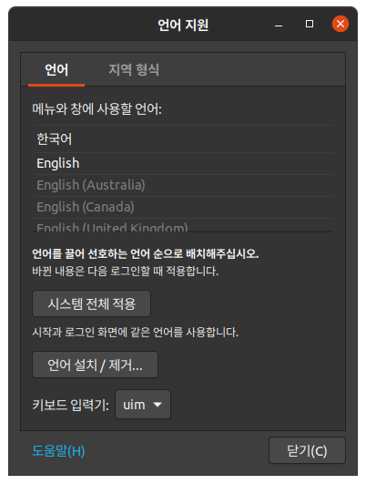
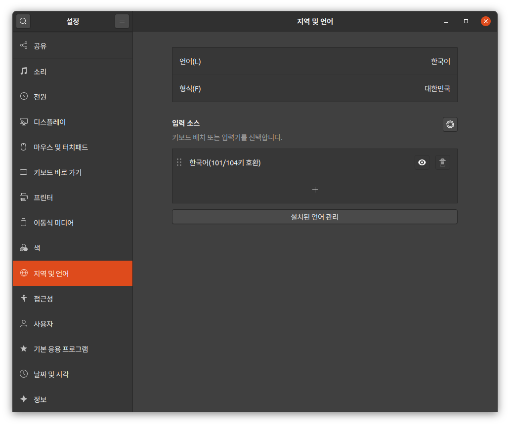
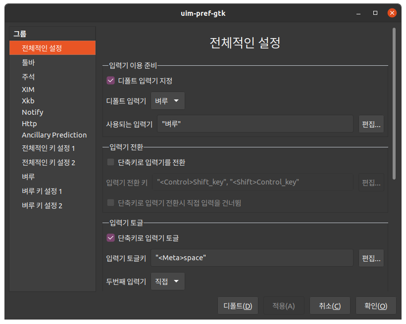
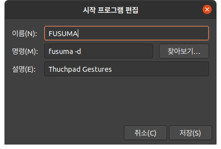
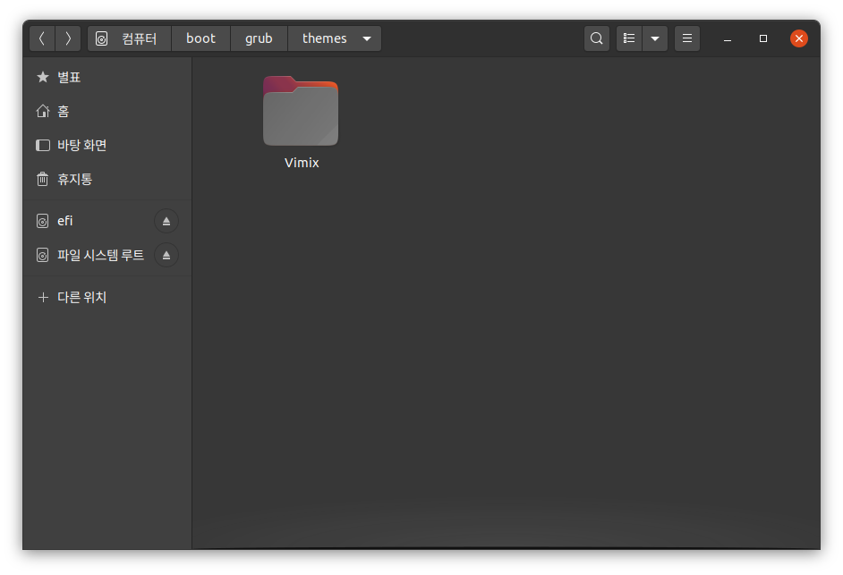
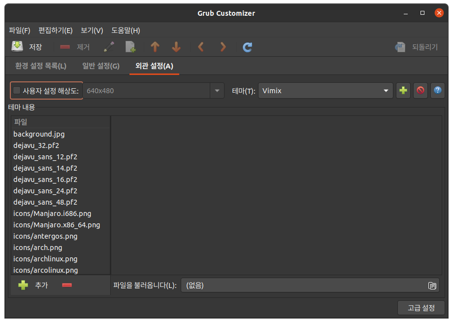
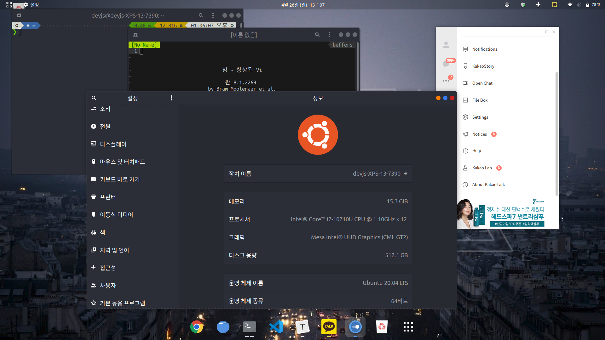

이전 18.04 lts 세팅을 하였던 것을 기반으로 이번에 20.04를 설치하고 세팅하면서 다시 작성합니다.

[https://jaeseokim.tistory.com/97](https://jaeseokim.tistory.com/97)

## chrome 설치

[https://www.google.com/chrome/](https://www.google.com/chrome/) 에서 ubuntu/debian용 deb 패키지를 다운 받습니다.

```
dpkg --install google-chrome-stable_current_amd64.deb
```

위 명령어를 통해 설치를 합니다.

### Ibus -> uim-byeru 입력기 변경

기존 18.04에서도 사용하면서 만족스러웠던 `uim-byeru` 를 설치 하여 사용합니다.

```
sudo apt install uim uim-byeoru
```



언어 지원에서 uim 입력기로 변경합니다.



지역 및 언어에서 입력 소스를 한국어 101/104키 호환으로 사용하여 기존에는 직접 수정하여 Alt -> Hangul 키 바인딩 했던 것을 자동으로 합니다.



그리고 이제 입력기를 "벼루"로 사용 설정합니다.

그리고 한영 전환키 바인딩 설정을 진행합니다. 그리고 재부팅을 하여 적용합니다. (재부팅을 안하면 한영키가 정상적으로 동작을 안합니다.)

## 한글 폴더명 수정

터미널을 쓰면서 항상 불편하게 다가온 한글 폴더명을 영어로 변경합니다.

```sh
export LANG=C
xdg-user-dirs-gtk-update
```

팝업 창이 뜨게 되면 update names 눌러 변경합니다.

```sh
devjs@devjs-XPS-13-7390:~$ export LANG=C
devjs@devjs-XPS-13-7390:~$ xdg-user-dirs-gtk-update
Moving DESKTOP directory from 바탕화면 to Desktop
Moving DOWNLOAD directory from 다운로드 to Downloads
Moving TEMPLATES directory from 템플릿 to Templates
Moving PUBLICSHARE directory from 공개 to Public
Moving DOCUMENTS directory from 문서 to Documents
Moving MUSIC directory from 음악 to Music
Moving PICTURES directory from 사진 to Pictures
Moving VIDEOS directory from 비디오 to Videos
```

### 트랙패드 제스처 설정 Fusuma 사용

기본적으로 세팅 되는 트랙패드는 기본적인 스크롤과 터치만 가능하기 때문에 다양한 제스처를 사용 할 수 있도록 `Fusuma` 를 이용하여 설정합니다.

[https://github.com/iberianpig/fusuma](https://github.com/iberianpig/fusuma)

```sh
sudo gpasswd -a $USER input
```

위의 명령어를 실행하여 그룹에 input를 추가한 다음 Reboot 작업을 진행 해주어야 합니다.

```sh
sudo apt-get install libinput-tools
sudo apt-get install ruby
sudo gem install fusuma
sudo apt-get install xdotool
```

그리고 추가적으로 플러그인을 설치 합니다. (굳이 사용 안 해도 문제는 없지만 제스처가 더욱더 부드럽게 작동하고 추가 기능들을 사용할 수 있습니다.)

```sh
sudo gem install fusuma-plugin-keypress
sudo apt install wmctrl
sudo gem install fusuma-plugin-wmctrl
sudo gem install fusuma-plugin-tap
```

이제 설치가 완료되면 제스처에 대해서 설정 합니다.

```sh
mkdir -p ~/.config/fusuma        # create config directory
vi ~/.config/fusuma/config.yml # edit config file.
```

저는 아래와 같은 제스처로 설정 했습니다.

```yml
swipe:
  3:
    left:
      command: "xdotool key alt+Left" # History back
      keypress:
        LEFTCTRL:
          command: "xdotool key ctrl+shift+Tab" # Prev tab
    right:
      command: "xdotool key alt+Right" # History forward
      keypress:
        LEFTCTRL:
          command: "xdotool key ctrl+Tab" # Next tab
    up:
      command: "xdotool key super+d" # All window Down/Up
    down:
      command: "xdotool key super+m" # notification Open/Close
  4:
    left:
      workspace: "next" # Switch to next workspace
      keypress:
        LEFTSHIFT:
          window: "next" # Move window to next workspace
        LEFTMETA:
          command: "xdotool key --clearmodifiers super+ctrl+Left" # Move window to left side
    right:
      workspace: "prev" # Switch to previous workspace
      keypress:
        LEFTSHIFT:
          window: "prev" # Move window to previous workspace
        LEFTMETA:
          command: "xdotool key --clearmodifiers super+ctrl+Right" # Move window to right side
    up:
      command: "xdotool key super+s" # Workspace overview
      keypress:
        LEFTMETA:
          window:
            maximized: "toggle" # Toggle Maximize/Unmaximize Window
    down:
      command: "xdotool key super+a" # Window overview
      keypress:
        LEFTMETA:
          window: "close" # Close window

pinch:
  2:
    in:
      command: "xdotool keydown ctrl click 4 keyup ctrl" # Zoom in
    out:
      command: "xdotool keydown ctrl click 5 keyup ctrl" # Zoom out
  4:
    in:
      command: "xdotool key super+a" # Window overview
    out:
      command: "xdotool key super+s" # Workspace overview

rotate:
  2:
    clockwise:
      command: "xdotool key XF86AudioRaiseVolume" # Volume up
    counterclockwise:
      command: "xdotool key XF86AudioLowerVolume" # Volume down
  3:
    clockwise:
      command: "xdotool key XF86MonBrightnessUp" # Brightness up
    counterclockwise:
      command: "xdotool key XF86MonBrightnessDown" # Brightness down

plugin:
  inputs:
    libinput_command_input: # options for lib/plugin/inputs/libinput_command_input
      enable-tap: true # click to tap
      enable-dwt: true # disable tap while typing
      show-keycodes: true # https://github.com/iberianpig/fusuma-plugin-keypress#add-show-keycode-option
      verbose: true # verbose log
```

이제 완성된 제스처를 부팅 시 마다 자동으로 적용이 되도록 합니다.



### TLP 설정 - 배터리 전력 관리

[guide to power optimization of your Dell XPS 13 (9370) 2018](https://gist.github.com/isgroup-srl/1b6bcd6419db575efb30f4bc2096642a) 이 글을 참고하여 설정 했습니다.

`tlp` 와 `powertop` 을 설치 합니다.

```sh
sudo apt install tlp tlp-rdw powertop
```

`tlp` 서비스를 자동으로 시작되도록 합니다.

```sh
systemctl enable tlp
```

`powertop` autotune systemd startup script도 작성하여 만들어 봅니다.

[https://blog.sleeplessbeastie.eu/2015/08/10/how-to-set-all-tunable-powertop-options-at-system-boot/](https://blog.sleeplessbeastie.eu/2015/08/10/how-to-set-all-tunable-powertop-options-at-system-boot/)

```sh
sudo vi /etc/systemd/system/powertop.service
[Unit]
Description=PowerTOP auto tune

[Service]
Type=idle
Environment="TERM=dumb"
ExecStart=/usr/sbin/powertop --auto-tune

[Install]
WantedBy=multi-user.target
```

`powertop` tuning 서비스도 등록 합니다.

```sh
systemctl daemon-reload
systemctl enable powertop.service
```

`tlpui` 를 설치하여 관리하기 편하게 합니다.

```sh
sudo add-apt-repository ppa:linuxuprising/apps
sudo apt update
sudo apt install tlpui
```

### 윈도우 파티션 접근을 위한 NTFS-3g 설치

이제 윈도우 파티션과 같이 접근을 하여 사용을 하기 위해 아래의 명령어를 입력합니다.

```sh
sudo apt install ntfs-3g
```

그러고 이제 윈도우 파티션에 접근을 할려고 보면 읽기 전용으로 설정이 되어 있는 것을 볼 수 있습니다.

윈도우에서는 컴퓨터가 꺼질때 윈도우 디스크에 읽기 전용 플래그를 날려 최대절전상태가 저장된 디스크를 보호하기 때문에 최대 절전 모드를 해제 해줍니다. 아래의 명령어를 관리자 권한을 추가 하여 실행 하였습니다.

```sh
powercfg -h off
```

### 윈도우와 우분투의 시간 동기화

우분투로 사용을 하다 윈도우로 부팅을 해보면 시간이 이상한 것을 볼 수 있습니다. 아래의 명령어를 사용하여 해결을 합니다.

```sh
timedatectl set-local-rtc 1
```

그리고 재부팅 시에도 다시 적용이 되도록 아래의 설정을 해줍니다.

```sh
sudo vi /etc/default/rcS
UTC=no
```

## 사용자 커스텀화 \- 테마 적용 및 개별 소프트웨어 다운 및 설치

### ZSH & OhMyZsh & powerlevel10k 설치

우분투나 Mac 환경에서 필수적으로 사용해야 한다는 ZSH과 OhMyZsh을 설치한다.

```sh
sudo apt install zsh
chsh -s /usr/bin/zsh
```

zsh 설치

```sh
curl -L https://raw.github.com/robbyrussell/oh-my-zsh/master/tools/install.sh | sh
```

powerlevel10k 설치

```sh
git clone --depth=1 https://github.com/romkatv/powerlevel10k.git ${ZSH_CUSTOM:-~/.oh-my-zsh/custom}/themes/powerlevel10k
```

Set `ZSH_THEME="powerlevel10k/powerlevel10k"` in `~/.zshrc`.

그리고 현재 기본 상태에서는 폰트가 정상적으로 출력이 안되는 모습을 볼 수 있는데 [https://github.com/ryanoasis/nerd-fonts/releases](https://github.com/ryanoasis/nerd-fonts/releases) 여기서 원하는 폰트를 골라 설치를 한다.

### GRUB 멀티 부팅 화면 커스텀 테마 설치

```sh
sudo add-apt-repository ppa:danielrichter2007/grub-customizer
sudo apt update
sudo apt install grub-customizer
```

[https://www.gnome-look.org/p/1009236/](https://www.gnome-look.org/p/1009236/)

`/boot/grub/thems/` 아래에 다운 받은 테마를 넣고 `grub-customizer` 를 실행해서 테마를 설정합니다.



### gnome-tweak-tool 를 이용한 테마 설정

#### ICON

[https://github.com/vinceliuice/Tela-icon-theme](https://github.com/vinceliuice/Tela-icon-theme)

#### Shell Theme

[https://extensions.gnome.org/extension/19/user-themes/](https://extensions.gnome.org/extension/19/user-themes/)

```sh
sudo apt install chrome-gnome-shell
```

[https://www.gnome-look.org/p/1013030/](https://www.gnome-look.org/p/1013030/)

#### extension

[https://github.com/micheleg/dash-to-dock](https://github.com/micheleg/dash-to-dock)

[https://extensions.gnome.org/extension/1031/topicons/](https://extensions.gnome.org/extension/1031/topicons/)

[https://extensions.gnome.org/extension/1162/emoji-selector/](https://extensions.gnome.org/extension/1162/emoji-selector/)

[https://extensions.gnome.org/extension/1485/workspace-matrix/](https://extensions.gnome.org/extension/1485/workspace-matrix/)

[https://extensions.gnome.org/extension/21/workspace-indicator/](https://extensions.gnome.org/extension/21/workspace-indicator/)

[https://extensions.gnome.org/extension/545/hide-top-bar/](https://extensions.gnome.org/extension/545/hide-top-bar/)

#### Theme

[https://www.pling.com/p/1214931](https://www.pling.com/p/1214931)

### build essential 설치

```sh
sudo apt-get install build-essential
```

### wine을 이용하여 KAKAO TALK 설치

```sh
dpkg --add-architecture i386
sudo apt update
```

원래 winehq의 공식 repo에서 바로 다운을 할려고 하였으나 20.04 repo가 아직 없는 관계로 기본 repo에서 다운을 받아 설치 합니다. 예전에 5.0 stable 버전에서는 오작동을 하여 development 버전으로 설치 합니다.

```sh
sudo apt install wine64-development wine-development
WINEARCH=win32 WINEPREFIX=~/.wine wine wineboot
```

`winetricks` 를 이용하여 추가로 필요한 패키지를 설치합니다. (

진짜 오래 걸립니다...

)

```sh
sudo apt install winetricks
winetricks gdiplus wmp9 riched20 msxml6 d3dx9_43
```

[http://app.pc.kakao.com/talk/win32/KakaoTalk_Setup.exe](http://app.pc.kakao.com/talk/win32/KakaoTalk_Setup.exe)

```sh
wine KakaoTalk_Setup.exe
```

### docker 설치

```sh
sudo apt install docker.io
sudo apt install docker-compose
sudo systemctl enable --now docker
```

```sh
newgrp docker
sudo usermod -aG docker ${USER}
```

### vscode 설치

[https://code.visualstudio.com/](https://code.visualstudio.com/)

```sh
sudo dpkg --install code_1.44.2-1587059832_amd64.deb
```

### nodejs, npm 설치

```sh
sudo apt install nodejs npm
```

node 최신 stable 업데이트

```sh
sudo npm install -g n
sudo n stable
```

### VIM Plugin 설치

[https://vim-bootstrap.com/](https://vim-bootstrap.com/) 에서 생성한 파일을 `~/` 경로에 `.vimrc` 로 이동

#### 최종 모습!



### 참고 자료

#### dell xps 13 7390 Battery stop charging thresholds

[https://wiki.archlinux.org/index.php/Dell_XPS_13\_(7390)](<https://wiki.archlinux.org/index.php/Dell_XPS_13_(7390)>)

20.04 문제점

1\. bluetooth-headset-not-working (에어팟 연결 시도시 연결도 잘 안되고 연결을 성공하여도 사운드 출력이 안됨.. 이미 동일 증상을 가진 유저들이 있음)

[https://askubuntu.com/questions/1230845/bluetooth-headset-not-working-in-20-04](https://askubuntu.com/questions/1230845/bluetooth-headset-not-working-in-20-04)
