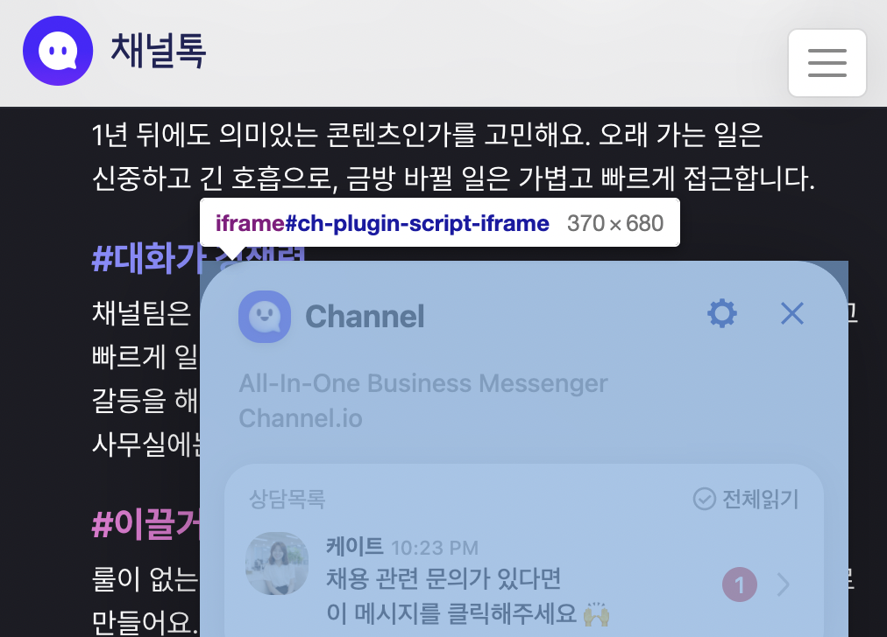
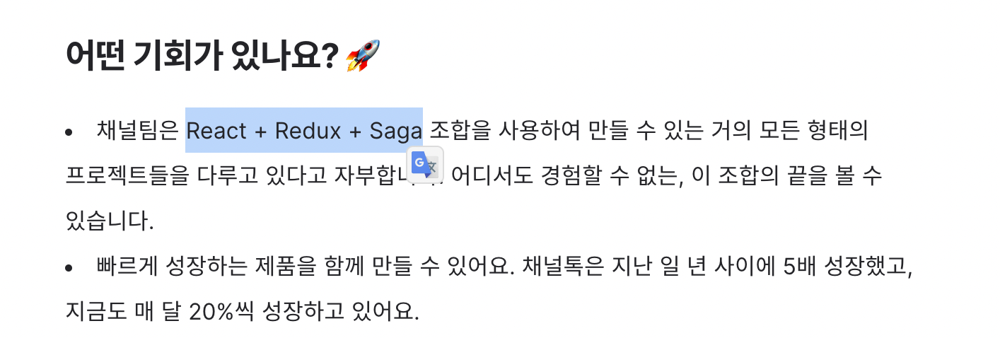
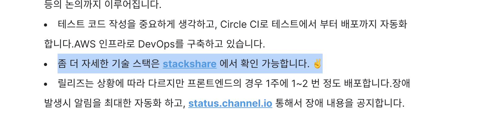
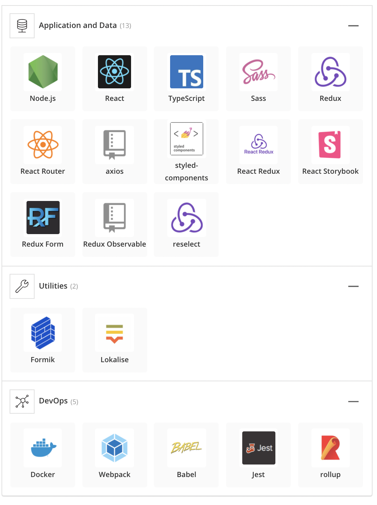
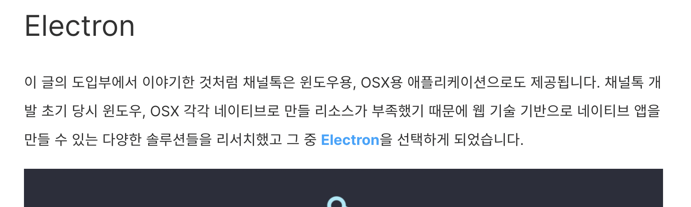
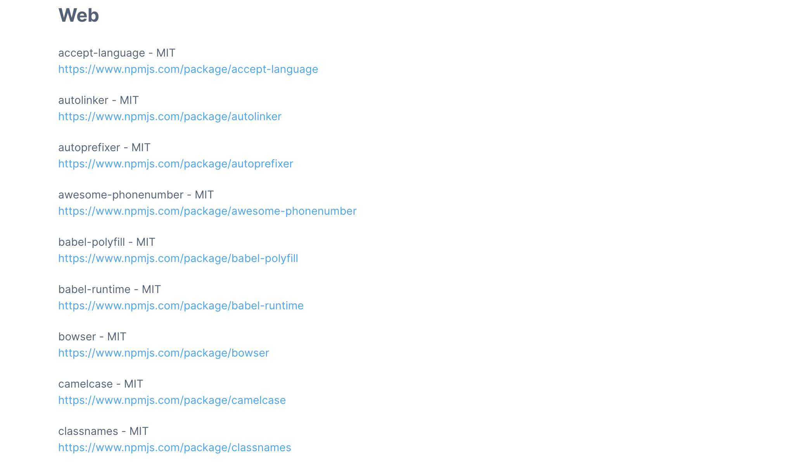
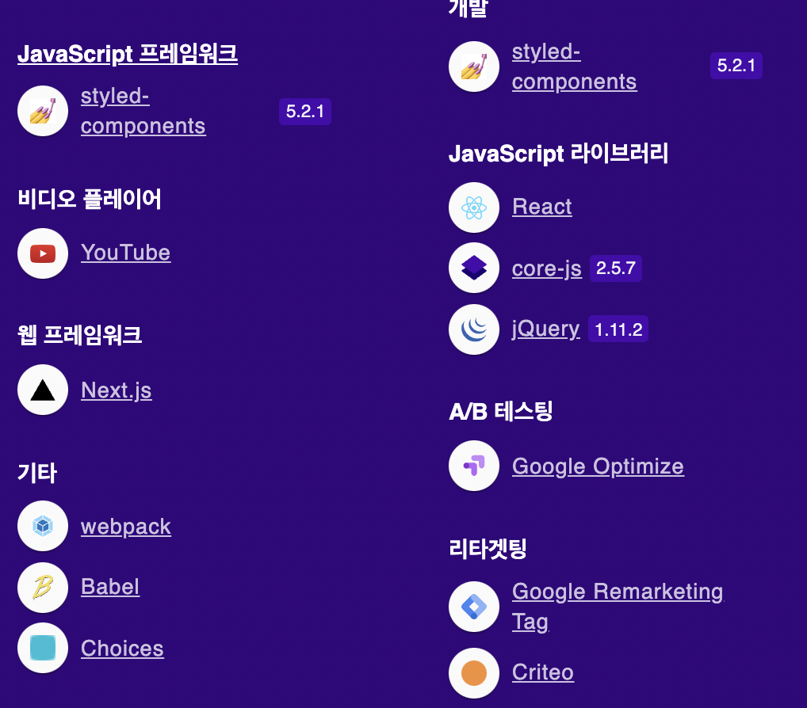

<div align="center">
  <br/>
  <image src="https://channel.io/images2/common/ch-logo-ko.png" alt="channel.io" />
</div>

## 🤓 intro

최근 FrontEnd 공부를 하면서 `channel.io`, `crisp` 와 같은 플러그인 서비스는 **특정 사이트, 서비스 위에** 추가 되어서 동작을 하게 되는데 이때 어떤 형태로 구현이 되어서 작동이 되었는지 궁금증과 호기심이 발생 하여서 분석을 해보았습니다.

## 🔬 개발자 도구를 통해 확인 해보기!

일단 기본적으로 이런 형태의 서비스는 `iframe` 를 통해 구현이 되어 있는 것으로 알고 있는데 해당 부분이 맞는지 직접 개발자 도구를 이용해서 확인을 해봅니다.



Chrome 개발자 도구를 켜서 직접 해당 element 를 확인을 해보니 위와 같이 iframe 으로 구성 되어 있는 것을 알 수 있습니다.

일단 `iframe` 를 통해 다른 서비스 내부에서 동작을 한다는 것은 알았지만 이제 어떤 형태로 사이트 내부에서 상호 작용하면서 통신을 하는 거지에 대한 의문을 가질수 있게 되는데 이때 `channel.io` 의 적용 script를 분석해보면서 의문점을 해결 해보겠습니다.

## 🧐 Channel Plugin Scripts 분석 하기!

일단 `channel.io` 의 개발자 가이드 문서로 가서 Installation 페이지에서 안내하는 스크립트를 분석 합니다!

> [[docs] web-installation#single-page-application](https://developers.channel.io/docs/web-installation#single-page-application)

```js
// ChannelService.js

class ChannelService {
  // 해당 Class 생성자 호출시 `loadScript` 함수를 호출 합니다.
  constructor() {
    this.loadScript()
  }

  loadScript() {
    var w = window
    // 이미 window 전역 객체에 `ChannelIO` 가 존재 하는 지를 체크 하여 중복으로 Load 되는 것을 방지 합니다.
    if (w.ChannelIO) {
      return (window.console.error || window.console.log || function () {})(
        "ChannelIO script included twice."
      )
    }
    // ch 객체를 만들고 내부의 c함수를 전달 받은 `arguments` 를 전달 하여 실행 합니다.
    var ch = function () {
      ch.c(arguments)
    }
    // ch 객체 내부에 q array를 만들어 줍니다.
    ch.q = []
    // 전달 받은 args를 q에 저장합니다.
    ch.c = function (args) {
      ch.q.push(args)
    }
    // window.ChannelIO 를 ch로 설정 합니다.
    w.ChannelIO = ch
    // boot script 를 정의 합니다.
    function l() {
      // 만약 channelIo가 초기화 되었다면 아무 작업을 하지 않도록 합니다.
      if (w.ChannelIOInitialized) {
        return
      }
      // 초기화 작업 완료 flag를 세워줍니다.
      w.ChannelIOInitialized = true
      // script element를 생성합니다.
      var s = document.createElement("script")
      // javascript 구문으로 해석 될 수 있도록 정의 합니다.
      s.type = "text/javascript"
      // 비동기 방식으로 불러올 수 있도록 설정합니다.
      s.async = true
      // channel.io가 핵심적으로 동작하게될 bunddle된 script src를 지정합니다.
      s.src = "https://cdn.channel.io/plugin/ch-plugin-web.js"
      // UTF-8로 핵석 될 수 있도록 알려줍니다.
      s.charset = "UTF-8"
      // document 내부에 있는 첫번째 script element를 가져 옵니다.
      var x = document.getElementsByTagName("script")[0]
      // 위에서 정의한 channel.io 스크립트 태그를 x 이전에 삽입 되도록 합니다.
      x.parentNode.insertBefore(s, x)
    }

    // Document의 상태가 complete 또는, 로드가 되어 있다면 l를 호출 한다.
    if (document.readyState === "complete") {
      l()
    } else if (window.attachEvent) {
      window.attachEvent("onload", l)
    } else {
      window.addEventListener("DOMContentLoaded", l, false)
      window.addEventListener("load", l, false)
    }
  }

  // ChannelIO의 boot 작업을 인자로 넘어온 settings 오브젝트를 통해 실행한다.
  boot(settings) {
    window.ChannelIO("boot", settings)
  }

  // ChannelIO 종료
  shutdown() {
    window.ChannelIO("shutdown")
  }
}

export default new ChannelService()
```

해당 스크립트를 살펴 보면 **CDN** 에서 **script** 를 불러와 실행 할 수 있도록 하는 것을 볼 수 있습니다.

이제 `ChannelService` 를 사용하기 위해서는 아래와 같이 **pluginKey** 와 옵션을 함께 전달하여 `channel.io` 를 실행 할 수 있는 것을 볼 수 있습니다.

```js
// Boot Channel as an anonymous user
ChannelService.boot({
  pluginKey: "YOUR_PLUGIN_KEY", //please fill with your plugin key
})

// Boot Channel as a registered user
ChannelService.boot({
  pluginKey: "YOUR_PLUGIN_KEY", //please fill with your plugin key
  profile: {
    name: "YOUR_USER_NAME", //fill with user name
    mobileNumber: "YOUR_USER_MOBILE_NUMBER", //fill with user phone number
    CUSTOM_VALUE_1: "VALUE_1", //any other custom meta data
    CUSTOM_VALUE_2: "VALUE_2",
  },
})

// Shutdown Channel
ChannelService.shutdown()
```

이제 한번 **CDN** 에서 불러온 **script** 를 분석 해봅니다!

```js
// https://cdn.channel.io/plugin/ch-plugin-web.js

!(function () {
  var e
  if (
    // 지원 하는 브라우저와 버전에 속해 있는지 검증
    ((e = window.navigator.userAgent),
    !/(Opera\/.+Opera Mobi.+Version\/((10|11)\.0|11\.1|11\.5|12\.(0|1)))|(Opera\/((10|11)\.0|11\.1|11\.5|12\.(0|1)).+Opera Mobi)|(Opera Mobi.+Opera(?:\/|\s+)((10|11)\.0|11\.1|11\.5|12\.(0|1)))|(SamsungBrowser\/((4|5)\.0|5\.4))|(IEMobile[ /](10|11)\.0)|(Android Eclair)|(Android Froyo)|(Android Gingerbread)|(Android Honeycomb)|(PlayBook.+RIM Tablet OS (7\.0|10\.0)\.\d+)|((Black[bB]erry|BB10).+Version\/(7\.0|10\.0)\.\d+)|(Trident\/6\.0)|(Trident\/5\.0)|(Trident\/4\.0)|(([MS]?IE) (5\.5|([6-9]|10)\.0))/.test(
      e
    ) &&
      // cookie를 가지고 사용 할 수 있는지에 대해서 테스트
      window.navigator.cookieEnabled &&
      (!window.document.documentMode ||
        ((document.cookie = "ch-session-test=1"),
        document.cookie.split("ch-session-test=").length >= 2 &&
          ((document.cookie = "ch-session-test=; Max-Age=0"), 1))))
  ) {
    // ch-plugin Element가 없다면 해당 Element 만들어서 body에 삽입
    if (!document.getElementById("ch-plugin")) {
      var i = document.createElement("div")
      ;(i.id = "ch-plugin"), document.body.appendChild(i)
    }
    // ch-plugin Element에 렌더링에 필요한 필수 Element와 Iframe 객체 삽입
    document.getElementById("ch-plugin").innerHTML +=
      '<div id="ch-plugin-core"></div><div id="ch-plugin-script" style="display:none"><iframe id="ch-plugin-script-iframe" style="position:relative!important;height:100%;width:100%!important;border:none!important;"></iframe></div>'
    // 위에서 생성한 ch-plugin-script-iframe Element를 n에 저장
    var n = document.getElementById("ch-plugin-script-iframe"),
      // flag 용 t false로 초기화
      t = !1,
      // iframe 초기화 작업을 하는 함수 o 선언
      o = function () {
        // ch-plugin-script-iframe의 내부의 document 객체를 e에 저장
        var e = n.contentDocument || n.contentWindow.document
        // iframe 내부를 writing 모드로 오픈
        e.open(),
          // 핵심 기능인 `https://cdn.channel.io/plugin/ch-plugin-core-20210923190001.js` script 설정
          e.write(
            '<script async type="text/javascript" src="https://cdn.channel.io/plugin/ch-plugin-core-20210923190001.js" charset="UTF-8"></script>'
          ),
          // React Rendering를 위한 필수 HTML 삽입
          e.write(
            '<!DOCTYPE html><html><head><meta charset="utf-8"></head><body><div id="main"></div></body></html>'
          ),
          // iframe 내부 writing 작성 완료
          e.close(),
          // flag ture로 설정
          (t = !0)
      }
    // Document가 onload시 iframe 초기화 작업 실행.
    n.onload || o(),
      (n.onload = function () {
        t || o()
      })
  }
})()
```

이제 여기서 `iframe` 를 초기화 하는 작업을 진행 하게 되는데 여기서 주요하게 봐야 하는 부분은 `CORS` 와 `browser 호환성` 을 고려하여 **iframe**의 **src** 를 통해 미리 만들어진 사이트를 가져오는 것이 아닌 번들링된 script를 이용하여 직접 SPA를 렌더링 하는 것을 볼 수 있습니다!

위와 같은 방법으로 iframe를 관리하게 되면 CORS의 정책에 따른 `script api access` 제한이 없어지며 또한 CORS에 따른 `X-Frame-Options` header를 서버 단에 설정하는 것에 대한 소모를 줄 일 수 있습니다!

https://developer.mozilla.org/en-US/docs/Web/Security/Same-origin_policy#cross-origin_script_api_access

이제 한번 번들링된 script를 간단하게 살펴 봅니다!

일단 `https://cdn.channel.io/plugin/ch-plugin-core-20210923190001.js` 파일을 다운 후 minify와 난독화가 일부분 적용이 된 상태이므로 formatter와 특정 object의 key를 검색하는 형태로 분석을 해봅니다!

일단 가장 먼저 보이게 되는 부분은 아래와 같이 주석을 볼 수 있는데 라이선스에 대한 정보를 담고 있는 것을 볼 수 있는데 해당 파일을 확인 하면 내부에는 `react` 와 함께 여러가지의 부가적인 라이브러리로 구성되어 있는 것을 볼 수 있습니다.

```js
/*! For license information please see ch-plugin-core-20210923190001.js.LICENSE.txt */

// ch-plugin-core-20210923190001.js.LICENSE.txt

...

/** @license React v16.13.0
 * react.production.min.js
 *
 * Copyright (c) Facebook, Inc. and its affiliates.
 *
 * This source code is licensed under the MIT license found in the
 * LICENSE file in the root directory of this source tree.
 */

...
```

일단 해당 기술 스택은 `react` 라는 것을 알게 되었으니 `window.ChannelIO` 객체에 대한 정의 하는 부분을 살펴 봅니다!

```js
// ch-plugin-core-20210923190001.js

...
var n = yl();
(n.ChannelIO = n.ChannelIO || {}),
  (this.commandQueue = n.ChannelIO.q || []),
  (this.pendingQueue = []),
  (this.callbacks = {}),
  (this.methods = Ch(
    {
      show: function () {
        if (!t.pushQueue({ apiName: "show", apiArray: ["show"] }))
          if ((tl(nl("show", "showMessenger")), Ip)) {
            var e = Af.channelSelectors.getChannel(t.getState());
            wp.redirectToEdgeBrowser(e);
          } else
            t.dispatch(
              Tr.uiActions.setShowMessenger({ showMessenger: !0 })
            );
      },
      hide: function () {
        t.pushQueue({ apiName: "hide", apiArray: ["hide"] }) ||
          (tl(nl("hide", "hideMessenger")),
          t.dispatch(
            Tr.uiActions.setShowMessenger({ showMessenger: !1 })
          ));
      },
      lounge: function () {
        if (
          !t.pushQueue({ apiName: "lounge", apiArray: ["lounge"] })
        ) {
          tl(nl("lounge"));
          var e = Xf.getHistory();
          if ("/lounge" !== e.location.pathname)
            if (Af.uiSelectors.showMessenger(t.getState()))
              e.push("/lounge");
            else if (Ip) {
              var n = Af.channelSelectors.getChannel(t.getState());
              wp.redirectToEdgeBrowser(n);
            } else
              t.dispatch(
                Tr.uiActions.setShowMessenger({
                  showMessenger: !0,
                  disableRedirect: !0,
                })
              ),
                e.push("/lounge");
        }
      },
      boot: function (e) {
        var n =
          arguments.length > 1 && void 0 !== arguments[1]
            ? arguments[1]
            : Mn.a;
        if (!Tn()(n) || !Sn()(e))
          return (
            tl("boot failed: Invalid arguments."), On.a.resolve()
          );
        t.methods.shutdown(), Uf.setSettings(e);
        var r = Uf.getPluginKey();
        if (!r)
          return (
            tl("boot failed: pluginKey not found."), On.a.resolve()
          );
        var o = Uf.getLanguage(),
          i = Uf.getLanguageOverrided(),
          a = Uf.getBootOption();
        return "YOUR_USER_ID" === a.memberId
          ? (tl("boot failed: Invalid memberId"), On.a.resolve())
          : (o && t.dispatch(Tr.geoActions.setLocale({ locale: o })),
            i &&
              (bh.setLanguage(i),
              Mp && t.methods.updateUser({ language: i })),
            t
              .dispatch(
                Tr.pluginActions.requestCheckIn({
                  pluginKey: r,
                  option: a,
                })
              )
              .promise.then(function (e) {
                var r = wn()(e, "payload.user", {});
                n(null, r),
                  _n()(t.pendingQueue) ||
                    t.execQueue(t.pendingQueue).then(function () {
                      t.pendingQueue = [];
                    });
              })
              .catch(function (e) {
                var t = wn()(
                  e,
                  "payload.body",
                  new Error("boot failed")
                );
                n(t, null);
              }));
      },
      shutdown: function () {
        t.dispatch(Tr.pluginActions.checkOut({}));
      }
...
```

코드의 양이 방대 함으로 일부분만 확인을 해보니 `window.ChannelIO` 에 외부에서 `channel.io` 와 상호 작용이 가능한 함수들을 정의 하는 것을 볼 수 있는데 `dispatch`, `actions`, `dispatch chaining promise` 를 통해 전역으로 상태관리를 위한 `redux`, `redux-saga` 와 같은 도구를 사용 하는 것을 볼 수 있습니다.

이번에는 `https://` 와 같은 키워드를 이용해서 어디와 통신을 주고 받는지 분석을 해봅니다.

```js
...
/**
 * https://api.channel.io에 대한 요청을 실행 하는 함수 정의 부분!
 * credentials: "omit" 를 통해 fetch API라는 것을 유추 할 수 있습니다.
 */
function n() {
  var e;
  return (
    he()(this, n),
    (e = t.call(this, "https://api.channel.io", {
      credentials: "omit",
    })),
    ve()(bu()(e), "language", Uf.getLanguageOverrided()),
    e
  );
}
...
/**
 * https://browser.sentry-cdn.com/5.6.2/bundle.min.js 를 통해
 * sentry를 이용하여 프론트 에러 로그를 수집 하는 것을 볼 수 있습니다.
 */
key: "install",
  value: function () {
    var e = window.document.createElement("script");
    (e.onload = function () {
      var e, t;
      null === (e = window.Sentry) ||
        void 0 === e ||
        e.init({
        dsn: "https://b05367f6be924bb49e15838987b99ce6@sentry.io/306179",
        environment: In()(
          (t = "".concat("production", "|"))
        ).call(t, "App"),
        release: "7.0.5",
        whitelistUrls: [/cdn\.channel\.io/, /cdn\.ravenjs\.com/],
        normalizeDepth: 5,
      });
    }),
      (e.async = !0),
      (e.crossOrigin = "anonymous"),
      (e.integrity =
       "sha384-H4chu/XQ3ztniOYTpWo+kwec6yx3KQutpNkHiKyeY05XCZwCSap7KSwahg16pzJo"),
      (e.src =
       "https://browser.sentry-cdn.com/5.6.2/bundle.min.js"),
      window.document.head.appendChild(e);
  },
...
/**
 * 또한 msg와 같이 실시간으로 주고 받기 위한 websocket도 설정 하는 것을 볼 수 있습니다!
 */
{
  key: "connect",
  value: function () {
    var e = this;
    this.isConnected() && this.disconnect({ forceDisconnect: !0 }),
      Zc(),
      (this.connecting = !0),
      (this.forceDisconnect = !1),
      (this.ready = !1),
      (this.readyQueue = []),
      (this.socket = (0, v_.a)("https://ws.channel.io/front-v4", {
      transports: ["websocket"],
      upgrade: !0,
      reconnectionDelay: 5e3,
      reconnectionDelayMax: 1e4,
    })),
      this.socket.on("ready", this.onReady),
      this.socket.on("connect", this.onConnect),
      this.socket.on("connect_error", this.onConnectError),
      this.socket.on("connect_timeout", this.onConnectTimeout),
      this.socket.on("reconnect_error", this.onReconnectError),
      this.socket.on("reconnect_failed", this.onReconnectFailed),
      this.socket.on("reconnect_attempt", this.onReconnectAttempt),
      this.socket.on("reconnect", this.onReconnect),
      this.socket.on("error", this.onError),
      this.socket.on("disconnect", this.onDisconnect),
      window.addEventListener("offline", function () {
      Zc(),
        e.isConnected() &&
        (Zc(), e.disconnect({ forceDisconnect: !1 }));
    }),
      window.addEventListener("beforeunload", function () {
      Zc(), e.disconnect({ forceDisconnect: !0 });
    });
  },
},
...
```

위에 적은 부분 말고도 여러가지 **Error** 에 대한 메시지를 통해 `redux`, `styled-components`, `core-decorators`, `date-fns` 등 여러가지 라이브러리를 사용한 것을 볼 수 있습니다.

이제 대략적으로 어떤 형태로 돌아 가는 지에 대해서 확인을 했으니 추가적으로 사용한 기술 스택에 대해서 조사를 해봅니다!

## ⚙️ 기술 스택 조사하기!

일단 기술 스택에 조사하는 방법은 여러가지가 존재 하는데 가장 일단 해당 기술 블로그나 채용 사이트에 들어가서 기술 스택에 대해서 조사를 해봅니다.





[](https://stackshare.io/channel-io/frontend)

채용공고를 확인 해 보니 내부에서 사용 하는 기술 스택에 대해서 자세히 설명을 하고 `stackshare` 를 통해 자세하게 공유 하는 것을 볼 수 있습니다!

아래의 기술 블로그에서 설명하는 `frontend-stack` 글을 통해 window와 macos의 native app를 제공하기 위해 `electron` 를 사용한다는 정보를 추가로 얻을 수 있었습니다!

https://channel.io/ko/blog/frontend-stack



이번에는 더욱더 상세하게 세부 라이브러리를 어떤 것을 사용 하는지에 대해 확인을 하도록 `오픈소스 라이선스` 사이트에 들어가 확인을 해봅니다.!

https://channel.io/ko/oss



해당 라이선스 문서를 통해 세부 적으로 사용한 라이브러리를 확인 할 수 있다는 것을 쉽게 알 수 있습니다!

마지막으로 `wappalyzer` 와 같은 분석 도구를 이용해서 분석을 해봅니다.

일단 iframe 내부는 분석을 제대로 하지 못하기 때문에 `channel.io` 의 메인 홈페이지를 분석을 해봅니다.!



위와 같이 홈페이지의 경우 `Next.js` 를 이용하여 `SSR` 를 제공 하는 것을 볼 수 있습니다.

## 📖 분석 해보면서 알게된 사실!

기존 이런 특정 서비스 위에서 돌아가게 되는 플러그인 서비스는 `iframe` 위에서 동작을 하게 된다라고 알고 있었는데 왜 그러한 방식을 채택 하는지에 대해서는 자세히 모르는 부분이 있었는데, 이번에 분석을 통한 학습을 하면서 `iframe` 를 사용하면 `namespace` , `css scope` 등이 분리 되기 때문에 채택을 한다는 것과 `iframe` 의 `cors` 정책을 해결하기 위해 `script` 를 직접 `iframe` 내부에 삽입 하는 방식을 사용하는 것을 알게 되었습니다.

또한 플러그인의 사용자 경험에 대한 향상을 위해 `SPA` 형태로 제공을 하는 것을 알게 되었습니다!

> 결론 : 플러그인 서비스를 개발하기 위해서는 브라우저의 작동방식과 호환성에 대해서 깊게 공부를 해야 하고, 사용자 경험을 위해 `SPA` 를 제공하는 것이 좋다!
