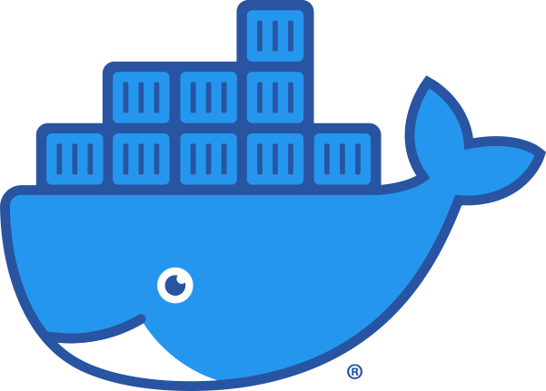
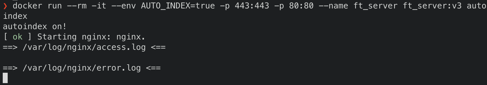
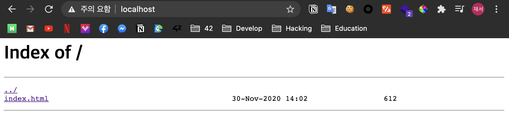
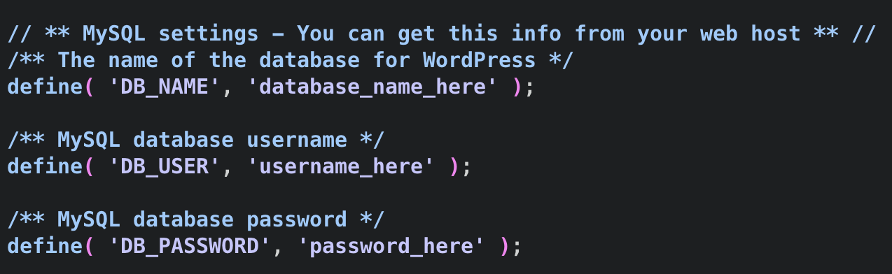
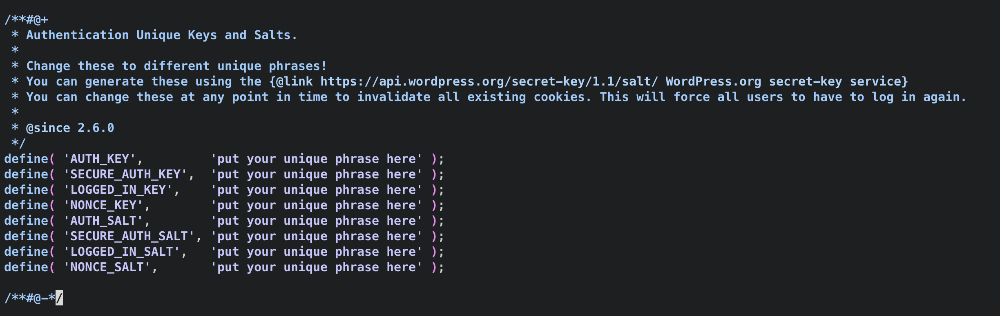
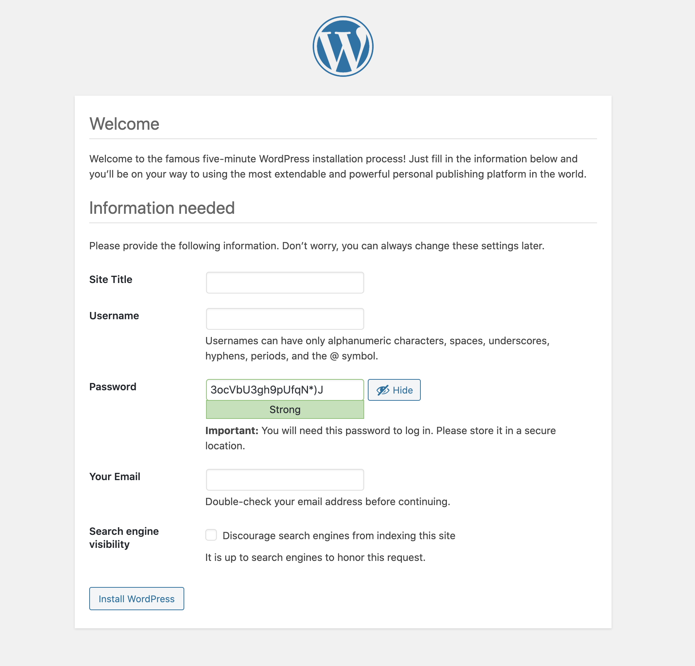
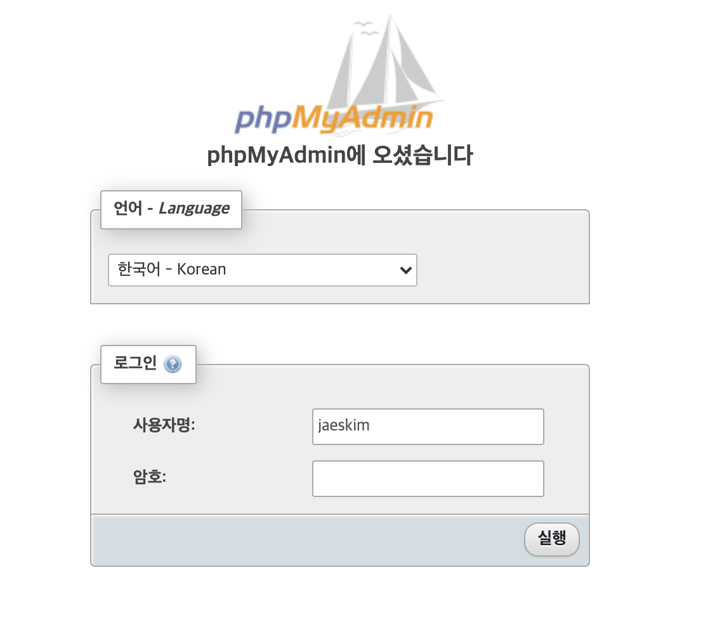

> 귀여운 Docker Logo!

# 🐳 Docker란!

Docker는 Linux Container 기술을 이용하여 만든 Container 기술 중 하나!

<details>
<summary>📦Linux Container 기술이란?</summary>

---

Linux Container는 기본적으로 프로세스를 격리 시킨다는 개념에서 출발.

예를 들어 `chroot` 명령어는 프로세스가 접근 할 수 있는 `/` 경로를 변경하여 접근 하는 파일에 대해서 제어 가능.

하지만 `chroot` 명령어 만으로는 네트워크 및 프로세스 등을 제한하기 어렵기 때문에 `cgroups` 기능을 이용하여 각종 리소스에 대해서 제어가 가능.

위와 같은 기능들을 이용하고 발전 시켜서 Linux Container 기술이 탄생됨.

Host와 프로세스, 리소스 격리를 통하여 컨테이너로 가둔 환경을 생성.

이를 통해 가상화와 달리 운영체제를 가상화 하기 위한 시스템이 별도로 필요가 없고 격리를 이용하여 Native 수준으로 실행이 가능함.

---

</details>

Docker를 이용하게 되면 응용 프로그램을 Host와 격리되어 실행이 되고 응용 프로그램을 위한 환경 전체가 미리 이미지에 대해 정의가 되어 실행이 되기 때문에 host의 환경과 상관없이 언제나 동일한 실행할 수 있다!

또한 가상화와 달리 격리하여 프로세스를 실행하는 것 이기 때문에 평범한 프로그램을 실행하고 종료하는 것과 같이 빠른 실행과 종료가 가능하다.

위 장점들을 통해서 하나의 이미지에서 **개발과 테스트 배포** 모든 것이 **빠르고 신속**하게 이루어 질 수 있다.

Docker는 대부분의 운영 체제에서 지원을 하나 Linux Container 기술이기 때문에 Linux 이외의 환경, Mac, Windows에서는 VM위에서 동작하게 된다.

## 💿 Docker Image

Docker는 만들어진 Container 환경 상태를 Image로 저장을 할 수 있도록 지원을 한다.

이렇게 만들어진 Docker Image를 기반으로 새로운 이미지를 만들거나 다른 서버에서 동일하게 실행이 가능하다.

이러한 Docker Image를 업로드 하여 보관하고 버전 관리 하는 곳이 있는데 그 곳을 `registry` 라고 한다.

대표적인 registry로 [**Docker Hub**](https://hub.docker.com/)가 있다.

## 🗂 Dockerfile

Dockerfile은 image를 생성하기 위한 Script 파일이다.

Dockerfile은 Image를 만들기 위한 작업이 기재되어 있기 때문에 Build가 되면 동일한 Image를 만들어내게 된다.

이 점을 이용하여 배포 시에 Build 후 나온 몇 기가 이상되는 이미지를 이용하여 배포하기 보다는 Dockerfile를 이용하여 build 하여 배포를 한다.

### 📝Dockerfile 작성 문법!

#### 📋 FROM

기본적으로 Dockerfile은 어떤 이미지를 기반으로 시작하는 지에 대해서 정의를 시작한다.

```dockerfile
# FROM <image-name>:<label>
FROM debian:buster
```

위와 같이 `FROM` 뒤에 이미지의 이름이 오고 그 다음에는 이미지의 label이 오게 된다.

여기서 이미지는 기본적으로 [\*\*Docker Hub](https://hub.docker.com/)\*\* 와 Alias가 되어 있어서 다른 registry에서 이미지를 가져 올 때에는 registry의 전체 url를 포함하여 작성을 해야 한다.

#### 📋 RUN

Dockerfile에서 이미지 내부에서 실행 되어야 하는 명령어를 작성을 할 수 있다.

```dockerfile
# RUN <command>
RUN apt update -y
```

위와 같이 `RUN` 뒤에 실행이 필요한 명령어를 작성을 하여 사용을 한다.

이때 위와 같이 사용 하는 방법만이 있는 것이 아니라 직접 실행 되어야 하는 경로를 직접 적어 주는 방법과 인자에 대해서 확실하게 array형태로 정의 해주는 방법도 존재 한다.

```dockerfile
RUN /bin/bash -c 'echo "Hello World!"'
RUN ["/bin/bash", "-c" "echo 'Hello World!'"]
```

이때 명령어를 실행한 후에 만들어지는 이미지를 레이어 별로 저장을 하게 되어서 `Dockerfile`에서 수정을 하여도 이전 레이어를 활용하여 빠르게 빌드가 가능하다.

#### 📋 COPY

Docker image를 만들면서 내부에 Sourcefile를 복사하여 이동이 필요 할 때가 있는데 이러한 상황에서는 아래와 같이 사용을 할 수 있다.

```dockerfile
# COPY <src> <dst>
COPY init.sh /
```

#### 📋 ADD

Dockerfile에는 `COPY` 와 유사한 성격인 `ADD` 명령어가 존재를 한다.

`ADD` 는 `COPY` 와 달리 파일의 src 부분에 url를 적게 되면 자동으로 파일을 다운 받아서 복사를 하고 압축 파일의 경우에는 압축을 해제해서 전달하게 되는 특징이 존재한다.

```dockerfile
# ADD <src(url)> <dest>
ADD <https://www.docker.com/sites/default/files/d8/2019-07/Moby-logo.png> /
```

이러한 특성이 존재하기 때문에 `COPY` 와 `ADD` 를 적절히 선택을 하여서 사용을 해야 한다.

#### 📋 ENV

Dockerfile에서는 내부 이미지에서 설정되는 환경 변수에 대해서도 아래와 같이 설정이 가능하다.

```dockerfile
# ENV name=value
ENV DEV_ENV=true
```

#### 📋 WORKDIR

Dockerfile에서 작업 하는 경로에 대해서 정의를 할 때에는 `WORKDIR` 를 이용하여 정의를 하게 된다.

```dockerfile
# WORKDIR <dir>
WORKDIR /root
```

#### 📋 USER

`WORKDIR` 를 이용하여 작업 경로를 지정하는 것과 같이 작업하는 사용자에 대해서도 정의가 가능하다.

```dockerfile
 # USER <user>[:<group>] | <UID>[:<GID>]
USER 0:0
```

단 이때 사용 되는 user에 대해서는 미리 `RUN` 를 이용해서 user와 group를 추가를 하거나 이미지에 등록이 된 user여만 작동을 하게 된다.

#### 📋 RUN

`RUN` 를 할 때에 사용이 되는 기본 shell에 대해 아래와 같이 정의가 가능 하다.

```dockerfile
# SHELL [<executable>, <parameters>]
SHELL ["/bin/bash", "-"]
```

#### 📋 ARG

Dockerfile은 image를 만들어주는 script 이므로 동적으로 할당이 가능한 `ARG` 를 사용 가능을 하다.

```dockerfile
# ARG <name>[=<default value>]
ARG user=root
```

이때 `ARG` 명령어로 정의하게 된 환경 변수는 동일한 `ARG` 변수를 재정의 한다.

빌드 할 때 만약 arg의 값을 변경하고 싶다면 아래와 같이 사용 한다.

```bash
$ docker build --build-arg user=jaeskim .
```

만약 환경 변수를 arg를 이용하여 재정의 하여 사용을 하고 싶다면 아래와 같이 사용 할 수 있다.

```dockerfile
ARG TEST
ENV TEST=${TEST:-hello_world}
RUN echo $TEST
```

#### 📋 EXPOSE

컨테이너 내부에서 네트워크 포트를 수신 대기 함을 Docker에게 미리 알려줄 수 있는데 이때 `EXPOSE` 명령어로 설정한다.

```dockerfile
# EXPOSE <port> | <port><protocol>
EXPOSE 80
EXPOSE 443/tcps
```

기본적으로 protocol에 대해서 정의를 하지 않게 된다면 tcp로 작동을 하게 되고, 여기서 정의를 하였다고 바로 HOST와 port가 연결이 되는 것이 아니기 때문에 run time시에 port binding 작업이 수행 되어야 한다.

#### 📋 CMD, ENTRYPOINT

이제 `Dockerfile` 에서 컨테이너가 올라가고 실행이 명령어에 대해서 정의 하는 방법에 대해 알아 본다.

`CMD` , `ENTRYPOINT` 라는 명령어를 이용하여 정의를 하게 되는데 각 각 사용 할 때와 같이 사용할 때의 예제와 함께 차이를 알아 본다.

```dockerfile
CMD ["echo", "hello"]
```

위와 같이 만들어진 dockerfile를 빌드 후 실행을 하게 되면 `echo hello` 가 작동 하는 것을 볼 수 있다.

이 때 `docker run test:cmd echo hi` 와 같이 마지막에 실행 인자를 전달 하게 되면 `echo hi` 가 실행이 되고 `inspect` 명령어로 확인을 해보면 `CMD` 부분의 정보가 새로 정의한 내용으로 변경이 되어 있는 것을 볼 수 가 있다.

이번에는 `ENTRYPOINT` 명령어를 단독으로 사용을 해본다.

```dockerfile
ENTRYPOINT ["echo", "hello"]
```

위와 같이 작성한 dockerfile를 빌드 후 실행하면 당연하게 `hello` 가 출력이 되는 것을 볼 수 있다.

이 때 `docker run test:entrypoint echo world` 로 실행을 하게 되면 `hello echo world` 가 나오는 것을 볼 수 있다.

이러한 동작이 나온 이유를 `inspect` 명령어를 통해 알아본다.

```json
...
"Cmd": [
  "echo",
  "world"
],
"Image": "test:entrypoint",
"Volumes": null,
"WorkingDir": "",
"Entrypoint": [
  "echo",
  "hello"
],
...
```

dcokerfile에서 작성된 `ENTRYPOINT` 는 재정의 되지 않고 `CMD` 부분은 재정의 되었지만 `ENTRYPOINT` + `CMD` 부분이 이어져서 작동을 한다.

즉 `ENTRYPOINT` 에는 서비스로 돌아가는 어플리케이션 으로 정의를 하고 `CMD` 부분을 추가 적으로 인자를 통해 정보를 전달 하는 형태로 만들어지는 것이 권장 된다.

#### 📋 VOLUME

Docker에서는 기본적으로 데이터를 이미지 레이어에 저장을 하게 되므로 container가 내려가고 새로운 것을 올릴 때마다 초기 설정된 데이터로 초기화 되는 휘발성이라는 특징을 가지고 있다.

이때 log file이나 db와 같은 데이터는 휘발성이 아닌 비 휘발성으로 관리 되어야 하므로 아래와 같이 특정 폴더를 기본 volume으로 저장을 하지 않고 따로 저장을 할 수 있다.

```dockerfile
# VOLUME [<dir>]
VOLUME ["/data"]
```

#### 📋 ONBUILD

만약 만들어진 image를 가지고 FROM를 할 때에 미리 수행 되어야 하는 작업이 있을 때 `ONBUILD` 를 사용한다.

예를 들어서 아래와 같이 `python build` 에 관련된 이미지라면 `FROM` 으로 사용하면 build를 할 때 src 파일들을 가져와 사용을 하게 만들 수 있다.

```dockerfile
# ONBUILD <INSTRUCTION>
ONBUILD ADD . /app/src
ONBUILD RUN /usr/local/bin/python-build --dir /app/src
```

#### 📋 STOPSIGNAL

기본적으로 Docker Container를 종료하게 되면 내부에서 작동하는 프로세스에게 `SIGTERM` 를 보내게 되는데 이 때 보내지는 SIGNAL에 대해서 정의가 가능하다.

```dockerfile
# STOPSIGNAL signal
STOPSIGNAL SIGKILL
```

#### 📋 HEALTHCHECK

DockerContainer가 올라갔을 때 실제로 프로세스가 정상적으로 동작 하는 지에 대해서 Healthcheck가 가능한데 이것을 아래와 같이 사용한다.

```dockerfile
# HEALTHCHECK [OPTIONS] CMD command
HEALTHCHECK --interval=5m --timeout=3s \\
  CMD curl -f <http://localhost/> || exit 1
```

여기서 사용 되는 옵션은 아래와 같이 사용이 된다.

- `-interval=DURATION` (default: `30s`)
- `-timeout=DURATION` (default: `30s`)
- `-start-period=DURATION` (default: `0s`)
- `-retries=N` (default: `3`)

#### 📋 LABEL

생성된 image에 대해 여러가지 정보를 담을 때에는 아래와 같이 사용을 한다.

```dockerfile
# LABEL <name>=<value>
LABEL maintainer="jaeskim <jaeskim.student.42seoul.kr>"
```

## 🖥 docker 명령어

docker를 관리 할 때 사용되는 다양한 명령어가 존재 하는데 그 중 자주 사용되고 중요한 명령어에 대해서 알아 본다.

옵션이 방대하여 모든 내용을 설명을 못하므로 필요한 기능이 있을 때에는 [reference site](https://docs.docker.com/engine/reference/commandline/docker/)에서 확인 하여 사용을 한다.

### ⚙️ build

`build` 명령어는 기본적으로 `Dockerfile` 를 이용하여 image를 만들 때 사용을 하게 된다.

```bash
# docker build [OPTIONS] PATH | URL | -
$ docker build --tag test:v1 .
```

기본적으로 위와 같은 구조로 작동이 되는데 자주 사용 되는 옵션에 대해서만 설명을 한다.

- `-t`, `--tag` name:tag 와 같은 형태로 인자를 주고 생성되는 image의 tag를 지정하는 옵션이다.
- `-f`, `--file string` 특정 `Dockerfile` 를 지정 하여서 이미지를 만들 때 사용한다.
- `--build-arg` Dockerfile에 정의된 변수에 대해서 값을 지정할 때 사용한다.
- `--no-cache` build 할 때 cache를 남기지 않도록 할 때 사용한다.

### 🏃🏻‍♂️ run

`run` 명령어는 만들어진 image를 가지고 실행 할 때 사용을 하게 된다.

```sh
# docker run [OPTIONS] IMAGE [COMMAND] [ARG...]
$ docker run -p 8080:80 -it --rm --name testserver test:v1 /bin/bash
```

기본적으로 위와 같은 구조로 작동이 되는데 자주 사용 되는 옵션에 대해서만 설명을 한다.

- `-p`, `--publish` (host_port:container_port) container 내부의 port와 host의 port를 binding 할 때 사용이 된다.
- `-i`, `--interactive` STDIN를 container와 연결 하여서 동적으로 반응 할 수 있도록 한다.
- `-t`, `--tty` tty처럼 작동 할 수 있게 한다.
- `--rm` container가 종료되면 자동으로 image를 지워주는 옵션이다.
- `-e`, `--env` 환경변수를 정의할 때 사용하게 된다.
- `--name` 컨테이너 이름을 정의 한다.
- `-d`, `--detach` background로 container가 동작하게 되고 ID를 출력한다.
- `-v`, `--volume` volume를 마운트 시킬 때 사용한다.

### ✋ stop

`stop` 명령어는 container를 중지 시킬때 사용한다.

```sh
# docker stop [OPTIONS] CONTAINER [CONTAINER...]
$ docker stop testserver
```

- `-t`, `--time` STOPSIGNAL 시그널을 보내고 몇초간 대기를 할지 설정하는 옵션이다.

### 🎬 start

`start` 명령어는 멈춰진 container를 다시 동작 시킬 때 사용한다.

```sh
# docker start [OPTIONS] CONTAINER [CONTAINER...]
docker start testserver
```

기본적으로 위와 같은 구조로 작동이 되는데 자주 사용 되는 옵션에 대해서만 설명을 한다.

- `-a`, `--attach` stdout/stderr 연결 한다.
- `-i`, `--interactive` STDIN를 container와 연결 하여서 동적으로 반응 할 수 있도록 한다.

### ⚓️ attach

`attach` 명령어는 실행된 container의 프로세스에 연결 할 때 사용을 한다.

```sh
# docker attach [OPTIONS] CONTAINER
docker attach testserver
```

이 때 전달 연결하게 되는 프로세스는 cmd, entrypoint로 정의된 프로세스 이므로 여기서 `ctr-c` 를 눌러 종료하면 컨테이너가 멈추므로 `ctr-p`, `ctr-q` 로 deattach를 하여 나오는 것이 권장이 된다.

### 📡 exec

`exec` 명령어는 실행된 container에게 프로세스를 실행을 시킬 때 사용을 한다.

```sh
# docker exec [OPTIONS] CONTAINER COMMAND [ARG...]
docker exec -it testserver /bin/bash
```

기본적으로 위와 같은 구조로 작동이 되는데 자주 사용 되는 옵션에 대해서만 설명을 한다.

- `-d`, `--detach` 실행한 프로세스와 연결 시키지 않고 백그라운드로 동작 하게 한다.
- `-e`, `--env` 컨테이너에게 환경변수를 전달.
- `-i`, `--interactive` STDIN를 container와 연결 하여서 동적으로 반응 할 수 있도록 한다.
- `-t`, `--tty` tty처럼 작동 할 수 있게 한다.
- `-u` `--user` 실행하는 프로세스의 유저를 정의 한다. <name|uid>[:<group|gid>]
- `-w`, `--workdir` 실행되는 작업 경로를 지정한다.

### 🗂 ps

`ps` 명령어는 continaer로 목록을 확인 할 때 사용을 한다.

```sh
# docker ps [OPTIONS]
docker ps -a
```

기본적으로 위와 같은 구조로 작동이 되는데 자주 사용 되는 옵션에 대해서만 설명을 한다.

- `-a`, `--all` 모든 container 목록을 출력! (기본값은 작동 중인 continer만 출력함)

### 📀 images

`images` 명령어는 images의 목록을 확인🇧🇸 할 때 사용을 한다.

```sh
# docker images [OPTIONS] [REPOSITORY[:TAG]]
docker images -a
```

기본적으로 위와 같은 구조로 작동이 되는데 자주 사용 되는 옵션에 대해서만 설명을 한다.

- `-a`, `--all` 모든 images 목록을 출력! (기본값은 중간 layer 단계의 images는 숨김)

### 🖨 inspect

`inspect` 명령어는 container object의 정보를 출력 할 때 사용한다.

```sh
# docker inspect [OPTIONS] NAME|ID [NAME|ID...]
docker inspect testserver
```

기본적으로 위와 같은 구조로 작동이 되는데 자주 사용 되는 옵션에 대해서만 설명을 한다.

- `-f`, `--format` 옵션과 함께 주어진 template 형태로 출력를 한다.

### 🗑 rm

`rm` 명령어는 contiainer를 제거 할 때 사용한다.

```sh
# docker rm [OPTIONS] CONTAINER [CONTAINER...]
docker rm testserver
```

기본적으로 위와 같은 구조로 작동이 되는데 자주 사용 되는 옵션에 대해서만 설명을 한다.

- `-f`, `--force` 작동 중인 container여도 SIGKILL를 보내어 강제로 종료후 삭제를 한다.

### ✨ rmi

`rmi` 명령어는 images를 제거를 할 때 사용한다.

```sh
# docker rmi [OPTIONS] IMAGE [IMAGE...]
docker rmi test
```

기본적으로 위와 같은 구조로 작동이 되는데 자주 사용 되는 옵션에 대해서만 설명을 한다.

- `-f`, `--force` 강제로 image를 제거한다.

### 🛎 commit

`commit` 명령어는 container의 상태를 가지고 새로운 이미지를 만들 때 사용한다.

```sh
# docker commit [OPTIONS] CONTAINER [REPOSITORY[:TAG]]
docker commit testserver testserver:v2
```

- `-a`, `--author` author에 대해 정의 한다.
- `-c`, `--change` 생성된 image에 Dockerfile 명령어를 적용.
- `-m`, `--message` 커밋 메세지 작성.
- `-p`, `--pause` commit 시점에 container 일시 중단. (Default true)

# 🐳 Docker를 Wordpress 서비스 직접 구현!

이제 위에서 정리한 내용을 바탕으로 Wordpress 서비스를 직접 구현을 한다.!

일단 시작 하기 전에 아래와 같은 조건으로 구현을 할 예정이다.

- Docker Container 에서는 web server를 Nginx로 사용을 하고, base Images는 debian buster로 설정한다.
- WebServer는 동시에 여러가지 서비스를 실행 하며, 서비스의 목록은 WordPress, phpMyAdmin, MySQL 이다.
- WebServer는 SSL protocol이 적용이 되어야 한다.
- Url에 따라서 각 서비스로 연결이 되어야 한다.
- 비활성화가 가능한 autoindex를 이용하여 서비스가 동작 하는지에 대해 확인이 가능해야 한다.

## 🔐 SSL 설정 하기!

일단 `Makefile`를 먼저 간단하게 작성을 해본다.

```dockerfile
FROM debian:buster
LABEL maintainer="jaeskim <jaeskim.student.42seoul.kr>"

# init setup
RUN apt update -y; apt upgrade -y

# install dependency
RUN apt install nginx curl -y
```

이렇게 작성한 dockerfile를 가지고 일단 build를 하여서 내부에 접근하여서 `SSL` 설정을 시작한다.

```sh
$ docker build --tag ft_server:v1 .
$ docker run -it --name ft_server ft_server:v1 /bin/bash
```

`SSL` 를 적용 하기 위해서는 인증서가 필요한데 인증서를 CA에 등록을 하여 사용을 하게 되면 비용이 발생하므로 OpenSSL를 이용하여 자체 서명 인증서를 발급 받아서 구현을 한다.

SSL 인증서를 발급 받기 위해서는 아래의 절차가 진행되어야 한다.

1. 개인키 생성

   ```sh
   openssl genrsa -out ft_server.localhost.key 4096
   ```

2. 개인키를 가지고 자체 서명 인증서 생성

   ```sh
   openssl req -x509 -nodes -days 365 -key ft_server.localhost.key -out ft_server.localhost.crt -subj "/C=KR/ST=SEOUL/L=Gaepo-dong/O=42Seoul/OU=jaeskim/CN=localhost"
   ```

이제 위에서 만든 `ft_server.localhost.key`, `ft_server.localhost.crt` 파일을 `/etc/ssl/certs` 와 `/etc/ssl/private` 경로로 이동을 시켜준다.

각 인증서 파일에 대한 권한을 `644` 변경을 하여서 root 소유자 만이 수정이 가능하도록 한다.

이제 `/etc/nginx/sites-available/default` 파일을 아래와 같이 수정을 한다.

```nginx
server {
	listen 80 default_server;
	listen [::]:80 default_server;

	return 301 https://$host$request_uri;
}

server {
	listen 443 ssl default_server;
	listen [::]:443 ssl default_server;

	server_name _;

	ssl_certificate /etc/ssl/certs/ft_server.localhost.crt;
	ssl_certificate_key /etc/ssl/private/ft_server.localhost.key;

	root /var/www/html;

	index index.html index.htm index.nginx-debian.html;

	location / {
		try_files $uri $uri/ =404;
	}
}
```

`443` 으로 들어온 요청은 설정한 `ssl_certificate`, `ssl_certificate_key` 파일들을 이용하여 ssl 통신을 하게 되고, 기존 `80` 으로 들어온 요청은 `https` 요청을 redirect 하도록 하였다.

continer 내부에서 수정한 파일을 continer 외부로 복사하기 위하여 `docker cp` 명령어를 이용하여 외부로 파일을 가져오고 위에서 했던 작업들을 dockerfile에 다시 정의를 해주었다.

```dockerfile
FROM debian:buster
LABEL maintainer="jaeskim <jaeskim.student.42seoul.kr>"

# init setup
RUN apt update -y; apt upgrade -y

# install dependency
RUN apt install nginx vim curl -y

# environment
ENV AUTO_INDEX=false

# setup SSL
RUN openssl genrsa -out ft_server.localhost.key 4096; \
	openssl req -x509 -nodes -days 365 \
	-key ft_server.localhost.key \
	-out ft_server.localhost.crt \
	-subj "/C=KR/ST=SEOUL/L=Gaepo-dong/O=42Seoul/OU=jaeskim/CN=localhost"; \
	chmod 644 ft_server.localhost.*; \
	mv ft_server.localhost.crt /etc/ssl/certs/;	\
	mv ft_server.localhost.key /etc/ssl/private/;

COPY src/nginx-sites-available-default.conf /etc/nginx/sites-available/default
```

## 🗂 비활성화가 가능한 autoindex 기능 추가!

이번에는 비활성화가 가능한 autoindex 기능을 추가를 해본다.

`cmd` 를 이용하여 비활성화 하도록 만들어 본다.

일단 `server.sh` 파일을 작성을 하고 `ENTRYPOINT` 로 설정을 한다.

```sh
#!/bin/bash

/bin/bash -C /setup_autoindex.sh $1

service nginx start

if [ $? -eq 0 ]; then
	tail -f /var/log/nginx/access.log /var/log/nginx/error.log
f
```

그리고 `setup_autoindex.sh` 에게 첫번째 인자를 같이 전달하여 `cmd` 를 이용하여 제어가 가능하도록 한다.

```sh
#!/bin/bash

# setup index.html
if [ -e "/var/www/html/index.nginx-debian.html" ]; then
	mv /var/www/html/index.nginx-debian.html /var/www/html/index.html
fi

if [ "$1" == "autoindex" ]; then
	echo "autoindex on!"
	sed -i "s@autoindex off;@autoindex on;@g" /etc/nginx/sites-available/default
	sed -i "s@index index.html index.htm;@index index.htm;@g" /etc/nginx/sites-available/default
else
	echo "autoindex off!"
	sed -i "s@autoindex on;@autoindex off;@g" /etc/nginx/sites-available/default
	sed -i "s@index index.htm;@index index.html index.htm;@g" /etc/nginx/sites-available/default
fi
```

이제 빌드를 하고 `run` 를 동작 할 때 `autoindex` cmd를 같이 보냈을 떄에 대해서 제대로 동작 하는지를 확인 해본다.

```sh
$ docker run --rm -it --env AUTO_INDEX=true -p 443:443 -p 80:80 --name ft_server ft_server:v3 autoindex
```





## 📦 mysqlDB(maria DB) 설치 및 설정 하기!

이번에는 wordpress를 위한 DB를 설정해 본다.

`apt install marinade-server` 명령어를 이용하여 설치를 한다.

여기서 mariadb를 사용하는 이유는 기존 mysql이 Oracle로 인수가 되면서 Fork되어 진행되고 있는 opensource 프로젝트 이다. (mysql과 동일한 소스코드를 기반으로 하여 대부분의 작업이 호환이 된다.)

Maria db를 php와 함께 사용을 하기 위해서는 여러가지 모듈이 필요한데 이에 따른 모듈을 설치한다.

```sh
$ apt install php-mysql php-mbstring
```

- php-mysql : php에서 mysql명령어를 실행하기 위한 모듈
- php-mbstring : 한국어, 중국어, 일본어와 같은 multibyte 문자열을 처리 하기 위해 사용되는 모듈

이제 `mysql service` 를 시작시키고 SQL 명령어에 대해서 작성을 해본다.

```mysql
# wordpress db 생성
CREATE DATABASE wordpress;
# wordpress db를 사용
USE wordpress;
# jaeskim user를 password `testpassword`으로 만들고 localhost에서만 접근이 가능하도록 함.
CREATE USER 'jaeskim'@'localhost' IDENTIFIED BY 'testpassword';
# jaeskim에게 wordpress db에 대한 권한을 전부 위임
GRANT ALL PRIVILEGES ON wordpress.* TO 'jaeskim'@'localhost' WITH GRANT OPTION;
# 권한 설정 업데이트
FLUSH PRIVILEGES;
```

이제 이렇게 작성한 내용을 바탕으로 실제 dockerfile에 적용을 해본다.

이때 db_name, db_user, db_password에 대한 항목은 `ARG` 명령어를 이용하여 관리를 한다. (실제로 암호와 같은 중요 정보는 `docker secret` 명령어를 이용하여 관리하는 것이 권장됨.)

```dockerfile
# init arg
ARG WP_DB_NAME=wordpress
ARG WP_DB_USER=jaeskim
ARG WP_DB_PASSWORD=42seoul

# setup mysqlDB(mariaDB)
RUN service mysql start; \
	mysql -e "CREATE DATABASE ${WP_DB_NAME};\
	USE ${WP_DB_NAME}; \
	CREATE USER '${WP_DB_USER}'@'localhost' IDENTIFIED BY '${WP_DB_PASSWORD}'; \
	GRANT ALL PRIVILEGES ON ${WP_DB_NAME}.* TO '${WP_DB_USER}'@'localhost' WITH GRANT OPTION; \
	FLUSH PRIVILEGES;"
```

위와 같이 `mysql -e` 와 `ARG` 를 이용하여 mysql 서비스 부분을 완성하였다.

## 📚 wordpress 서비스 설치 및 설정하기!

이전에 설치한 `curl` 를 이용하여 https://wordpress.org/latest.tar.gz 를 다운 받아서 설치를 해본다!!!

일단 wordpress를 설치 하기 전에 nignix에서 php를 동작 할 수 있도록 도와 주는 모듈인 `php-fpm` 를 설치 하여 사용을 한다.

그리고 `niginx/sites-available/default` 파일을 수정하여서 php가 동작 하도록 수정을 한다.

```nginx
index index.html index.htm index.php;

location ~ \.php$ {
	include snippets/fastcgi-php.conf;
	fastcgi_pass unix:/var/run/php/php7.3-fpm.sock;
}
```

이제 기본적인 준비가 끝났으니 아래의 명령어를 통해서 wordpress를 다운 받고 압축을 해제 한다.

```sh
$ curl -O https://wordpress.org/latest.tar.gz
# 다운 후 srcs로 이동을 시켜준다.
$ tar -xzf latest.tar.gz -C /var/www/html/
```

이제 내부에 존재하는 `wp-config-sample.php` sed 명령어를 통해서 수정을 해본다.



내부를 보게 되면 기본적으로 정의 해야 하는 DB 정보가 있는데 이 부분을 아까전에 mysql를 설정 하면서 사용 하였던 변수를 이용하여 수정을 하도록 한다.!

```dockerfile
RUN mv /var/www/html/wordpress/wp-config-sample.php /var/www/html/wordpress/wp-config.php; \
	sed -i "s/database_name_here/${WP_DB_NAME}/g" /var/www/html/wordpress/wp-config.php; \
	sed -i "s/username_here/${WP_DB_USER}/g" /var/www/html/wordpress/wp-config.php; \
	sed -i "s/password_here/${WP_DB_PASSWORD}/g" /var/www/html/wordpress/wp-config.php
```

그리고 아래와 같이 여러가지 key, salt 값을 정의 하는 부분이 있는데 이것을 `/dev/null` 를 이용하여서 채워준다.



```sh
wp_salt=$(cat /dev/urandom | tr -dc 'a-zA-Z0-9!@#\%+=' | fold -w 64 | sed 1q); \
	sed -i "s/define( 'AUTH_KEY',         'put your unique phrase here' );/define( 'AUTH_KEY', '$wp_salt' );/g" /var/www/html/wordpress/wp-config.php; \
	wp_salt=$(cat /dev/urandom | tr -dc 'a-zA-Z0-9!@#\%+=' | fold -w 64 | sed 1q); \
	sed -i "s/define( 'SECURE_AUTH_KEY',  'put your unique phrase here' );/define( 'SECURE_AUTH_KEY', '$wp_salt' );/g" /var/www/html/wordpress/wp-config.php; \
	wp_salt=$(cat /dev/urandom | tr -dc 'a-zA-Z0-9!@#\%+=' | fold -w 64 | sed 1q); \
	sed -i "s/define( 'LOGGED_IN_KEY',    'put your unique phrase here' );/define( 'LOGGED_IN_KEY', '$wp_salt' );/g" /var/www/html/wordpress/wp-config.php; \
	wp_salt=$(cat /dev/urandom | tr -dc 'a-zA-Z0-9!@#\%+=' | fold -w 64 | sed 1q); \
	sed -i "s/define( 'NONCE_KEY',        'put your unique phrase here' );/define( 'NONCE_KEY', '$wp_salt' );/g" /var/www/html/wordpress/wp-config.php; \
	wp_salt=$(cat /dev/urandom | tr -dc 'a-zA-Z0-9!@#\%+=' | fold -w 64 | sed 1q); \
	sed -i "s/define( 'AUTH_SALT',        'put your unique phrase here' );/define( 'AUTH_SALT', '$wp_salt' );/g" /var/www/html/wordpress/wp-config.php; \
	wp_salt=$(cat /dev/urandom | tr -dc 'a-zA-Z0-9!@#\%+=' | fold -w 64 | sed 1q); \
	sed -i "s/define( 'SECURE_AUTH_SALT', 'put your unique phrase here' );/define( 'SECURE_AUTH_SALT', '$wp_salt' );/g" /var/www/html/wordpress/wp-config.php; \
	wp_salt=$(cat /dev/urandom | tr -dc 'a-zA-Z0-9!@#\%+=' | fold -w 64 | sed 1q); \
	sed -i "s/define( 'LOGGED_IN_SALT',   'put your unique phrase here' );/define( 'LOGGED_IN_SALT', '$wp_salt' );/g" /var/www/html/wordpress/wp-config.php; \
	wp_salt=$(cat /dev/urandom | tr -dc 'a-zA-Z0-9!@#\%+=' | fold -w 64 | sed 1q); \
	sed -i "s/define( 'NONCE_SALT',       'put your unique phrase here' );/define( 'NONCE_SALT', '$wp_salt' );/g" /var/www/html/wordpress/wp-config.php; \
	unset wp_salt
```

이제 저번에 작성한 `src/server.sh` 파일을 수정하여서 `mysql`, `php-fpm` 등도 같이 실행이 가능하도록 설정을 한다.

```sh
#!/bin/bash

/bin/bash -C /setup_autoindex.sh $1

service mysql start
service php7.3-fpm start
service nginx start

if [ $? -eq 0 ]; then
	tail -f /var/log/nginx/access.log /var/log/nginx/error.log
fi
```

이제 dockerfile로 정리하여서 서비스를 실행해 본다.!

```sh
$ docker run --rm -it -p 443:443 -p 80:80 --name ft_server ft_server
```

`https://localhost/wordpress` 로 접근을 해보면 아래와 같이 wordpress가 정상적으로 올라온 것을 볼 수 있다.



## 🧑‍💻 phpmyadmin 설치 하기!

이제 마지막으로 db관리를 위한 `phpmyadmin` 를 설치 해본다.

Curl 명령어를 이용하여 일단 phpmyadmin를 다운 받는다.

```dockerfile
RUN curl -O https://files.phpmyadmin.net/phpMyAdmin/5.0.4/phpMyAdmin-5.0.4-all-languages.tar.gz
```

그리고 이제 압축을 해제하고 생성된 폴더의 이름을 수정해준 후 `config.sample.inc.php` 를 이용하여 간단하게 설정을 해본다.

여기서는 `blowfish_secret` 라는 cookie를 암호화 하게 되는 키를 만들어서 넣어주게 된다.

```sh
blowfish_secret=$(cat /dev/urandom | tr -dc 'a-zA-Z0-9!@#\%+=' | fold -w 64 | sed 1q); \
	sed -i "s@''; /\* YOU MUST FILL IN THIS FOR COOKIE AUTH! \*/@'$blowfish_secret';@g" /var/www/html/phpmyadmin/config.inc.php; \
	unset blowfish_secret;
```

그리고 마지막으로 현재 `/var/www/html` 이 `root` 소유자로 등록이 되어 있어서 `phpmyadmin` 에서 temp directory를 생성을 못한는 이슈가 있기 때문에 권한을 `www-data:www-data` 로 수정을 해준다.



이제 접근을 하게 되면 위에서 만들었던 계정을 통해서 로그인이 가능 한 모습을 볼 수 있다.

---

> `42Seoul` 에서 진행한 **ft_server** 프로젝트를 정리한 글 입니다.
> 여기서 진행된 Dockerfile과 src 파일은 아래의 github에서 확인 할 수 있습니다.!
>
> [jaeseokim/42cursus/02_ft_server](https://github.com/JaeSeoKim/42cursus/tree/master/02_ft_server)
