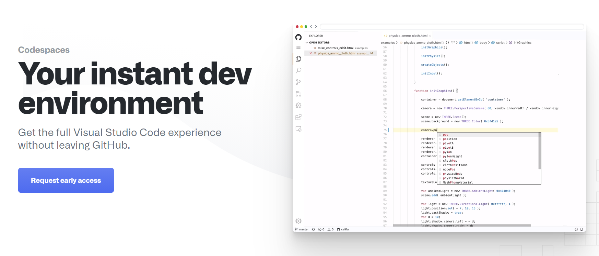
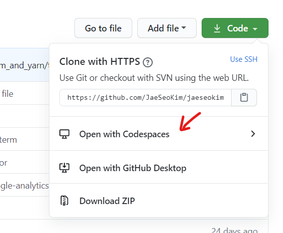
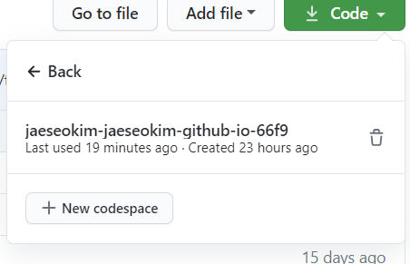
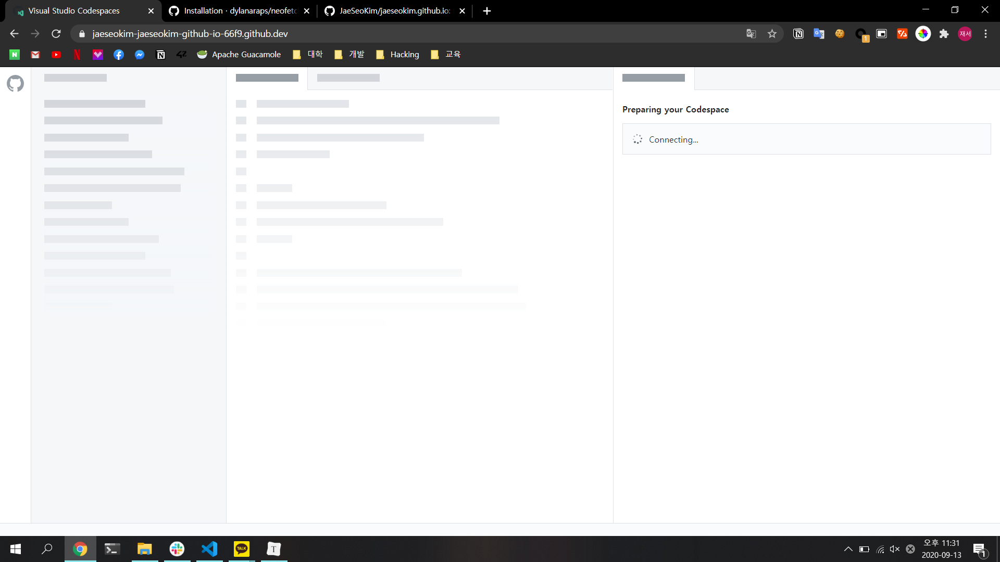
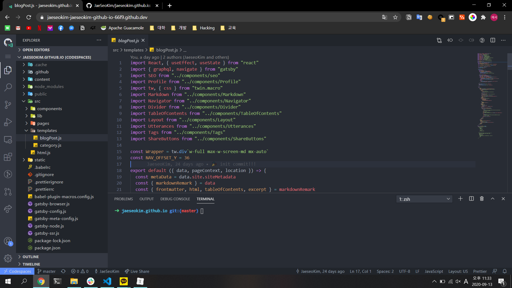
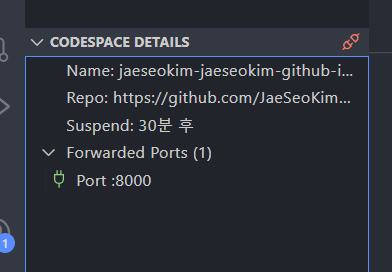
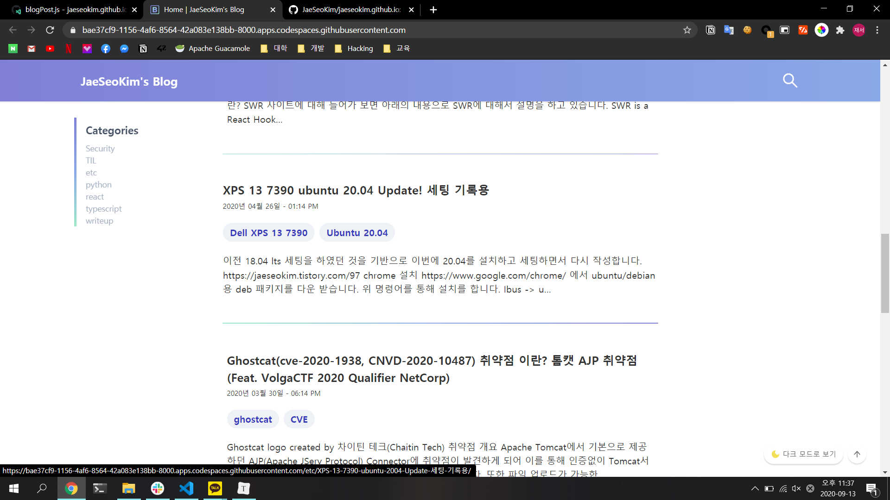

이번에 Github의 새로운 feature 기능인 Codespaces의 베타에 당첨되어 한번 글을 작성하게 되었습니다.

# Codespaces 란?

Codespaces는 Github에서 새롭게 지원하게 되는 기능 중 하나입니다.

기존 Github는 웹상에서 코드에 대해 수정은 가능하지만 코드를 직접 실행하거나 디버깅을 하는 것은 거의 불가능에 가까웠는데 이번에 새롭게 추가된 Codespaces를 통하여 브라우저만 있다면 어디서든 github에서 바로 개발과 디버깅이 가능하게 됩니다.

Codespaces는 `Visual Studio Code`를 기반으로 만들어졌기 때문에 기존 VSCode와 같은 환경으로 사용이 가능하게 됩니다. 즉 extension를 통하여 커스텀도 가능합니다.

또한 베타 기준(정식 서비스시 요금제에 따라 성능이 달라질 수 있습니다.) 아래의 스펙을 가지고 있기 때문에 간단한 개발 작업이 충분히 가능합니다.

| SPEC   | INFO                                   |
| ------ | -------------------------------------- |
| OS     | Debian GNU/Linux 9.13 (stretch) x86_64 |
| Kernel | 5.4.0-1025-azure                       |
| CPU    | Intel Xeon Platinum 8168 (2) @ 2.6GHz  |
| Memory | 4096MB                                 |
| SSD    | 64gb                                   |

# Codespaces 사용하기!

github에서 repo에 들어간 다음 `code` 버튼을 눌러보면 기존에 없던 새로운 버튼이 생긴 것을 볼 수 있습니다!

이미 저는 한번 생성을 하여서 목록에 기존에 사용을 하던 Codespace가 하나 보입니다.

눌러서 실행을 해보면 아래와 같이 로딩을 진행하고 브라우저 상에서 `VScode`를 볼 수 있습니다.

여기서 처음에 들었던 의문은 블로그repo를 대상으로 실행을 하였으니 실제 개발을 할때 웹서버를 띄어 두고 확인을 해야 하는데 이때 어떤 형태로 포트 포워딩이 되는지에 대해 의문이 있었는데 한번 개발 서버를 띄어 두고 Remote Explorer에 있는 Port Forwarding를 추가 하니 아래와 같이 Powarding이 정상적으로 동작 하는 것을 확인 하였습니다.

기존 goormide를 사용하였을 때에는 Code Syntax와 Code intellisense 기능이 무언가 부족하여서 사용하기 불편함이 조금 있었는데 `VScode` 기반으로 작동을 하니 기존 개발 환경과 유사하게 사용할 수 있다는 점이 매우 맘에 들었습니다!

실제 스마트폰만 들고다니다 삼성스마트폰의 dex기능을 통해 codespace로 들어가 바로 개발을 한다던가 아니면 태블릿으로 개발을 편하게 할 수 있다는 점이 강점인 것 같습니다.

아직 베타 서비스라 몇 extension를 설치시에 오류가 발생하는 모습도 보였지만 이러한 자잘한 문제만 해결이 된다면 충분히 구독하고 사용할 만한 가치가 있다고 생각됩니다!
