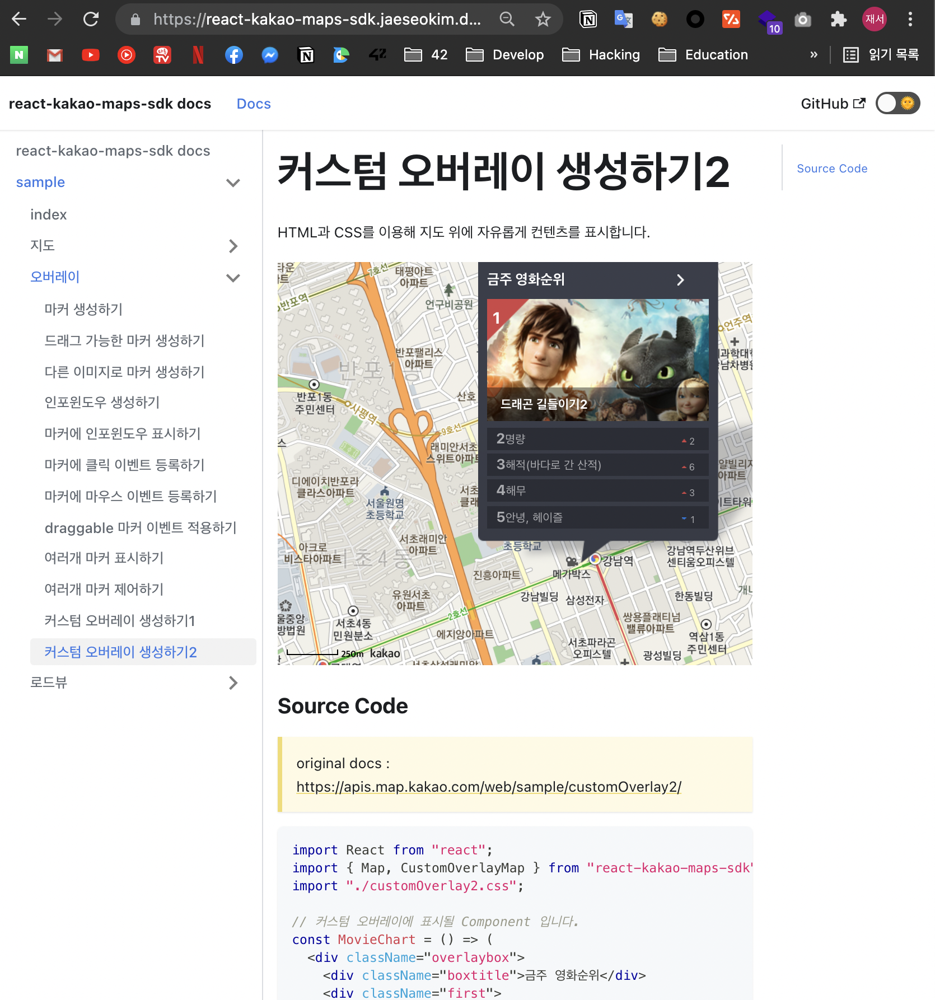
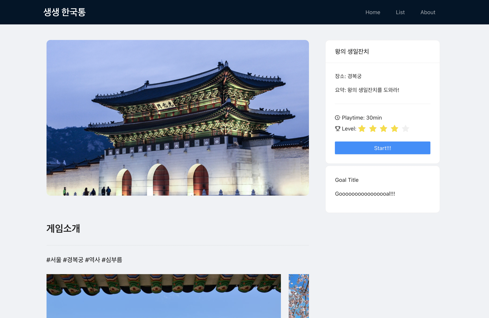

> ### [hackalearn 2021 이란?](https://github.com/devrel-kr/HackaLearn)
>
> HackaLearn은 Hackathon + Learn의 합성어로 주어진 기간 안에 관련 지식을 직접 배워서 해커톤에 적용하는 이벤트입니다. 이번 HackaLearn 이벤트의 주제는 바로 애저 정적 웹 앱(Azure Static Web Apps)과 깃헙 액션(GitHub Actions)입니다. 2주간 공부하고 직접 웹 애플리케이션을 만들어 보는 HackaLearn 이벤트!

코로나로 인해 또 `42Seoul` 클러스터가 멈추게 되어서 공부의 의욕을 잃어가던 와중 `42seoul` 멘토님이 올리신 한 해커톤을 보고 참여하게 맘을 먹게 되었다!

평소 많이 친하게 공부하며 지내던 형, 누나들과 같이 참여를 신청을 하게 되었다!

주제를 **로드뷰**를 통한 **가상 문화체험, 관광 서비스** 를 **게임**과 접목시켜 만들기로 하였다!

일단 hackalearn의 주제가 에저 정적 웹앱과 깃허브 액션을 주제로 하고 있어서 평소에 제가 잘 알고 있는 `React` 으로 기술 스택이 확정을 하고 아직 저만 다룰줄 알기 때문에 첫 1주일은 대부분 **기획, JS, React, Kakao map api** 용법을 각자 공부하고 정리하는 시간을 가지게 되었다.

일단 나의 역할 이였던 아이디어인 `Roadview` 를 관리하고 제어 하는 부분이였는데 현재 **react 라이브러리**로 만들어 진 것 중 현재 까지 유지보수 되고 가장 중요한 `Roadview` 를 지원하고 있는 라이브러리가 없었기 때문에 **[react-kakao-maps-sdk](https://github.com/JaeSeoKim/react-kakao-maps-sdk)** 라이브러리를 직접 만들어 현 시점(8월 14일) 까지는 이번 주제를 구현 가능한 수준 까지 구현을 하고 개인적으로 추후에 계속 오픈소스 프로젝트로 진행하게 되었다.

작년에 `kakao-map` 를 react에서 간단하게 다뤄본적이 있어서 겁없이 도전 해보았는데 1년동안 배운 지식이 늘어나게 되니 그전에 작성했던 코드들이 얼마나 잘못 되었는지 알게 되었고 이번에는 최대한 **상태관리의 편의성**과 react 컴포넌트의 props로 쉽게 제어가 가능하게 라이브러리를 작성할려고 노력을 하였다.

일단 react에서 kakao map api 제어 하는 방법에 대해 심도 있게 구현을 하였으니 이제 구현물을 같이 구현하게 되었는데 이미 시간이 일주일이 지나버려서 초기에는 `azure function` 를 이용하여 구현을 할려고 하였지만 시간 관계상 `mock_data` 를 이용하여 개발을 하게 되었다.

이번 해커런을 통해서 기존에 알던 `Github Action` 에 대해 깊게 알게 되었고 평소에 잘 모드고 있던 `azure static web apps` 에 대해서 경험을 해볼 수 있어서 좋았던 것 같다.
