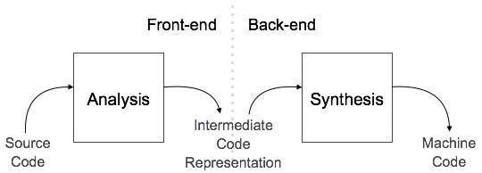

42seoul에서 bash와 같이 명령어에 대해서 읽고 실행 할 수 있는 shell를 직접 만들어 보는 과제가 나와서 bash에서 어떻게 cmd에 대해 parsing하는 지에 대해 고민해보았다.

## bash는 컴파일러하고 유사하게 동작을 한다.

일단 bash는 기본적으로 명령어에 대해서 실행을 해주는 것만이 아니라 파일에 대해 입출력을 전달 할 수 도 있고 명령어와 명령어를 이어주는 pipe 기능 이전 명령어에 대한 상태를 기반으로한 조건 흔히 shell script라고 사용하는 if, while, 변수 등 흔히 사용하는 컴퓨터 언어와 동일하게 동작을 한다.

이를 토대로 bash가 어떻게 parsing를 하는지에 대해 컴파일러의 동작 방법를 보고 유추가 가능하다.

## Compiler의 동작 방법 살펴 보기!

일단 [Compiler Design Tutorial](https://www.tutorialspoint.com/compiler_design/index.htm) 글에서 설명을 보게 되면 컴파일러는 기본적으로 `FrontEnd(Analysis Phase)` , `BackEnd(Synthesis Phase)` 크게 2가지로 구분되게 되는데 FrontEnd에서 들어온 코드에 대해서 컴퓨터가 이해를 할 수 있는 형태로 해석과 함께 구문에 대해서 문제점이 있는지에 대해서 처리를 하게 된다. 그 후 BackEnd 영역에서 해석된 내용을 바탕으로 기계어로 합성을 시키게 된다.



> [출처 : [Compiler Design Tutorial](https://www.tutorialspoint.com/compiler_design/index.htm)]

일단 bash를 만들때 필요한 정보는 `FrontEnd` 에 대한 부분이고 `BackEnd` 에 대한 부분은 조금 다르기 때문에 `FrontEnd` 에서 어떻게 처리를 하는지에 대해서 알아본다!

### Lexical Analyzers

코드에 대해서 어휘를 분석하는 단계가 필요하다!

이 단계 안에서는 기본적으로 2가지 과정이 수행이 되는 데 첫번째 과정은 바로 `Tokenizer` 과정이다.

#### Tokenizer

Tokenizer는 컴퓨터가 이해를 하기위해서 코드에 대해서 최소한의 단위 즉 `Token` 으로 나누는 작업을 진행하게 된다.

이때 특별한 의미를 가지고 있는 `Symbol(if, while, && 등)` 에 대해서도 `Token` 화 시키게 된다.

이렇게 나누어진 Token를 가지고 이 Token에 대해 어떤 의미인지 분석하는 과정이 필요 하게 되는데 이 과정이 바로 `Lexer` 단계이다.

#### Lexer

Lexer는 기본적으로 정해진 규칙을 이용하여 해석을 하게된다. 특별한 의미를 가지고 있는 Symbol에 대해서는 각 심볼에 대한 의미를 부여 하고 특정 심볼 뒤에 에는 어떤 형태로 해석이 되어야 한다. 등 이러한 규칙들을 이용하여 해석을 하게 된다.

이제 이렇게 분석된 어휘를 가지고 컴퓨터에서 이해하기 쉽도록 구문 트리를 만들게 된다.

### Syntax Analyzers

위 단계에서 해석한 내용을 기반으로 구문 트리를 만들게 된다.

예를 들면 `if` 가 오게 되면 그에 따른 조건이 존재하게 되고 결과값이 참일 때 빠져야 하는 곳 거짓일 때 행해야 하는 곳 등으로 여러가지 트리가 만들어지게 된다.

엄청 간단한 사칙 연산을 기준으로 예시를 들어 보면 아래와 같이 해석이 된다.

> a + b \* c

```
        +
       / \
      a   *
         / \
        b   c
```

### Semantic Analysis

이제 마지막으로 하게 되는 부분은 바로 만들어진 구문 트리에 대해서 의미가 정상적으로 해석이 가능한지에 대한 작업이 필요하다.

예를 들어 int형 변수에 문자열을 대입 할려고 한다던가 이러한 Type 오류와 같이 여러가지 에러상황에 대해서 탐지하게 된다.

## Compiler 이론을 Bash에 적용시켜 보기!

일단 내가 만들어야 하는 shell은 `pipe, redirect, control operator` 등의 기능이 작동을 해야 하기 때문에 `special symbol` 에 대해서 아래처럼 정리를 해두었다.

> ###### Special Symbol
>
> `<`, `>`, `<<`, `>>`, `&&`, `||`, `|`, `;`

일단 의미를 분석하기 위해서 구분자에 대해서 어떻게 처리가 필요한데 어떻게 작동하는지에 대해 자세하게 찾아보았다.

bash에서는 `Input field Seporator` 를 기준으로 작동하게 되는 이것은 기본적으로 ` \n\t` 를 가지고 구분하게 된다고 한다.

이 점을 이용하여서 로직을 간단하게 구상을 해보았다.

### Lexical Analyzers minishell.ver

minishell에서는 많은 조건들이 존재 하지 않기 때문에 `Token` 화를 진행하면서 바로 의미를 부여 하는 형태로 로직을 구상을 하였다.

`Special Symbol` 에 따른 여러가지 조건을 이용하여 의미를 부여를 하였다.

일단 가장 큰 기본이 되는 틀은 현재 상태에 대해서 저장을 하는 것이다.

`Status` 를 저장할 수 있는 변수를 선언 후 각 상태에 따른 bit를 활성화 하는 형태로 사용을 하였다.

상태에 따른 기본적인 규칙을 정리를 해보면 아래와 같은 형태로 정리가 된다.

| Status    | CMD                | REDIRECT         | PIPE             | SEPERATOR        | CTR_OP           | NONE            |
| --------- | ------------------ | ---------------- | ---------------- | ---------------- | ---------------- | --------------- |
| CMD       | NONE: ARG로 처리됨 | O                | O                | O                | O                | O               |
| REDIRECT  | O                  | X: FILE Required | X: FILE Required | X: FILE Required | X: FILE Required | O               |
| PIPE      | O                  | X: FILE Required | X: FILE Required | X: CMD Required  | X: CMD Required  | X: CMD Required |
| SEPERATOR | O                  | X: FILE Required | X: CMD Required  | X: CMD Required  | X: CMD Required  | X: CMD Required |
| CTR_OP    | O                  | X: FILE Required | X: CMD Required  | X: CMD Required  | X: CMD Required  | X: CMD Required |
| NONE      | O                  | O                | X: CMD Required  | X: CMD Required  | X: CMD Required  | NONE            |

표에 정리되지 못한 조건을 추가로 작성을 해본다면 아래와 같이 정리가 된다.

> CMD는 PIPE와 SEPERATOR를 만나게 되면 0으로 초기화 된다.
>
> CMD가 활성화 되게 되면 그 뒤에 오는 일반 토큰은 ARG로 처리가 된다.
>
> NONE 상태에서 일반 토큰을 만나게 되면 CMD로 처리가 된다.
>
> REDIRECT가 활성화 된 상태에서 다음에 오는 일반 토큰은 FILE로 처리가 되고 FLAG를 0으로 설정한다.

이제 Token화를 하는 로직에 대해서 고민을 해본다!

위에서 설명한 `Input Field Seporator` 문자열을 일단 처음에는 Skip를 하고 그후 만나게 되는 문자는 무조건 Token의 시작이니 그 부분 부터 `"`, `'`, `\` 등을 고려 해가면서 Token화를 시켜준다. 이때 `Special Symbol` 가 올 경우에는 예외처리를 통해 Token화를 시켜주는 형태로 진행을 하게 된다.

> 참고 예외 케이스
> `$ echo hello>file world!`
>
> > // file
> >
> > hello world

이때 나온 Token이 `Special Symbol` 인 경우 위에 작성한 표에 따른 예외처리와 함께 의미를 부여하여 Lexical Analyzers를 진행 한다.

---

### Syntax Analyzers

2편에서 계속...!

> ##### 참고 자료:
>
> Compiler Design Tutorial](https://www.tutorialspoint.com/compiler_design/index.htm)
