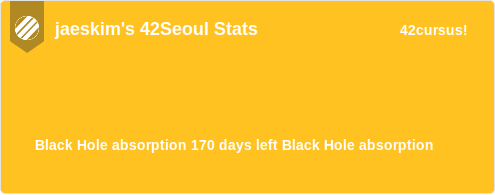
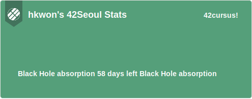
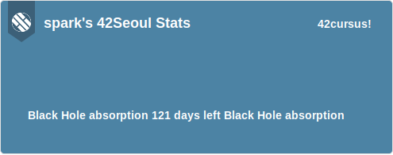
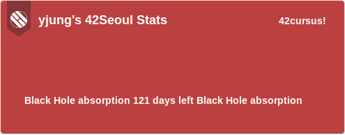

이번에 `42Seoul`에 합격하고 어느덧 3주가 넘어가는 시점이 되었다.

그동안 `Libft`, `netwhat`, `get_next_line` 과 같은 기본 서클 과제를 깨면서 Github에 올리고 그 정보를 `readme.md` 파일에 각 프로젝트에 대하여 설명을 작성을 하였는데 무언가 `Badge` 나 `Status`를 보여주는 `dynamic` 한 `SVG` 이미지를 제공해주는 서비스가 필요 하겠다고 생각을 하게 되었다.

그리고 이번에 `ft_printf` 과제를 하다가 중간에 집중이 안되어서 기분 전환 겸으로 **토이 프로젝트**를 시작하였다.!

# 🚀 [42-readme-stats](https://github.com/JaeSeoKim/badge42)

바로 프로젝트 이름은 **`42-readme-stats`** 이다..! 🙌

아직은 개발을 시작 한지 2일 밖에 안되는 시점이라 어떤 방향으로 계획하고 있는지, 또한 어떻게 개발을 해보고 있는지에 대하여 작성을 해본다.

## ✏️ 프로젝트 설명

일단 Referense가 된 프로젝트가 있는데 바로 **[github-readme-stats](https://github.com/anuraghazra/github-readme-stats)** 이다.

github-readme-stats는 `github-api`를 이용하여 사용자의 Github 정보를 바탕으로 Github 평가와 함께 정보를 보여주는 서비스 이다.

이 서비스의 특 장점은 기본적으로 응닶 값이 `svg` 이기 때문에 `Github readme` 를 비롯한 대부분의 `Markdown` 에서 이미지로써 삽입이 가능하고 지속적으로 데이터가 변화되어진다는 것이다.

> 예시 :
>
> 

이렇게 정보를 보여 주는 모습을 보고 어?? 이거 `42intra` 에서도 `API`를 제공 해주니깐 이걸로 한번 만들어 보면 좋지 않을까? 하고 시작을 하게 되었다.

일단 대략적으로 목표로 하고 있는 기능들은 `Cursus` 별 상태와 `Project` 별 점수를 포함한 Retry 횟수? 등을 포함한 `Badge` 등을 만드는 것을 목표로 하고 있다.

## 🔧 API를 사용해보자! - (~~GraphQL이 위대한 이유 ㅠㅠ~~)

일단 대부분의 API가 그렇듯 사용을 하기 위해서 `api.intra.42.fr` 에 들어가 문서를 읽고 `App`를 등록 후 필요한 정보에 대하여 가져오는 `API EndPoint`에 대해서 탐색을 해보았다.

일단 시작을 하기 전에 등록한 `AppID` `SecretKey` 를 가지고 있다고 바로 요청이 가능한 것이 아니라 Token를 발급 후 사용이 가능하기 때문에 문서에서 설명한 것을 바탕으로 Token를 발급 받는 함수를 만들었다.

그 다음 일단 기본적인 사용자가 가지고 있는 정보에 대해 알 수 있는 `EndPoint("/v2/users/:id")` 에 요청을 하여 다양한 응답을 받았지만 현재 필요한 `login_name`, `first_name`, `last_name`, `id`, `email`, `capus 정보` 등을 Parsing하여 리턴을 하는 함수를 만들었다.

이번에는 소속하고 있는 Team(coalition)의 `Name`, `Logo`와 `Color`를 가져와 배경 색과 로고를 보여주게 하기 위하여 `EndPoint("/v2/users/:id/coalitions")` 에 요청을 하는 함수를 만들었다.

하지만 이것만 으로도 아직 원하는 정보를 모두 얻을 수가 없어서 또 한번 Rest Api의 EndPoint에 접근하여 정보를 가져오게 되었다 ㅠㅠ(~~42Api를 이용한 인트라 어플이 존재하였는데 사용시 너무 로딩 시간이 길어서 불만 이였지만 그 이유를 알게 된 것 같았다 ㅠㅠㅠ~~)

마지막으로 현재 진행 중인 `cursus`의 정보를 가져와 현재 `블랙홀의 정보`, `시작 날짜`, `종료 날짜`, `현재 레벨` 등의 정보를 가져오는 작업을 했다.

이 때 발생했던 문제는 endpoint에 접근을 할 때 기존 `Intra id` 로 사용을 하는 것이 아닌 `EndPoint("/v2/users/:id")` 에 요청을 하여서 받은 `id` 를 가지고 요청을 해야 하기 때문에 동시에 실행이 불가능하게 되는 요인이 되었다.

위와 같은 API 호출에 관한 함수를 전부 제작을 하고 나니 호출 시 응답을 받는데 까지 대략적으로 `5~10` 사이의 시간이 걸리는 것을 볼 수 있었다.....

기본적으로 `42intra` 가 프랑스에 존재하기 때문에 기본적으로 응답 시간이 느린 편인데 이것을 동시에 요청이 불가능 하기 때문에 엄청난 속도를 볼 수 있었다...

이 부분을 조금이라도 해결하기 위해 Promise 객체를 이용하여 동시에 요청이 가능한 것은 묶어서 요청을 하였지만 이 방법도 중간 중간 너무 빠르게 요청을 보낸다는 이유로 응답 거부를 받기 때문에 실패 하였다...

이 문제를 해결 하기 위해 일단 생각 하고 있는 방법은 `Cache`를 하여 처리를 할려고 생각을 하고 있다.

> GraphQL를 공부하면서 단 하나의 EndPoint로 모든 요청이 가능하다는 점에 대하여 엄청난 장점인가? 하고 의문을 가진적이 있었는데 실제로 Rest API를 사용하면서 EndPoint가 수십 곳으로 분기가 되어 있으니 응답 속도에 대하여 문제가 있을 수 있다는 것을 확실히 깨닫게 되었다. (api.intra.42.fr API v3에 새롭게 GraphQL로 바꿔서 내주세요 ㅠㅠㅠ)

## 🎨 SVG 디자인!

일단 간단하게 무지막지하게 느리지만 API를 통해 성공적으로 정보를 가져왔으니 이제 SVG를 완성하여서 Return해주는 부분에 대하여 고민을 해보았다.

일단 기본적으로 응답을 받을 때 SVG로 사용을 하기 위해서는 `Content-Type` 이 `image/svg+xml` 으로 설정이 되어 있어야 하기 때문에 response의 Header에 설정을 하였고, 이제 response에 Send해야 하는 `Text`를 `SVG` render가 된 것을 Return 해야 하기 때문에 일단은 단순 무식하지만 아래와 같이 SVG TEXT를 리턴 하도록 만들었다.

```js
import getImageToBase64 from "../util/getImageToBase64"
import getRemainDay from "../util/getRemainDay"
import renderBlackhole from "./renderBlackhole"
import renderCursus from "./renderCursus"
import renderHeader from "./renderHeader"
import renderLogo from "./renderLogo"

export default async (user_data) => {
  console.log(user_data)

  const color = user_data.color
    ? user_data.color.substring(0, 1) == "#"
      ? user_data.color
      : "#" + user_data.color
    : "#00BABC"

  const logo = await getImageToBase64(user_data.image_url)

  // TODO: end_at이 null이 아닌 경우 언제 종료 했는지 보여주어야 함.
  const blackhole_remain = getRemainDay(user_data.blackholed_at)

  return `
    <svg
      width="495"
      height="195"
      viewBox="0 0 495 195"
      fill="none"
      xmlns="http://www.w3.org/2000/svg"
    >
    <style>
    .bg {
      width: 100%;
      object-fit: fill;
    }

    .header {
      font: 600 18px 'Arial', 'Segoe UI', Ubuntu, Sans-Serif;
      fill: #fff;
    }

    .logo {

    }

    .cursus {
      font: 600 14px 'Arial', 'Segoe UI', Ubuntu, Sans-Serif;
      fill: #fff;
    }

    </style>

    <rect
      x="0.5"
      y="0.5"
      rx="4.5"
      height="99%"
      stroke="#E4E2E2"
      width="494"
      fill="${color}"
      stroke-opacity="1"
    />
    ${renderLogo(color, logo)}
    ${renderHeader(user_data.login, user_data.capus.name)}
    ${renderCursus(user_data.cursus_name)}
    ${renderBlackhole(blackhole_remain)}
    </svg>
  `
}
```

작성을 하다 보니 모든 SVG 디자인을 한 곳에서 몰아서 할 이유가 없기 때문에 각 Part 별로 함수를 분리하여서 제작을 하였다.

아직은 제작 중이지만 결과를 보면 아래와 같이 완성된 모습을 볼 수 있다.

### 👷 개발 중 샘플 - (2020-10-17 02시 기준)

_(응답으로 온 SVG를 저장하여 보여 주는 모습입니다. 개발되어 변경된 모습을 Live로 보고 싶다면 [github](https://github.com/JaeSeoKim/badge42)로 들어와 확인 해주세요!)_

(2020-10-17 기준)









## 🚧 개발 방향!

### 느린 응답 속도...

개발을 하면서 지금 가장 큰 문제점인 응답 속도에 대하여 고민을 하게 되었는데 일단 임시 조치와 같은 형태로 아래의 코드를 추가함으로 `Cache` 되도록 처리를 하였다.

```js
res.setHeader("Cache-Control", "s-maxage=3600, stale-while-revalidate")
```

일단 저 조치를 통하여 저 시간 동안은 괜찮겠지만 그 다음 로딩 시 무수히 느린 응답을 받게 된다면 사용자는 첫 로딩 시에는 제대로 된 결과 화면을 마주 할 수 없으므로 그 부분에 대하여 개선이 필요하다.

지금 `vercel`를 이용하여 사용을 하고 있는데 이 서비스는 `ServerLess` 형태로 운영이 되기 때문에 사용된 Token를 메모리에 저장을 하고 결과 값을 Cache화 하는 방법 등에 대하여 사용이 어렵기 때문에 Heroku로 서버를 이전을 하고 지금 `Next.js` 를 사용 하였지만 `Express` 또는 `Koa` 를 API 담당 하도록 하여서 `Token` 이 만약 `expires_in` 에 해당하는 시간이 메모리에 남아 있도록 하여서 API 요청 할 때 마다 요청 하는 작업을 줄이도록 하고 그리고 기본적으로 필요한 정보를 아예 Hompage에서 정보를 받아와 URL를 완성 시켜 API 호출을 최소화 하는 방향으로 수정을 해봐야 할 것 같다.

### 추가 적인 기능!

지금은 일단 사용자의 Stats를 보여 주는 기능만 만들고 있지만 추가적으로 각 프로젝트에 대한 `점수`와 `완료한 날짜`, 몇번 시도를 했는지 등에 대하여 보여주는 `Badge` 기능도 추가를 해보는 방향으로 개선을 해보고 싶다.

## 🙈 마무리 하면서...

처음 시작을 할 때에는 가볍게 한번 이게 가능 할까? 하고 시작을 했지만 고민을 하다 보니 제대로 완성을 하고 싶어져서 이렇게 개발 일지를 작성하게 되었다.

아직은 개발을 시작한지 몇 일 안된 조그만한 프로젝트 지만 몇 달 뒤에는 42에 속한 사람들이 다들 자연스럽게 사용하는 프로젝트가 되는 것이 목표 이다!
