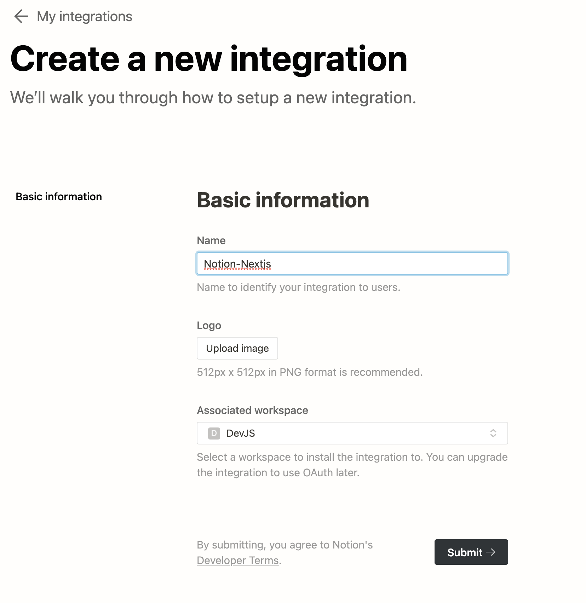
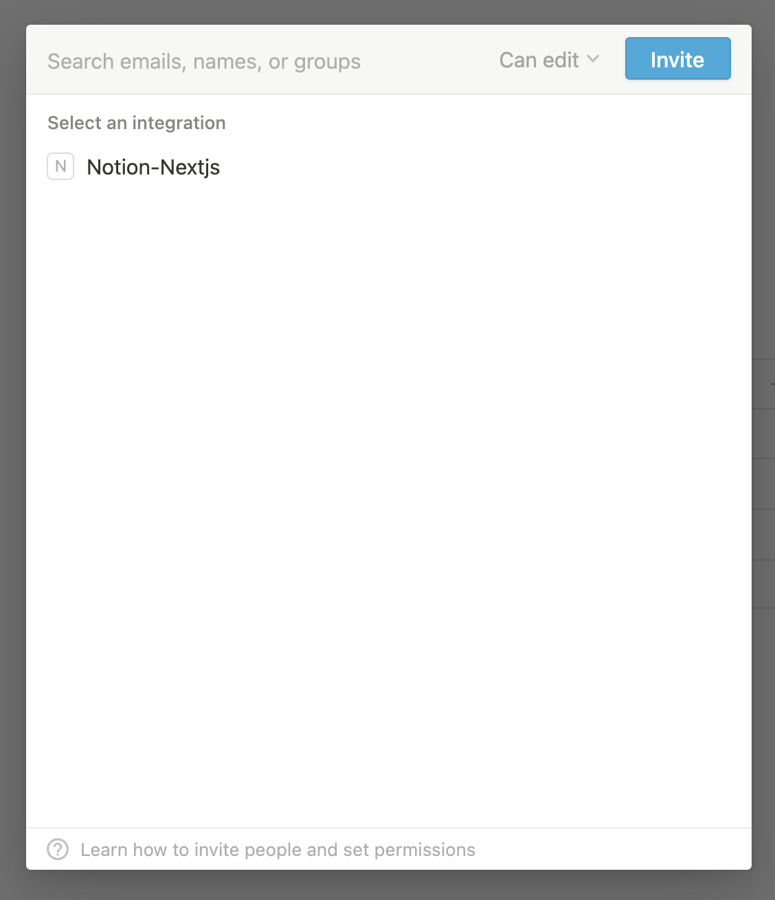
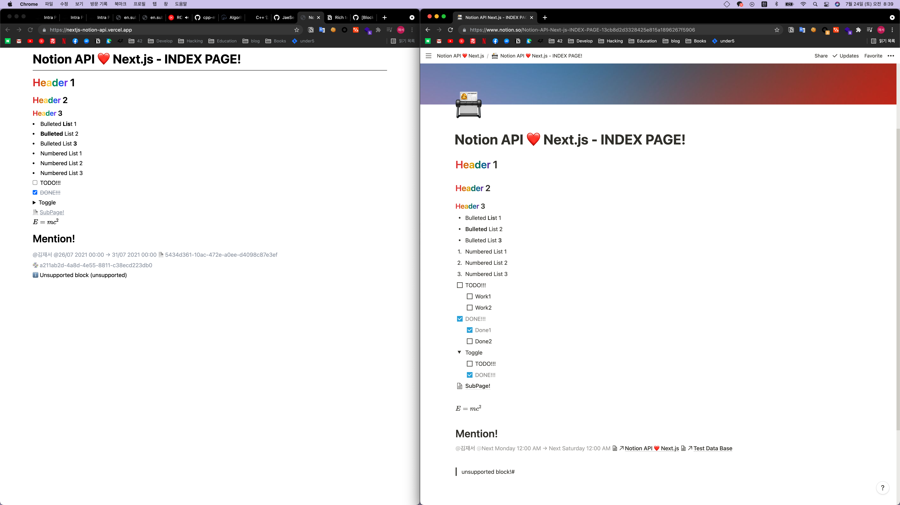

최근에 Noiton API Beta로 오픈이 되어서 한번 Notion를 CMS로 하는 사이트를 개발 할려고 하다가 생각 보다 지원하는 기능이 적어서 분석하는 글을 작성하게 되었습니다.

글을 작성하면서 참고하게된 Reference는 다음과 같습니다.

> 🔗 https://samuelkraft.com/blog/building-a-notion-blog-with-public-api

### Notion API 발급 하기

일단 처음으로 Notion API를 사용하기 위해서는 integration 생성을 해야 하기 때문에 아래의 사이트로 들어가서 발급 받습니다.

> 🔗 https://www.notion.so/my-integrations



integration를 발급 받은 후 이제 해당 Notion의 Page의 접근 권한을 주기 위해 사용할 Page에 Share를 눌러서 발급 받은 integration를 초대 합니다.



이제 Token 발급 까지 끝냈으니 분석을 하기 위해 프로젝트를 세팅합니다.

분석하는 프로젝트 환경은 원래 간단한 CMS Front를 구축 할 예정이여서 `Next.js` 위에서 작업을 하였습니다.

아래의 명령어를 이용하여 `notion-js sdk` 를 설치 합니다.

```sh
npm install @notionhq/client
```

그리고 아래와 같이 `.env.local` 를 아래와 같이 설정하여 `Token` , `PageId`, `DatabaseId` 등을 추가 합니다.

```
NOTION_ACCESS_TOKEN=
NOTION_INDEX_PAGE=
NOTION_DATABASE=
```

이제 드디어 간단한 Notion API 관련 작업을 수행하는 `ts` 파일을 하나 작성을 합니다.

```typescript
// notion.ts
import { Client } from "@notionhq/client"

const notion = new Client({
  auth: process.env.NOTION_TOKEN,
})

export const getPage = async (pageId: string) => {
  const response = await notion.pages.retrieve({
    page_id: pageId,
  })
  return response
}
```

현재 Notion API는 4가지의 대표적인 Endpoint를 제공을 합니다.

`Database` , `Page`, `Block` , `User` 로 Database 내부에 항목을 추가하거나 Page의 Block를 수정하는 등 다양한 기능을 할 수 있습니다.

일단 첫 번째로 분석을 할 부분은 `notion.pages.retrieve` (https://api.notion.com/v1/pages/page_id) 를 응답을 분석합니다.

> 🔗 https://developers.notion.com/reference/get-page

### Notion Page Title 정보 가져오기!

이 API는 해당 Page의 기본적인 data를 반환하게 되는데 `Database` 객체가 부모일 경우 해당 객체가 가리키고 있는 여러가지 `properties` 를 반환하게 됩니다.

만약 `Database` 가 아닌 경우에는 기본적으로 `title` 만 가지게 되는데 해당 객체는 `rich_text` object를 Array로 가지게 됩니다.

이걸 이용하여서 page 객체에서 title을 문자열로 가져오는 함수를 만든다면 아래와 같이 완성할 수 있습니다.

```tsx
import { PagesRetrieveResponse } from "@notionhq/client/build/src/api-endpoints"
import {
  RichText,
  TitlePropertyValue,
} from "@notionhq/client/build/src/api-types"

export const getTitleFromPage = (
  page: PagesRetrieveResponse,
  titleKey: string = "Name"
) => {
  let title: RichText[] = []
  if (page.parent.type === "page_id" || page.parent.type === "workspace") {
    title = (page.properties.title as TitlePropertyValue).title
  } else if (page.parent.type === "database_id") {
    title = (page.properties[titleKey] as TitlePropertyValue).title
  }
  return title.map(({ plain_text }) => plain_text).join("")
}
```

`@notionhq/client` 내부에 미리 사전에 typedef이 되어 있기 때문에 `import` 하여 구현을 하였습니다.

기본적으로 `Database` 객체에서의 `titleKey` 같은 경우에는 기본 값이 `Name` 으로 설정이 되어 있기 때문에 기본값을 설정해주었습니다.

그리고 최종적으로 구해진 `RichText` 객체 리스트를 plain_text만 추출하여 join 하여 반환 하도록 하였습니다.

이제 간단한 Page 객체에서 title를 가져오는 부분을 구현 하였으니 이제 block를 이용하여 내용을 렌더링 하는 부분을 분석하였습니다.

### Notion Block Component 만들기!

일단 Block Component를 만들기 위해서는 Block를 가져오는 함수가 있어야 하므로 아래와 같이 PageId에게 종속된 Block를 가져오는 함수를 작성 했습니다.

```typescript
export const getBlocks = async (
  blockId: string,
  {
    start_cursor,
    page_size,
  }: {
    start_cursor?: string
    page_size: number
  } = {
    page_size: 50,
  }
) => {
  const response = await notion.blocks.children.list({
    block_id: blockId,
    page_size: page_size,
    start_cursor: start_cursor,
  })
  return response.results
}
```

이제 Block 객체가 가지고 있는 것들에 대해서 분석을 해봅니다.

[공식 문서](https://developers.notion.com/reference/block)에서 알려주기로는 `paragraph`, `heading_1`, `heading_2`, `heading_3`, `bulleted_list_item`, `numbered_list_item`, `to_do`, `toggle`, `child_page`, `unsupported` type들을 반환 한다고 합니다.

이 때 type에 따라 `children` 여부와 부모 `tag`가 달라지게 되고 `unsupported` 제외한 모든 type들은 `RichText` 배열을 가지게 됩니다.

그렇다면 `RichText` 컴포넌트를 먼저 구현을 해야하기 때문에 [공식문서](https://developers.notion.com/reference/rich-text)를 보면서 아래와 같이 구현을 하였습니다.

```tsx
import React from "react"
import { RichText as RichTextType } from "@notionhq/client/build/src/api-types"
import styles from "./RichText.module.scss"
import Text from "./Text"
import Equation from "./Equation"
import Mention from "./Mention"

export interface SwitchRichTextProps {
  value: RichTextType
}

export const SwitchRichText: React.FC<SwitchRichTextProps> = ({ value }) => {
  switch (value.type) {
    case "text":
      return <Text value={value} />
    case "mention":
      return <Mention value={value} />
    case "equation":
      return <Equation value={value} />
  }
}

export interface RichTextProps {
  value: RichTextType
}

const RichText: React.FC<RichTextProps> = ({ value }) => {
  const { annotations } = value

  return (
    <span
      className={[
        styles.richtext,
        styles[`richtext-${annotations.color}`],
        annotations.bold ? styles["richtext-bold"] : "",
        annotations.italic ? styles["richtext-italic"] : "",
        annotations.underline ? styles["richtext-underline"] : "",
        annotations.strikethrough ? styles["richtext-strikethrough"] : "",
        annotations.code ? styles["richtext-code"] : "",
      ]
        .join(" ")
        .trim()}
    >
      <SwitchRichText value={value} />
    </span>
  )
}

export default RichText
```

일단 공통적으로 사용이 되는 `annotations` 에 관한 styling를 부모쪽에서 처리를 한다음 `SwitchRichText` 구현 하여 해당 `type` 에 맞는 Component를 렌더링 하도록 구현을 하였습니다.

가장 일반적인 `text` type의 경우에는 간단한 `link` 여부를 확인 하여 rendering를 하도록 하였습니다.

```tsx
import { RichTextText } from "@notionhq/client/build/src/api-types"
import React from "react"

export interface TextProps {
  value: RichTextText
}

const Text: React.FC<TextProps> = ({ value }) => {
  const { text } = value
  if (text.link) {
    return (
      <a href={text.link.url} target="_blank" rel="noopener noreferrer">
        {text.content}
      </a>
    )
  }
  return <>{text.content}</>
}

export default Text
```

`equation` type의 경우에는 간단하게 katex를 사용하는 라이브러리를 이용하여 rendering 하는 컴포넌트를 구현하였습니다.

```tsx
import React from "react"
import "katex/dist/katex.min.css"
import TeX from "@matejmazur/react-katex"
import { RichTextEquation } from "@notionhq/client/build/src/api-types"

export interface EquationProps {
  value: RichTextEquation
}

const Equation: React.FC<EquationProps> = ({ value }) => {
  return <TeX math={value.equation.expression} />
}

export default Equation
```

마지막인 `mention` 같은 경우에는 아직 API가 Beta인 점과 오류가 많아서 일부분을 강제로 type를 재정의 하여 구현을 하였습니다.

```tsx
import {
  DatabaseMention as DatabaseMentionType,
  DateMention as DateMentionType,
  DatePropertyValue,
  PageMention as PageMentionType,
  RichTextMention as RichTextMention,
  UserMention as UserMentionType,
} from "@notionhq/client/build/src/api-types"
import React from "react"
import Image from "next/image"
import styles from "./Mention.module.scss"
import dayjs from "dayjs"
import { data } from "autoprefixer"

interface UserMentionProps {
  mention: UserMentionType
}

const UserMention: React.FC<UserMentionProps> = ({ mention }) => {
  const { user } = mention

  return (
    <span className={[styles.mention].join(" ").trim()}>
      {user.avatar_url && (
        <span className={styles.avatar}>
          <Image
            src={user.avatar_url}
            alt={`${user?.name} profile image`.trim()}
            width={24}
            height={24}
            layout="fixed"
          />
        </span>
      )}
      {user.name ? user.name : user.id}
    </span>
  )
}

interface DatabaseMentionProps {
  mention: DatabaseMentionType
}

const DatabaseMention: React.FC<DatabaseMentionProps> = ({ mention }) => {
  const { database } = mention

  return (
    <span
      className={[styles.database].join(" ").trim()}
      title={`database-${database.id}`}
    >
      {database.id}
    </span>
  )
}

interface DateMentionProps {
  mention: DateMentionType
}

const DateMention: React.FC<DateMentionProps> = ({ mention }) => {
  const { date } = mention as unknown as DatePropertyValue
  const startAt = dayjs(date.start).format("DD/MM YYYY mm:ss")
  if (date.end) {
    const endAt = dayjs(date.end).format("DD/MM YYYY mm:ss")

    return (
      <span
        className={[styles.mention].join(" ").trim()}
        title={`${startAt}-${endAt}`}
      >
        {startAt} → {endAt}
      </span>
    )
  }
  return (
    <span className={[styles.mention].join(" ").trim()} title={`${startAt}`}>
      {startAt}
    </span>
  )
}

interface PageMentionProps {
  mention: PageMentionType
}

const PageMention: React.FC<PageMentionProps> = ({ mention }) => {
  const { page } = mention
  return (
    <span className={[styles.page].join(" ").trim()} title={`page-${page.id}`}>
      {page.id}
    </span>
  )
}

interface MentionSwitchProps {
  mention:
    | UserMentionType
    | PageMentionType
    | DatabaseMentionType
    | DateMentionType
}

const MentionSwitch: React.FC<MentionSwitchProps> = ({ mention }) => {
  switch (mention.type) {
    case "user":
      return <UserMention mention={mention} />
    case "database":
      return <DatabaseMention mention={mention} />
    case "page":
      return <PageMention mention={mention} />
    case "date":
      return <DateMention mention={mention} />
  }
}

export interface MentionProps {
  value: RichTextMention
}

const Mention: React.FC<MentionProps> = ({ value }) => {
  return <MentionSwitch mention={value.mention} />
}

export default Mention
```

`notion-js-sdk` 가 응답해주는 값과 type 선언된 부분이 `DateMention` 부분에서 문제가 있어서 ` const { date } = mention as unknown as DatePropertyValue;` 형태로 강제로 재정의를 하여 사용을 하였습니다. ([관련 이슈 링크](https://github.com/makenotion/notion-sdk-js/issues/154))

또한 Database, page의 경우에는 응답해주는 값이 id 만을 반환하기 때문에 이걸 가지고 실 프로젝트를 하기 위해서는 해당 처리를 할 수 있는 API EndPoint를 구현 해야 할 것 으로 보입니다.

`RichText` 에 대해서 다 구현을 하였으니 이제 `Block` 를 구현 해봅니다.

```tsx
import React from "react"
import { Block as BlockType } from "@notionhq/client/build/src/api-types"
import Paragraph from "./Paragraph"
import HeadingOne from "./HeadingOne"
import HeadingTwo from "./HeadingTwo"
import HeadingThree from "./HeadingThree"
import BulletedListItem from "./BulletedListItem"
import NumberedListItem from "./NumberedListItem"
import ToDo from "./ToDo"
import Toggle from "./Toggle"
import ChildPage from "./ChildPage"

interface BlockProps {
  value: BlockType
}

const Block: React.FC<BlockProps> = ({ value }) => {
  switch (value.type) {
    case "paragraph":
      return <Paragraph value={value} />
    case "heading_1":
      return <HeadingOne value={value} />
    case "heading_2":
      return <HeadingTwo value={value} />
    case "heading_3":
      return <HeadingThree value={value} />
    case "bulleted_list_item":
      return <BulletedListItem value={value} />
    case "numbered_list_item":
      return <NumberedListItem value={value} />
    case "to_do":
      return <ToDo value={value} />
    case "toggle":
      return <Toggle value={value} />
    case "child_page":
      return <ChildPage value={value} />
    default:
      console.info(
        `ℹ️ Unsupported block (${value.type}) - https://developers.notion.com/reference/block`
      )
      return <p>ℹ️ Unsupported block ({value.type})</p>
  }
}

export default Block
```

위와 같이 해당 Type에 대한 적절한 부모 `tag`와 `children`를 가지게 하는 `Component`를 구현 하고 `Block` Component에서 switch를 통해 해당 type를 렌더링 하도록 하였습니다.

이때 애매한 부분중 하나가 `list_item` 에 대한 부분인데 Block에 대한 list가 반환되는 것이기 때문에 `list_item` 이 연속으로 오게된다면 부모에서 적절한 `ol`, `ul` 를 감싸도록 해야 하는데 `Block` Component 는 단순히 하나의 block 만을 대응 할 수 있기 때문에 list를 정확하게 보이게 할려면 감싸는 상위 Component를 만들어야 한다는 문제점이 있었습니다.

### Next.js SSG를 이용한 Rendering 하기!

이제 Next.js의 `SSG` 를 이용하여 Rendering를 합니다..!

```tsx
import { GetStaticPropsContext, InferGetStaticPropsType } from "next"
import Head from "next/head"
import Block from "../components/notion/Block"
import { getBlocks, getPage, getTitleFromPage } from "../lib/notion"

export const getStaticProps = async (ctx: GetStaticPropsContext) => {
  if (typeof process.env.NOTION_INDEX_PAGE !== "string")
    throw new Error("Missing NOTION_INDEX_PAGE environment variable")
  const page = await getPage(process.env.NOTION_INDEX_PAGE)
  const blocks = await getBlocks(process.env.NOTION_INDEX_PAGE)

  return {
    props: {
      page,
      blocks,
    },
    revalidate: 10,
  }
}

const indexPage = ({
  page,
  blocks,
}: InferGetStaticPropsType<typeof getStaticProps>) => {
  const title = getTitleFromPage(page)
  return (
    <div
      className={["container", "px-2"].join(" ").trim()}
      style={{
        marginLeft: "auto",
        marginRight: "auto",
      }}
    >
      <Head>
        <title>{title}</title>
      </Head>
      <article>
        <h1 className={["text-4xl", "py-3", "font-bold"].join(" ").trim()}>
          {title}
        </h1>
        <hr />
        {blocks.map((block) => (
          <Block key={block.id} value={block} />
        ))}
      </article>
    </div>
  )
}

export default indexPage
```

`index` page를 rendering 하기 위해서 `getStaticProps` 를 이용하는데 이때 `revalidate` 옵션을 주어서 특정 초가 지나갈 때마다 새롭게 `SSG` 를 생성하도록 설정을 합니다.

이러한 옵션은 `npm start` 를 이용하였을 때만 작동을 하지만 `getserversideprops`, `getInitialProps` 는 매번 동작 해야 하는 반면 서버에서 `revalidate` 설정한 시간마다 html 파일을 생성 시키고 요청이 아무리 많이 들어와도 미리 만들어진 `html` 정적 파일만을 전달 하면 되기 때문에 서버 비용 부분에서 매우 효과적일 수 있습니다..

이제 간단하게 만든 Page와 실제 Notion Page와 비교를 해봅니다...!!



여기서 여러 문제점이 보이게 되는데 일단 첫번 째인 children block에 대해서 Code 상으로는 구현을 하였으나 실제 응답에서 아직 구현이 안되어 있기 때문에 렌더링이 안되는 것을 볼 수 있습니다.

또한 위에서 설명한 `list item` 문제점과 `page, database mention` 가 보이게 되는 것을 볼 수 있습니다.

아직 `Notion API` 가 Beta 여서 제공하는 기능과 미완성된 부분들이 많이 있지만 완성이 되고 나면 Notion API를 가지고 많은 작업들을 할 수 있을 것 같습니다.

아직 분석을 못한 `Database` 조회와 수정 기능들은 다음편에서 작성을 해보겠습니다..!!!!

> 😸 Github Repo : https://github.com/JaeSeoKim/nextjs-notion-api-example
>
> Original Notion Page: https://www.notion.so/Notion-API-Next-js-INDEX-PAGE-13cb8d2d3328425e815a1896267f5906
>
> Demo Site : https://nextjs-notion-api.vercel.app/
