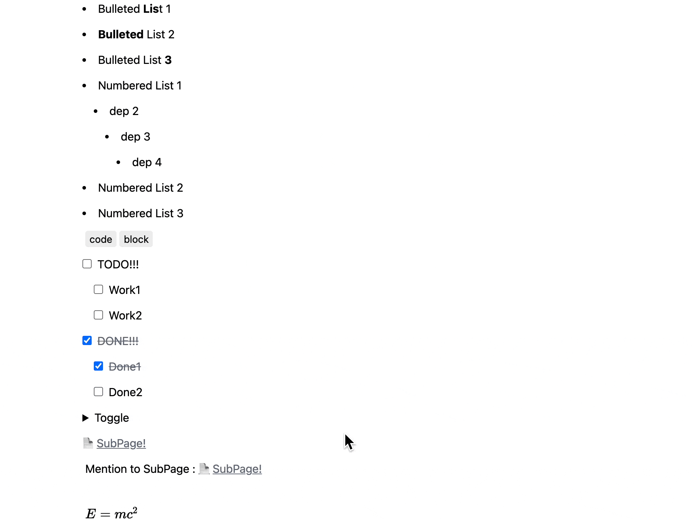

[✍️ 이전 1편 읽으러 가기!](/Javascript/analysis-notion-api-feat_nextjs_part_1/)

### 하위 Notion Block 불러오기!

저번에 간단하게 만들어둔 `Block Rendering` 부분에서 `Child Component` 를 Rendering 하는 부분은 코드 상으로 존재하지만 `notion` 의 응답이 실제 `typedef` 된 부분과 다르기 때문에 아래의 함수를 만들어서 재귀를 돌려 하위 `child blocks` 모두 불러올 수 있도록 만들었습니다.

typescript의 type 때문에 코드가 조금 길게 작성되었습니다. (개선 하시는 방법을 아시는 분은 댓글로 알려주세요!)

```ts
const getBlocksWithChildren = async (blocks: Block[]) => {
  return await Promise.all(
    blocks.map(async (block) => {
      return await getBlockWithChildren(block)
    })
  )
}

const getBlockWithChildren = async (block: Block) => {
  if (block.has_children === true) {
    const children = await getBlocks(block.id)
    switch (block.type) {
      case "paragraph":
        if (typeof block.paragraph.children === "undefined") {
          block.paragraph.children = await getBlocksWithChildren(children)
        }
        break
      case "bulleted_list_item":
        if (typeof block.bulleted_list_item.children === "undefined") {
          block.bulleted_list_item.children = await getBlocksWithChildren(
            children
          )
        }
        break
      case "numbered_list_item":
        if (typeof block.numbered_list_item.children === "undefined") {
          block.numbered_list_item.children = await getBlocksWithChildren(
            children
          )
        }
        break
      case "to_do":
        if (typeof block.to_do.children === "undefined") {
          block.to_do.children = await getBlocksWithChildren(children)
        }
        break
      case "toggle":
        if (typeof block.toggle.children === "undefined") {
          block.toggle.children = await getBlocksWithChildren(children)
        }
        break
    }
  }
  return block
}
```

이제 `next.js` 의 `getStaticProps` 를 아래와 같이 수정함으로 하위 Block 모두를 가지고 온 정보를 담을 수 있게 하였습니다.

```tsx
export const getStaticProps = async (_ctx: GetStaticPropsContext) => {
  if (typeof process.env.NOTION_INDEX_PAGE !== "string")
    throw new Error("Missing NOTION_INDEX_PAGE environment variable")
  const page = await getPage(process.env.NOTION_INDEX_PAGE)
  const blocks = await getBlocks(process.env.NOTION_INDEX_PAGE)
  const blocksWithAllChildren = await getBlocksWithChildren(blocks)
  return {
    props: {
      page,
      blocks: blocksWithAllChildren,
    },
    revalidate: 64,
  }
}
```

### Next.js pages API 만들기!

이전에 `Notion mention` 에서 `page.id`, `database.id` 만을 가지고 있으니 이 때 필요한 정보를 가져올 수 있는 API를 작성 했습니다.

`end-point` 를 실제 notion과 유사하게 설정을 하였습니다.

```ts
// pages/api/pages/[page_id].ts

import {
  APIErrorCode,
  ClientErrorCode,
  isNotionClientError,
} from "@notionhq/client"
import { Page } from "@notionhq/client/build/src/api-types"
import type { NextApiRequest, NextApiResponse } from "next"
import { getPage } from "../../../lib/notion"

export type GetPagesResData = {
  error?: string
  page: Page | null
  code?: ClientErrorCode | APIErrorCode
}

const getHandler = async (
  req: NextApiRequest,
  res: NextApiResponse<GetPagesResData>
) => {
  const { page_id } = req.query
  try {
    const page = await getPage(
      typeof page_id === "string" ? page_id : page_id[0]
    )
    res.status(200).json({
      page: page,
    })
  } catch (e: unknown) {
    if (isNotionClientError(e))
      res.status(500).json({
        page: null,
        error: e.message,
        code: e.code,
      })
    else throw e
  }
}

const handler = async (req: NextApiRequest, res: NextApiResponse) => {
  switch (req.method) {
    case "GET":
      return await getHandler(req, res)
    default:
      break
  }
}

export default handler
```

이제 `metion` 부분에서 `swr` 를 이용하여 정보를 `fetch` 하고 받아오는 로직을 추가 합니다.

```tsx
import { PageMention as PageMentionType } from "@notionhq/client/build/src/api-types"
import Link from "next/link"
import classes from "../../../../lib/classes"
import useRequest from "../../../../lib/hooks/useRequest"
import { getTitleFromPage } from "../../../../lib/notion"
import { GetPagesResData } from "../../../../pages/api/pages/[page_id]"

interface PageMentionProps {
  mention: PageMentionType
  className?: string
}

const PageMention: React.FC<PageMentionProps> = ({ mention, className }) => {
  const { page } = mention
  const { data, error } = useRequest<GetPagesResData>({
    url: `/api/pages/${page.id}`,
  })

  if (error || data?.page === null) {
    return (
      <Link href={`/pages/${page.id}`}>
        <a className={classes([className])}>requests fail: {page.id}</a>
      </Link>
    )
  }

  if (data === undefined) {
    return (
      <Link href={`/pages/${page.id}`}>
        <a className={classes([className])} title={`loading-page-${page.id}`}>
          Loading 📡
        </a>
      </Link>
    )
  }

  const title = getTitleFromPage(data.page)

  return (
    <Link href={`/pages/${page.id}`}>
      <a className={classes([className])} title={title}>
        {title}
      </a>
    </Link>
  )
}

export default PageMention
```

이때 `next/link` 를 이용하여 `/pages/[page_id]` 로 이동하도록 만들어 두었는데 해당 page를 만들어 봅니다.

### Next.js getStaticPaths fallback를 이용한 notion pages rendering

`next.js` 에서 제공하는 강력한 기능중 하나인 `getStaticPaths` `fallback: true` 옵션을 통해서 요청이 들어오면 `SSG` 를 작동하도록 만듭니다.

```tsx
import { GetStaticPropsContext } from "next"
import Head from "next/head"
import { useRouter } from "next/router"
import Block from "../../components/notion/Block"
import { Block as BlockType } from "@notionhq/client/build/src/api-types"
import { PagesRetrieveResponse } from "@notionhq/client/build/src/api-endpoints"
import classes from "../../lib/classes"
import {
  getBlocks,
  getBlocksWithChildren,
  getPage,
  getTitleFromPage,
} from "../../lib/notion"
import Loading from "../../components/Loding"

export const getStaticPaths = async () => {
  return { paths: [], fallback: true }
}

export const getStaticProps = async (
  ctx: GetStaticPropsContext<{
    page_id: string
  }>
) => {
  const { page_id } = ctx.params!

  try {
    const page = await getPage(page_id)
    const { blocks, next_cursor } = await getBlocks(page_id)
    const blocksWithAllChildren = await getBlocksWithChildren(blocks)
    return {
      props: {
        page,
        blocks: blocksWithAllChildren,
      },
      revalidate: 64,
    }
  } catch (error) {
    return {
      notFound: true,
    }
  }
}

const PageByIdPage = ({
  page,
  blocks,
}: {
  page: PagesRetrieveResponse
  blocks: BlockType[]
}) => {
  const { isFallback } = useRouter()

  if (isFallback) {
    return (
      <Loading
        className={classes([
          "container",
          "min-w-screen-md",
          "min-h-screen",
          "mx-auto",
          "w-8",
        ])}
      />
    )
  }

  const title = getTitleFromPage(page)
  return (
    <div
      className={classes(["container", "max-w-screen-md", "mx-auto", "px-2"])}
    >
      <Head>
        <title>{title}</title>
      </Head>
      <article>
        <h1 className={classes(["text-4xl", "py-3", "font-bold"])}>{title}</h1>
        <hr />
        {blocks.map((block) => (
          <Block key={`${block.id}-${new Date()}`} value={block} />
        ))}
      </article>
    </div>
  )
}

export default PageByIdPage
```

`next/router` 의 `useRouter` hook를 이용하여 `isFallback` 에 대한 경우를 체크를 하여 Loading를 하도록 처리를 해두고 만약 `getStaticProps` 에서 `notFound` 가 true로 응답이 오게 되면 자동으로 404로 연결이 됩니다.

이방법을 사용하게 되면 `getServerSideProps` 와 같은 작업은 무조건 매요청마다 `SSR` 작업을 수행하지만 이 방식을 사용하게 되면 요청이 들어왔을 때 없었던 요청이면 `SSG` 작업을 거치고 응답을 해주고 아니라면 미리 사전에 렌더링 된 HTML을 응답하여 빠른 속도로 처리가 가능합니다.



실제로 `vercel` 를 통해 deploy 한 결과물의 동작은 지연이 없이 매우 부드럽게 동작하는 것을 볼 수 있습니다!

### Next.js databases API 만들기!

이제 `Database` 관한 정보를 가져오는 API를 만들어 봅니다!

```ts
// pages/api/databases/[database_id].ts

import {
  APIErrorCode,
  ClientErrorCode,
  isNotionClientError,
} from "@notionhq/client"
import { Database } from "@notionhq/client/build/src/api-types"
import type { NextApiRequest, NextApiResponse } from "next"
import { getDatabase } from "../../../lib/notion"

export type GetDatabasesResData = {
  error?: string
  database: Database | null
  code?: ClientErrorCode | APIErrorCode
}

const getHandler = async (
  req: NextApiRequest,
  res: NextApiResponse<GetDatabasesResData>
) => {
  const { database_id } = req.query
  try {
    const database = await getDatabase(
      typeof database_id === "string" ? database_id : database_id[0]
    )
    res.status(200).json({
      database: database,
    })
  } catch (e: unknown) {
    if (isNotionClientError(e))
      res.status(500).json({
        database: null,
        error: e.message,
        code: e.code,
      })
    else throw e
  }
}

const handler = async (req: NextApiRequest, res: NextApiResponse) => {
  switch (req.method) {
    case "GET":
      return await getHandler(req, res)
    default:
      break
  }
}

export default handler
```

위와 같이 API를 구현하였으니 `PageMention` 과 동일하게 `DatabaseMention` 도 API와 연결 합니다.

```tsx
import { DatabaseMention as DatabaseMentionType } from "@notionhq/client/build/src/api-types"
import classes from "../../../../lib/classes"
import useRequest from "../../../../lib/hooks/useRequest"
import { GetDatabasesResData } from "../../../../pages/api/databases/[database_id]"

interface DatabaseMentionProps {
  mention: DatabaseMentionType
  className?: string
}

const DatabaseMention: React.FC<DatabaseMentionProps> = ({
  mention,
  className,
}) => {
  const { database } = mention

  const { data, error } = useRequest<GetDatabasesResData>({
    url: `/api/databases/${database.id}`,
  })

  if (error || data?.database === null) {
    return (
      <span className={classes([className])}>requests fail: {database.id}</span>
    )
  }

  if (data === undefined) {
    return (
      <span
        className={classes([className])}
        title={`loading-database-${database.id}`}
      >
        Loading 📡
      </span>
    )
  }

  const title = data.database.title.map((value) => value.plain_text).join("")

  return (
    <span className={classes([className])} title={title}>
      {title}
    </span>
  )
}

export default DatabaseMention
```

그리고 해당 `Database` 에 대한 종속 `pages` 정보를 가져오는 API도 작성을 합니다.

```ts
// pages/api/databases/[database_id]/pages.ts

import {
  APIErrorCode,
  ClientErrorCode,
  isNotionClientError,
} from "@notionhq/client"
import { Page } from "@notionhq/client/build/src/api-types"
import type { NextApiRequest, NextApiResponse } from "next"
import { getDatabasePages } from "../../../../lib/notion"

export type GetDatabasesPagesResData = {
  error?: string
  pages: Page[] | null
  code?: ClientErrorCode | APIErrorCode
  next_cursor: string | null
}

export type GetDatabasesPagesReqData = {
  database_id: string
  start_cursor?: string
  page_size?: string
}

const getHandler = async (
  req: NextApiRequest,
  res: NextApiResponse<GetDatabasesPagesResData>
) => {
  const { database_id, start_cursor, page_size } =
    req.query as unknown as GetDatabasesPagesReqData
  try {
    const { pages, next_cursor } = await getDatabasePages(database_id, {
      start_cursor,
      page_size: Number(page_size) || 50,
    })
    res.status(200).json({
      pages: pages,
      next_cursor: next_cursor,
    })
  } catch (e: unknown) {
    if (isNotionClientError(e))
      res.status(500).json({
        pages: null,
        next_cursor: null,
        error: e.message,
        code: e.code,
      })
    else throw e
  }
}

const handler = async (req: NextApiRequest, res: NextApiResponse) => {
  switch (req.method) {
    case "GET":
      return await getHandler(req, res)
    default:
      break
  }
}

export default handler
```

이제 `Database` 부분을 가지고 렌더링 하는 부분은 다음편에 이어서 작성을 해보겠습니다.

몇일에 걸쳐서 `Notion-api` 를 직접 사용해보니 여러가지 사용하기 편한 부분들이 많이 있어서 신기 했고 Beta가 끝나면 `oopy.io`, `super.so` 와 같은 서비스를 사용하지 않더라도 쉽게 나만의 `Notion Site` 를 만들 수 있을 것 같습니다.

> 😸 Github Repo : https://github.com/JaeSeoKim/nextjs-notion-api-example
>
> Original Notion Page: https://www.notion.so/Notion-API-Next-js-INDEX-PAGE-13cb8d2d3328425e815a1896267f5906
>
> Demo Site : https://nextjs-notion-api.vercel.app/
