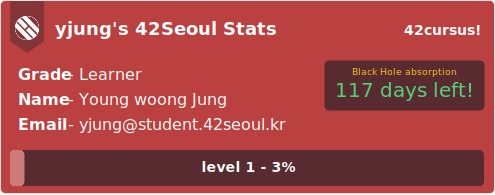

**토이 프로젝트(badge42) 개발기 2편 입니다!**

**[이전글 1편 보러 가기!](https://jaeseokim.github.io/Javascript/42-readme-stats-%EA%B0%9C%EB%B0%9C%EA%B8%B0_1/)**

# 📌 badge42! (aka. 42-readme-stats)

이전에 작성했던 글에서는 프로젝트 명을 42-readme-stats로 명명 하였는데 이번에 구조를 개선하기 위하여 `Vercel`에서 `Heroku`로 이전을 하게 되면서 `Heroku`의 도메인은 영어 소문자로 시작을 해야 한다는 제약 사항과 추가적인 기능에 대하여 표현을 하기 이름을 `badge42`로 이름을 바꾸었다!

이전 개발 상황이랑 다른 점을 차례대로 소개를 해보겠습니다!

## ♻️ Change SVG Render System!

> **TL;DR :** return (PlainText) -> return (React.renderToStaticMarkup)

처음 개발을 시작 했을 때에는 SVG를 Text 형태로 완성하여 Return 하는 함수를 만들었는데 이 때 문제는 SVG를 만들 때 Ide의 기능(intellisense, Formatting 등)을 사용할 수 없기 때문에 개발할 때의 불편함이 있어서 `React` 를 이용하는 방향으로 변경하였다!

SVG를 `component` 형태로 개발을 하고 최종적으로 Server에서 Response를 할 때 `ReactDomServer.renderToStaticMarkup()` 를 이용하여 정적으로 완성된 문자열을 Return하도록 수정을 하였다!

## 🎨 SVG Design!

저번에 했던 디자인은 아직 미완성의 느낌 이였지만 이번에 `React` Component 개발로 변경을 하고 빠르게 진행하여서 애니메이션을 제외한 기본적인 디자인을 완성 시켰다!

### 👷 개발 중 샘플 - (2020-10-20 기준)

_(응답으로 온 SVG를 저장하여 보여 주는 모습입니다. 개발되어 변경된 모습을 Live로 보고 싶다면 [github](https://github.com/JaeSeoKim/badge42)로 들어와 확인 해주세요!)_

## 🚀 Change From Serverless to Paas Platform!

기존 개발을 시작을 할 때 `Next.js` 를 이용하여 개발을 시작하여서 자연스럽게 `Vercel` 를 이용하여 서비스를 하였다.

이때 문제점이 Serverless 형태로 동작을 하게 되는데 이번에 도입을 할려고 하는 `Memory Cache` 기능을 사용을 할 수 없기 때문에 `Pass` Platform인 `Heroku` 로 이전을 하게 되었다!

## 🚧 개발 방향!!

### 개발 진행 목록!

#### 느린 응답 속도! (Memory-Cache 이용!)

저번에 있었던 문제가 API를 순차적으로 비동기 형태로 4개를 호출하고 또 Img_url의 응답 값을 가져와 Base64로 채워야 하는 로직이 있었는데 비 동기적 으로 실행되다 보니 최종적으로 응답이 완료 되기 까지 약 10초 정도의 시간이 필요 하는 문제가 있었다.

이를 해결하기 위해 `Memory-cache`를 사용하였는데 일단 공용으로 사용이 되는 `Token` 에 대해서 응답 값으로 `expires_in` 이라는 ttl Value를 주기 때문에 첫 Request 때 `cacheStore.set("token", token, expires_in);` 하여서 그 다음 요청 때 Token이 메모리에 남아 있다면 요청을 하지 않고 메모리에 있는 값을 가져와 재 사용 하는 방향으로 API 호출 횟수를 줄였다.

그 다음으로 수정한 부분은 `logo` 에 대한 부분인데 `SVG` 내부에서 Image를 Import 하기 위해 내부에 Proxy를 사용하여 `https://cdn.intra.42.fr/` 와 연결을 시켰지만 ㅠㅠ Github와 같은 서비스는 내부에서 `camo` 라는 Image proxy를 사용하기 때문에 svg 내부의 Image 요청이 전달되지 않아 직접 Fetch를 하여 Base64 Encoding를 하여 SVG를 렌더링 하도록 하였다.

이 때에 대하여도 응답이 동일하게 이루어 지기 때문에 재 사용이 가능하도록 `cacheStore.set(user_data.image_url, logo, (86400 \* 14));` TTL를 매우 길게 (14일)을 설정하여 사용하도록 하였다.

그리고 현재 유저 정보에 대하여 12시간 이라는 긴 TTL를 주어서 저장을 하도록 하였지만 이 부분은 사용자가 늘어나게 된다면 서버의 메모리 부족으로 이루어 질 수 있기 때문에 `Cache-Control` 헤더를 좀 더 공부한 이후 제거 하는 방향으로 가기로 하였다.

### 개발 예정 목록!

#### Cusus 선택 기능!

현재 API를 호출 하고 난 이후 `Cusus` 에 대하여 배열로 된 응답을 하게 되는 데 현재 가장 첫번 째로 있는 Cusus의 값만 가져와 보여주는 기능을 하고 있다.
이 부분을 get Parameter로 인자를 받아 들어서 선택이 가능하도록 수정을 할 예정을 가지고 있다!

또한 현재는 무조건 BlackHole Day를 보여 주고 있는데 만약 종료 된 Cusus라면 시작한 날짜와 종료된 날짜를 보여 주는 것으로 치환 하게 되는 것도 작업 예정이다!

#### Project별 Score Badge 기능!

Project Score를 API별로 정보를 가져와 보여 주는 기능을 추가할 예정이다.

## 🙈 마무리 하면서...

개발을 시작하고 주변 42 동료들 한테 소개 이후 조금씩 사용하는 사람이 생기게 되어서 약간 기분이 신기해 졌다.

아직은 공식적으로 Slack에 이야기 하지는 않았지만 메인 홈페이지와 SVG 애니메이션을 추가한 이후 한번 Slack에 공개하여 실 사용자를 받고 개선 사항들을 받아 개선 발전해 나아가고 싶다!
