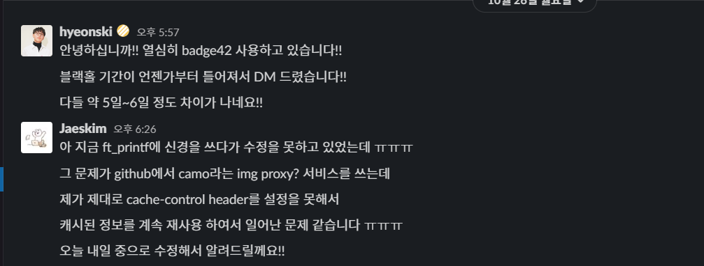
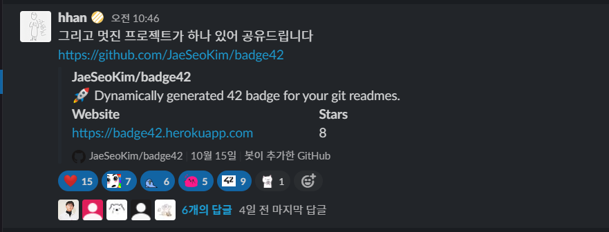
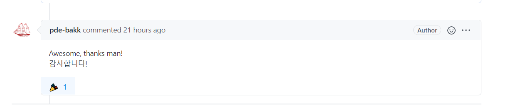

**토이 프로젝트(badge42) 개발기 3편 입니다!**

**[이전글 1편 보러 가기!](https://jaeseokim.github.io/Javascript/42-readme-stats-%EA%B0%9C%EB%B0%9C%EA%B8%B0_1/)**

**[이전글 2편 보러 가기!](https://jaeseokim.github.io/Javascript/badge42-%EA%B0%9C%EB%B0%9C%EA%B8%B0_2_aka_42-readme-stats/)**

# 📌 badge42! (aka. 42-readme-stats)

이전과 달리 개발에 대해서는 아직 `ft_printf` 프로젝트를 진행 중이라서 추가로 개발이 되었던 부분은 없지만 깃허브와 슬랙으로 이슈를 받게 되어서 그 부분에 해결한 기록을 남겨 보려고 한다!

## 🐛 First Issue! (cache-control header Problem)

처음으로 받게 된 `Issue` 는 바로 `hyeonski` 님 께서 제보 해주신 Issue였다!

그 내용은 블랙홀 날짜가 이전 날짜로 지속적으로 사용이 된다는 문제였다!



(_처음 Slack으로 연락을 받고 미완성이 아직 부족한 점이 많은 완전 프로토 수준 이였는데 관심을 주셔서 너무 기뻣다!!_)

그 이유는 바로 다름 아닌 이전에 Vercel에서 Heroku로 이전을 하고 `Memory-cache` 를 적용하면서 `cache-control` 헤더를 자세히 모르는 상태에서 사용을 하게 되어 공부 후 사용을 하고자 제거를 하였는데 깃허브에서 사용하는 img proxy [`camo`](https://github.com/atmos/camo) 에서 계속 캐쉬를 하여 전달을 하였기 때문에 일어난 일이 였다.

일단 제거를 한 `cache-control` Header 때문에 생긴 문제였으니 `res.setHeader("Cache-Control", "public, max-age=43200, stale-while-revalidate");` 코드를 추가 하여 수정을 하였고 그 다음 지금은 Proxy 상에서 Cache가 되어서 `https://badge42.herokuapp.com` 로 요청이 제대로 전달이 안되고 변한 `cache-control` 정책을 모르기 때문에 아래의 명령어로 `PURGE` 메소드를 날려서 Cache를 초기화 시키는 작업을 진행했다!

```
curl -X PURGE https://camo.githubusercontent.com/687997709b33483fe839174c5f3989840c6b4dc8/68747470733a2f2f626164676534322e6865726f6b756170702e636f6d2f6170692f73746174732f6a6165736b696d
```

## ✨ Github Project STAR!!!!!

원래 아직 제대로 완성도 안되고 `ft_printf` 를 진행 중 이여서 주변 42 동료들 한테 조금씩 소개만 하고 Slack에서 말하지는 않았었는데 `hhan` 님께서 멋진 프로젝트가 하나 있다고 소개를 해주셔서 처음으로 프로젝트에 2자리 수의 Star 갯수를 받아 보게 되었다!



_뭔가 많은 분들이 알게 되어서 부끄러웠지만 기뻤었다 ㅎㅎ_

## 🐛 Issue! [Unable to generate badge for my profile](https://github.com/JaeSeoKim/badge42/issues/3)

이번 이슈는 Github를 통해 받게 된 Issue 사항이다!

그것도 42seoul에서 보낸 Issue가 아닌 42Amsterdam(aka. Codam)에서 공부하시는 42 동료께서 보낸 이슈였다!

지금까지 Github를 하면서 내가 개발한 것에 대해 Issue를 제대로 받는 것은 처음이라서 뭔가 떨렸지만 해외에서 있는 42 동료가 관심을 보인다는 것에 기뻐서 빠르게 해결 했던 issue 였다!

이슈의 내용은 자신의 `42 Stats Card` 가 오류만 나타나고 정상적으로 보이지 않는 문제 였는데 이 부분은 기존에 작성한 `getImageToBase64` 함수 내부에서 불필요한 객체 생성이 많아져 오류가 나는 상황 이였기 때문에 그 부분의 코드를 제거하여 해결을 하였다!

이슈에 관한 버그 내용은 매우 간단하였지만 마지막에 받은 한국어로된 감사 인사 한마디가 나를 뿌듯하게 만들었었다!



## 🐛 Issue! [Error on multiple badge in github markdown](https://github.com/JaeSeoKim/badge42/issues/4)

이 이슈는 42Seoul에서 같이 공부하는 `sunpark` 님께서 남겨 주신 이슈 사항이다!

문제는 바로 github에서 여러 개의 `badge` 를 동시에 호출을 할 때 한두 개의 badge만이 제대로 로딩이 되고 나머지는 오류 화면이 나타나는 이슈 이다.

이 부분은 아직 해결이 된 것은 아니지만 2 가지의 개선 방향을 생각을 해보았다.

일단 근본적으로 오류가 나는 이유는 `42api` 가 현재 초 당 2번 호출이 가능한데 초 당 3회 이상 호출을 하게 되면 바로 에러 응답 값이 오게 되어 문제가 생기는 일이다.

이 부분을 해결하기 위해서는 42Seoul의 스태프 분들께 이야기를 드려서 `API` 호출 제한을 해제 해야 하는 문제기 때문에 바로 해결하기가 어려워 추후에 이 부분에 대하여 개선을 하고 지금은 다른 임시 방편의 방향으로 개선하기로 하였다.

2 번째 임시 방안의 해결 방법은 현재 Error 상황에서도 `cache-control` Header가 12시간의 TTL를 가지고 있기 때문에 Github Image Proxy가 에러 응답 값을 계속 리턴 하게 되는데 이 부분을 에러 시에는 TTL를 0초와 Cache가 불가능하도록 설정하여 새로 고침 시 다시 응답 값을 받아 올 수 있도록 개선을 할려고 하고 있다.

이 부분은 추가로, `Expires와` `Pragma` Header에 대하여 좀 더 공부하여 적용을 하여야 하기 때문에 일단은 미 해결 으로 남겨두고 `ft_printf` 과제가 끝난 후 첫 번째 작업 후보로 올려둔 상태 이다.

## 🙈 마무리 하면서...

이번에 같은 42서울에서 공부하는 동료 뿐만 아니라 해외에서 공부하는 42 동료께 이슈를 받게 되어서 기분이 신기하고 뭔가 기쁘다.

하지만 한편으로는 아직 완성도가 매우 떨어져 있는 상황이라서 빨리 `ft_printf` 를 끝내고 `TypeScript` Code refactoring도 해보고 싶고 TDD도 적용을 해서 안정성 있는 서비스를 만들어 보고 싶다!
