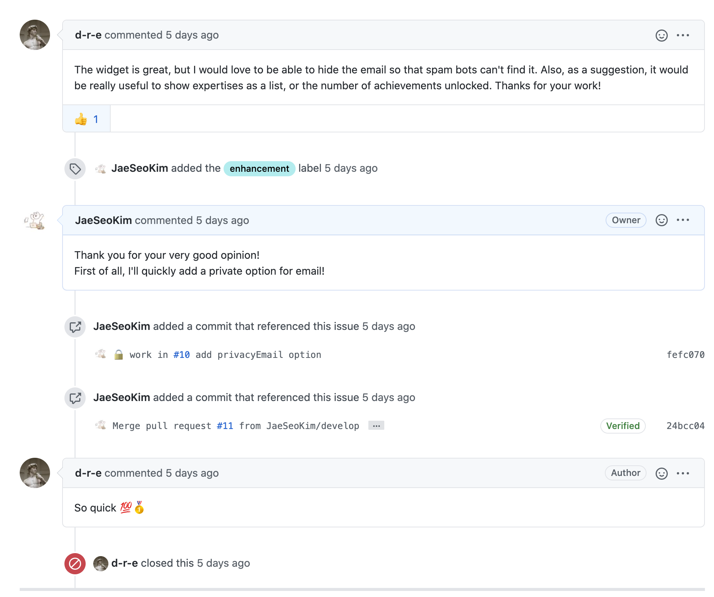
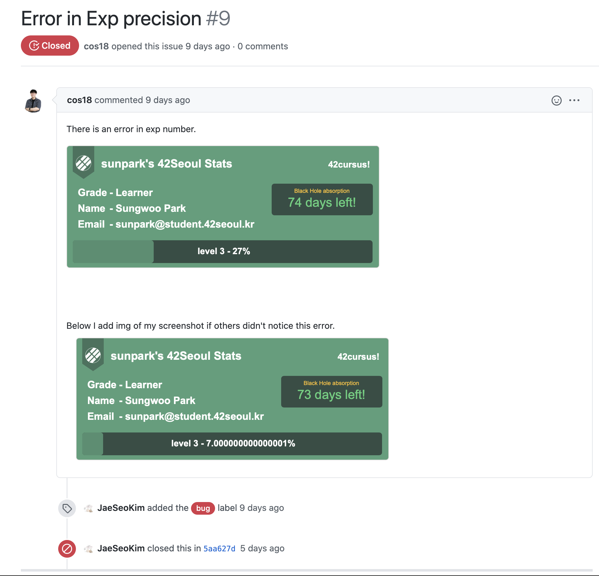

**토이 프로젝트(badge42) 개발기 3편 입니다!**

**[이전글 1편 보러 가기!](https://jaeseokim.github.io/Javascript/42-readme-stats-%EA%B0%9C%EB%B0%9C%EA%B8%B0_1/)**

**[이전글 2편 보러 가기!](https://jaeseokim.github.io/Javascript/badge42-%EA%B0%9C%EB%B0%9C%EA%B8%B0_2_aka_42-readme-stats/)**

**[이전글 3편 보러 가기!](https://jaeseokim.github.io/Javascript/badge42-%EA%B0%9C%EB%B0%9C%EA%B8%B0_3_aka_42-readme-stats/)**

# 📌 badge42!

한동안 개발을 하면서 많은 변화와 함께 여러가지 이슈에 대해 해결한 방법에 대해 기록을 하고자 작성을 해보았다!

## ♻️ Typescript로 이전!

이전 부터 작업을 하면서 불만 이였던 부분중 하나인 API 응답값을 가지고 SVG render를 하기 위해 데이터를 참조를 하다가 잘못된 데이터를 접근 하는 경우가 많았는데 이번에 Typescript로 type를 지정하여 이렇한 문제점이 없도록 하고자 이전을 하였다.

일단 이전을 하면서 크게 변경된 부분은 일단 현재는 필요가 없는 `next.js` 를 제거 하였고 velog.io의 백엔드로 사용이 되고 있다고 알려진 `Koa`에 관심을 가지게 되어서 Express에서 Koa로 이전을 하게 되었다.

## 💄 add simple animation!

Typescript로 이전을 완료한 이후에는 react를 쓰고 있는 강점을 살리고자 `emotion` 를 이용하여 애니메이션을 추가하였다!

애니메이션은 매우 간단하게 fadein 애니메이션과 progress bar 애니메이션을 추가하고 duration를 주어서 아래와 같이 보이도록 완성을 하였다!


## 🔒 [Email privacy issue #10](https://github.com/JaeSeoKim/badge42/issues/10)

한동안 42seoul에서의 프로젝트를 진행하면서 신경을 제대로 못쓰고 있던 찰나에 새로운 이슈가 들어와서 해결을 해보았다.

이슈의 내용은 다름이 아닌 기존의 badge는 기본적으로 무조건적으로 이메일을 보이게 표시를 하는데 이렇게 이메일을 표시하게 된다면 스팸봇 같은 것에 의해 크롤링이 되고 스팸이 날라올 수 있다는 문제점을 제시 한 것 이였다.

> **[d-r-e](https://github.com/d-r-e)** commented [3 days ago](https://github.com/JaeSeoKim/badge42/issues/10#issue-743291583)
>
> The widget is great, but I would love to be able to hide the email so that spam bots can't find it. Also, as a suggestion, it would be really useful to show expertises as a list, or the number of achievements unlocked. Thanks for your work!

이제 위와 같은 이슈를 보고 이러한 문제점을 수정이 필요 하겠다고 생각이 되어서 크게 작업을 해야 하는 부분도 아니여서 바로 수정에 나섰다.

일단 첫 번째로 한 일은 get 메소드로 값을 받는 로직을 추가 하고 Stats 컴포넌트에 Props로 전달을 하도록 만들어 두었다.

```tsx
const {
  params: { intraId },
  query: { privacyEmail },
  cacheStore,
} = ctx

ctx.body = ReactDomServer.renderToStaticMarkup(
  <Stats userData={user_data} logo={logo} privacyEmail={privacyEmail} />
)
```

이제 전달 받은 privacyEmail이 true라면 기존에 redering 되는 height를 25정도를 빼도록 설정을 하고 email에 대한 정보를 렌더링 하지 않도록 수정을 하였다.

이렇게 만듬으로 기존의 email 정보를 제거하였을 때에도 빈 여백이 크게 발생하지 않도록 만들었다.


이제 이렇게 수정을 완료 하였으니 readme에 사용 방법에 대한 예제를 추가를 하고 이슈 번호와 함께 커밋 후 push를 하였다!



그리고 위와 같은 내용을 답변을 받고 이슈는 close 되었다!

## 🐛 [Error in Exp precision #9](https://github.com/JaeSeoKim/badge42/issues/9)

이번 이슈는 부동 소수점에서 발생하는 문제 때문에 생기는 오류 였다.

기존의 퍼센티지에 대해 구하는 코드를 아래와 같이 만들어 두었는데 100를 곱하였을 때 부동 소수점의 문제로 소수점 아래의 값이 보이게 되는 문제였다.

```ts
const level_percentage = parseFloat((level % 1).toFixed(2)) * 100
```

위 코드를 아래의 코드로 수정을 하여서 간단하게 해결을 하였다!

```ts
const level_percentage = (parseFloat((level % 1).toFixed(2)) * 100).toFixed(0)
```



### ⚓️ choose **cursus**!

기존의 코드에서는 무조건 cursus배열에서 첫 번째에 해당하는 정보만 을 가지고 와서 redering 하도록 만들었었는데 이번에 lodash를 이용하여 cursus에 대해서 선택이 가능하도록 수정을 하였다!

```ts
const index = _.findIndex<get42UserCrususData>(crusus, {
  cursus: { name: cursusName },
})
```

일단 첫번째로 발생하는 문제는 기본적으로 42에서 본과정을 진행하는 학생은 2개의 cursus를 진행하였고, piscine 과정에서는 coalition이 없기 때문에 그점에 대해서 적절한 예외 처리가 필요하였다.

그래서 `cursusSlug.includes("piscine")` 를 이용하여 piscine인 경우에는 logo를 출력을 하지 않도록 하고 piscine과정 만을 진행하였던 사람들도 정상적으로 동작이 가능하도록 하였다!


## 🚧 code coverage 추가하기!

최근에 [FEconf2020에서 나온 발표](https://www.youtube.com/watch?v=L1dtkLeIz-M&t=861s)를 보면서 한번 이걸 badge42에 간단하게 라도 적용을 하고 싶어서 시도하게 되었다!

`@testing-library/react, jest` 등을 설치하여 testing이 가능하도록 환경을 설정을 하고 테스트 코드를 아래와 같이 간단하게 작성을 하여서 제대로 동작하는 지에 대해 확인을 하는 코드를 작성하였다.

```tsx
/* ************************************************************************** */
/*                                                                            */
/*                                                        :::      ::::::::   */
/*   Stats-42cursus.test.tsx                            :+:      :+:    :+:   */
/*                                                    +:+ +:+         +:+     */
/*   By: jaeskim <jaeskim@student.42seoul.kr>       +#+  +:+       +#+        */
/*                                                +#+#+#+#+#+   +#+           */
/*   Created: 2020/11/20 01:46:11 by jaeskim           #+#    #+#             */
/*   Updated: 2020/11/21 10:26:52 by jaeskim          ###   ########.fr       */
/*                                                                            */
/* ************************************************************************** */

import React from "react"
import { render } from "@testing-library/react"
import fs from "fs"
import Stats from "../src/components/Stats"
import getRemainDay from "../src/util/getRemainDay"
import { get42UserData } from "../src/api/api42"

describe("sample-jeaskim-2020-11-05 Stats", () => {
  /* SAMPLE DATA */
  const userData: get42UserData = JSON.parse(
    fs.readFileSync("test/sample-jeaskim-2020-11-05.json").toString()
  )
  const logo = ""

  const privacyEmail = false

  it("render Stats Container : ", () => {
    const { container } = render(
      <Stats
        logo={logo}
        privacyEmail={privacyEmail}
        userData={userData}
        cursusName={null}
      />
    )

    expect(container.querySelector("[data-testid='header']").textContent).toBe(
      "jaeskim's 42Seoul Stats"
    )

    expect(container.querySelector("[data-testid='cursus']").textContent).toBe(
      "42cursus!"
    )

    expect(
      container.querySelector("[data-testid='logo']").getAttribute("href")
    ).toBe(logo)

    expect(
      container.querySelector("[data-testid='information-grade']").textContent
    ).toBe("Grade- Learner")

    expect(
      container.querySelector("[data-testid='information-name']").textContent
    ).toBe("Name- Jaeseo Kim")

    if (privacyEmail) {
      expect(
        container.querySelector("[data-testid='information-email']")
      ).toBeNull()
    } else {
      expect(
        container.querySelector("[data-testid='information-email']").textContent
      ).toBe("Email- jaeskim@student.42seoul.kr")
    }

    expect(
      container.querySelector("[data-testid='blackhole']").textContent
    ).toBe(`${getRemainDay(userData.crusus[0].blackholed_at)} days left!`)

    expect(container.querySelector("[data-testid='level']").textContent).toBe(
      "level 1 - 66%"
    )

    expect(
      container
        .querySelector("[data-testid='svg-container']")
        .getAttribute("fill")
    ).toBe("#ffc221")
  })
})
```

이렇게 작성한 테스트 코드를 `CI(github action)` 를 이용하여 `codecov.io` 에서 자동으로 테스트 및 code coverage에 대한 보고를 할 수 있도록 설정하였다.

아래의 코드는 github action를 위해 작성한 코드 이다.

```yml
name: test

on:
  push:
    branches:
      - master
  pull_request:
    branches:
      - master

jobs:
  build:
    runs-on: ubuntu-latest

    steps:
      - uses: actions/checkout@v2

      - name: Setup Node
        uses: actions/setup-node@v1
        with:
          node-version: "12.x"

      - name: Cache node modules
        uses: actions/cache@v2
        env:
          cache-name: cache-node-modules
        with:
          path: ~/.npm
          key: ${{ runner.os }}-npm-cache-${{ hashFiles('**/package-lock.json') }}
          restore-keys: |
            ${{ runner.os }}-npm-cache-
      - name: Install & Test
        run: |
          npm install
          npm run test
      - name: Code Coverage
        uses: codecov/codecov-action@v1
```

그리고 마지막으로 `husky`를 설치하여 precommit, prepush에 대한 조건을 test 통과로 설정을 하여서 실수로 commit또는 push가 되는 것을 방지 하였다.

## 🙈 마무리 하면서...

이번에 `ft_printf` 프로젝트를 끝내고 나서 여러가지 밀려 있던 이슈를 해결하고 test코드를 작성해서 code coverage를 확인 가능하게 해보니 뭔가 느낌이 신기하고 재미있는 기분이다.
아직 머리속으로만 구상을 하고 제대로 실현을 못한 기능들이 많은데 빨리 구현을 해보고 싶다!
그리고 어느정도 완성을 하고 42서울의 3층 보컬분들께 가져가서 소개를 해드리고 42 API에 대해 제한 해제도 물어보고 싶다!
