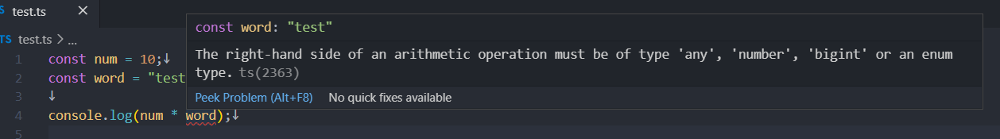
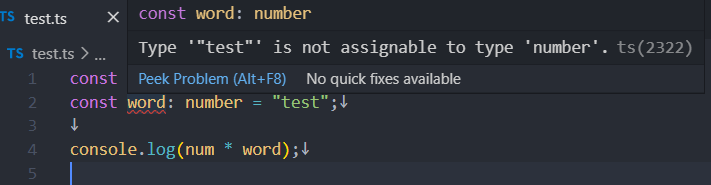

<p align="center">

<span style="font-size: 50px;">❤</span>

</p>

# [TypeScript?](https://www.typescriptlang.org/)

TypeScript에 대해서 처음 관심을 가지게 된 것은 React를 공부하며 개발을 하다 중간 중간 `Type`에 대해 제대로 체크를 안하고 그냥 사용을 하다 런타임에서 문제가 발생한다는 것을 눈으로 보고 수정을 하는 경우가 많았는데 이러한 문제를 원천 차단 할 수 있는 `JavaScript` 의 `SuperSet` 언어인 `TypeScript`가 있다는 것을 알게 되고 관심을 가지게 되었다.

`TypeScript`가 위에서 설명한 문제를 원천 차단 할 수 있다는 이유는 JS와 달리 컴파일 과정에서 `TypeChecker`를 통해 예를 들어 숫자와 문자를 곱하고 있는지 와 같은 행위를 발견하고 미리 경고를 함으로써 개발자는 실수를 줄이고 원하는 형태로 정상적으로 나오게 될 수 있다.

처음 `TypeScript`에 대해 알았을 때 **컴파일**을 해 준다고?? `JavaScript`는 **인터프리터** 언어인데? 하면서 의문점이 생겼다.

이때 `TypeScript`는 위에서 말한 것과 같이 `JavaScript`의 SuperSet으로 `TypeScript`는 결과물을 `JavaScript`로 만들어 준다.

그 과정에서 타입에 대해 체크를 해주기 때문에 런타임이 아닌 컴파일 시점에서 타입에 대해 잘못된 부분을 알게 되는 것이다.

```yml
TS:
1: 타입스크립트 소스 -> 타입스크립트 AST
2: 타입 검사기가 AST를 확인
3: 타입스크립트 AST -> 자바스크립트 소스
JS:
4: 자바스크립트 소스 -> 자바스크립트 AST
5: AST -> 바이트코드
6: 런타임이 바이트코드를 평가
```

위와 같은 단계를 거치면서 TypeScript가 JavaScript 소스로 생성하여 브라우저 기타 엔진에 의해서 자바스크립트가 실행이 된다.

그리고 `Node.js` 에서 `TypeScript`를 사용하기 위해서는 `typescript tslint @types/node` 등의 추가적인 모듈이 요구가 되는데 `deno` 라는 새로운 엔진을 사용해서 추가적인 모듈이 없이 작동이 가능하게 된다.

# [Deno?](https://deno.land/)

> ## Deno is a simple, modern and secure runtime for JavaScript and TypeScript that uses V8 and is built in Rust.

`Deno`의 공식 사이트에 들어가게 되면 위와 같이 설명을 하고 있는 것을 볼 수 있다.

`Deno`는 `Node.js`의 개발자가 기존 `Node.JS`를 만들었던 상황과 지금의 JavaScript의 생태계가 변화됨으로써 근본적으로 가지고 있었던 단점들을 개선한 프로젝트 이다.

기존 `Node.js`와의 차이점을 아래의 리스트로 정리해보았다.

|                            | Node.js                     | Deno                 |
| -------------------------- | --------------------------- | -------------------- |
| Engine                     | V8                          | V8                   |
| Language                   | C++, javascript             | rust, typescript     |
| Package manager            | NPM                         | URLs or file paths   |
| Modules import             | CommonJs                    | ES Modules           |
| Security                   | full access                 | explicit permissions |
| TypeScript Support         | not built in                | built in             |
| async actions return value | return undefined or promise | return promise       |

`Node.js`와 `Deno`는 위와 같은 차이를 가지고 있다. 하지만 아직 개발이 `Node.js` 와 달리 초기인 점을 고려하여서 사용을 고려해야 한다.

기존 `Node.js` 는 TypeScript를 쓰기 위해 추가적인 모듈을 사용 해야 하고 복잡한 설정이 필요하지만 Deno는 자체적으로 TypeScript를 지원하기 때문에 이번 기회에 같이 공부하고자 이렇게 정리 글을 작성하게 되었다.

# Hello TypeScript! with Deno🦕

이제 한번 Deno를 설치하여서 `Hello TypeScript! - with 🦕` 문구를 출력 해본다!

> ## Installation
>
> Deno works on macOS, Linux, and Windows. Deno is a single binary executable. It has no external dependencies.
>
> Using Shell (macOS and Linux):
>
> ```
> curl -fsSL https://deno.land/x/install/install.sh | sh
> ```
>
> Using PowerShell (Windows):
>
> ```
> iwr https://deno.land/x/install/install.ps1 -useb | iex
> ```
>
> Using [Scoop](https://scoop.sh/) (Windows):
>
> ```
> scoop install deno
> ```
>
> Using [Chocolatey](https://chocolatey.org/packages/deno) (Windows):
>
> ```
> choco install deno
> ```
>
> Using [Homebrew](https://formulae.brew.sh/formula/deno) (macOS):
>
> ```
> brew install deno
> ```
>
> Using [Cargo](https://crates.io/crates/deno) (Windows, macOS, Linux):
>
> ```
> cargo install deno
> ```

Deno에서 제공하는 설치 방법을 통해 설치를 진행 한다.

이제 `hello.ts` 라는 간단한 파일을 만들고 아래와 같은 내용으로 작성을 해본다.

```ts
console.log("Hello TypeScript! - with 🦕")
```

그리고 `deno run hello.ts` 명령어를 통해 결과물을 확인 해본다!

이제 TypeScript의 장점인 `TypeChecker`가 동작하는 지 확인한다.

```ts
const num = 10
const word = "test"

console.log(num * word)
```

위와 같이 작성된 파일을 보게 되면 아래와 같은 경고가 바로 출력 되는 것을 볼 수 있다.



이번에는 `annotation`를 사용하여 변수의 Type를 지정 하였을 때 어떤 식으로 작동하는지 확인 한다.

```ts
const num: number = 10
const word: number = "test"

console.log(num * word)
```



위와 같이 타입에 대하여 정의를 통해 개발자가 할 수 있는 타입에 대한 실수가 사라지게 된다.

---

한번 간단하게 TypeScript와 Deno에 대해서 글을 해보았는데 Deno의 장점과 왜 TypeScript를 사용해야 하는지에 대해 좀 더 알아가게 된 것 같다.
