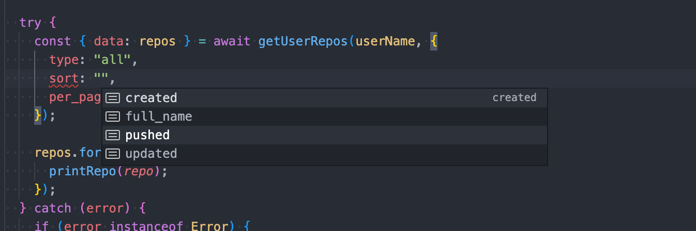

# JavaScript 란?

JavaScript는 **\*프로토타입** 기반의 Interpreter 또는 JIT 컴파일 언어로, 기본적으로 Web Browser를 위해 태어난 언어인 만큼 Web에서 자주 사용되는 것으로 알려져 있지만, Node.js, Deno 와 같은 런타임, 프레임워크를 통해 Web Browser가 아닌 곳에서도 활용 되는 것을 찾아 볼 수 있습니다.

[JavaScript - Wikipedia](https://en.wikipedia.org/wiki/JavaScript#Other_usage)

## 역사

초기 Netscape에서 Web Browser에서 이미지, 플러그인들을 쉽게 제어 할 수 있는 언어를 개발 하였으며, 이후 여러가지 JavaScript 문법 호환 파생 언어(JScript)가 많이 생겨남에 따라 표준화에 대한 요구가 커지게 되어 **ECMAScript**가 탄생하게 되었습니다.

## **ECMAScript**

**ECMA-262** 기술 규격에 따라 정의하고 있는 표준화된 스크립트 프로그래밍 언어를 말합니다.

JavaScript를 표준화 하기 위해 만들어졌으며, JavaScript, JScript 모두 ECMAScript의 호환을 목표로 하며, ECMA 규격에 포함되지 않는 확장 기능을 제공합니다.

현재 `ES2015` 이후 매년 새로운 개정 표준을 발표 하고 있으며, 다양한 브라우저 및 런타임에서 표준을 호환하기 위한 작업을 지속적으로 진행하고 있습니다.

## 장점

1. **낮은 진입장벽**

   기본적으로 Web Browser 위에서 동작하는 스크립트 언어이므로, Browser만 있다면 개발을 시작할 수 있습니다.

2. **학습 및 디버깅 에 대한 강력한 지원**

   Browser를 통해 다른 사이트의 JavaScript 소스 코드를 바로 확인 및 디버깅 할 수 있으며, 이를 통한 학습도 가능합니다. (단 uglify 및 minify 된 경우 해석하기 힘듬)

## 단점

1. **동적 타입 변환**

   기본적으로 변수에 대한 자료형의 제한이 없고, 자료형간의 연산의 경우 동적으로 타입이 변환이 되기 때문에 프로젝트의 규모가 커질 경우 예상치 못하는 오류가 발생할 수 있습니다.

2. **브라우저 호환성**

   매년 새로운 표준이 개정되지만 구형 브라우저에서는 최신 문법이 아직 미지원 하기 때문에 `Babel`, `SWC` 와 같은 `transpiler` 를 통한 구형 버전의 JavaScript로 치환이 필요합니다.

# TypeScript 란?

JavaScript의 SuperSet 언어로 JavaScript에는 없는 Type에 대한 문법을 제공하며, JavaScript와 1 대 1 매칭이 되는 컴파일 언어로써, JavaScript를 사용하는 곳이라면 TypeScript를 적용할 수 있습니다.

또한 컴파일 시점에 Type에 대한 체크를 진행하여 런타임 이전의 논리적인 오류를 확인 할 수 있습니다.

Microsoft에서 현재 설계 개발을 지속적으로 이끌어 가고 있으며, 2020년 Stack Over Flow 설문 조사에서 개발자가 사랑하는 언어 2위를 차지하고 있는 언어입니다.

## 장점

1. **정적 타입핑**

   JavaScript는 런타임에 인스턴스화 되기전까지 type를 정확하게 알 수 없습니다. 이러한 문제점을 해결 하기 위해 JavaScript에 type를 추가한 것이 TypeScript입니다.

2. **새로운 ECMAScript 문법 지원**

   TypeScript는 ECMAScript의 문법을 지원하고, 특정 원하는 ECMAScript 버전으로 변환하는 기능을 가지고 있습니다. 이를 통해 최신 문법들을 쉽게 사용할 수 있습니다.

3. **향상된 IDE 지원**

   TypeScript에서 알려주는 여러가지 정보를 IDE와 연결하여 개발을 좀더 편리하게 진행 할 수 있습니다.

4. **타입 추론**

   TypeScript의 유형추론을 통해 모든 type를 정의 하지 않더라도 런타임시에 발생할 수 있는 타입 오류를 캐치 할 수 있습니다.

5. **상호 운용성**

   JavaScript로 사용되는 것은 TypeScript내부에서도 사용이 가능합니다. 단 추가적으로 type 정의와 같은 추가 설정이 필요합니다.

## 단점

1. **컴파일 언어**

   기본적으로 TypeScript는 JavaScript로 컴파일 되는 언어이므로, 브라우저나 대중적으로 사용되는 런타임 에서는 바로 사용할 수 없다는 단점이 있습니다.

2. **복잡한 초기 설정**

   기본적으로 TypeScript를 사용하기 위해서는 `tsconfig.json` 파일을 통해 여러가지 설정을 해야 하고, 기존에 사용되던 JavaScript 언어에 type 정의를 추가해야 하는 작업과, 라이브러리 별 추가 type 라이브러리 설치 또는 정의 과정이 필요하게 됩니다.

# 상호 보완하기!

이제 위에서 살펴본 JavaScript와 TypeScript의 장단점을 이용하여 언제 어떤 언어를 사용하고 서로 상호 보완할 수 있는지 살펴봅니다.

## 복잡도가 낮거나, 프로젝트 인원이 적은 프로젝트

일반적으로 복잡도가 낮은 프로젝트를 진행하는 경우에는 TypeScript의 사용하는 것이 오히려 리소스 소모가 더 커지게 됩니다.

간단한 형태의 `vanillaJS` 를 이용하여 정적 웹사이트를 개발한다고 하였을 때 `TypeScript` 을 적용하게 되면 초기 프로젝트 설정에 대한 리소스 비용이 상당히 커지게 됩니다.

> **초기 프로젝트 설정**
>
> - **vanillaJS :** `live server` 와 같은 프로그램 또는 플러그인을 통한 초기 설정 필요 없이 바로 프로젝트 진행 가능
> - **TypeScript :** live server와 같은 기능을 사용하기 위해 `webpack`를 통한 직접 초기 설정을 진행 및 `tsconfig.json` 설정 및 내부에서 사용되는 객체에 대한 Typing 작업을 진행 필요

이때 JavaScript 프로젝트를 진행하면서 TypeScript의 타입체크의 도움을 받고 싶은 경우 아래와 같이 `@ts-check` 와 `jsdoc` 문법을 통해 도움을 받을 수 있습니다.

```jsx
// @ts-check

/**
 * @param {any[]} arr
 */
function compact(arr) {
  if (arr.length > 10) {
    arr.trim(0, 10)
    // Property 'trim' does not exist on type 'any[]'.ts(2339)
  }
  return arr
}
```

또한 위와 같은 방법을 통해 특정 `framework` 에 대한 설정을 해야 할 때에는 아래와 같이 `type` 를 import 하여 활용 할 수 있습니다.

```jsx
// Next.js의 설정파일 : next.config.js
const path = require("path")
// @ts-check

/**
 * @type {import('next').NextConfig}
 **/
module.exports = {
  sassOptions: {
    includePaths: [
      path.join(__dirname, "styles"),
      path.join(__dirname, "components/**"),
    ],
  },
  experimental: {
    swcMinify: true,
  },
}
```

## 복잡도가 높거나, 프로젝트 인원이 많은 프로젝트

기본적으로 프로젝트의 복잡도가 커지게 되는 경우 JavaScript 보다는 TypeScript 가 권장됩니다.

예를 들어 특정 API 의 복잡한 응답을 시각화하는 프로젝트의 경우 복잡한 type 때문에 개발을 진행하면서 여러가지 참조 오류가 발생할 수 있습니다. 또한 해당 오류를 발생하지 않도록 개발문서를 다양하게 참조 하면서 개발 시간이 증가하는 문제점이 발생합니다.

type를 정의 하거나 외부에서 정의된 type 사용하게 되면 개발 진행 도중 잘못된 type 사용시 경고 및 여러가지 객제에 대한 힌트를 제공하기 때문에 빠른 개발이 가능합니다.

[https://github.com/JaeSeoKim/kakao.maps.d.ts](https://github.com/JaeSeoKim/kakao.maps.d.ts)

위와 프로젝트를 같이 type 정의 패키지를 정의를 하게 되면 복잡한 type 들을 다양한 프로젝트에서 활용이 가능합니다.

[https://github.com/JaeSeoKim/react-kakao-maps-sdk](https://github.com/JaeSeoKim/react-kakao-maps-sdk)

위 라이브러리는 위에 정의된 type을 활용하여 개발 진행 시 해당 객체가 정확하게 들어왔는지와 이벤트에 의해 들어오는 객체의 type에 대해서 알려주기 때문에 TypeScript를 적용하지 않았을 때 발생할 수 있는 여러가지 type 오류를 사전에 방지 할 수 있습니다.

만약 TypeScript를 사용하지 않는 경우 해당 type에 대한 검증을 runtime에 추가 하는 형태로 진행되기 때문에 오버헤드가 발생하므로 하기 때문에 프로덕션용으로는 적합하지 않습니다.

[https://github.com/facebook/prop-types](https://github.com/facebook/prop-types)

Meta(구 facebook)에서 제공하는 prop-types 패키지 개발시 자주 사용되고 React의 경우 production용으로 build 시에는 해당 코드는 제외된 형태로 build 됩니다.

# Sample 예시 코드 리뷰

[https://github.com/JaeSeoKim/JavaScript_VS_TypeScript](https://github.com/JaeSeoKim/JavaScript_VS_TypeScript)

## Sample01

> **Github User API를 이용하여 유저에 대한 간단한 정보를 출력 하는 프로그램**

### JavaScript

[JavaScript_VS_TypeScript/JavaScript/sample01 at main · JaeSeoKim/JavaScript_VS_TypeScript](https://github.com/JaeSeoKim/JavaScript_VS_TypeScript/tree/main/JavaScript/sample01)

```jsx
const axios = require("axios")

const USER_NAME = "JaeSeoKim"

function printInfo(key, value) {
  console.log(`${key} :`, value)
}

function printUserInfo(info) {
  printInfo("id", info.id)
  printInfo("followers", info.followers)
  printInfo("following", info.following)
  printInfo("bio", info.bio)
  printInfo("name", info.name)
  printInfo("blog", info.blog)
  printInfo("email", info.email)
  printInfo("company", info.company)
}

async function main() {
  console.log(`Hello ${USER_NAME}!`)
  try {
    const { data } = await axios.get(
      `https://api.github.com/users/${USER_NAME}`,
      {
        headers: { Accept: "application/vnd.github.v3+json" },
      }
    )
    printUserInfo(data)
  } catch (error) {
    console.log(error.message)
  }
}

main()
```

작성한 코드를 기본적으로 살펴보면 매우 간결한 형태로 코드가 작성된 것을 볼 수 있습니다.

또한 `node.js` 기반으로 작성하였지만 `axios` 모듈 부분은 CDN으로 로드하면 해당 스크립트를 바로 브라우저에서 동작 하는 것이 가능합니다.

```jsx
// OUTPUT
Hello JaeSeoKim!
id : 48559454
followers : 176
following : 181
bio : 🌱 I am a student developer studying in 42Seoul.
name : JaeSeoKim
blog : https://about.jaeseokim.dev/
email : null
company : 42Seoul(@innovationacademy-kr)
```

이제 해당 스크립트를 실행시 위와 같은 결과물이 나오게 되는데, 이때 API의 응답값으로 들어오는 객체에 대해서 문서와 응답값을 기준으로 개발을 진행하다 보니 특정 객체의 값이 null인 경우를 제대로 검증하지 못하는 부분을 볼 수 있습니다.

또한 `printUserInfo(data);` 이 부분에서 해당 data가 해당 함수에서 요구하는 객체가 맞는지 확인 할 수 있는 방법이 없기 때문에, 실제 runtime까지 동작하지 않는다면 문제점을 발견하기 힘듭니다.

### TypeScript

[JavaScript_VS_TypeScript/TypeScript/sample01 at main · JaeSeoKim/JavaScript_VS_TypeScript](https://github.com/JaeSeoKim/JavaScript_VS_TypeScript/tree/main/TypeScript/sample01)

```tsx
import axios from "axios"
import type { Endpoints } from "@octokit/types"

export declare type SetIntersection<A, B> = A extends B ? A : never

type UserResponse = Endpoints["GET /users/{username}"]["response"]

type UserData = SetIntersection<
  UserResponse,
  {
    status: 200
  }
>["data"]

const USER_NAME = "JaeSeoKim"

function printInfo(key: string, value: string | number) {
  console.log(`${key} :`, value)
}

function printUserInfo(info: UserData) {
  printInfo("id", info.id)
  printInfo("followers", info.followers)
  printInfo("following", info.following)
  info.bio && printInfo("bio", info.bio)
  info.name && printInfo("name", info.name)
  info.blog && printInfo("blog", info.blog)
  info.email && printInfo("email", info.email)
  info.company && printInfo("company", info.company)
}

async function main() {
  console.log(`Hello ${USER_NAME}!`)
  try {
    const { data } = await axios.get<UserData>(
      `https://api.github.com/users/${USER_NAME}`,
      {
        headers: { Accept: "application/vnd.github.v3+json" },
      }
    )
    printUserInfo(data)
  } catch (error) {
    if (axios.isAxiosError(error)) {
      console.log(error.message)
      if (error.response) {
        console.log(error.response.data)
      }
    } else if (error instanceof Error) {
      console.log(error.message)
    } else {
      console.log(error)
    }
  }
}

main()
```

TypeScript로 작성을 할 때 일단 기본적으로 github api의 응답값에 대한 type 정의가 필요한데 이때 `@octokit/types` type 라이브러리를 이용하여 직접 type를 정의 하지 않고 해당 정의를 가져와 활용하는 것을 볼 수 있습니다.

단 이때 원하는 type를 정확하게 꺼내기 위해 `utility type` 를 정의하여 사용하는 부분이 있는데 해당 문법에 대해서 정확한 지식이 없으면 사용하기 어렵다는 문제점이 보입니다.

```tsx
const { data } = await axios.get<UserData>(
      `https://api.github.com/users/${USER_NAME}`,
```

위 코드를 보게 되면 api의 응답값은 `UserData` 가 온다는 것을 명시 해줌으로 추후 해당 type를 알 수 없는 문제점을 해결 한 것을 볼 수 있습니다.

또한 `printUserInfo` 함수에서도 정확하게 `UserData` 만을 받는 다는 것을 명시하였기 때문에 다른 데이터를 넘길 시에는 오류가 발생하는 것을 볼 수 있습니다.

`printUserInfo` 함수 내부를 이제 살펴보면 이제 응답값에서 특정 데이터는 optional 하게 넘어온다는 것을 알려주기 때문에 출력 이전에 적절하게 검증하여 사용하는 것도 볼 수 있습니다.

단 해당 스크립트는 TypeScript 이기 때문에 바로 node를 통해 실행 할 수는 없고, `tsc` , `ts-node` 등을 활용하여 실행해야 하는 문제점이 있습니다.

## Sample02

> **Github User API를 이용하여 입력받은 유저의 레포 정보를 출력 하는 프로그램**

### JavaScript

[JavaScript_VS_TypeScript/JavaScript/sample02 at main · JaeSeoKim/JavaScript_VS_TypeScript](https://github.com/JaeSeoKim/JavaScript_VS_TypeScript/tree/main/JavaScript/sample02)

```jsx
// index.js
import { readlineQuestionSync } from "./readline-sync.js"
import { getUserRepos, printRepo } from "./github.js"

async function main() {
  const userName = await readlineQuestionSync("Insert Github UserName : ")

  try {
    const { data: repos } = await getUserRepos(userName, {
      type: "all",
      sort: "created",
      per_page: "10",
    })

    repos.forEach((repo) => {
      printRepo(repo)
    })
  } catch (error) {
    if (error instanceof Error) {
      console.log(error.message)
    } else {
      console.log(error)
    }
  }
}

main()
```

JavaScript 답게 간결하게 사용된 것을 볼 수 있습니다.

`readlineQuestionSync` 함수를 통해 사용자 이름을 입력 받고 해당 유저의 이름을 가지고 repo 정보를 가져오는 것을 볼 수 있습니다.

이때 `getUserRepos` 함수를 살펴보게 되면 사용자 이름 이외에도 추가적으로 옵션을 전달 하는 것을 볼 수 있습니다.

```jsx
export async function getUserRepos(
  username,
  /**
   * @see https://docs.github.com/en/rest/reference/repos#list-repositories-for-a-user
   */
  options
) {
  return await axios.get(`${GITHUB_API}/users/${username}/repos`, {
    params: options,
    headers: GITHUB_HEADER,
  })
}
```

문제점은 이때 받는 `options` 에 대한 객체를 어떤 형태라도 넣을 수 있기 때문에 주석에 달린 문서를 읽으면서 작성하는 방법 밖에 없습니다.

또한 해당 API의 결과값 같은 경우 오타가 발생하여도 런타임시에 repo 데이터가 날라오기 때문에 자세히 확인 하지 않으면 오류가 발생하였는지 확인 하기 힘듭니다.

### TypeScript

[JavaScript_VS_TypeScript/TypeScript/sample02 at main · JaeSeoKim/JavaScript_VS_TypeScript](https://github.com/JaeSeoKim/JavaScript_VS_TypeScript/tree/main/TypeScript/sample02)

```tsx
// index.ts
import { readlineQuestionSync } from "./readline-sync"
import { getUserRepos, printRepo } from "./github"

async function main() {
  const userName = await readlineQuestionSync("Insert Github UserName : ")

  try {
    const { data: repos } = await getUserRepos(userName, {
      type: "all",
      sort: "created",
      per_page: 10,
    })

    repos.forEach((repo) => {
      printRepo(repo)
    })
  } catch (error) {
    if (error instanceof Error) {
      console.log(error.message)
    } else {
      console.log(error)
    }
  }
}

main()
```

TypeScript로 변환한 코드를 살펴보면 이전과 거의 동일 한 것을 볼 수 있습니다.

이때 내부적으로 달라지는 부분은 해당 함수들의 return type과 argument에 대한 type들이 정의 되어 있기 때문에 `getUserRepos` 함수의 `option` 를 사용할 때 자동 완성 및 잘못된 옵션을 사용하였을 때 에러를 발생하기 때문에 문서를 확인하고 테스트 하는 리소스를 줄일 수 있습니다.



단 이번에 사용한 예시와 같이 간단한 프로젝트일 경우 `TypeScript` 환경 설정 및 `type` 정의에 대한 리소스가 실 개발 리소스 보다 많이 소모될 수 있는 문제점이 있습니다.
