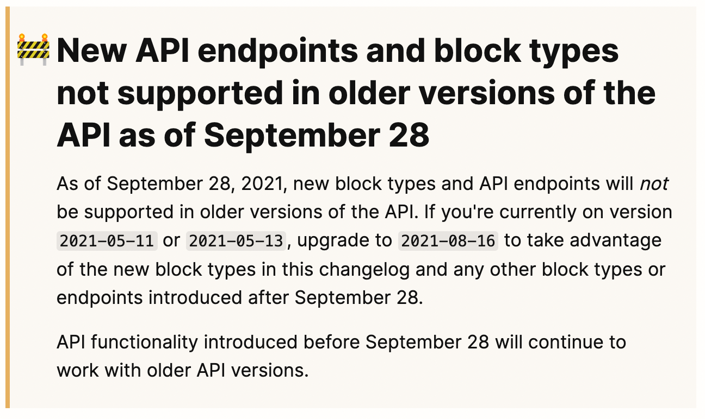

# 💬 시작하기에 앞서...

이 글은 필자가 Typescript를 사용하면서 기존에 잘 못 사용하던 방식을 개선한 방법에 대해서 두서없이 작성한 글 입니다. 따라서 틀린 내용 또는 개선 할 수 있는 내용이 다양하게 존재 할 수 있으니 댓글로 같이 공유 해주세요!

**# 이글이 도움이 되는 대상**

- 단순하게 type를 정의 해서 사용하고 있던 경우
- 외부 라이브러리의 type이 export 되지 않는 경우 type 코드를 복사해서 사용하고 있던 경우
- 특정 type내부의 type를 정의 하고 싶은데 방법을 모르고 있던 경우

**# 이글이 도움이 안되는 대상**

- 제네릭 문법에 대해서 잘 알고 활용을 자유자제로 하고 있던 경우
- 나만의 Typescript utility type를 정의 해서 사용하고 있던 경우

# 🧐 문제 발견!

최근 **Notion-api**를 이것 저것 만져 보면서 새롭게 블로그를 이전을 해볼려고 연구를 하고 있었는데 이전 [`https://github.com/JaeSeoKim/nextjs-notion-api-example`](https://github.com/JaeSeoKim/nextjs-notion-api-example) 연구를 했을 때와 달리 **SDK** 의 응답 타입 등이 대규모로 변경이 되어서 새롭게 다시 만들어야 하게 되었습니다.



Notion beta api의 2021-05-\* ver에 대한 Deprecated 안내

첫번째로 발견된 문제는 기존 라이브러리에서는 다양한 객체에 대한 **type**들을 export 해주거나 해당 객체별 별도의 **type**이 정의되어 있어서 일부분 가져와서 사용하기 편한 형태로 되어 있었지만 최신버전인 `0.4.3` 에서는 `api-endpoint` 에 대한 응답값만이 type를 export되어 있기 때문에 내부에서 사용하는 특정 객체의 Type를 알 수 없다라는 문제가 발생하였습니다.

일단 제공되는 해당 type를 이용하여 개발을 진행을 하였는데 이 때 문제는 해당 type은 아래와 같이 `type` key에 대한 정보를 확인 하여 해당 객체에만 존재하는 오브젝트를 가지고 있는 형태였습니다.

```tsx
(alias) type GetBlockResponse = {
    type: "paragraph";
    paragraph: {
        ...
		}
		...
	}
|
	{
		type: "heading_1";
    heading_1: {
        ...
		}
		...
	}
|
	{
		type: "child_page";
    child_page: {
        ...
		}
		...
	}
...
```

이 때문에 Typescript에서는 `type` 객체를 검증하는 코드를 통해 확정되지 않는 이상 에러를 발생하기 때문에 `paragraph` 를 그리는 Component를 만들어야 한다고 하면 아래와 같이 작성을 해야 합니다.

```tsx
export interface ParagraphProps {
  block: GetBlockResponse // 블럭에 올수 있는 모든 결과값이 위와 같은 예시 처럼 union 형태로 정의 되어 있음
}

const Paragraph: React.FC<ParagraphProps> = ({ block }) => {
  if (block.type !== "paragraph") {
    throw new Error("invaild block type! : required paragraph")
  }
  return (
    <div className={cs(["notion-paragraph"])}>
      <Text rich_texts={block.paragraph.text} block_id={block.id} />
    </div>
  )
}
```

이 때 발생하는 문제점은 이미 사전에 아래와 같이 `Type`를 체크하여서 렌더링을 하고 있지만 2번 중복해서 매번 불필요한 type 체크 코드를 작성해야 하는 문제가 있습니다.

```tsx
const SwitchBlock: React.FC<BlockProps> = ({ block }) => {
    if (block.type === "paragraph") {
      return <Paragraph block={block} />
    }
    if (block.type === "heading_1") {
      return <Heading1 block={block} />
    }
    if (block.type === "heading_2") {
      return <Heading2 block={block} />
    }
		...
```

이런한 문제 때문에 `paragraph` , `heading_1` 와 같은 block별 type를 정의 하는 것이 필요한데 저희가 직접 type를 정의 하는 것은 `notion-api` 와 같이 변화점이 많은 경우 유지 보수 하는 것이 어렵기 때문에 typesript의 장점을 활용하여 개선해봅니다.

# 🛠️ utility types를 이용하여 개선하기!

위와 같은 문제를 해결하기 위해서 사용한 것은 바로 `utility types` 입니다!

**# utility types이란?**
Typescript의 **generic**를 이용하여 일반적인 **Type 변환**을 쉽게 할 수 있도록 하는 Type입니다!

[Documentation - Utility Types](https://www.typescriptlang.org/docs/handbook/utility-types.html)

utility types를 이용하면 위와 같이 특정한 조건을 성립하였을 때의 값을 가져오는 것 등이 가능합니다.

간단한 `utility type` 하나를 살펴봅니다!

```tsx
type Partial<T> = {
  [P in keyof T]?: T[P]
}
```

위의 `Partial<T>` type은 T 내부의 객체 전부를 옵션 형태로 변경해주는 type 입니다.

`[P in keyof T]` 를 통해 T 내부의 모든 key를 배열에 넣은 후 `[P in keyof T>? : T[P];` 를 통해 모두 옵션으로 변경하고 해당하는 `T[P]` 로 재정의 하는 것을 볼 수 있습니다.

이러한 여러가지 utility types를 추가로 만들거나 활용한다면 원하는 특정 타입을 추론하는 것이 가능합니다.

기본적으로 Typescript에서는 여러가지 utility types 를 제공을 하지만 커뮤니티에서 만든 유용한 utility types를 모아둔 라이브러리를 활용하여 문제점을 해결해봅니다!

[GitHub - piotrwitek/utility-types: Collection of utility types, complementing TypeScript built-in mapped types and aliases (think "lodash" for static types).](https://github.com/piotrwitek/utility-types)

## ✍️ 새롭게 type 정의 하기!

일단 첫번째로 type정의 할 부분은 바로 `GetBlockResponse` 입니다.

현재 `GetBlockResponse` 은 export를 통해 저희가 접근하여 사용이 가능하지만 언제 다시 depricate 될지 모르기 때문에 아래와 같이 type를 정의 합니다.

```tsx
import { PromiseType } from "utility-types"
import { Client } from "@notionhq/client"

export type GetBlockResponse = PromiseType<
  ReturnType<typeof Client.prototype.blocks.retrieve>
>
```

위와 같이 추가적인 `utility-types` 를 이용하여 notion의 Client의 `blocks.retrieve` end-point에 대한 ReturnType를 받은 다음 Propmise wrapper를 제거하여 결과를 가져온 것을 볼 수 있습니다.

이제 각 block 별 객체를 새롭게 정의 해봅니다!

```tsx
export type ParagraphType = SetIntersection<
  GetBlockResponse,
  { paragraph: Object }
>

export type Heading1Type = SetIntersection<
  GetBlockResponse,
  { heading_1: Object }
>

export type Heading2Type = SetIntersection<
  GetBlockResponse,
  { heading_2: Object }
>
...
```

여기서 사용한 `SetIntersection` 은 아래와 같이 정의 되어 있어서 **A**가 **B** 를 가지고 있는 경우에만 **A**를 반환하기 때문에 저희의 경우에 사용하기 알맞아 각 block type의 객체에 대해서 가지고 있는 경우만을 가져와 정의를 했습니다.

```tsx
export declare type SetIntersection<A, B> = A extends B ? A : never
```

이제 새롭게 정의한 type를 이용하여 아까전의 `Paragraph` 컴포넌트를 개선합니다.

```tsx
import { ParagraphType } from "../types"

export interface ParagraphProps {
  block: ParagraphType
}

const Paragraph: React.FC<ParagraphProps> = ({ block }) => {
  return (
    <div className={cs(["notion-paragraph"])}>
      <Text rich_texts={block.paragraph.text} block_id={block.id} />
    </div>
  )
}
```

이제 들어오는 block의 type 자체를 `ParagraphType` 으로 제한을 걸어두었기 때문에 검증하는 코드 없이 사용이 가능하고 외부에서 호출할 때 block의 type이 다를 경우 Typescript가 에러를 발생시키는 것도 확인이 가능합니다.

# 🤓 이전과 달라진 점

이전에 개발을 진행할 때에도 이것에 대한 특정 함수의 ReturnType를 가져오거나 특정 객체의 일부를 함수의 인자로 받아 사용하고 싶을 때 직접 type를 정의하였지만 이제는 utility type를 정의하여 가져오는 것이 가능해졌습니다!

이글을 통해 저처럼 Typescript를 제대로 활용을 못하고 있던 분들에게 도움이 되었으면 합니다!
