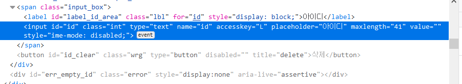
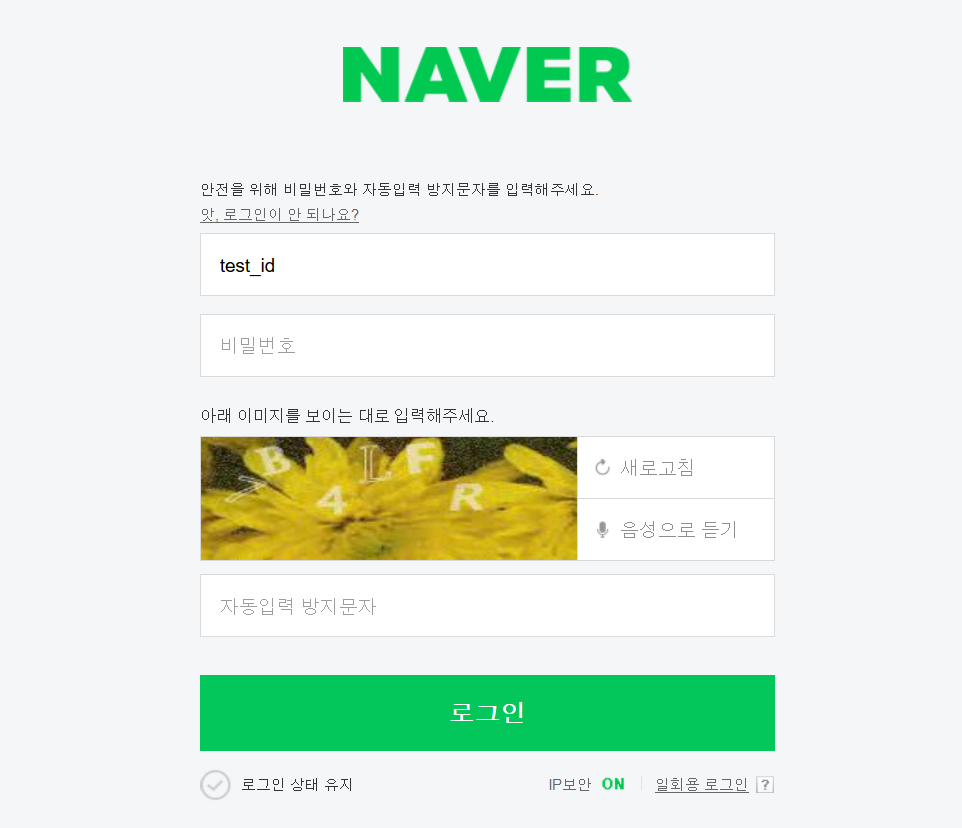
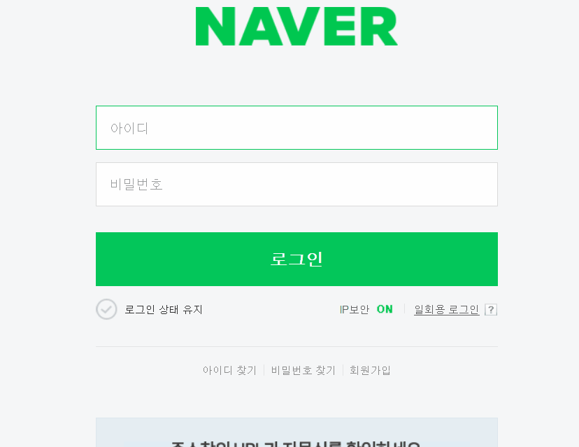
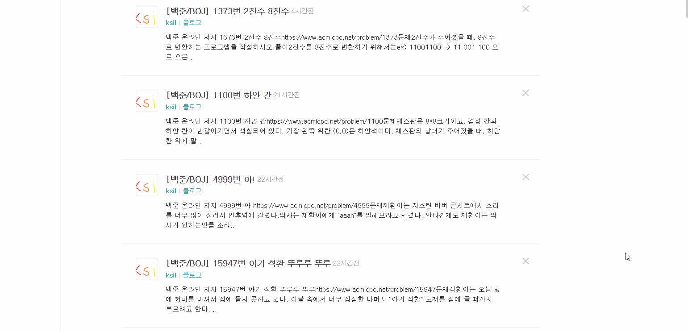
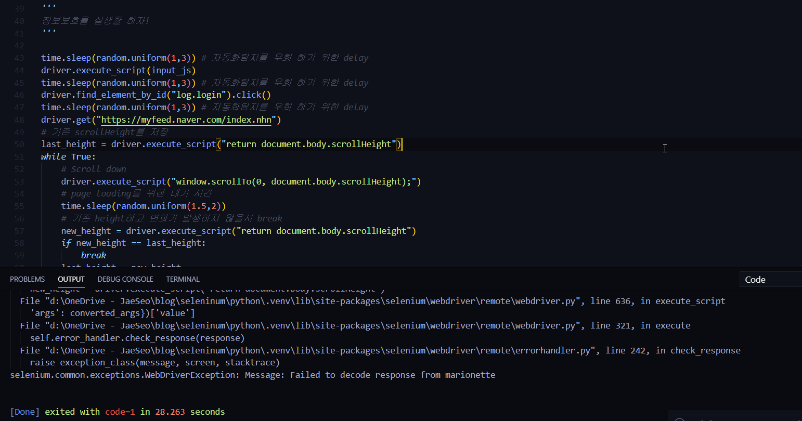
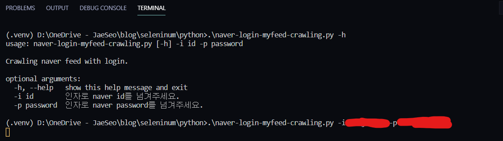
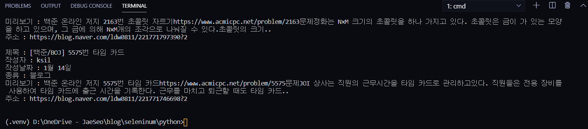

Selenium를 이용하여 naver 구독 Feed를 크롤링 하기 위해서는 일단 Naver Login를 처리해야 하고 그다음 피드 페이지의 내용을 불러와 크롤링을 해야 합니다. 여기서 2가지의 문제가 발생하는 데 일단 Naver Login의 captcha 우회가 필요하고 그 다음 피드 페이지의 내용을 스크롤 다운을 통해 불러와야 합니다.

### Naver Login 처리

일단 네이버 로그인을 하기위해 스크립트를 짜봅니다.

```python
import time
import random
from selenium import webdriver

# 다운받은 webdriver의 경로를 지정
executable_path='D:/OneDrive - JaeSeo/blog/seleninum/python/webdriver/geckodriver.exe'
driver = webdriver.Firefox(executable_path = executable_path)
time.sleep(random.uniform(1,3)) # 자동화탐지를 우회 하기 위한 delay
# naver login page로 이동
driver.get("https://nid.naver.com/nidlogin.login?mode=form&url=https%3A%2F%2Fwww.naver.com")
```

일단 NAVER의 로그인 페이지로 이동하도록 합니다.



이제 input 필드에 값을 넣을수 있도록 id를 확인 합니다.

id, pw로 매우 간단하게 id가 설정되어 있는 것을 확인할 수 있었습니다.

일단 `element.send_keys()` 방법으로 한번 입력을 한후 로그인을 시도해 보겠습니다.

```python
time.sleep(random.uniform(1,3)) # 자동화탐지를 우회 하기 위한 delay
driver.find_element_by_id('id').send_keys("test_id")
driver.find_element_by_id('pw').send_keys("test_pw")
time.sleep(random.uniform(1,3)) # 자동화탐지를 우회 하기 위한 delay
driver.find_element_by_id('pw').submit()
```



`send_keys()` 를 이용하여 입력한후 submit를 하니 `naver captcha` 에 탐지가 되어 입력을 해야 하는 모습을 볼 수 있습니다.

이때 우회 방법이 여러가지가 있는데 일단 인터넷에서 찾아본 방법중 하나는 [lumyjuwon/NaverCaptcha: 셀레니움 네이버 캡차 무력화 - GitHub](https://github.com/lumyjuwon/NaverCaptcha) 에서 찾은 클립보드`ctr + c` , `ctr + v` 이용하여 우회하는 방법입니다.

그다음으로 발견한 방법으로는 브라우저에서 계정정보를 저장하고 `autocomplete` 해주는 기능은 정상적으로 captcha에 탐지가 안되고 작동되는 것을 생각 하여 한번 어떻게 구현이 되었나 생각을 하다 `chrome extension` 에 비밀번호 관리 확장프로그램이 있고 그리고 js로 구현이 되기 때문에 한번 js로 입력값을 넣도록 했습니다.

```python
input_js = ' \
        document.getElementById("id").value = "{id}"; \
        document.getElementById("pw").value = "{pw}"; \
    '.format(id = "test_id", pw = "test_pw")
time.sleep(random.uniform(1,3)) # 자동화탐지를 우회 하기 위한 delay
driver.execute_script(input_js)
time.sleep(random.uniform(1,3)) # 자동화탐지를 우회 하기 위한 delay
driver.find_element_by_id("log.login").click()
```

일단 매우 간단한 방법으로 `document.getElementById().value` 에 값을 직접 넣는 js만든 다음 `execute_script()` 이용하여 실행하였습니다.



이번에는 정상적으로 로그인 시도로 인식하여 로그인 Captcha가 작동안하는 모습을 볼 수 있습니다.

이제 로그인이 정상적으로 성공을 하였을 때 피드의 정보를 가져오도록 하겠습니다.

### Naver Feed Scroll crawling

[https://myfeed.naver.com/index.nhn](https://myfeed.naver.com/index.nhn) 의 피드를 크롤링 하기 위해서는 일단 스크롤을 최하단으로 내렸을때 피드의 내용을 이어서 받아오기 때문에 이에 대해 모든 정보를 받아오고 크롤링을 해야 합니다.



일단 스크롤의 최하단으로 이동을 해야 하는데 이때 js을 이용하여 최하단으로 이동하도록 합니다.

```js
window.scrollTo(0, document.body.scrollHeight)
```

이때 이작업을 반복적으로 하면서 더이상 변화가 없다면 break를 해야 하는데 해당 기능은 아래로 구현 했습니다.

```python
# 기존 scrollHeight를 저장
last_height = driver.execute_script("return document.body.scrollHeight")
while True:
    # Scroll down
    driver.execute_script("window.scrollTo(0, document.body.scrollHeight);")
    # page loading를 위한 대기 시간
    time.sleep(random.uniform(1.5,2)) # Feed를 불러올 수 있도록 램덤 대기
    # 기존 height하고 변화가 발생하지 않을시 break
    new_height = driver.execute_script("return document.body.scrollHeight")
    if new_height == last_height:
        break
    last_height = new_height
```

그리고 일단 간단하게 Feed list 영역의 text만 추출하여 출력하여 정상적으로 동작하는지 확인 합니다.



이제 데이터 분석을 편리하게 할 수 있도록 Beautifulsoup로 분석을 하여 list[dictionary] 형태로 저장을 합니다.

```python
# list_feed 부분만 분리
list_feed = driver.find_element_by_xpath("/html/body/div[2]/div[2]/div[2]/div[1]/div[1]/div[2]").get_attribute('innerHTML')
# beautifulsoup를 이용하여 분석
soup = BeautifulSoup(list_feed, 'html.parser')
list_feed = soup.find_all('li',{'class':'_ccast_item'})
feed_data = list()
for i in range(len(list_feed)):
    # feed 정보를 저장할 dictionary 선언
    feed = dict()
    # 정보에 대해 저장
    feed['title'] = list_feed[i].find('h4').find('a').text.strip()
    feed['date'] = list_feed[i].find('span',{'class':'wrt_time'}).text.strip()
    feed['copywriter'] = list_feed[i].find('span',{'class':'h_title'}).text.strip()
    feed['content_type'] = list_feed[i].find('span',{'class':'svc_name'}).text.strip()
    #thumnail이 없을 경우 div의 class의 이름이 달라져서 예외 처리
    try:
        div_cont = list_feed[i].find('div',{'class':'fd_cont'}).find('a')
        feed['preview'] = div_cont.text.strip()
        feed['link'] = div_cont.attrs['href']
    except:
        div_cont = list_feed[i].find('p',{'class':'thumbs_tx'}).find('a')
        feed['preview'] = div_cont.text.strip()
        feed['link'] = div_cont.attrs['href']
    feed_data.append(feed)
```

이제 함수로 분리를 하고 프로그램 실행시 인자를 아이디와 비번을 받아 크롤링 한후 출력을 하는 스크립트를 작성합니다.

```python
import time
import random
import argparse
from bs4 import BeautifulSoup
# 설치한 selenium에서 webdriver를 import
from selenium import webdriver

def login_naver(driver,id,pw):
    time.sleep(random.uniform(1,3)) # 자동화탐지를 우회 하기 위한 delay
    # naver login page로 이동
    driver.get("https://nid.naver.com/nidlogin.login?mode=form&url=https%3A%2F%2Fwww.naver.com")
    # id input, pw input 필드에 값을 입력
    # send_key()를 이용하였을때 captacha탐지가 되기 때문에 우회 방법으로 js으로
    input_js = ' \
        document.getElementById("id").value = "{id}"; \
        document.getElementById("pw").value = "{pw}"; \
    '.format(id = id, pw = pw)
    time.sleep(random.uniform(1,3)) # 자동화탐지를 우회 하기 위한 delay
    driver.execute_script(input_js)
    time.sleep(random.uniform(1,3)) # 자동화탐지를 우회 하기 위한 delay
    driver.find_element_by_id("log.login").click()

def crawling_feed(driver):
    time.sleep(random.uniform(1,3)) # 자동화탐지를 우회 하기 위한 delay
    driver.get("https://myfeed.naver.com/index.nhn")
    # 기존 scrollHeight를 저장
    last_height = driver.execute_script("return document.body.scrollHeight")
    while True:
        # Scroll down
        driver.execute_script("window.scrollTo(0, document.body.scrollHeight);")
        # page loading를 위한 대기 시간
        time.sleep(random.uniform(1.5,2))
        # 기존 height하고 변화가 발생하지 않을시 break
        new_height = driver.execute_script("return document.body.scrollHeight")
        if new_height == last_height:
            break
        last_height = new_height
    # list_feed 부분만 분리
    list_feed = driver.find_element_by_xpath("/html/body/div[2]/div[2]/div[2]/div[1]/div[1]/div[2]").get_attribute('innerHTML')
    # beautifulsoup를 이용하여 분석
    soup = BeautifulSoup(list_feed, 'html.parser')
    list_feed = soup.find_all('li',{'class':'_ccast_item'})
    feed_data = list()
    for i in range(len(list_feed)):
        # feed 정보를 저장할 dictionary 선언
        feed = dict()
        # 정보에 대해 저장
        feed['title'] = list_feed[i].find('h4').find('a').text.strip()
        feed['date'] = list_feed[i].find('span',{'class':'wrt_time'}).text.strip()
        feed['copywriter'] = list_feed[i].find('span',{'class':'h_title'}).text.strip()
        feed['content_type'] = list_feed[i].find('span',{'class':'svc_name'}).text.strip()
        #thumnail이 없을 경우 div의 class의 이름이 달라져서 예외 처리
        try:
            div_cont = list_feed[i].find('div',{'class':'fd_cont'}).find('a')
            feed['preview'] = div_cont.text.strip()
            feed['link'] = div_cont.attrs['href']
        except:
            div_cont = list_feed[i].find('p',{'class':'thumbs_tx'}).find('a')
            feed['preview'] = div_cont.text.strip()
            feed['link'] = div_cont.attrs['href']
        feed_data.append(feed)

    return feed_data

def main(id,pw):
    # 다운받은 webdriver의 경로를 지정
    executable_path='D:/OneDrive - JaeSeo/blog/seleninum/python/webdriver/geckodriver.exe'
    driver = webdriver.Firefox(executable_path = executable_path)
    # 사용자 정의 함수 실행
    login_naver(driver,id,pw)
    data = crawling_feed(driver)
    # 출력을 위한 부분
    for i in range(len(data)):
        print('제목 : {title}\n작성자 : {copy}\n작성날짜 : {date}\n종류 : {type}\n미리보기 : {preview}\n주소 : {link}\n'.format(
            title = data[i]['title'],
            copy = data[i]['copywriter'],
            date = data[i]['date'],
            type = data[i]['content_type'],
            preview = data[i]['preview'],
            link = data[i]['link']))

def check_args():
    # 프로그램 실행시 인자를 통해 id, pw를 받음
    parser = argparse.ArgumentParser(description='Crawling naver feed with login.')
    parser.add_argument('-i',
        required=True,
        metavar="id",
        help="인자로 naver id를 넘겨주세요.",
        type=str)
    parser.add_argument('-p',
        required=True,
        metavar="password",
        help="인자로 naver password를 넘겨주세요.",
        type=str)
    args = parser.parse_args()
    main(args.i, args.p)

if __name__ == "__main__":
    check_args()

```

이제 실제 작동을 해봅니다.


