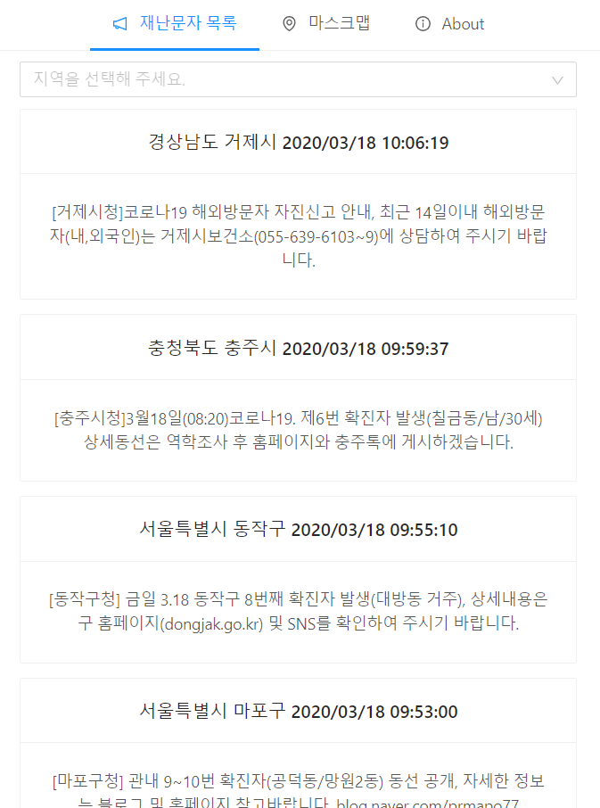
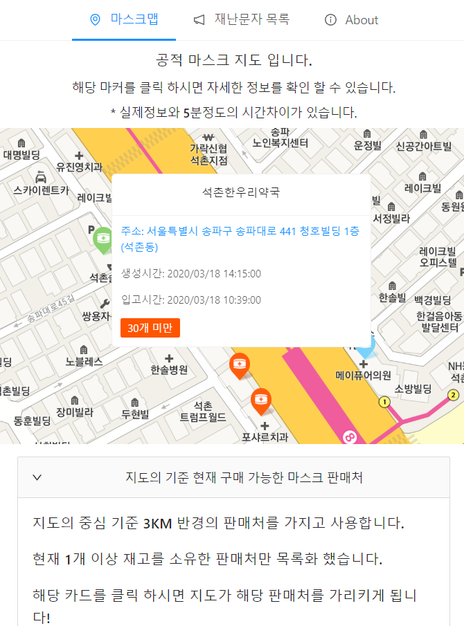

> ### 2021-10-02 추가
>
> 예전에 사용을 했던 경험을 바탕으로 새롭게 [react-kakao-maps-sdk](https://github.com/JaeSeoKim/react-kakao-maps-sdk) 라이브러리를 만들었습니다. 해당 글에 적혀있는 내용은 비효율 적인 부분과 이상한 부분도 있을 수 있으니 참고만 해주세요!

---

이번에 React JS에 대해 공부를 하면서 "나도 한번 마스크맵, 재난문자 서비스를 개발 해보자!" 라는 생각이 가지게 되어서 급하게 바로 개발을 하기 시작 하게 되었다. 맨 처음 리액트의 컴포넌트 생명주기에서 골머리를 앓았는데 `Hook` 이라는 매우 좋은 기술을 알게 되어서 편하게 개발을 할 수 있었다.

그래서 맨 처음 만들어 낸 작품이 [재난문자 확인](http://msg.devjs.cf/) 이다. [깃허브 링크](https://github.com/JaeSeoKim/disaster_message)

## 재난 문자 확인 사이트



처음에 `Infinite Scroll`을 구현 하기 위해서 하드 코딩으로 겨우 구현을 하였는데 `Redux` 을 빠르게 공부하여서 적용을 시키니 API의 재 호출도 적어지고 컴포넌트의 State 관리가 매우 편리해져서 좋았다.

그리고 그다음 gh-pages 을 이용하여 호스팅을 하였는데 재난 문자 API가 `http` 여서 MIXED CONTENT 경고가 뜨면서 동작을 하지 않아서 이점은 따로 도메인을 연결 시켜서 해결 하였다. 그리고 그 다음 간단하게 재난 문자의 지역을 기반으로 마스크 정보 리스트 만이라도 출력을 시켜 주자 하고 만들기 시작 하게 되었는데 의외로 API 사용도 간단하고 쉽게 개발이 되어서 한번 카카오맵 API 사용해서 마스크 맵을 만들어 볼까 라는 생각을 하게 되었다.


그리고 이제 카카오맵 API를 React에 어떻게 적용할 수 있는지 공부를 하면서 공적 마스크 맵 프로젝트를 시작 하게 되었다. [깃허브 링크](https://github.com/JaeSeoKim/mask-map) , [사이트 링크](https://map.devjs.cf/)

## 공적 마스크 맵 사이트

맨 처음 리액트에 Kakao Map 스크립트를 적용 시키는 것부터 난관에 봉착 하였는데 리액트 Lint에서는 `kakao` 라는 함수는 없다고 오류를 발생 시키고 스크립트소스를 index.html 메타 태그에 적용한 뒤 `const { kakao } = window;` 을 사용하는 것으로 일단 오류는 해결이 되었다.

그 다음 화면에 맵을 보이게 하는 것은 `useEffect` 을 사용하여 맵 객체를 생성하게 만들었는데 문제는 그다음 만들 어진 MAP 객체를 다른 곳에서 사용 시키게 하는 것에서 문제가 생겼다.

```js
import React, { useEffect } from "react"

const { kakao } = window

const KakaoMap = () => {
  useEffect(() => {
    const container = document.getElementById("mask-map")
    const options = {
      center: new kakao.maps.LatLng(33.450701, 126.570667),
      level: 3,
    }
    const map = new kakao.maps.Map(container, options)
  }, [])

  return <div id="mask-map" style={{ height: "100%" }}></div>
}

export default KakaoMap
```

이런 식으로 만들 어진 컴포넌트에서 `useEffect` 안에서 모든 작업을 수행 시키게 할려고 하니 하드 코딩이 되고 DOM 렌더링 된 것을 보았을 때 `mask-map` div 내부에 map이 여러 개 만들어져서 겹쳐서 보여지는 것을 확인 하고 이런 식으로 구현을 하면 안되겠다는 생각이 들어서 여기 서도 `redux` 을 사용하여 map 객체를 store에 저장을 시키고 외부 `useEffect` 에서 map 객체가 null이 아닌 정상적으로 map이 들어있으면 동작을 할 수 있도록 개발을 하였다. 아래는 지도가 로딩 되었을 때 현재 위치를 받아오고 마커 을 넣기 위해 만들었다.

```js
import { useSelector } from "react-redux"
import useIpAddr from "../useIpAddr"
import useMaskData from "../useMaskData"
import useSetMarker from "./useSetMarker"
const { kakao } = window

var kakaoMap = {}

const useGeolocation = () => {
  const { map } = useSelector((state) => ({ map: state.maskMap.map }), [])

  const { getIpAddr } = useIpAddr()
  const { getMaskDataGeo } = useMaskData()
  const { setMarker } = useSetMarker()

  kakaoMap = map

  const getGeo = () => {
    if (navigator.geolocation) {
      if (kakaoMap !== null) {
        navigator.geolocation.getCurrentPosition(
          (position) => {
            getMaskDataGeo(
              position.coords.latitude,
              position.coords.longitude,
              3000
            ).then(() => {
              setMarker()
            })

            kakaoMap.panTo(
              new kakao.maps.LatLng(
                position.coords.latitude,
                position.coords.longitude
              )
            )
          },
          () => getIpAddr()
        )
      }
    } else {
      alert("이 브라우저에서는 Geolocation이 지원되지 않습니다.")
    }
  }
  return { getGeo }
}

export default useGeolocation
```

이렇게 `redux` 로 map 객체를 관리 하니 React에는 어떻게 Kakao Map 을 적용 시키지 하면서 고민 했던 것이 싹 해결이 되었다. 이제 map 객체를 쉽게 사용이 가능하니 카카오맵 API 문서를 보면서 빠르게 기능 들을 적용 시키니 왠지 모르게 재난 문자 리스트를 구현하는데 5일 이라는 시간이 걸렸는데 공적 마스크 맵을 구현 하는데에는 2일 밖에 걸리지 않아서 뭔가 기분이 신기 했다.

그리고 중간에 문제점이 하나 더 있었는데 한번 마커를 찍은 위치에 다시 데이터를 로딩을 하게 되면 그 위치에 중복 마킹을 하게 되고 또 맵을 이동을 여러 번 하게 되다 보니 마커 객체 수가 어마 무시하게 늘어나게 되어서 성능이 느려지는점이 바로 느껴 졌는데 이점은 또 Redux의 힘을 빌려서 해결 하였다. 한번 만든 마커 리스트를 store에 저장을 시키고 그 후 마킹을 하기 전에 마커들을 한번 씩 불러와 맵에서 마킹 된 것을 해제 시키고 마킹 작업을 하게 하니 맵 이동 시에도 매우 부드럽게 되고 중복 마킹 현상도 사라지게 되었다.



현재는 이렇게 디자인도 나름대로 하고 사소한 오류도 해결을 하고 하니 뭔가 완성품이 나오게 되었다.

뭔가 처음 이렇게 아무 말 주절 거리면서 개발 후기를 작성해봤는데 이게 개발 후기가 맞는지는 모르겠지만 일단 개발을 끝까지 거의 완성을 한 것 같아 기분이 좋다.
