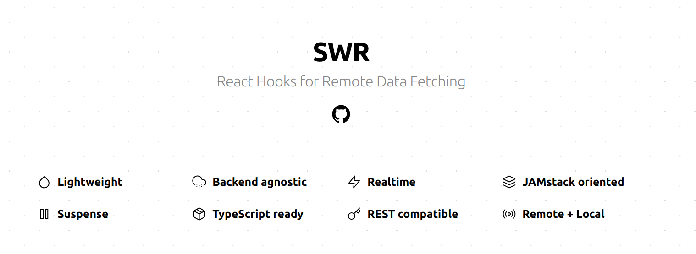
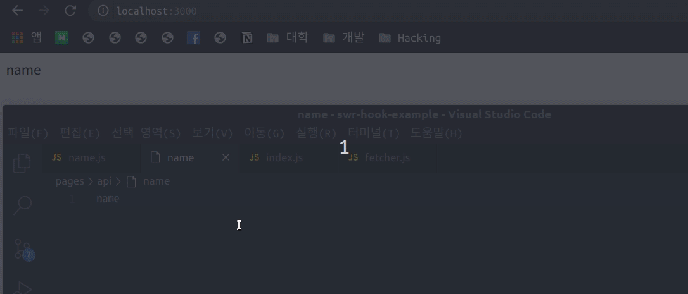
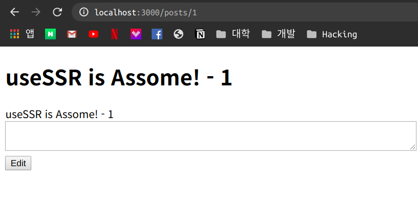
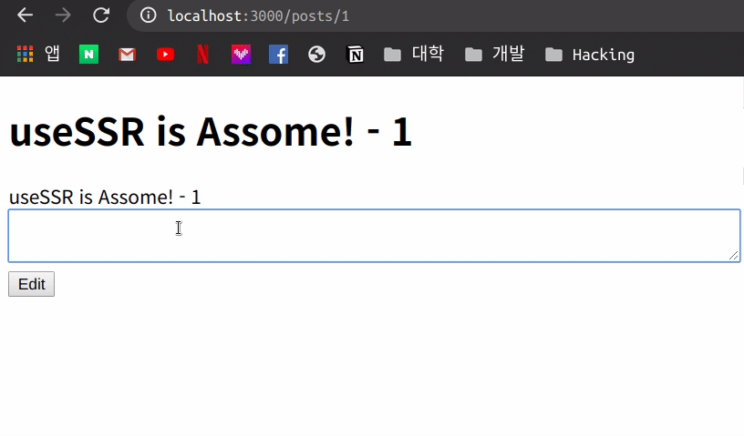
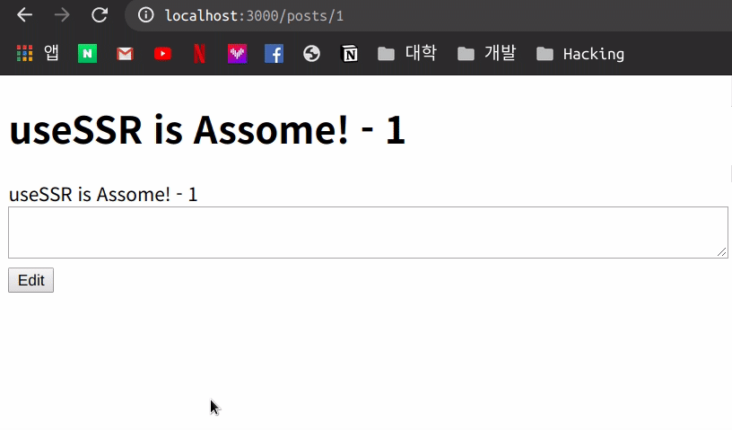
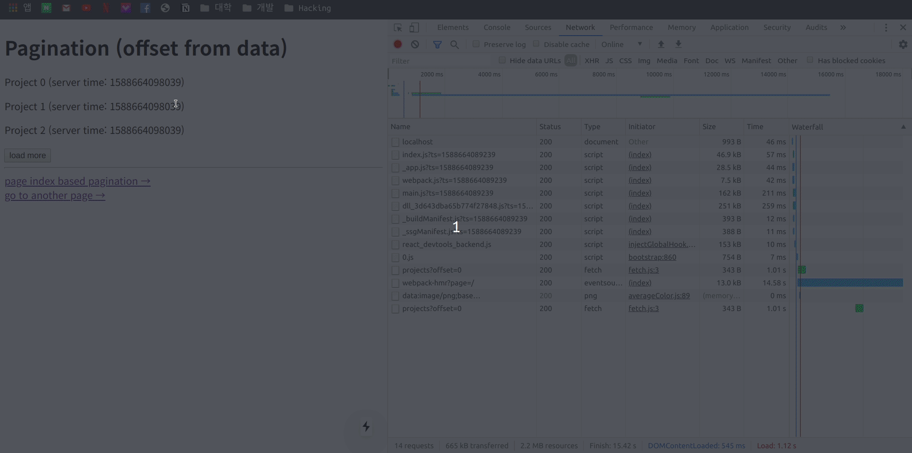
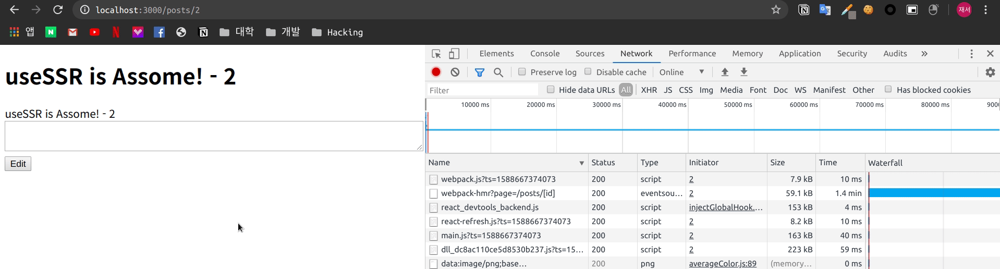
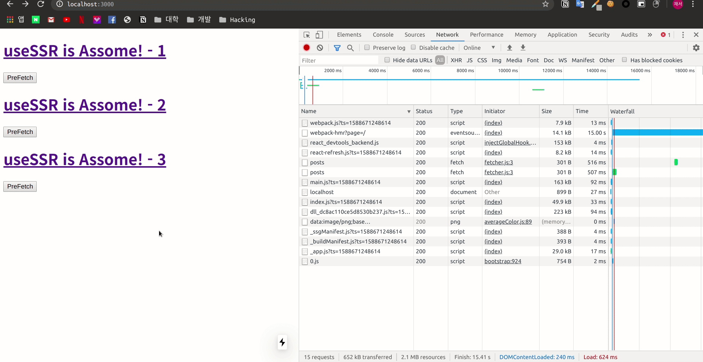

Next.js를 공부하다 Client 단에서 Data Fetch할 때 자주 사용 되는 `swr` 에 대해서 알게 되어 한번 정리를 해보았습니다.

⭐ **혹시 잘못 이해해서 잘못된 부분이 있다면 댓글로 알려주세요.!** ⭐



## useSWR 이란?

`SWR` 사이트에 대해 들어가 보면 아래의 내용으로 SWR에 대해서 설명을 하고 있습니다.

> SWR is a React Hooks library for remote data fetching.
>
> The name “ **SWR**” is derived from `stale-while-revalidate`, a HTTP cache invalidation strategy popularized by RFC 5861.
>
> **SWR** first returns the data from cache (stale), then sends the fetch request (revalidate), and finally comes with the up-to-date data again.

마지막 줄을 보면 맨처음 cache로 부터 받아온 데이터 즉 오래된 정보를 먼저 리턴을 해주고 그 다음 fetch를 한다음 마지막으로 업데이트된 데이터를 다시 리턴합니다.

이러한 로직을 통해 UX의 향상을 만들어 낼 수 있습니다.

이제 간단한 예제를 통해 `SWR`의 장점에 대해 알아 봅니다.

## Basic Data Loding

기본적으로 `SWR` 은 두가지의 인자가 필수로 사용됩니다. 첫번째 인자는 `key` 에 대한 항목으로 Fetcher에게 전달 되는 인자로 사용되는 것과 동시에 SWR 요청의 구분 인자로도 사용됩니다. 보통 URL와 같은 내용을 전달합니다.

두번째 인자는 Fetcher에 대한 항목 입니다.

Fetcher의 역할은 말 그대로 Data를 Fetch 하는 기능입니다. 보통 unfetch, axios 와 같은 함수를 통해 사용합니다.

기본적인 unfetch를 이용한 예제를 만들어 봅니다.

`lib/tools/fetcher.js`

```js
import fetch from "unfetch"

const fetcher = async (...args) => {
  const response = await fetch(...args)
  return response.json()
}

export default fetcher
```

`pages/index.js`

```js
import useSWR from "swr"
import fetcher from "../lib/tools/fetcher"

export default function Home() {
  const { data, error } = useSWR("/api/name", fetcher)
  if (error) {
    return <div>ERROR...</div>
  }

  if (!data) {
    return <div>isLoding...</div>
  }

  return <div>{data.name}</div>
}
```

`pages/api/name.js`

```js
import fs from "fs"
export default (req, res) => {
  const name = fs.readFileSync("./pages/api/name", "utf-8")
  setTimeout(() => {
    res.statusCode = 200
    res.json({ name: name })
  }, 500)
}
```

위와 같이 api에서는 파일을 읽어 0.5초 뒤에 응답을 해주도록 하였고 index에서는 api에게 호출하여 error가 발생시 error 표시를 하고 data가 없으면 loading 표시 응답이 오면 data.name를 보여주도록 하였습니다.

이제 여기서 next.js의 장점이 보이게 됩니다.



보이는 것과 같이 화면에 대해 포커싱을 하게 되면 자동으로 SWR이 data Fetch를 하여 데이터를 실시간으로 변화 시켜줍니다. 또한 오류가 발생하였을 시 Error에 대해 반환하여 예외 처리에 대해서도 처리가 가능합니다.

이 부분에 대해서는 [https://swr.now.sh/#focus-revalidation](https://swr.now.sh/#focus-revalidation) 여기서 설명을 해주고 있습니다.

> When you re-focus a page or switch between tabs, SWR automatically revalidates data.
>
> This can be useful to immediately synchronize to the latest state. This is helpful for refreshing data in scenarios like stale mobile tabs, or laptops that went to sleep.

이러한 기능들은 옵션을 통해 조절이 가능합니다.

## Local Mutation

이번에는 Mutate에 대해서 설명해보겠습니다.

말 그대로 Mutate는 데이터의 변화에 대해 설정이 가능합니다.

만약 댓글을 달거나 하였을 때 데이터를 한번더 fetch해서 가져오는 것 보다 기존의 데이터를 Mutate 시켜 미리 렌더링을 하고 추후에 fetch를 하여 다시 한번 더 변경하는 것이 가능해집니다.

간단하게 로컬의 파일을 읽어 전달하는 API를 만들어서 테스트를 해봅니다.

`pages/api/posts/[id].js`

```jsx
import fs from "fs"

export default (req, res) => {
  setTimeout(() => {
    try {
      const post = fs.readFileSync(`posts/${req.query.id}.json`, "utf-8")
      res.status(200).json(JSON.parse(post))
    } catch (error) {
      res.status(404).end()
    }
  }, 500)
}
```

`pages/api/posts.js`

```jsx
import fs from "fs"

export default (req, res) => {
  setTimeout(() => {
    const dir = fs.readdirSync(`./posts/`)
    const list = dir.map((fileName) => {
      const id = fileName.replace(/\.json$/, "")
      const data = fs.readFileSync(`./posts/${fileName}`, "utf-8")
      const { title } = JSON.parse(data)
      return {
        id,
        title: title,
      }
    })
    console.log(list)
    res.status(200).json(list)
  }, 500)
}
```

`pages/index.js`

```jsx
import useSWR from "swr"
import Link from "next/link"
import fetcher from "../lib/tools/fetcher"
const URL = "/api/posts"

export default function Home() {
  const { data, error } = useSWR(URL, fetcher)
  if (error) {
    return <div>ERROR...</div>
  }

  if (!data) {
    return <div>isLoding...</div>
  }
  return (
    <div>
      {data.map((element) => (
        <Link href="/posts/[id]" as={`/posts/${element.id}`}>
          <a>
            <h1>{element.title}</h1>
          </a>
        </Link>
      ))}
    </div>
  )
}
```

`pages/posts/[id].js`

```jsx
import fetch from "isomorphic-unfetch"
import useSWR from "swr"
import fetcher from "../../lib/tools/fetcher"
import Error from "next/error"
import { useRouter } from "next/router"
import fs from "fs"

const URL = "/api/posts"

const posts_id = ({ errorCode }) => {
  if (errorCode) {
    return <Error statusCode={errorCode} />
  }

  const router = useRouter()
  const {
    query: { id },
  } = router
  const { data: article, mutate: articleMutate } = useSWR(
    id ? `${URL}/${id}` : null,
    fetcher,
    {
      refreshInterval: 0,
      revalidateOnFocus: false,
      revalidateOnReconnect: false,
    }
  )

  const editPost = async () => {
    fetch(`${URL}/${id}`, {
      method: "PUT",
      body: JSON.stringify({
        ...article,
        body: editTextArea.value,
      }),
      headers: {
        "Content-type": "application/json; charset=UTF-8",
      },
    })
    articleMutate({ ...article, body: editTextArea.value }, true)
  }

  if (!article) {
    return <h1>isLoding.....</h1>
  }

  return (
    <div>
      <h1>{article.title}</h1>
      <span>{article.body}</span>
      <div>
        <textarea id="editTextArea" style={{ width: "100%" }} />
        <button onClick={editPost}>Edit</button>
      </div>
    </div>
  )
}

export async function getServerSideProps(context) {
  const {
    query: { id: reqId },
  } = context
  const dir = fs.readdirSync(`./posts/`)
  const paths = dir.map((fileName) => {
    const id = fileName.replace(/\.json$/, "")
    return id
  })
  const isPath = paths.find((element) => element === reqId)
  if (!isPath) {
    return {
      props: {
        errorCode: 404,
      },
    }
  }
  return {
    props: {},
  }
}

export default posts_id
```



1번 Post에 대해 들어가 보면 이러한 내용으로 되어 있는 것을 확인 할 수 있습니다.

이제 아무 내용이나 작성을 하고 Edit를 누르게 되면 아래처럼 작동을 하는 것을 볼 수 있습니다.



일시적으로 내용이 변하고 다시 원래 상태로 돌아 오는 모습을 볼 수 있는데 이러한 이유는 아직 수정하는 작업에 대해 API에서는 처리를 안하기 때문에 `mutate` 를 통해 data를 설정한 값으로 변화되었다가 다시 Fetch한 값으로 돌아 오는 것을 알 수 있습니다.

이번에는 mutate의 인자를 true에서 false로 수정하여 사용해봅니다.

`articleMutate({ ...article, body: editTextArea.value }, false);`



이번에는 위와 같이 기존의 Data가 변화된 후 다시 Fetch 작업을 하지 않아 기존 data가 유지 되는 모습을 볼 수 있습니다.

`Mutate` 를 통해 데이터가 변화에 대해 유동적으로 표현이 가능 합니다.

## Refetch on Interval

이번에는 `refreshInterval` 에 대해서 알아 보겠습니다. 기본적으로 아래의 설명과 같이 기본적으로 비활성화 되어 있습니다. 이번에는 활성화해서 사용을 해보겠습니다.

> `refreshInterval = 0`: polling interval (disabled by default)

API을 수정해서 `PUT` 에 대해서 작업을 하도록 수정했습니다.

`pages/api/posts/[id].js`

```jsx
import fs from "fs"

export default (req, res) => {
  if (req.method === "GET") {
    setTimeout(() => {
      try {
        const post = fs.readFileSync(`posts/${req.query.id}.json`, "utf-8")
        res.status(200).json(JSON.parse(post))
      } catch (error) {
        res.status(404).end()
      }
    }, 500)
  }
  if (req.method === "PUT") {
    setTimeout(() => {
      try {
        fs.writeFileSync(`posts/${req.query.id}.json`, JSON.stringify(req.body))
        res.status(200).end()
      } catch (error) {
        res.status(404).end()
      }
    }, 500)
  }
}
```

`pages/posts/[id].js` 파일의 useSWR의 옵션을 수정하였습니다.

```jsx
const { data: article, mutate: articleMutate } = useSWR(
  id ? `${URL}/${id}` : null,
  fetcher,
  {
    refreshInterval: 1000,
    revalidateOnFocus: false,
    revalidateOnReconnect: false,
  }
)
```

이제 같은 페이지에 대해 화면을 띄어 두고


변화를 확인 합니다.

실제로 설정한 간격만큼 다시 Fetch를 하여 데이터를 새로 변경하는 것을 볼 수 있습니다.

## Scroll Position Recovery and Pagination

useSWR은 Pagination에 대해 스크롤 위치와 인덱스를 유지 시켜 주는 기능을 제공 하고 있습니다.

[https://github.com/zeit/swr/tree/master/examples/pagination](https://github.com/zeit/swr/tree/master/examples/pagination)

`swr` 에서 기본 제공하는 예시를 사용하였습니다.

`pages/api/projects.js` 파일을 보게 되면 아래의 내용으로 되어 있습니다.

```jsx
// an endpoint for getting projects data
export default (req, res) => {
  const offset = parseInt(req.query.offset || 0)

  if (offset >= 9) return setTimeout(() => res.json([]), 1000)

  const data = Array(3)
    .fill(0)
    .map((_, i) => {
      return {
        name: "Project " + (i + offset) + ` (server time: ${Date.now()})`,
        id: i + offset,
      }
    })

  setTimeout(() => res.json(data), 1000)
}
```

Query로 부터 offset를 받아오고 만약 존재 하지 않는다면 0으로 처리하는 것을 볼 수 있습니다.

또한 9보다 넘어가게 되면 빈 배열만 전달 하는 것을 볼 수 있습니다.

그리고 간단하게 서버의 시간과 넘어온 offset으로 부터 1씩 상승한 데이터를 넘겨주는 것도 보이게 됩니다.

이제 가장 중요한 Pagination에 대해 확인 해봅니다.

`pages/index.js`

```jsx
import fetch from "../libs/fetch"
import Link from "next/link"

import useSWR, { useSWRPages } from "swr"

export default () => {
  const { pages, isLoadingMore, isReachingEnd, loadMore } = useSWRPages(
    // page key
    "demo-page",

    // page component
    ({ offset, withSWR }) => {
      const { data: projects } = withSWR(
        // use the wrapper to wrap the *pagination API SWR*
        useSWR("/api/projects?offset=" + (offset || 0), fetch)
      )
      // you can still use other SWRs outside

      if (!projects) {
        return <p>loading</p>
      }

      return projects.map((project) => <p key={project.id}>{project.name}</p>)
    },

    // one page's SWR => offset of next page
    ({ data: projects }) => {
      return projects && projects.length
        ? projects[projects.length - 1].id + 1
        : null
    },

    // deps of the page component
    []
  )

  return (
    <div>
      <h1>Pagination (offset from data)</h1>
      {pages}
      <button onClick={loadMore} disabled={isReachingEnd || isLoadingMore}>
        {isLoadingMore ? ". . ." : isReachingEnd ? "no more data" : "load more"}
      </button>
      <hr />
      <Link href="/page-index">
        <a>page index based pagination →</a>
      </Link>
      <br />
      <Link href="/about">
        <a>go to another page →</a>
      </Link>
    </div>
  )
}
```

코드를 보게 되면 위와 같이 사용 하는 것을 볼 수 있는데 일단 `useSWRPages` 라는 함수를 추가로 Import 하여 사용 하고 있는 모습을 볼 수 있습니다.

그리고 Return 되는 항목에 대해 보면 아래의 내용으로 정리가 됩니다.

> pages: Component => Fetch된 데이터를 바탕으로 완성된 Component
>
> isLoadingMore: Boolean => 다음 데이터에 대해 Loading를 진행 여부에 대해 알려 주는 Boolean Type 변수
>
> isReachingEnd: Boolean => 더 받아 올 수 있는 데이터가 있는지에 대해 알려 주는 Boolean Type 변수
>
> loadMore: Function => 그 다음 Data를 Fetch 시키는 함수

이제 이러한 Return 값을 가지고 Page를 구성하고 버튼에 대해 이벤트 처리가 가능합니다.

이제 `useSWRPages` 함수의 인자에 대해 알아 보겠습니다.

첫 번째 항목은 `page key` 키에 대한 항목으로 기존 useSWR과 같이 SWR 요청에 대해 구분하는 용도로 사용됩니다.

두 번째 항목은 `page component` 에 관한 항목으로 Fetch된 데이터를 가지고 Component를 완성 하여 Return 시켜야 합니다.

Compent를 구성하기 위해 2 가지의 인자를 전달 하는데 `({ offset, withSWR })` 첫 번째 `offset` 은 요청을 해야하는 offset를 전달 합니다. 그 다음 `withSWR` 은 `useSWR` 을 wrap 시켜서 이전 offset의 데이터와 합쳐 Return 시키는 역할을 합니다. **아래의 형태로 `useSWR` 을 `withSWR` 으로 감싸는 형태가 되어야 합니다.**

```js
const { data: projects } = withSWR(
  // use the wrapper to wrap the *pagination API SWR*
  useSWR("/api/projects?offset=" + (offset || 0), fetch)
)
// you can still use other SWRs outside
```

이제 넘어온 Data를 가지고 Component를 완성 시켜 Return 하면 됩니다.

세 번째 항목은 `offset` 에 대해 정의 하는 항목으로 전달 받은 data을 가지고 다음 Fetch때에 사용 되어야 하는 Offset에 대해 Return 시키면 됩니다.

마지막 네 번째 항목은 `deps of the page component` 으로 `dependency` 항목으로 들어간 값이 변화하게 되면 page Component에 대해 Rerendering을 진행하게 됩니다. `useEffect` 의 `dependency` 항목하고 동일하게 사용되는 것 같습니다.

이제 다른 페이지로 이동을 한 다음 다시 Pagination 로 돌아오게 되면 어떤 형태로 작동하는지 개발자 도구의 Network 항목을 관찰하면서 확인 합니다.



네트워크를 관찰 하여 보니 다른 페이지 이동 후 다시 기존 페이지로 돌아오게 되면 이전 stale 상태의 Data을 이용 하여 렌더링을 한 후 Page Fetch 차례대로 offset까지 진행하여 업데이트 하는 모습을 볼 수 있습니다.

## Suspense

`useSWR` 은 React Suspense에 대해서도 지원을 합니다.

기본적으로 Suspense는 false로 되어 있지만 옵션을 활성화 시켜 사용을 하면 아래와 같이 사용이 가능합니다.

```jsx
import fetch from "isomorphic-unfetch"
import useSWR from "swr"
import fetcher from "../../lib/tools/fetcher"
import Error from "next/error"
import { useRouter } from "next/router"
import { Suspense } from "react"
import fs from "fs"

const URL = "/api/posts"

const Posts_id = ({ errorCode }) => {
  if (errorCode) {
    return <Error statusCode={errorCode} />
  }

  const router = useRouter()
  const {
    query: { id },
  } = router
  const { data: article, mutate: articleMutate } = useSWR(
    `${URL}/${id}`,
    fetcher,
    {
      suspense: true,
    }
  )

  const editPost = async () => {
    fetch(`${URL}/${id}`, {
      method: "PUT",
      body: JSON.stringify({
        ...article,
        body: editTextArea.value,
      }),
      headers: {
        "Content-type": "application/json; charset=UTF-8",
      },
    })
    articleMutate({ ...article, body: editTextArea.value }, false)
  }

  // if (!article) {
  //   return <h1>isLoding.....</h1>;
  // }

  return (
    <div>
      <h1>{article.title}</h1>
      <span>{article.body}</span>
      <div>
        <textarea id="editTextArea" style={{ width: "100%" }} />
        <button onClick={editPost}>Edit</button>
      </div>
    </div>
  )
}

const test = () => {
  return (
    <>
      <Suspense fallback={<div>suspenseLoding...</div>}>
        <Posts_id />
      </Suspense>
    </>
  )
}

export async function getServerSideProps(context) {
  const {
    query: { id: reqId },
  } = context
  const dir = fs.readdirSync(`./posts/`)
  const paths = dir.map((fileName) => {
    const id = fileName.replace(/\.json$/, "")
    return id
  })
  const isPath = paths.find((element) => element === reqId)
  if (!isPath) {
    return {
      props: {
        errorCode: 404,
      },
    }
  }
  return {
    props: {},
  }
}

export default test
```

## SSR with Next.js

`SWR` 은 Next.js를 이용한 SSR도 지원을 합니다.

`initialData` 옵션을 이용하여 데이터를 전달 하면 Fetch를 진행하기 전 `initialData` 로 전달된 값을 먼저 Return 하여 SSR이 가능해지도록 합니다.

```jsx
import fetch from "isomorphic-unfetch"
import useSWR from "swr"
import fetcher from "../../lib/tools/fetcher"
import Error from "next/error"
import { useRouter } from "next/router"
import fs from "fs"

const URL = "/api/posts"

const posts_id = ({ errorCode, post: initalPostData }) => {
  if (errorCode) {
    return <Error statusCode={errorCode} />
  }

  const router = useRouter()
  const {
    query: { id },
  } = router
  const { data: article, mutate: articleMutate } = useSWR(
    id ? `${URL}/${id}` : null,
    fetcher,
    {
      refreshInterval: 0,
      revalidateOnFocus: false,
      revalidateOnReconnect: false,
      initialData: JSON.parse(initalPostData),
    }
  )

  const editPost = async () => {
    fetch(`${URL}/${id}`, {
      method: "PUT",
      body: JSON.stringify({
        ...article,
        body: editTextArea.value,
      }),
      headers: {
        "Content-type": "application/json; charset=UTF-8",
      },
    })
    articleMutate({ ...article, body: editTextArea.value }, false)
  }

  if (!article) {
    return <h1>isLoding.....</h1>
  }

  return (
    <div>
      <h1>{article.title}</h1>
      <span>{article.body}</span>
      <div>
        <textarea id="editTextArea" style={{ width: "100%" }} />
        <button onClick={editPost}>Edit</button>
      </div>
    </div>
  )
}

export async function getServerSideProps(context) {
  try {
    const {
      query: { id: reqId },
    } = context
    const dir = fs.readdirSync(`./posts/`)
    const paths = dir.map((fileName) => {
      const id = fileName.replace(/\.json$/, "")
      return id
    })
    const isPath = paths.find((element) => element === reqId)
    if (!isPath) {
      return {
        props: {
          errorCode: 404,
        },
      }
    }
    const post = fs.readFileSync(`posts/${reqId}.json`, "utf-8")
    return {
      props: {
        post,
      },
    }
  } catch (error) {
    return {
      props: {
        errorCode: 500,
      },
    }
  }
}

export default posts_id
```



서버에서 Rendering을 진행하여 전달 하기 때문에 자바스크립트를 비활성화 하여도 내용은 유지 되는 모습을 볼 수 있습니다.

## Prefetching Data

`SWR` 은 초기 fetching 로딩을 없애기 위해 미리 Data를 Fetch 시켜 빠른 반응 속도로 응답이 가능하도록 할 수 있습니다.

기본적으로 적극 권장하는 방법은 아래의 방법이지만 실제로 테스트를 해보니 stale 데이터로 들어가는 것이 아니라 loding 화면이 빠르게 보이고 다시 렌더링 되는 모습이 보이게 되었습니다.

```jsx
<link rel="preload" href="/api/data" as="fetch" crossorigin="anonymous">
```

다른 방법으로는 mutate를 이용하여 미리 fetch 하는 방법입니다.

stale data가 저장되는 것은 key 값을 통해 구분되어 저장되기 때문에 아래의 방법으로 사용 시 stale data를 가지고 바로 로딩 후 refetching 하기 때문에 바로 로딩 되는 모습을 볼 수 있습니다.

```jsx
function prefetch() {
  mutate(
    "/api/data",
    fetch("/api/data").then((res) => res.json())
  )
  // the second parameter is a Promise
  // SWR will use the result when it resolves
}
```

한번 prefetch를 하였을 때와 하지 않았을 때의 차이를 비교해봅니다.

```jsx
import useSWR, { mutate } from "swr"
import Link from "next/link"
import Head from "next/head"
import fetcher from "../lib/tools/fetcher"
const URL = "/api/posts"

export default function Home() {
  const { data, error } = useSWR(URL, fetcher)

  if (error) {
    return <div>ERROR...</div>
  }

  if (!data) {
    return <div>isLoding...</div>
  }
  return (
    <div>
      {data.map((element) => (
        <>
          <Link href="/posts/[id]" as={`/posts/${element.id}`}>
            <a>
              <h1>{element.title}</h1>
            </a>
          </Link>

          <button
            onClick={() =>
              mutate(
                `/api/posts/${element.id}`,
                fetch(`/api/posts/${element.id}`).then((res) => res.json())
              )
            }
          >
            PreFetch
          </button>
        </>
      ))}
    </div>
  )
}
```



Fetch를 진행 하였을 때에는 stale data를 가져와 렌더링을 진행 하는 모습을 볼 수 있습니다.

## Trigger

`SWR` 에서 제공하는 Trigger 함수는 reFetch가 필요한 data에 대해 trigger를 이용하여 refetch 가 가능합니다.

```js
trigger(_key, (shouldRevalidate = true))
```

위와 같은 형태로 trigger에 key를 전달하여 refetch 할 수 있습니다.

```jsx
const editPost = async () => {
  fetch(`${URL}/${id}`, {
    method: "PUT",
    body: JSON.stringify({
      ...article,
      body: editTextArea.value,
    }),
    headers: {
      "Content-type": "application/json; charset=UTF-8",
    },
  })
  trigger(`${URL}/${id}`)
  // articleMutate({ ...article, body: editTextArea.value }, false);
}
```

## Global Configuration

`SWR` 의 옵션 항목의 Default 값을 지정할 수 있습니다.

```jsx
import useSWR, { SWRConfig } from "swr"

function Dashboard() {
  const { data: events } = useSWR("/api/events")
  const { data: projects } = useSWR("/api/projects")
  const { data: user } = useSWR("/api/user", { refreshInterval: 0 }) // don't refresh
  // ...
}

function App() {
  return (
    <SWRConfig
      value={{
        refreshInterval: 3000,
        fetcher: (...args) => fetch(...args).then((res) => res.json()),
      }}
    >
      <Dashboard />
    </SWRConfig>
  )
}
```

위와 같은 형태로 미리 값을 지정하게 되면 하위 컴포넌트의 `useSWR` 은 option에 대해 Default값을 가지게 됩니다.

---

제가 설명을 잘못한 부분과 이해가 안되는 부분은 댓글로 알려 주시거나 [공식 예제](https://github.com/zeit/swr) 를 참고 해주세요!

---

뭔가 `useSWR` 에 대해 찾아보고 공부하면서 정리를 해보았는데 staleData를 사용하여 redering를 한다는 점이 독특하였고 이러한 기능들을 기존 사이트를 사용하면서 당연하다고 느꼈던 것이지만 다양한 방법을 통해 구현한 기능이라는 것을 알 게 되었다!
