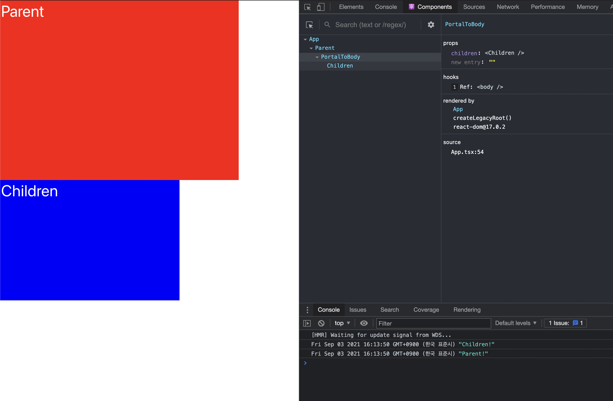
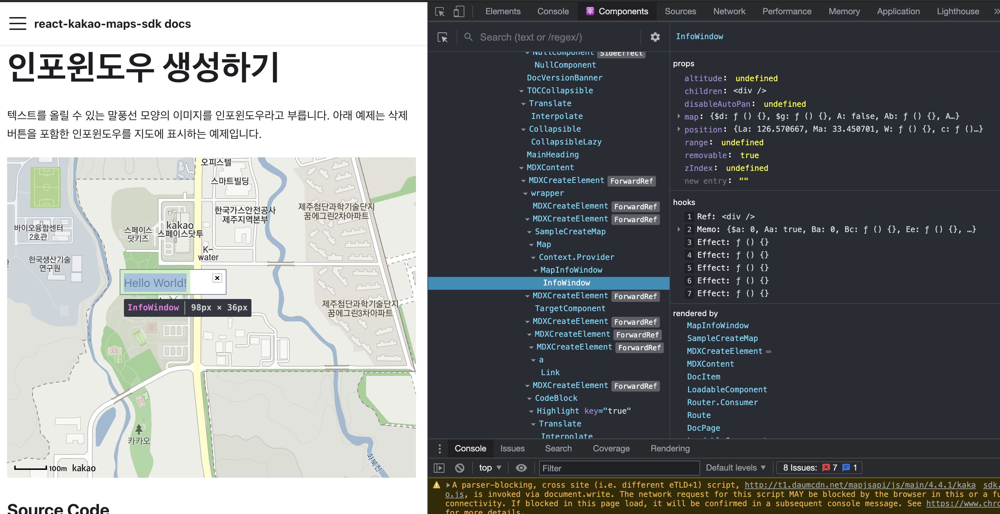
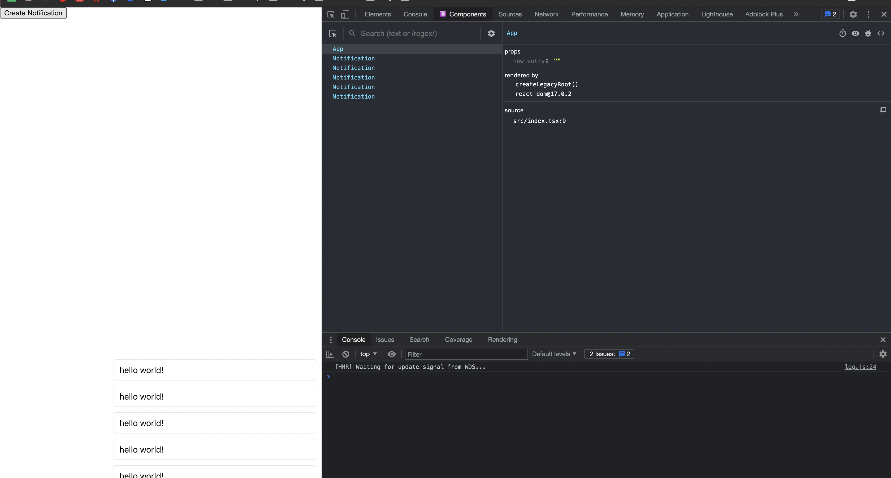

최근 **Kakao Map Api**를 **React Component 라이브러리**로 개발을 진행하며 자주 사용하게 된 **ReactDom**의 **Portal** 기능에 대해서 공부를 하면서 **Render**와 **어떠한 차이점**이 있는지 그리고 **활용방안에 대해서 정리** 해보았습니다!

# Portal 이란?

**ReactDom의 Portal 기능**은 **부모 컴포넌트의 DOM 계층 구조 바깥에 있는 DOM 노드로 자식을 렌더링** 하는 기능을 제공합니다.

즉 외부에 존재하는 **DOM 노드**가 **React App DOM 계층 안에 존재하는 것처럼 연결**을 해주는 **포탈 기능**을 제공합니다.

이렇게 `createPortal()`로 연결된 경우에도 **컴포넌트 생명주기(Component LifeCycle)** 와 **합성 이벤트(SyntheticEvent)** 이 적용이 됩니다.

아래와 같이 예시를 작성하고 `Children` 에 해당하는 컴포넌트에 `onClick` 이벤트를 발생시 **이벤트 버블링** 이 적용이 되어 `Parent` 에 대한 `onClick` 이벤트가 발생하는 것을 볼 수 있습니다.

```tsx
import React, { useRef } from "react"
import ReactDom from "react-dom"

const PortalToBody: React.FC = ({ children }) => {
  const container = useRef(document.body)
  return ReactDom.createPortal(children, container.current)
}

const Parent: React.FC = ({ children }) => {
  const handleClick = () => console.log("Parent!")

  return (
    <div
      style={{
        width: "480px",
        height: "360px",
        border: "2px solid red",
        backgroundColor: "red",
        color: "white",
        fontSize: "2rem",
      }}
      onClick={handleClick}
    >
      Parent
      {children}
    </div>
  )
}

const Children: React.FC = () => {
  const handleClick = () => console.log("Children!")

  return (
    <div
      style={{
        width: "360px",
        height: "240px",
        border: "2px solid blue",
        backgroundColor: "blue",
        color: "white",
        fontSize: "2rem",
      }}
      onClick={handleClick}
    >
      Children
    </div>
  )
}

const App = () => {
  return (
    <div className="App">
      <Parent>
        <PortalToBody>
          <Children />
        </PortalToBody>
      </Parent>
    </div>
  )
}

export default App
```



실제로 `Children` 에 대한 컴포넌트는 실제 Dom 위치는 `body` 안에 있지만 React의 Component Tree 상에서는 App 하위에 존재하는 것을 React Development Tool를 통해 확인 할 수 있습니다.

또한 해당 `Children` 의 클릭 이벤트 발생을 시키면 이벤트 버블링이 발생하여 `Parent` 의 이벤트 까지 발생 하는 것을 볼 수 있습니다.

### Portal의 활용 방안!

Portal은 **React 생명주기와 밀접한 연관**이 있기 때문에 **기존 Dom를 다루는 JavaScript 라이브러리**와 함께 사용을 할 때 유용하게 사용 하거나 **Modal**과 같은 기능을 구현 할 때 활용 할 수 있습니다.

`Kakao Map` 과 같이 특정 Dom에 렌더링을 시키거나 자체적으로 Dom를 관리 하는 경우 `Portal` 를 이용하여 해당 관리 함수를 React Component으로 랩핑하여 React의 **life cycle**과 함께 사용할 수 있습니다.

아래는 간단하게 `Kakao Map` 의 **InfoWindow 기능을 React 컴포넌트로 랩핑한 예시** 입니다.

```tsx
import React, { useEffect, useMemo, useRef } from "react"
import ReactDom from "react-dom"

interface InfoWindowProps {
  map: kakao.maps.Map | kakao.maps.Roadview
  position: kakao.maps.LatLng | kakao.maps.Viewpoint
  marker?: kakao.maps.Marker
  /**
   * 인포윈도우를 열 때 지도가 자동으로 패닝하지 않을지의 여부
   * @default false
   */
  disableAutoPan?: boolean

  /**
   * 인포윈도우 엘리먼트의 z-index 속성 값
   */
  zIndex?: number

  /**
   * 로드뷰에 올라있는 인포윈도우의 높이 값(m 단위)
   */
  altitude?: number

  /**
   * 로드뷰 상에서 인포윈도우의 가시반경(m 단위), 두 지점 사이의 거리가 지정한 값보다 멀어지면 인포윈도우는 보이지 않게 된다
   */
  range?: number

  /**
   * 인포윈도우 객체 생성후 해당 객체를 반환하는 함수
   */
  onInfoWindowCreated?: (infoWindow: kakao.maps.InfoWindow) => void
}

const InfoWindow: React.FC<InfoWindowProps> = ({
  map,
  position,
  marker,
  children,
  altitude,
  disableAutoPan,
  range,
  removable,
  zIndex,
  onInfoWindowCreated,
}) => {
  const container = useRef(document.createElement("div"))

  const infoWindow = useMemo(() => {
    const kakaoInfoWindow = new kakao.maps.InfoWindow({
      altitude: altitude,
      disableAutoPan: disableAutoPan,
      range: range,
      zIndex: zIndex,
      content: container.current,
      position: position,
    })
    if (onInfoWindowCreated) onInfoWindowCreated(kakaoInfoWindow)
    return kakaoInfoWindow
    // eslint-disable-next-line react-hooks/exhaustive-deps
  }, [])

  useEffect(() => {
    infoWindow.open(map, marker)
    return () => {
      infoWindow.close()
    }
    // eslint-disable-next-line react-hooks/exhaustive-deps
  }, [map, marker])

  useEffect(() => {
    if (!infoWindow) return
    infoWindow.setPosition(position)
  }, [infoWindow, position])

  useEffect(() => {
    if (!infoWindow || !altitude) return
    infoWindow.setAltitude(altitude)
  }, [infoWindow, altitude])

  useEffect(() => {
    if (!infoWindow || !range) return
    infoWindow.setRange(range)
  }, [infoWindow, range])

  useEffect(() => {
    if (!infoWindow || !zIndex) return
    infoWindow.setZIndex(zIndex)
  }, [infoWindow, zIndex])

  return ReactDom.createPortal(children, container.current)
}

export default InfoWindow
```

위 코드를 살펴 보면 `kakao.maps.InfoWindow` 객체를 `useRef` 를 통해 관리되는 `HTML Div Element` 를 Content로 설정하여 생성을 하고 해당 객체를 통해 useEffect를 이용하여 `props` 의 변화에 따른 해당 상태 변화를 전달 할 수 있습니다.

또한 **children** 를 content로 사용된 객체에 `ReactDom.createPortal` 를 통해 해당 **Dom** 에 렌더링이 되고 React의 컴포넌트로써 관리가 가능하게 됩니다.



# Render 이란?

```tsx
ReactDOM.render(element, container[, callback])
```

React 엘리먼트를 `container` DOM에 렌더링 하는 함수 입니다.

단순하게 보기에는 `createPortal()` 과 동일하게 보이지만 이 때 주요하게 확인 해야 하는 부분은 **새로운 React LifeCycle 생성** 한다는 점 입니다.

그말은 즉 `React Component` 내부에서 해당 함수를 동작 시켜도 별개의 라이프 사이클을 가지고 있기 때문에 함수를 호출 하는 것만으로 **react dom**를 렌더링이 가능합니다.

사실 일반적으로는 React application 최초 생성을 하기 위해서 사용하는 함수 이지만 **<u>함수를 통해 React Component를 생성 할 수 있다</u>** 라는 점을 이용하여 아래와 같이 활용이 가능합니다.

## Render의 활용 방안!

함수를 통해 React Component를 생성 할 수 있다 라는 점을 이용해서 Notification과 같은 기능을 구현이 가능합니다.

일반적으로 html상에서의 `Notification` 의 기능은 특정 위치에 일정 시간동안 안내 사항을 보여주는 기능이기 때문에 이 부분을 React의 LifeCycle에 종속되어서 함수를 통해 생성이 가능하도록 만든다고하면, 최상위에 `Context API` 를 통한 `Notification` 정보를 관리를 하고 가지고 있는 `Notification` 를 렌더링 하는 부분등 여러가지를 만들어서 사용을 해야하게 되는데, 이 때 발생하는 부분은 최상위에 `Notification Context, Render ` 를 관리하는 컴포넌트로 감싸야 하는 부분이 있기 때문에 Dom Tree의 변화로 인한 Effect 발생, 상태관리의 어려움등 여러가지 발생합니다.

이때 `ReactDOM.render()` 를 이용해서 `Notification` 를 만든다면 기존 React의 상태와 상관 없이 새롭게 생성이 가능이 가능합니다. 단 호출한 부모의 React LifeCycle과 별개로 동작을 하기 때문에 내부에서 외부의 `Context` 와 같은 부분은 접근은 불가능 합니다. 하지만 함수 같은 경우는 실행이 가능하기 때문에 호출단에서 해당 함수를 작성해서 인자로 전달하여 동작 시키도록 하면 정상적으로 동작을 할 수 있습니다.

그리고 해당 React가 Notification의 기능을 다하고 사라져야 하는 경우 `ReactDom.unmountComponentAtNode` 를 이용하여 해당 `Compnent` 를 직접 unMount 하여 제거가 가능합니다.

아래의 소스코드는 위에서 설명한 부분을 실제 코드로 구현한 부분 입니다.

```tsx
import React from "react"
import ReactDom from "react-dom"

let container: null | HTMLDivElement = null

const notification = (
  content: React.ReactNode | React.ReactNodeArray | string
) => {
  if (container === null) {
    container = document.createElement("div")
    container.style.display = "flex"
    container.style.flexDirection = "column-reverse"
    container.style.position = "fixed"
    container.style.bottom = "10px"
    container.style.right = "10px"
    document.body.appendChild(container)
  }

  const div = document.createElement("div")

  container.appendChild(div)

  const removeNotication = () => {
    ReactDom.unmountComponentAtNode(div)
    if (div?.parentNode) {
      div.parentNode.removeChild(div)
    }
  }

  ReactDom.render(<Notification>{content}</Notification>, div, () => {
    setTimeout(removeNotication, 1000)
  })

  return removeNotication
}

interface NotificationProps {}

const Notification: React.FC<NotificationProps> = ({ children }) => {
  return (
    <div
      style={{
        display: "flex",
        border: "1px solid #e6e6e6",
        backgroundColor: "#fff",
        borderRadius: "5px",
        padding: "10px",
        marginTop: "10px",
        minWidth: "360px",
        zIndex: 2,
      }}
    >
      {children}
    </div>
  )
}

const App = () => {
  return (
    <div className="App">
      <button
        onClick={() => {
          notification(<span>hello world!</span>)
        }}
      >
        Create Notification
      </button>
    </div>
  )
}

export default App
```



해당 `notification` 함수를 호출 시 위와 같이 React Component가 렌더링 되지만 최상위 `APP` 과 별개로 생성이 되는 것을 볼 수 있습니다.

# Portal vs Render

최종적으로 아래와 같이 표를 통해 차이점과 공통점에 대해서 표로 만들어 봤습니다.

|                 | Portal                                                                                 | Render                                                         |
| --------------- | -------------------------------------------------------------------------------------- | -------------------------------------------------------------- |
| 공통점          | 특정 dom으로 component를 렌더링                                                        | 특정 dom으로 component를 렌더링                                |
| 호출 위치       | React Render 내부                                                                      | 어디서든 상관 없이 함수로 호출 가능                            |
| LifeCycle       | 호출위치의 하위 컴포넌트로 관리됨                                                      | 새로운 최상위 component 으로 생성됨                            |
| unMount         | LifeCycle에 의해 자동으로 unMount 됨                                                   | 직접 `ReactDom.unmountComponentAtNode()` 함수를 사용 하여 관리 |
| event           | 실제 렌더링 위치는 다르지만 부모 component의 하위 dom처럼 동작함 (버블링, 캡쳐링 발생) | 최상위 compoent 로써 동작                                      |
| 일반적인 활용처 | 특정 Component를 부모 외부에 Rendering 하려고 할 때                                    | React App를 새롭게 생성 할 때                                  |
