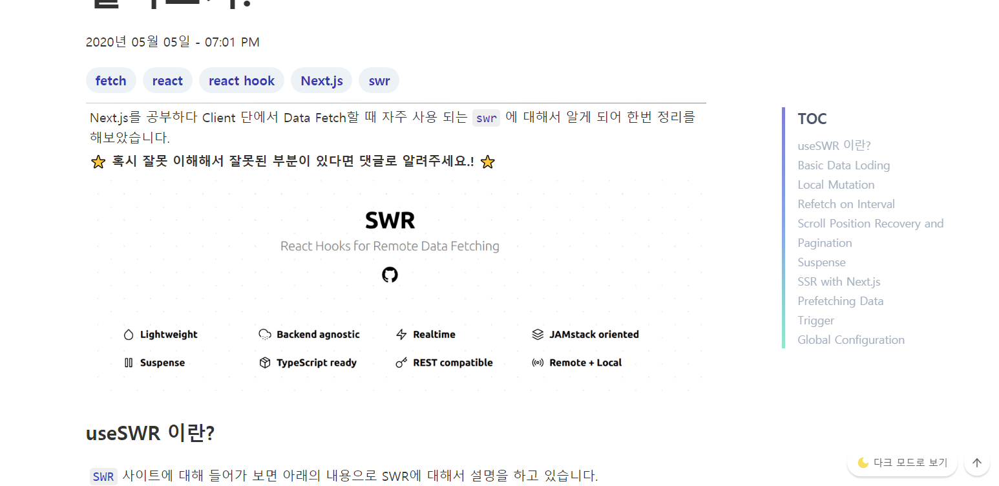

# intro

최근 블로그를 관리와 글 작성을 소홀히 하고 있는 내 모습을 어느 순간 발견하게 되었다.

42서울 본 과정도 코로나로 인하여 지연이 되고 나태해 지는 자신을 반성하고자 블로그를 다시 제대로 하기로 마음을 먹게 되었다.

블로그를 제대로 다시 하기 위하여 일단 기존 `Tistory` 블로그에 작성된 글을 읽어보니 틀린 내용과 어설프게 작성된 내용들이 너무 많이 보이고 그리고 무분별한 카테고리를 통해 엉망으로 되어 있는 모습을 보게 되었다.

이를 해결하기 위해 이전부터 계속 계획하고 있던 `Gatsby` 를 활용한 `gitblog`를 만드는 것을 도전 해봤다!

---

일단 블로그를 만들기 전에 레퍼런스가 될 여러가지 블로그를 찾아보았는데 Gatsby starter로 유명한 [JaeYeopHan/gatsby-starter-bee](https://github.com/JaeYeopHan/gatsby-starter-bee) 의 코드를 보면서 Gatsby plugin 설정 및 디자인에 대해 엄청 참고를 하였다. 그리고 그 다음으로 참고 했던 사이트 는 [velog.io](velog.io) 이다.

이 두가지 블로그를 보면서 각 블로그의 장점들을 따라가기 위하여 개발을 진행 했다.

일단 css 작업은 `twin.macro` 를 사용하여 `css in js(emotion)` 와 `tailwind` 이 두가지의 기능을 한번에 사용 가능한 라이브러리를 채택하였다.

그리고 이전 [your-portfolio.vercel.app](http://your-portfolio.vercel.app/) 를 개발하면서 만들어둔 컴포넌트를 가져와 많이 재 사용을 하였다.

---

# 첫 번째 고민 - TOC 기능

[velog.io](velog.io) 를 보다 보니 약1200px 이상일 때 화면 왼쪽에 Toc차트가 sticky하게 붙어 있는 모습을 보게 되었는데 이것을 보고 어떻게 구현 한거지? 라면서 검색을 통해 기능 구현 방법에 대해 찾아보았다.

그 결과 [`blueshw`님의 자동으로 생성되는 목차(TOC: Table of Contents) 만들기](https://blueshw.github.io/2020/05/30/table-of-contents/)을 찾게 되어서 기능을 구현하게 되었다.!

결과적으로 만들어진 `TOC` 모습이다!



나름대로 CSS 디자인도 해보고 그리고 소스코드를 보면서 분석을 하면서 즐겁게 코딩을 했었던 것 같다.

# 두 번째 고민 - 검색 기능

검색 기능을 추가해보고 싶어서 일단 Gatsby Plugin를 통하여 구현을 해보려고 시도를 해보았다!

처음 시도해본 Plugin은 `gatsby-plugin-local-search` 를 사용하게 되었다.

내부적으로 2가지 라이브러리중 하나를 선택하여 사용이 가능하게 만들어 져있었는데 문제는 한국어에 대해서 검색을 못하는 것이 였다.

이 `flexsearch` 같은 경우는 모든 단어에 대하여 slice 하여서 미리 Index를 만드는 작업을 진행하는 것 같았다.

**Ex** slice -> s, sl, sli, slic, slice 와 같이 모든 경우의 수에 대하여 index를 만들어두었는데 이때 한국어는 Unicode이기 때문에 숫자로 치환이 되는 문제가 발생하였다.

이문제를 해결하기 위해 flexsearch의 readme 파일을 읽어 보았는데 아래와 같은 옵션을 통해 해결이 가능하다고 적혀 있었지만 결과적으로 제대로 작동을 안하고 기존 영어조차 작동을 안하는 모습을 보았다

> ### CJK Word Break (Chinese, Japanese, Korean)
>
> Set a custom tokenizer which fits your needs, e.g.:
>
> ```js
> var index = FlexSearch.create({
>   encode: false,
>   tokenize: function (str) {
>     return str.replace(/[\x00-\x7F]/g, "").split("")
>   },
> })
> ```

좌절을 하고 실망을 하던 와중 인터넷에서 이 글을 발견을 하고 구현에 성공 하게 되었다.

[`yohanpro` 님의 Gatsby 블로그에 검색기능 구현하기](https://yohanpro.com/posts/gatsby-search)

StaticQuery를 이용하여 모든 Markdown 글들의 정보를 불러와 filter함수를 통하여 검색기능을 구현하는 방법이였다.

이때 나의 경우에는 화면에 태그 목록들도 같이 보여주고 있었기 때문에 처음 검색을 통해 나온 결과물에서 태그 목록을 추출하고 그 이후 태그 버튼이 눌렸을 경우에 한번더 태그를 통하여 필터를 하는 방법을 사용하였다.

현재 추후에 글 양이 많아지게 되면 속도에서 많이 느려질 것 같은 부담이 있어서 본문 전체의 내용을 검색 범위로 지정을 하지 않고 제목, 태그 목록, 간략화된 본문을 검색 색인 범위로 지정하였다.


위와 같은 모습의 결과물을 만들어 낼 수 있게 되었다.

# 세 번째 고민 - 카테고리 기능

처음 구상을 하였을 때 [JaeYeopHan/gatsby-starter-bee](https://github.com/JaeYeopHan/gatsby-starter-bee) 를 따라서 만들게 되는 경향이 있었는데 기존 Tistory블로그에 있는 글을 이전하기 위하여 태그기능을 추가하고 개발을 완료하고 기존글들을 적용 해보니 Tag의 양이 많아서 찾기가 힘들어지는 모습을 보고 카테고리를 추가해야 하겠다는 생각을 가지게 되었다.

일단 Category를 구분 하기 위한 방법을 여러가지 생각을 해보았는데 추가적으로 Markdown의 Frontmatter에 카테고리를 추가하는 것이 아닌 폴더를 통하여 구분을 하자고 생각을 하게 되었고 이를 어떻게 구현을 하지 고민을 하게 되었다.

결과적으로 떠오르게 된 방법은 gatsby의 createPage 기능을 통하여 만들게 되었다.

일단 템플릿 페이지를 만들기 위하여 아래와 같은 쿼리와 Createpage 함수를 작성하게 되었다.

```javascript
return graphql(
    `
      {
        categories: allDirectory(
          filter: { absolutePath: { regex: "/^((?!image).)*$/" } }
        ) {
          nodes {
            relativePath
          }
          totalCount
        }
      }
    `
  ).then((result) => {
    if (result.errors) {
      throw result.errors
    }

    const categories = result.data.categories.nodes

    categories.forEach((category) => {
      if (category.relativePath !== "") {
        console.log(`${__dirname}` + `/category/${category.relativePath}/`)
        createPage({
          // path: `/category/${category.relativePath}/`,
          path: `/${category.relativePath}/`,
          component: categoryTemplate,
          context: {
            categoryRegex: `/^(${__dirname}\/content\/posts\/)(${category.relativePath}\/)([^\/]*\.md$)/`,
          },
        })
      }
    })
  })
}
```

정규식을 사용하여 `/^((?!image).)*$/` 경로에 image가 포함되어 있지 않은 경로들을 확인 한 후 그 결과가 "" 가 아닌 경우를 찾아서 그 결과값을 Template를 통하여 Page를 생성하게 되었다.

이때 context로 `categoryRegex` 라는 정규식을 전달해주었는데 이것을 템플릿 페이지가 받아 그 경로에 포함된 글들을 나열 할 수 있도록 하였다.

```js
export const pageQuery = graphql`
  query ($categoryRegex: String) {
    site {
      siteMetadata {
        configs {
          countOfInitialPost
        }
      }
    }
    allMarkdownRemark(
      sort: { fields: [frontmatter___date], order: DESC }
      filter: {
        fileAbsolutePath: { regex: $categoryRegex }
        frontmatter: { draft: { eq: false } }
      }
    ) {
      edges {
        node {
          excerpt(pruneLength: 200, truncate: true)
          fields {
            slug
          }
          frontmatter {
            date(formatString: "YYYY년 MM월 DD일 - hh:mm A")
            title
            tags
          }
        }
      }
    }
  }
`
```

그리고 이렇게 만들어진 카테고리 페이지로 이동하기 위한 링크들을 만들었다.

1280px가 넘는 화면에서는 TOC와 동일하게 Sticky하게 만들어두었고 그보다 화면 해상도가 작다면 list형태로 보이도록 하였다.

# 네 번째 고민 - Tistory 글 Markdown으로 백업하기

이전 작업을 위하여 기존에 Tistory에 작성된 글들을 Markdown형태로 저장을 했어야 하는 문제가 있었다. 이걸 해결 하기 위하여 Tistory에서 제공하는 Open API를 이용하여 백업 프로그램을 개발하기 시작하였다.

일단 언어는 `Golang`을 선택하였다. `GoRoutine`을 통하여 간단하게 병렬 작업이 가능하다는 점이 무척 이나 마음에 들어서 선정하였다.

https://github.com/JaeSeoKim/tistory-to-md

위처럼 완성을 하였는데 만들면서 가장 힘들었던 부분이 IMG 부분에 대해 Parsing하고 Img를 다운로드 하는 작업 이였다.

API를 통해 Blog 컨텐츠를 받았을 때 img에 대한 부분이 다양하게 받아지게 되어서 그 부분을 인지할 수 있는 정규식을 만들고 예외 처리 하는 작업이 어려웠다.

결과적으로 실력이 부족하여 아래와 같은 이상한 정규식을 만들어서 필터링을 하는 것을 성공하였다

```js
`(\[##\_Image)(\|[\w@\/.]*)(\|\w*)(\|)([\w-=" \.]*)(\|_##])`
# 2가지의 형태의 이미지 데이터가 들어왔다.
`(<div\s*class="imageblock\s*dual" ([\w\s="-:;]*>))(<table([\w\s="-:;]*)>)(<tr([\w\s="-:;]*)>)(<td>)())(<p([\w\s="-:;]*>))([\w\s="-:;]*)(<\/p>)(<\/td>)(<td>)(<a([\w\s="-:;ㄱ-ㅎ|ㅏ-ㅣ|가-힣]*>))())(([\w\s="-:;]*)<\/a>)(<\/td>)(<\/tr>)(<\/table>(<\/div>))`
```

만들면서 어떻게 사용자가 토큰을 쉽게 받을 수 있을까 생각을 하면서 간단한 로컬 웹서버를 만들고 Callback URL로 로컬 서버를 가리키게 하여서 토큰을 쉽게 알 수 있도록 하였다.

```html
<!DOCTYPE html>
<html lang="ko">
  <head>
    <meta charset="UTF-8" />
    <meta name="viewport" content="width=device-width, initial-scale=1.0" />
    <title>Tistory-to-md</title>
  </head>
  <body>
    <h1>access_token</h1>
    <p>아래의 access_token를 복사해주세요.</p>
    <textarea style="width: 600px; height: 200px" id="token"></textarea>
    <script>
      var tokenBody = document.getElementById("token")
      var hash = window.location.hash.substring(1)
      var params = {}
      hash.split("&").map((hk) => {
        let temp = hk.split("=")
        params[temp[0]] = temp[1]
      })
      tokenBody.innerText = params.access_token
    </script>
  </body>
</html>
```

---

이렇게 만들면서 Google의 Litehouse 기능을 사용하면서 어떤 점이 부족한지 계속 체크를 하면서 100점을 만들도록 노력을 해보았다.


그 결과 세세하게 수정을 하자 100, 100, 100, 100으로 완성을 시켰다.

아직 코드가 더러운 부분도 있고 아직 불편한 부분들도 많아서 아직 개선을 해야 하는 곳도 많지만 이제 사용이 가능할 정도로 완성을 했다는 점이 뿌듯해져서 한번 개발 후기를 작성해보았다.

나중에 한번 기회가 된다면 이 블로그를 gatsby-starter로 만들어 보고 싶다.
