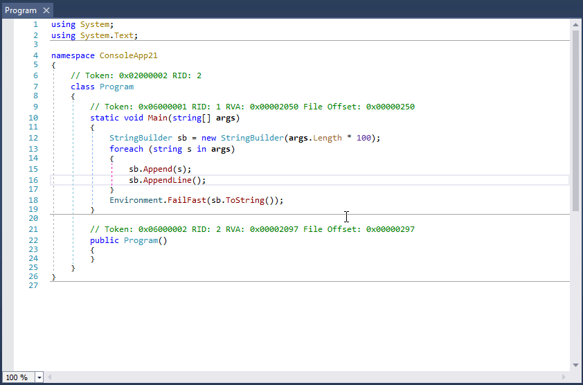
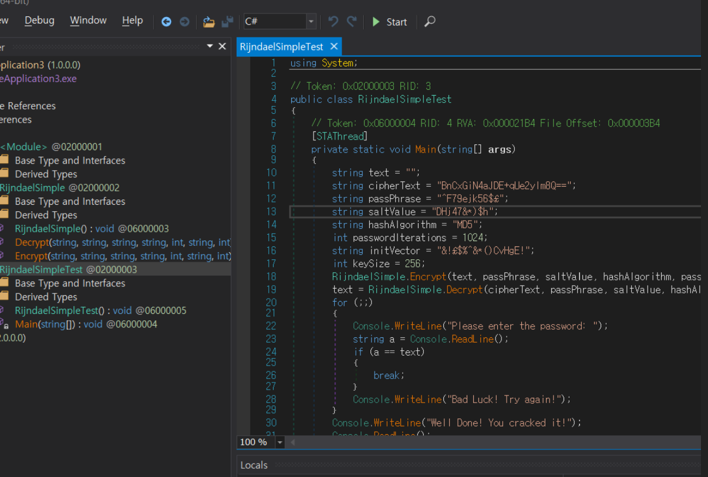
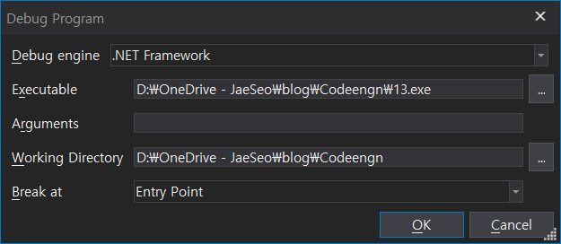
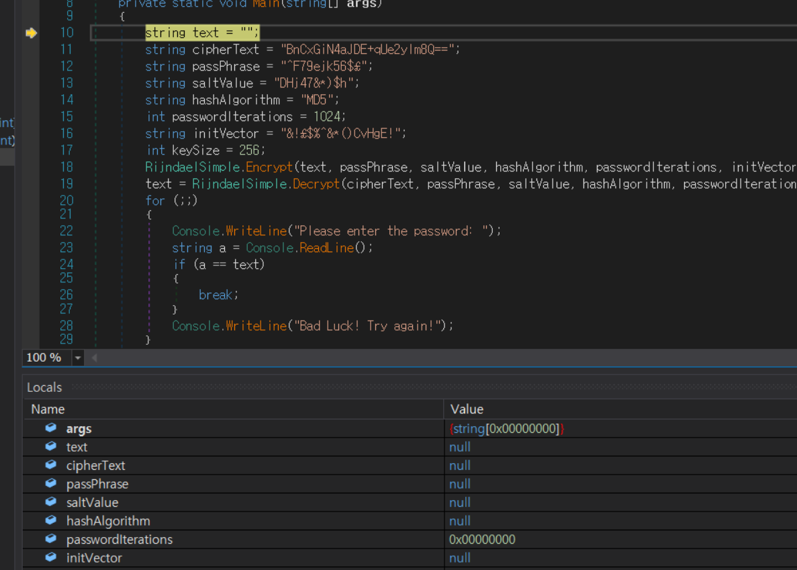
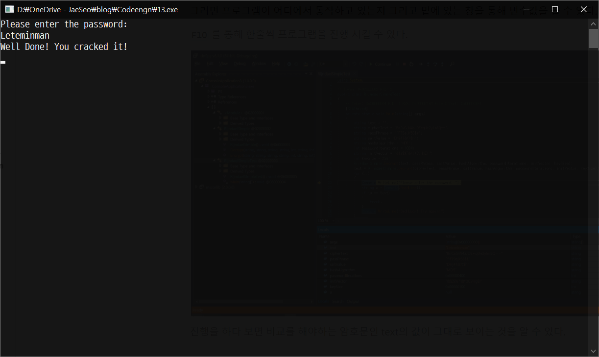

## dnspy란?

[dnspy - github 주소](https://github.com/0xd4d/dnSpy)

- Debug .NET and Unity assemblies

- Edit .NET and Unity assemblies
  

## dnspy 설치 방법

github에서 직접 소스를 다운받아 build를 하여 설치가 가능하다.

```sh
git clone --recursive https://github.com/0xd4d/dnSpy.git
cd dnSpy
# or dotnet build
./build.ps1
```

또는 [releases](https://github.com/0xd4d/dnSpy/releases) 된 파일을 받아서 사용이 가능하다.

## dnspy 간단 사용법

### Debug용 단축키 설명

| 단축키           | 기능                      |
| ---------------- | ------------------------- |
| F5               | Start Debugging           |
| Ctr + F5         | Start without debugging   |
| F9               | BreakPoint                |
| Ctr + Shift + F5 | Restart                   |
| Alt + Num \*     | 현재 작동중인 위치로 이동 |
| F10              | Step Over                 |
| F11              | Step Into                 |
| Shift + F11      | Step Out                  |
| Ctr + Shift + F9 | Delect All BreakPoint     |
| Ctr + Alt + P    | Attach to Process         |
| Ctr + Alt + C    | View Call Stack           |
| Ctr + Alt + H    | View Threads              |
| Ctr + Alt + U    | View Modules              |
| Ctr + Alt + Z    | View Processes            |
| Ctr + 6          | View Memory 1             |
| Alt + 4          | View Locals               |

### Editer용 단축키 설명

| 단축키                                       | 기능            |
| -------------------------------------------- | --------------- |
| Ctr + F                                      | Find            |
| Ctr + Shift + K                              | Find Assembiles |
| Ctr + X                                      | Open Hex Editor |
| Del (커서가 함수를 가르키고 있을 때)         | Delete Function |
| Alt + Enter (커서가 함수를 가르키고 있을 때) | Edit Method     |

## [dnspy 간단 사용 예제 - X-MAS: Lapland Mission](/writeup/X-MAS-CTF-2019-Lapland-Mission/)

## dnspy 간단 사용 예제 - CodeEngn RCE basic 13번

문제를 보면 C#으로 짜여진 문제 인데 이때 dnspy를 통해 간단하게 디버깅으로 해결이 가능하다.



`F5` 를 눌러 디버깅을 시작한다.



그러면 시작 할때 Break 지점도 설정이 가능한데 이때 Entry Point로 설정을 하고 실행을 해본다.

그러면 프로그램이 어디에서 동작하고 있는지 그리고 밑에 있는 창을 통해 변수값을 볼 수 있다.



`F10` 를 통해 한줄씩 프로그램을 진행 시킬 수 있다.

진행을 하다 보면 비교를 해야하는 암호문인 text의 값이 그대로 보이는 것을 알 수 있다.


