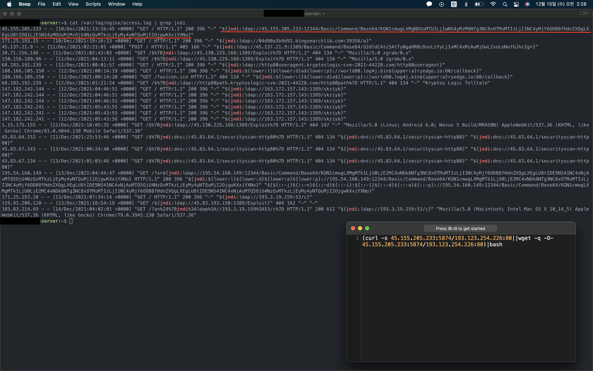
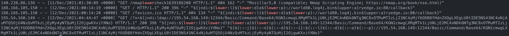

# Log4j란?

log4j는 java의 기반 로깅 유틸 라이브러리로, Apache Software Foundation이 관리 하고 있는 프로젝트이며, 다양한 java기반 프로젝트에서 자주 사용되는 라이브러리 입니다.

해당 라이브러리에서는 기본적으로 로깅에 대해서 강력한 기능을 지원해주기 위해 format 기능들을 지원을 해줍니다.

그 중 이후 취약점 부분에서 자세히 이야기 할 기능인 **[Lookups](https://logging.apache.org/log4j/2.x/manual/lookups.html)** 의 경우 아래와 같이 data, env, docker, jndi 등 여러가지 정보를 가져와 보여주는 기능을 제공합니다.

```xml
<File name="Application" fileName="application.log">
  <PatternLayout>
    <pattern>$${env:PWD}</pattern>
  </PatternLayout>
</File>
```

_log setup sample_

```text
/log4shell/severity/critical
```

_application.log - 환경변수의 PWD의 값을 가져와 로깅 된 예시_

# Log4Shell (CVE-2021-44228) 취약점 이란?

알리바바의 클라우드 보안팀이 2021년 11월 24일에 아파치 재단에게 비공개적으로 전달하였고, 2021년 11월 26일에 [CVE 코드 생성](https://cve.mitre.org/cgi-bin/cvename.cgi?name=CVE-2021-44228), 2021년 12월 9일에 공식적으로 첫 공개 되었습니다.

해당 취약점은 CVSS(Common Vulnerability Scoring System) 점수의 최고점인 [10.0점](https://nvd.nist.gov/vuln-metrics/cvss/v3-calculator?name=CVE-2021-44228&vector=AV:N/AC:L/PR:N/UI:N/S:C/C:H/I:H/A:H&version=3.1&source=NIST) 을 받았으며 Apple, Twitter, Cloudflare, Amazon, Tesla, Google, LinkedIn 등 유명한 서비스들도 영향을 받았습니다.

## 동작 원리

기본적으로 문자열 로그를 남길 때 **[Lookups](https://logging.apache.org/log4j/2.x/manual/lookups.html)** 의 기능을 통해 `${prefix:name}` 형태를 해석하여 해당 결과 값으로 치환하는 작동을 하게 되는데 이중 **JNDI**(Java Naming and Directory Interface)을 이용할 때 문제점이 발생합니다.

**JNDI**은 원격 디렉토리 서비스에 있는 Java 객체를 불러와 참조하는 API 이므로, `${jndi:<lookup>}` 형태로 사용하게 될 경우 `<lookup>` 에 해당 하는 Java 객체를 가져와 참조하여 실행하게 됩니다.

일반적으로 동적으로 로그를 남기는 문자열에 대해서는 escape 처리를 하여 일반 문자열 취급을 해야 하지만 치명적인 설계 실수로 정적으로 설정된 문자열과 동일한 취급을 하도록 되어 있어 **[Lookups](https://logging.apache.org/log4j/2.x/manual/lookups.html)** 와 같은 포맷 문자열 기능이 동작하여 취약점이 발생합니다.

해당 취약점이 심각한 이유는 log4j로 로그가 남겨질 만한 곳이라면 어디든 공격 대상이 가능하다는 문제점이 있습니다.

또한 Kafka, Solr, Guacamole, Elasticsearch 등 유명한 라이브러리, 프레임워크에서 log4j을 사용하고 있기 때문에 해당 기술들을 이용하고 있다면 공격 대상이 될 수 있습니다.


_Apple에서 취약점이 동작 하는 모습, 출처: https://github.com/YfryTchsGD/Log4jAttackSurface_

위와 같이 Apple에서는 로그인 요청에 대해 log4j를 통한 로그를 남기고 있기 때문에 공격이 통하는 것을 볼 수 있습니다.

## 완화조치 방법

해당 취약점을 해결 하는 방법은 log4j를 `2.15.0rc2` 버전 이상으로 업데이트 하는 것 이지만 현실적으로 바로 업데이트 하는 것은 불가능하기 때문에, 임시로 취약점에 대한 완화조치를 필수로 진행 해야 합니다.

첫번째 방법은 `log4j2.formatMsgNoLookups` 를 `true` 로 설정하는 것으로 formatMsg에서의 Lookups를 비활성화 시키는 방법이고 해당 옵션이 제공되지 않는 버전의 경우 아래의 명령어와 같이 JndiLookup class를 제외 시키는 방법이 있습니다.

```bash
$ zip -q -d log4j-core-*.jar org/apache/logging/log4j/core/lookup/JndiLookup.class
```

# Log4shell 취약점이 무서운 이유.

## GhostCat vs Log4shell

### GhostCat 취약점 이란?

> **NIST:** NVD
>
> **Base Score:** **[9.8 CRITICAL](https://nvd.nist.gov/vuln-metrics/cvss/v3-calculator?name=CVE-2020-1938&vector=AV:N/AC:L/PR:N/UI:N/S:U/C:H/I:H/A:H&version=3.1&source=NIST) **
>
> **Vector:** CVSS:3.1/AV:N/AC:L/PR:N/UI:N/S:U/C:H/I:H/A:H

Apache Tomcat에서 기본으로 제공하던 AJP(Apache JServ Protocol) Connector에 취약점이 발견하게 되어 이를 통해 인증없이 Tomcat서버의 **webapp목록 하위에 있는 모든 파일을 읽을 수 있습니다.**

또한 파일 업로드가 가능한 서버라면 **RCE(Remote Code Execution)** 공격으로도 이어질 수 있습니다.

이 취약점이 가능해진 이유는 기본적으로 AJP Connector가 활성화 되는 것이 기본으로 설정되어 있고 또한 모든 IP 주소에 대해 허가를 하고 있어 심각도가 높습니다.

[Ghostcat(cve-2020-1938, CNVD-2020-10487) 취약점 이란? 톰캣 AJP 취약점 (Feat. VolgaCTF 2020 Qualifier NetCorp)](https://jaeseokim.dev/Security/Ghostcatcve-2020-1938-CNVD-2020-10487-취약점-이란-톰캣-AJP-취약점-Feat-VolgaCTF-2020-Qualifier-NetCorp/)

더 자세한 내용에 대해서 확인 하실려면 위의 글을 참고 해주세요!

### 공격을 위한 사전 조건 비교

**GhostCat**

- **취약한 버전의 Tomcat**를 사용하고 **AJP Connector**를 외부로 공개 및 사용하고 있어야 함

  webapp목록 하위에 있는 모든 파일을 읽을 수 있음.

- 파일 업로드 취약점이 동시에 존재하는 경우에 **RCE(Remote Code Execution)** 공격으로 이루어 질 수 있음

**Log4Shell**

- **취약한 버전의 Log4j**를 사용하고 있음. (log4j를 사용하는 기술들을 사용하는 경우에도 포함)

  **RCE(Remote Code Execution)** 공격 가능

위와 같이 단순하게 공격 조건을 비교하였을 때 **GhostCat** 취약점에서는 RCE 공격으로 까지 이루어지기 위해서는 일단 해당 서버에서 **취약한 Tomcat**를 사용하고 **AJP Connector**를 외부로 공개 및 사용을 해야하는데, 이경우 실제 서비스의 경우 대부분 내부에서 취약한 Tomcat를 사용하고 있더라도, 외부로 다이렉트로 공개 되어 있지 않고, Gateway(nginx)를 통해 서비스시 필요한 포트만 공개되어 있기 때문에 첫번째 조건을 성립하기 힘듭니다.

또한 해당 포트가 공개 되어 있다고 하더라도 내부 webapp목록 하위에 있는 모든 파일을 읽을 수 있을 뿐, RCE로 공격이 이루어 지기 위해서는 서비스 내부에 파일 업로드 취약점이 존재해야 한다는 2번째 조건이 있습니다.

2번째 조건의 경우 대부분의 서비스에서 시큐어 코딩으로 가드가 되어있고, 또 Tomcat에서 파일을 직접 관리하는 것이 아닌 대부분 Storage 서버를 별도로 두어 관리하기 때문에 공격하는 것이 힘듭니다.

그에 반해 **Log4Shell** 취약점의 경우 로그가 발생할 여지가 될만한 곳에 단순하게 남겨두는 것만으로 공격이 가능하고, 공격이 매우 쉬운 방법으로 이루어 질 수 있다는 것을 이용하여 단순하게 스크립트를 통해 무작위의 대다수에게 공격이 가능하다는 점이 있습니다.

실제로 제가 운영중인 서버에 남은 로그를 살펴보면 아래와 같이 해당 취약점이 오픈된 이후 공격이 지속적으로 들어온 것을 볼 수 있습니다.



_운영중인 서버에 남은 공격 로그 기록_



_우회를 통한 공격 로그 기록_

해당 공격을 살펴보면 우회기법을 통해 waf 장비를 우회할려고 하는 모습도 볼 수 있고, 특정 명령어를 Base64를 통해 전달 하는 것을 볼 수 있는데, 해당 Base64 공격은 decode 하면 위의 사진에서 나온 것 처럼 특정 주소에서 파일을 다운 받아 실행하는 것을 볼 수 있습니다.

이를 통해 코인채굴기와 같은 악성프로그램을 서버에서 실행시킬려는 것을 확인 할 수 있습니다.

## 공격 방법이 단순하고, 대상 서비스가 많으며, 원격코드 실행이 가능하다.

위에서 설명한 것과 같이 기존의 유명한 취약점의 경우에도 여러가지 상황과 다른 취약점이 같이 발생하여야지 공격이 가능한데에 반해, Log4Shell의 경우 `${jndi:<lookup>}` 를 로그 처리 될 만한 곳에 남기는 것 만으로 RCE 공격이 가능하고, log4j를 사용하는 곳이 다양하게 퍼져 있기 때문에 다른 취약점이 비해 매우 위험성이 높습니다.

# 오픈소스 및 프로젝트

해당 취약점이 공개된 이후 다양한 오픈소스와 프로젝트가 만들어졌는데 인상 깊었던 프로젝트에 대해서 소개를 하겠습니다.

## Logout4Shell

> **Github :** https://github.com/Cybereason/Logout4Shell Use Log4Shell vulnerability to vaccinate a victim server against Log4Shell

해당 프로젝트는 Log4Shell의 취약점을 이용하여 피해자 서버에 해당 취약점에 대한 완화조치를 취해주는 프로젝트 입니다.

https://github.com/Cybereason/Logout4Shell/blob/main/src/main/java/Log4jRCE.java

코드를 살펴보면 `FORMAT_MESSAGES_PATTERN_DISABLE_LOOKUPS` feild를 강제로 `True` 로 설정 및 문제가 되는 `org.apache.logging.log4j.core.impl.Log4jContextFactory` class 내부의 lookupMap에서 `jndi` 를 강제로 제거를 하는 것을 볼 수 있습니다.

취약점을 통해 역으로 피해자 서버를 보호해준다는 컨셉에 인상 깊었던 프로젝트 입니다.

## Log4jAttackSurface

> **Github** : https://github.com/YfryTchsGD/Log4jAttackSurface
>
> Log4j impact on manufacturers and components summary from the Internet community. If Manufacturer or Component is not verified, it does not have screenshots or references to prove that it is affected.

특정 서비스가 공격 대상인지에 대해 기록을 남겨둔 레포 입니다.

커뮤니티 제보를 통해 운영되고 있으며, 해당 증거 기록과 함께 남아 있습니다.

## CVE-2021-44228-PoC-log4j-bypass-words

> **Github :** https://github.com/Puliczek/CVE-2021-44228-PoC-log4j-bypass-words
>
> 🐱‍💻 ✂️ 🤬 CVE-2021-44228 - LOG4J Java exploit - A trick to bypass words blocking patches

Log4Shell 취약점에 공격 탐지 우회 방법에 대해 적힌 repo 입니다.

현재 `WAF` 장비와 개발자들이 `ldap` `jndi` 가 들어가 키워드에 대해서 필터링을 진행하고 있는데, 이를 우회 할 수 있는 기법을 소개하고 있습니다.

## **Log4j2Scan**

> **Github** : https://github.com/whwlsfb/Log4j2Scan
>
> Log4j2 RCE Passive Scanner plugin for BurpSuite

BurpSuite 라는 Web Proxy 도구를 이용하여 Log4j2 RCE 취약점을 자동화 하여 검증 할 수 있는 플러그인 입니다.
