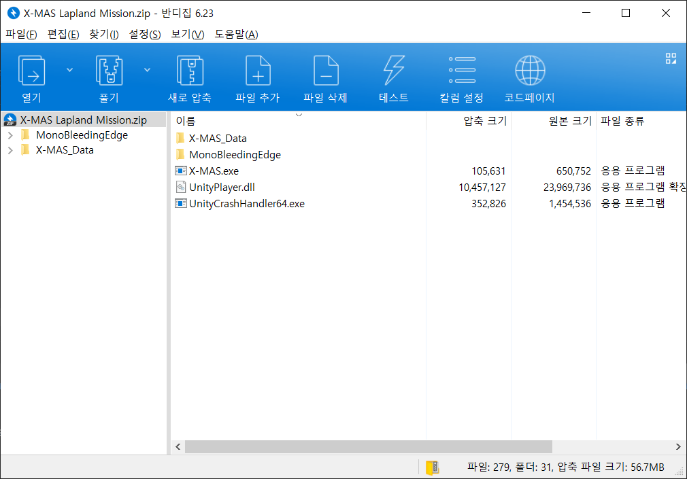
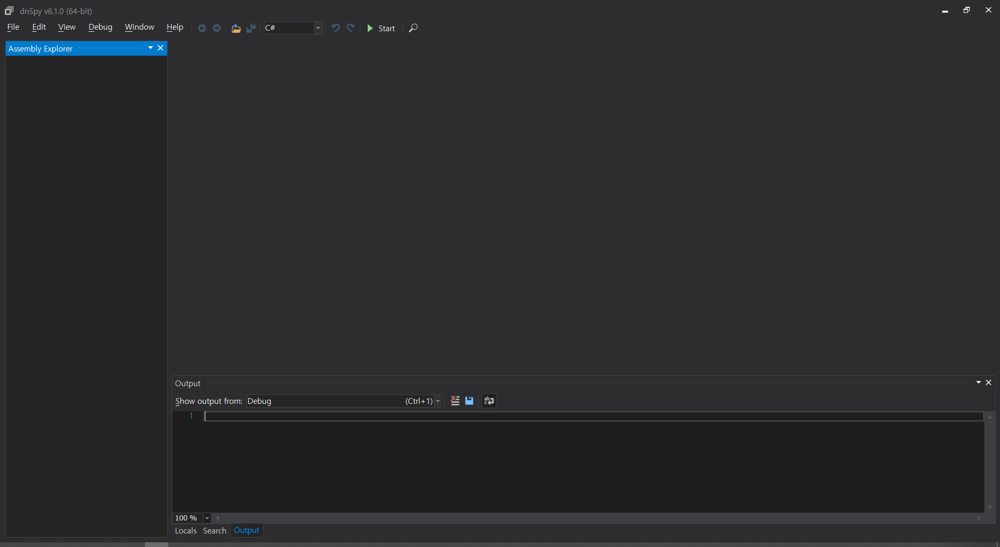
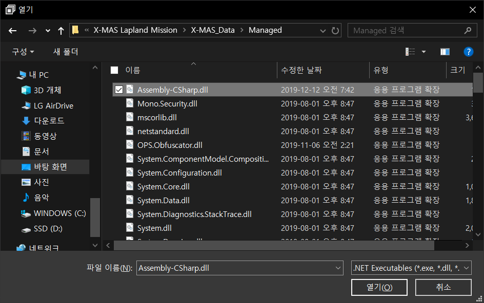
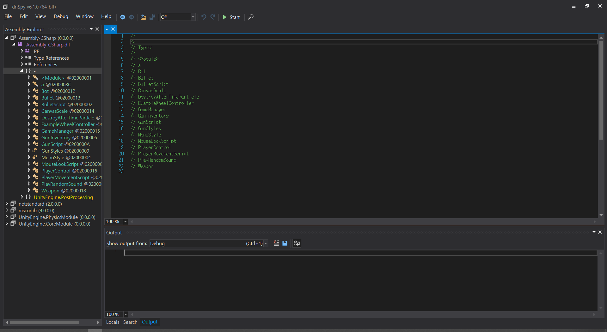
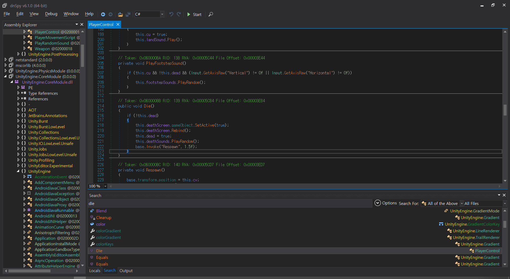
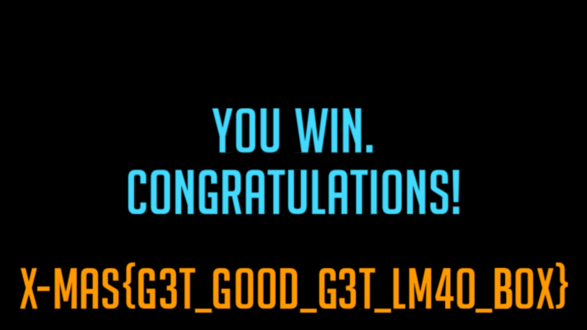

## [X-MAS: Lapland Mission](https://xmas.htsp.ro/challenge?id=28)

X - MAS의 Lapland Mission 문제를 다운 받아보면 아래와 같이 Unitity로 만들어진 것을 파악할 수 있다.

이제 이 파일을 실행 해보면 아래처럼 FPS 게임과 같은 형식인 것을 볼 수 있는데 게임을 클리어를 불가능 하게 만들어진 것을 확인할 수 있다.

이때 dnspy를 통해 분석을 하고 게임을 수정하여 게임을 클리어를 해본다.

dnspy를 실행을 해보면 위와 같은 화면이 보이는데 이때 `X-MAS_Data\Managed\` 아래에 있는 DLL 파일들을 불러와서 분석을 한다.

이때 대부분 시스템 관련 DLL 파일이거나 UNITY 관련 DLL 파일로 보이는데 가장 기본적인 `Assembly-CSharp.dll` 만을 가지고 분석을 한다.

열어서 보면 이렇게 Bot, Bullet, PlayerControl 등 다양한 함수가 존재 하는 것을 볼 수 있는데 `CTL+SHIFT+K` 를 이용하여 Assemblies를 검색하여 함수 변수등을 찾아본다. 일단 가장 간단하게 문제를 해결하는 방법으로 사용자가 죽을때에 대해 작동하는 함수를 무효화 시키는 방법, 또는 Bot이 공격을 안하게 하는 방법등 다양하게 해결하는 방법이 존재 한다. 여기서는 간단하게 죽었을 때에 대해 처리를 아무것도 안함으로 해결해본다.!

검색을 통해 찾아보니 PlayerControl 쪽에 die() 함수가 정의 되어서 deathScreen object를 true로 처리하고 dead 변수를 true로 처리하는 등 죽었을 때에 대해 처리를 하는 것을 볼 수가 있는데 이제 이것을 `CTL+SHIFT+E` 단축기를 통해 수정을 한다.

Die() 함수 내부 내용을 모두 지워준 다음 Complie를 하고 `CTR+SHIFT+S` 를 이용하여 수정하 모듈을 전부 저장 한다. 이제 다시 문제로 돌아가 보면 플레이어가 죽음에 대한 작동을 안하는 모습과 이때 봇을 전부 죽이면 클리어 화면이 나오는 것을 볼 수 있다.

