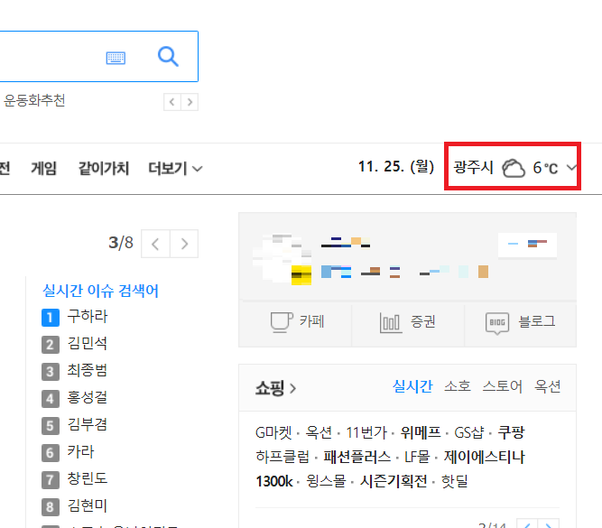

평소 requests에만 너무 의존을 하는 것 같아 한번 urllib라는 python 기본 제공 라이브러리를 이용해서 크롤링 스크립트를 만들었습니다.

크롤링 대상은 다음 홈페이지의 메인 포털 상단 오른쪽의 지역별 날씨 항목을 가져와 크롤링 했습니다.



아래의 코드에 주석을 달아 두었으니 한번 보시면서 이해하시면 될것 같습니다.

```python
from urllib import request, parse, error
from bs4 import BeautifulSoup

url = 'https://www.daum.net/' #url 선언
response = "" #전역 변수 선언

try:
    response = request.urlopen(url) #request로 url에 대한 응답값 가져옴
except:
    print("URL 오류") #try문을 이용하여 response를 못받아오면 안내 메세지 출력후 종료
    exit(0)

soup = BeautifulSoup(response.read(), 'html.parser')
#응답값을 BeautifulSoup으로 soup에 담음
info_today = soup.find('div', {'class': 'info_today'})
#soup의 내용중 필요한 div info_today만 가져옴
date_today = info_today.find('strong', {'class': 'date_today'})
#info_today의 내용중 현재 날짜에 해당하는 data_today를 가져옴
list_weather = info_today.find('ul', {'class': 'list_weather'})
#info_today의 내용중 list_weather항목을 추출
weather = list_weather.find_all('li')
#list_weather의 li 항목들을 분리하여 list에 저장

text_weather = dict()
#dictionary 형태로 선언

for i in range(len(weather)):
    #weater에서 하나씩 열어서 분리함
    place = weather[i].find('span', {'class': 'txt_part'})
    #지역에 대한 정보를 분리
    state = weather[i].find('strong', {'class': 'ico_ws'})
    #날씨에 대한 정보를 분리
    temperature = weather[i].find('em', {'class': 'screen_out'})
    #온도에 대한 정보를 분리
    text_weather[place.text] = "지역 : {}\n상태 : {}\n온도 : {}\n".format(place.text, state.text, temperature.text)
    #dictionary 형태로 저장

def findWeather(place): #함수선언 매개변수를 받아 dictonary에서 검색해서 리턴해준다.
    try :
        return "날짜 : {}\n{}".format(date_today.text, text_weather[place])
    except:
           #dictionary에 항목이 존재 안하면 출력
        return "정상적인 도시를 입력하세요."

if __name__ == '__main__': #메인 함수
    place = input("도시를 입력해주세요 : ")
    #도시를 입력받는다.
    print(findWeather(place.strip()))
    #findWeather를 이용하여 리턴값을 출력
```

- 후기... requests 라이브러리 사용하는 이유가 있구나... urllib는 너무 불친절합니다..
