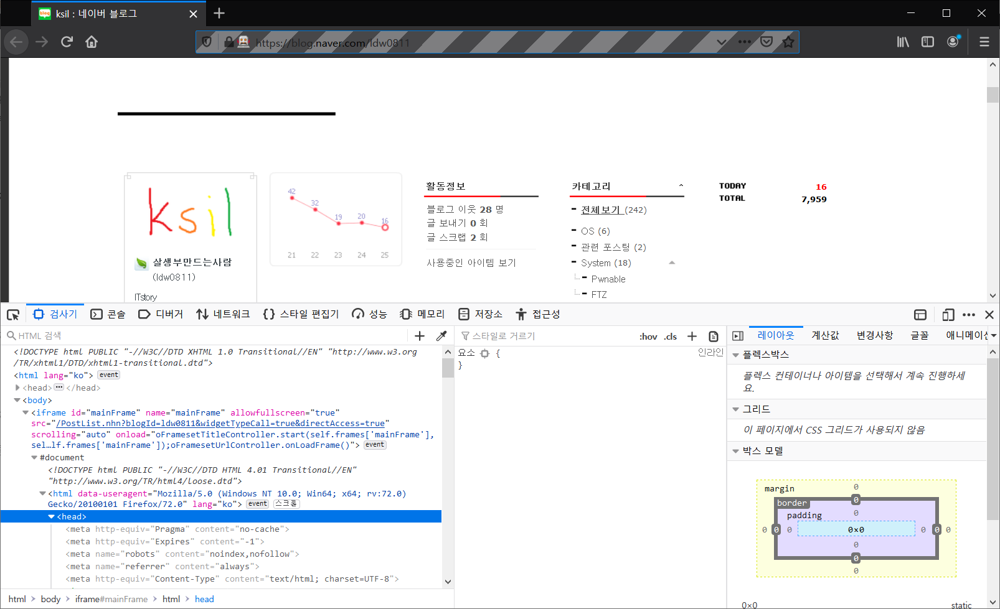
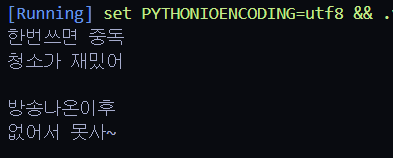

## Selenium 이란?

다양한 언어에서 웹 드라이버를 통한 웹 자동화 테스트를 지원하는 라이브러리 입니다.

여기서 웹 자동화 테스트에서만 국한 되는 것이 아닌 웹에서 자동화를 통한 다양한 작업을 할 수 있습니다.

글 제목에서 적혀 있듯이 웹 크롤링을 할 때에도 사용 합니다.

#### python - requests, beautifulsoup를 이용한 웹 크롤링과의 차이점

**requests** 라이브러리는 단순하게 request만 날려 그때 서버에서 응답을 한 값을 가지고 크롤링을 한다는 특징이 있습니다. 이때 만약 naverblog를 크롤링 할려고 하면 아래처럼 iframe, js의 처리가 된 상태의 내용을 못 가져온 다는 것을 확인할 수 있습니다.

```python
import requests

# 친한 형의 블로그 입니다!!
responese = requests.get('https://blog.naver.com/ldw0811')
print(responese.text)
```


하지만 selenium은 웹 자동화 테스트 용도로 개발이 되어 실제 브라우저를 사용한다는 것이 특징입니다.

즉 dom이 변화하는 것도 관찰이 가능합니다. 아래의 스크립트를 작동하면 실제로 firefox의 브라우저가 실행되고 dom이 정상적으로 변화하는 것도 관찰이 가능합니다.

```python
# 설치한 selenium에서 webdriver를 import
from selenium import webdriver

# 다운받은 webdriver의 경로를 지정
driver = webdriver.Firefox(executable_path='D:/OneDrive - JaeSeo/blog/seleninum/python/webdriver/geckodriver.exe')

driver.get('https://blog.naver.com/ldw0811')
```



requests, beautifulsoupselenium서버로 요청을 보내고 응답 받은 값에 대해서 만 처리가 가능(정적)실제 browser를 사용하기 때문에 dom의 변화에 대해서도 처리가 가능(동적)

### 지원 브라우저

#### Firefox

GeckoDriver is implemented and supported by Mozilla, refer to their [documentation](https://firefox-source-docs.mozilla.org/testing/geckodriver/Support.html) for supported versions.

#### Internet Explorer

Only version 11 is supported, and it requires additional [configuration](https://github.com/SeleniumHQ/selenium/wiki/InternetExplorerDriver#required-configuration).

#### Safari

SafariDriver is supported directly by Apple, for more information, check their [documentation](https://developer.apple.com/documentation/webkit/about_webdriver_for_safari)

#### Opera

OperaDriver is supported by Opera Software, refer to their [documentation](https://github.com/operasoftware/operachromiumdriver/releases) for supported versions.

#### Chrome

ChromeDriver is supported by the Chromium project, please refer to their [documentation](https://sites.google.com/a/chromium.org/chromedriver/) for any compatibility information

#### Edge

Microsoft is implementing and maintaining the Microsoft Edge WebDriver, please refer to their [documentation](https://developer.microsoft.com/en-us/microsoft-edge/tools/webdriver/#downloads) for any compatibility information

### 지원 운영체제

#### Microsoft Windows

Most versions of MS Windows that are currently still supported by Microsoft should work with Selenium. Although we use the latest MS Windows to troubleshoot things, it does not mean Selenium won't attempt to support different versions of Windows. This only means we don't continually run tests on other particular version of Windows.

#### macOS

We currently do not use any version of macOS in our automated tests against the selenium project. However most developers on the project are using a recent version of macOS and we'll continue to support the current stable release and often the previous release.

#### Linux

We test mainly on Ubuntu, but other variations of Linux should also work where the browser manufacturers support them.

### 지원 언어

- Ruby [Changelog](https://raw.githubusercontent.com/SeleniumHQ/selenium/master/rb/CHANGES) [API Docs](https://seleniumhq.github.io/selenium/docs/api/rb/index.html)
- JavaScript [Changelog](https://raw.githubusercontent.com/SeleniumHQ/selenium/master/javascript/node/selenium-webdriver/CHANGES.md) [API Docs](https://seleniumhq.github.io/selenium/docs/api/javascript/index.html)
- Java [Changelog](https://raw.githubusercontent.com/SeleniumHQ/selenium/master/java/CHANGELOG) [API Docs](https://seleniumhq.github.io/selenium/docs/api/java/index.html)
- Python [Changelog](https://raw.githubusercontent.com/SeleniumHQ/selenium/master/py/CHANGES) [API Docs](https://seleniumhq.github.io/selenium/docs/api/py/index.html)
- C#[Download](https://goo.gl/uJJ5Sc) [Changelog](https://goo.gl/t3faSQ) [API Docs](https://goo.gl/uutZjZ)

## python을 이용한 웹 크롤링 - naver 쇼핑 광고 크롤링

일단 python에서 웹 크롤링을 하기 위해 `seleninum` 을 설치합니다.

```python
pip install seleninum
```

그리고 사용하는 브라우저의 webdriver를 다운 받습니다.

**Chrome**:[https://sites.google.com/a/chromium.org/chromedriver/downloads](https://sites.google.com/a/chromium.org/chromedriver/downloads)
**Edge**:[https://developer.microsoft.com/en-us/microsoft-edge/tools/webdriver/](https://developer.microsoft.com/en-us/microsoft-edge/tools/webdriver/)
**Firefox**:[https://github.com/mozilla/geckodriver/releases](https://github.com/mozilla/geckodriver/releases)
**Safari**:[https://webkit.org/blog/6900/webdriver-support-in-safari-10/](https://webkit.org/blog/6900/webdriver-support-in-safari-10/)

저는 firefox를 사용하겠습니다.

다운 받은 드라이버를 원하는 경로로 이동시켜 줍니다.


이번 예제에서는 네이버 쇼핑 광고를 크롤링 해오는 것을 해보겠습니다.


여기서 광고 영역을 보면 `<` , `>` 버튼을 통해 서버에 요청을 하고 div 내부의 내용을 변경 하는 것을 볼 수가 있습니다. 이때 requests에서는 1페이지에 있는 항목만 크롤링이 가능하지만 selenium을 이용하여 다른 페이지도 크롤링 해봅니다.

설치한 selenium에서 webdriver를 import 시키고 driver 객체를 생성합니다.

```python
# 설치한 selenium에서 webdriver를 import
from selenium import webdriver

# 다운받은 webdriver의 경로설정
driver = webdriver.Firefox(executable_path='D:/OneDrive - JaeSeo/blog/seleninum/python/webdriver/geckodriver.exe')
```

executable_path에 다운 받은 driver 경로를 설정합니다.

그리고 `driver.get(url)` 이용하여 원하는 naver로 이동합니다.

```python
# 네이버로 이동
driver.get("https://www.naver.com")
```

일단 간단하게 첫 번째에 있는 광고 항목의 제목을 가져 옵니다.

브라우저의 개발자 도구를 이용하여 xpath를 복사합니다.


이때 광고 부분을 확인 해보니 ifram으로 구성이 되어 있어 switch_to_frame을 이용하여 frame를 변경하고 작업을 합니다.

```python
# 쇼핑 광고의 iframe id를 적는다.
driver.switch_to_frame('cnsv_shbx')
# 첫번째 필드위치의 광고 제목의 xpath를 기준으로 element를 가져와 text만 추출하여 출력
print(driver.find_element_by_xpath('/html/body/div/div[2]/div/div/div/div/div/ul/li[1]/a/p').text,"\n")
```

이제 한번 실행을 해봅니다.


브라우저에 있는 내용이 정상적으로 크롤링 되는 모습을 볼 수 있습니다. 이번에는 `>` 버튼이 눌려서 dom이 변화된 다음의 내용을 가져오도록 하겠습니다.

```python
# `<` 버튼을 찾아 click 이벤트 발생
driver.find_element_by_xpath('//*[@id="prod_page_next"]').click()
# random한 시간 동안 지연
time.sleep(random.uniform(3,5)
# 똑같이 광고의 제목 출력
print(driver.find_element_by_xpath('/html/body/div/div[2]/div/div/div/div/div/ul/li[1]/a/p').text,"\n")
```



정상적으로 click 이벤트가 발생된 후 내용을 크롤링 하는 것을 볼 수 있습니다. 이제 이러한 방법을 이용하여 스크립트를 완성 시킵니다.

```python
from selenium import webdriver
import time
import random

# 다운받은 webdriver의 경로설정
driver = webdriver.Firefox(executable_path='D:/OneDrive - JaeSeo/blog/seleninum/python/webdriver/geckodriver.exe')
# 네이버로 이동
driver.get("https://www.naver.com")
driver.implicitly_wait(5)
driver.switch_to_frame('cnsv_shbx')
print(driver.find_element_by_xpath('/html/body/div/div[2]/div/div/div/div/div/ul/li[1]/a/p').text,"\n")
time.sleep(random.uniform(4,5))
for i in range(int(driver.find_element_by_xpath('/html/body/div/div[2]/div/div/div/div/div/div[1]/em').text.split('/')[1])-1):
    time.sleep(random.uniform(1,2))
    driver.find_element_by_xpath('//*[@id="prod_page_next"]').click()
    print(driver.find_element_by_xpath('/html/body/div/div[2]/div/div/div/div/div/ul/li[1]/a/p').text,"\n")
driver.quit()
```

## python을 이용한 웹 크롤링 -Naver login 후 구독 Feed 크롤링

[link](/python/python-Selenium을-이용한-웹-크롤링-Naver-login-후-구독-Feed-크롤링/)
