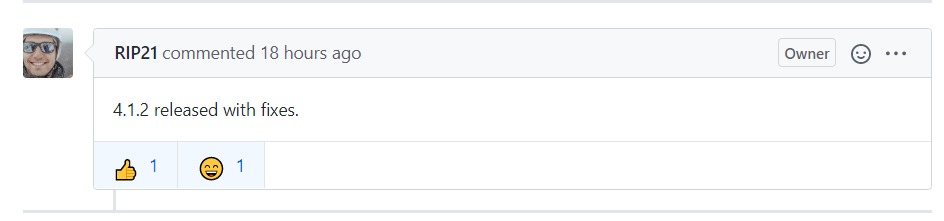
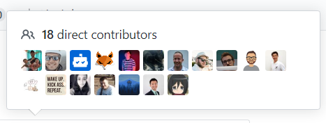
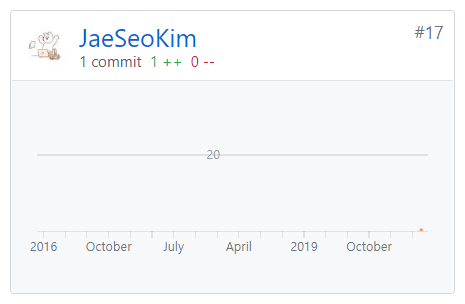

게시판 기능을 구현을 하면서 **[ react-simplemde-editor](https://github.com/RIP21/react-simplemde-editor)** 를 사용하여 이미지 업로드 기능까지 구현을 하였는데 문제를 발견한 부분이 Drag & Drop 으로 이미지를 삽입시 추가된 IMG 내용을 `onChange` 으로 전달을 하지 않아 Drag & Drop 이미지 삽입후 즉시 저장시 이미지 업로드 내용을 반영하지 않아서 한번 소스 코드를 분석 하게 되었습니다.

소스 부분을 분석하다 보니 Events를 등록하는 부분이 있어서 한번 분석을 하게 되었습니다.

```js
 addEvents = () => {
    if (this.elementWrapperRef && this.simpleMde) {
      this.editorEl = this.elementWrapperRef;
      this.editorToolbarEl = this.elementWrapperRef.getElementsByClassName(
        "editor-toolbar"
      )[0];
      this.editorEl.addEventListener("keyup", this.eventWrapper);
      this.editorEl.addEventListener("paste", this.eventWrapper);
      this.editorToolbarEl &&
        this.editorToolbarEl.addEventListener("click", this.eventWrapper);

      this.simpleMde.codemirror.on("cursorActivity", this.getCursor);

      const { events } = this.props;
```

기존 이벤트는 위와 같이 `keyup` , `paste`, `click (toolbar)`이벤트가 발생시 `this.eventWrapper` 작동시켜 `onChange` prop에 `simpleMde!.value()` 를 전달 하였습니다.

```js
 eventWrapper = () => {
    this.keyChange = true;
    this.setState({
      value: this.simpleMde!.value()
    });
    this.props.onChange(this.simpleMde!.value());
  };
```

여기서 문제가 된 부분이 `Drag & Drop` 은 위 3가지 이벤트에 대해 해당사항이 없어서 전달이 안되는 문제점이 있었는데 [code mirror docs](https://codemirror.net/doc/manual.html#events) 를 보고 `change` Events를 추가하여 해결하였습니다.

그리고 문제점 내용과 해결한 방법을 작성하여 issue와 Pull Requests를 등록하였습니다.


그 결과 4.1.2 Released Version에 반영되었습니다!







비록 단 한줄의 기여였지만 처음으로 오픈소스에 대해 기여를 해본것이 신기하고 당당하게 Contributor에 올라온것이 오픈소스에 한발짝 더 다가간것 같아서 기분이 좋습니다!
